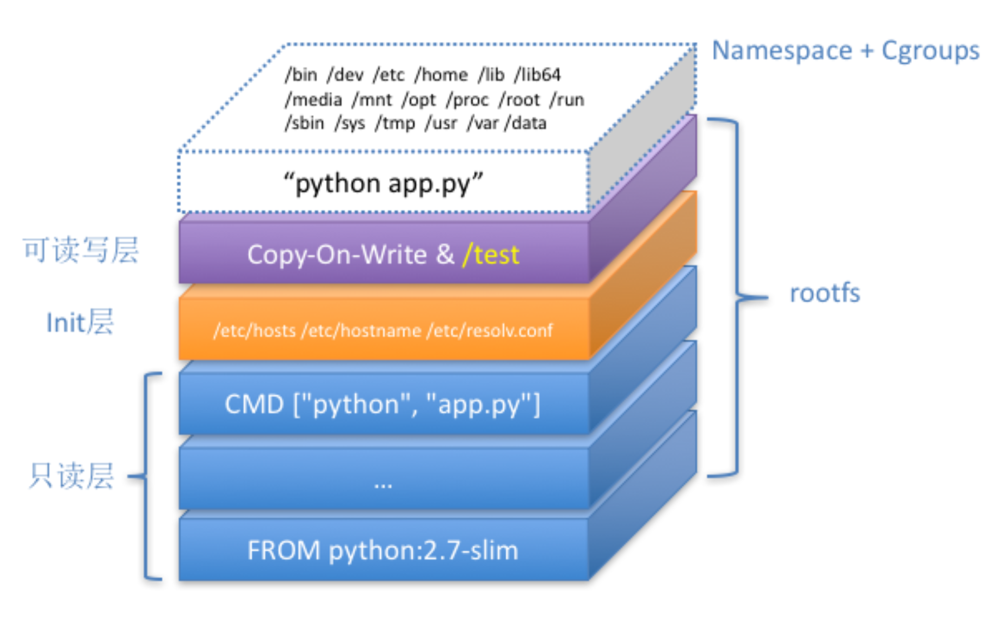

[toc]


# Volumn

允许将宿主机指定的目录或者文件，挂载到容器里面进行读取和修改操作

容器volume里面的信息，并不会被docker commit 提交掉

Volume 的本质是宿主机上的一个独立目录，不属于rootfs的一部分


## 原理

当容器进程被创建之 后，尽管开启了 Mount Namespace，但是在它执行 chroot(或者 pivot_root)之前，容器进 程一直可以看到宿主机上的整个文件系统。

而宿主机上的文件系统，也自然包括了我们要使用的容器镜像。这个镜像的各个层，保存在 /var/lib/docker/aufs/diff 目录下，在容器进程启动后，它们会被联合挂载在 /var/lib/docker/aufs/mnt/ 目录中，这样容器所需的 rootfs 就准备好了。

所以，我们只需要在 rootfs 准备好之后，在执行 chroot 之前，把 Volume 指定的宿主机目录 (比如 /home 目录)，挂载到指定的容器目录(比如 /test 目录)在宿主机上对应的目录(即 /var/lib/docker/aufs/mnt/[可读写层 ID]/test)上，这个 Volume 的挂载工作就完成了。

更重要的是，由于执行这个挂载操作时，“容器进程”已经创建了，也就意味着此时 Mount Namespace 已经开启了。所以，这个挂载事件只在这个容器里可见。你在宿主机上，是看不见 容器内部的这个挂载点的。这就保证了容器的隔离性不会被 Volume 打破。





## 声明方式

在 Docker 项目里，它支持两种 Volume 声明方式，可以把宿主机目录挂载进容器的 /test 目 录当中:

```
$ docker run -v /test ...
$ docker run -v /home:/test ...
```

在第一种情况下，由于你并没有显示声明宿主机目录，那么 Docker 就会默认在宿主机 上创建一个临时目录 /var/lib/docker/volumes/[VOLUME_ID]/_data，然后把它挂载到容器的 /test 目录上

在第二种情况下，Docker 就直接把宿主机的 /home 目录挂载到容器的 /test 目录上。