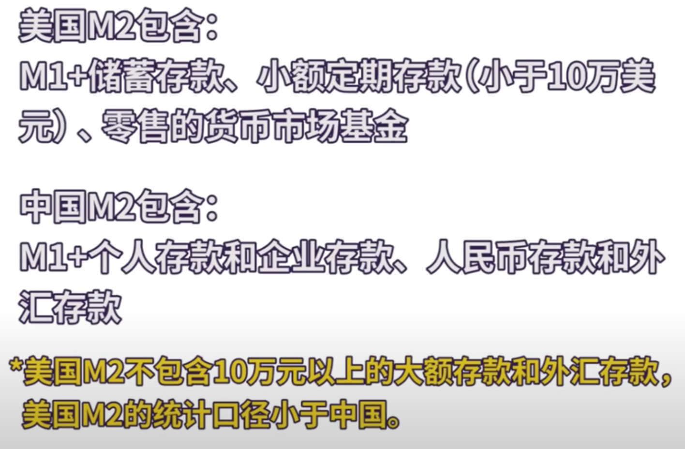

[toc]

# 利率

## 降息

会造成本国货币供应量增加，刺激投资和消费，导致物价和资产上涨，也可能导致通货膨胀

## 涨息

会造成本国货币供应量减少，阻碍投资和消费，导致物价和资产下跌，也可能导致通货紧缩

# 贸易逆差

若美国贸易逆差，即进口>出口 ，美元外流

# 期权 Option

金融衍生品的一种，不是证券(security)

即简单又复杂

常见的金融衍生品，期货（future，forward） ，对赌协议（swap）

一种权利，花钱买期权

## 看涨期权 Call Option

在未来一段时间内，以一个现在就约定好的特定价格，去买一个标的物的权利

To long(write/wrote) a call 去买一个看涨期权

## 看跌期权 Put Option

在未来一段时间内，以一个现在就约定好的特定价格，去卖一个标的物的权利

To short(write/wrote) a put  去卖一个看跌期权

## 过期日 Expiration Date 

未来一段时间的截止

## 行权价 Execise Price(Strike Price)

固定的价格去买卖

## 标的物 Underlining

可以是股票，可以是债券，还可以是其他的金融衍生品

# 期权分类

在其他相同的条件下，美式期权比欧式期权贵

## America Option 

在一段时间内可以去买卖标的物，行权时间可以在任意期间内

## European Option

只能在最后一天行权

# 期权判断

判断对了很难， 股票而言，只需要判断对了方向即可

做空，不但要判断对方向，还要判断对时间

若认为下周跌，做空的话，下个月跌，那期间的issue和margin call（追缴保证金）就可能撑不下去了

期权而言，要判读好

1. 大方向
2. 涨或者跌的幅度
3. 时间

# 看涨期权案例

买期权的人，最大的损失（即最小的收益）是期权本身的价格成本。最大的收益是无穷大

而卖期权的人，正好相反，最大的收益是期权本身的价格，最大的损失也是无穷大

## 情况1

若买一个期权，标的物为一支股票，到期日是6个月之内，即6个月内都可以行权。行权价是50元，其市场价在20-30之间浮动，股票价格20

6月之内没有超过50元，期权就白买了，即没有涨到50元的行权价，买到的权利没有用，期权就自动过期，最大的损失就是购买期权

## 情况2

若涨到50元，但其实没有用，即可以行使权力卖掉，当然，在open market 也可以以50元的价格买到，没有优惠

## 情况3

在6个月内，涨超过50元，如60元，可以在open market 上卖出，每一股获利10元，但一定是在这个时间范围内

# M0-M3

# ACV

# ARR 年度经常性收入

ARR is an acronym for Annual Recurring Revenue, a key metric used by SaaS or subscription businesses that have term subscription agreements, meaning there is a defined contract length. 

It is defined as the value of the contracted recurring revenue components of your term subscriptions normalized to a one-year period. 

ARR is the less frequently used alternative normalization method of the two common ones, ARR and MRR. It is used almost exclusively in B2B subscription businesses.

对ARR的不理解其实是来源于对订阅经济的不熟悉。在过去，分析师们习惯了用传统财务模型去理解一家公司，如通过对企业售出货物的计量来统计销售额，再通过计算成本与费用得到利润。在订阅模式兴起后，大家发现传统的财务记账是不适用的。Zuora（ZUO.US）创始人在其《订阅经济》一书中是这么总结传统模型失效的原因的：**在传统模型中，客户一次性贡献一块钱的收入和连续十年每年都贡献一块钱的收入是没有区别的，而在订阅模型中，ARR的重要程度则远高于Revenue。**因此，当一种收入能持续产生的时候就可以被称为RR（Recurring Revenue，经常性收入）。ARR就是按年统计的经常性收入，MRR则就是按月统计（一家公司的MRR乘以12应当是等于它的ARR）

现在美国SaaS公司比较普遍的是用P/ARR来进行估值，比如2021年1月，提供基于Spark的开源数据服务公司Databricks以280亿美元的投后估值融资10亿美元，此时它已拥有4.25亿美元的ARR，P/ARR（投后）就是66x（实在是太高了!）。很可惜的是，**因为ARR属于Non-GAAP的指标，上市公司是并无义务披露它的，这也是为什么从大部分SaaS公司的年报中找不到这个参数的原因。**

## 计算ARR

先铺垫一下SaaS公司的收入确认方式：**1. 签合同（Bookings）2. 开发票（Invoice/Billings）3. 确认收入（Revenue）。**很简单，就是乙方与客户先签合同、乙方财务开具发票并寄出、乙方提供服务并逐步确认收入，值得注意的是，这个过程中存在着**时间滞后性**。

 

根据Cloudera（CLDR.US）在财报中对ARR的定义，“ARR是管理层用来监控客户留存和增长，并做出与业务相关的运营决策的主要指标。ARR等于报告期内所有经常性订购合同的年化价值，包括老客户留存（流失）、增（减）购以及新客户的订单增加。”

 

**结合SaaS公司的收入确认方式以及上述对ARR的定义，个人认为ARR是与签单额强关联的指标，与开票金额及收入无直接关联。**归纳出来ARR的计算公式是：

 

**本期末ARR = 上一期ARR +（新增RR + 增购RR） – （流失RR + 减值RR）**

# Appendix

https://mp.weixin.qq.com/s/6uRKGRbwnpGY7m5qnUTtsQ

