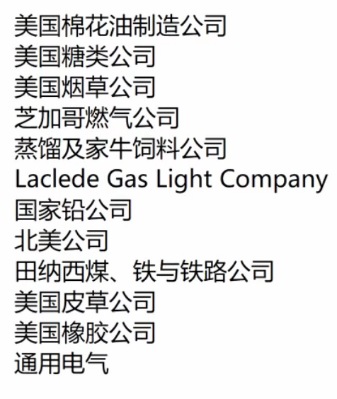

[toc]

# 道琼斯指数

起初是12家原始股的平均值

The industrial average was first calculated on May 26, 1896

Since April 2, 2019, the Dow Jones Industrial Average has consisted of the following companies

|                           Company                            |                           Exchange                           |                            Symbol                            |                           Industry                           | Date Added |                            Notes                             |
| :----------------------------------------------------------: | :----------------------------------------------------------: | :----------------------------------------------------------: | :----------------------------------------------------------: | :--------: | :----------------------------------------------------------: |
|            [3M](https://en.wikipedia.org/wiki/3M)            | [NYSE](https://en.wikipedia.org/wiki/New_York_Stock_Exchange) | [NYSE](https://en.wikipedia.org/wiki/New_York_Stock_Exchange): [MMM](https://www.nyse.com/quote/XNYS:MMM) | [Conglomerate](https://en.wikipedia.org/wiki/Conglomerate_(company)) | 1976-08-09 |            as Minnesota Mining and Manufacturing             |
| [American Express](https://en.wikipedia.org/wiki/American_Express) | [NYSE](https://en.wikipedia.org/wiki/New_York_Stock_Exchange) | [NYSE](https://en.wikipedia.org/wiki/New_York_Stock_Exchange): [AXP](https://www.nyse.com/quote/XNYS:AXP) | [Financial services](https://en.wikipedia.org/wiki/Financial_services) | 1982-08-30 |                                                              |
|    [Apple Inc.](https://en.wikipedia.org/wiki/Apple_Inc.)    |        [NASDAQ](https://en.wikipedia.org/wiki/NASDAQ)        |          [AAPL](http://www.nasdaq.com/symbol/aapl)           | [Information technology](https://en.wikipedia.org/wiki/Information_technology) | 2015-03-19 |                                                              |
|        [Boeing](https://en.wikipedia.org/wiki/Boeing)        | [NYSE](https://en.wikipedia.org/wiki/New_York_Stock_Exchange) | [NYSE](https://en.wikipedia.org/wiki/New_York_Stock_Exchange): [BA](https://www.nyse.com/quote/XNYS:BA) | [Aerospace manufacturer](https://en.wikipedia.org/wiki/Aerospace_manufacturer) and [Arms industry](https://en.wikipedia.org/wiki/Arms_industry) | 1987-03-12 |                                                              |
| [Caterpillar Inc.](https://en.wikipedia.org/wiki/Caterpillar_Inc.) | [NYSE](https://en.wikipedia.org/wiki/New_York_Stock_Exchange) | [NYSE](https://en.wikipedia.org/wiki/New_York_Stock_Exchange): [CAT](https://www.nyse.com/quote/XNYS:CAT) | [Construction](https://en.wikipedia.org/wiki/Heavy_equipment_(construction)) and [Mining](https://en.wikipedia.org/wiki/Mining) | 1991-05-06 |                                                              |
| [Chevron Corporation](https://en.wikipedia.org/wiki/Chevron_Corporation) | [NYSE](https://en.wikipedia.org/wiki/New_York_Stock_Exchange) | [NYSE](https://en.wikipedia.org/wiki/New_York_Stock_Exchange): [CVX](https://www.nyse.com/quote/XNYS:CVX) | [Petroleum industry](https://en.wikipedia.org/wiki/Petroleum_industry) | 2008-02-19 |                also 1930-07-18 to 1999-11-01                 |
| [Cisco Systems](https://en.wikipedia.org/wiki/Cisco_Systems) |        [NASDAQ](https://en.wikipedia.org/wiki/NASDAQ)        |          [CSCO](http://www.nasdaq.com/symbol/csco)           | [Information technology](https://en.wikipedia.org/wiki/Information_technology) | 2009-06-08 |                                                              |
| [The Coca-Cola Company](https://en.wikipedia.org/wiki/The_Coca-Cola_Company) | [NYSE](https://en.wikipedia.org/wiki/New_York_Stock_Exchange) | [NYSE](https://en.wikipedia.org/wiki/New_York_Stock_Exchange): [KO](https://www.nyse.com/quote/XNYS:KO) | [Food industry](https://en.wikipedia.org/wiki/Food_industry) | 1987-03-12 |                also 1932-05-26 to 1935-11-20                 |
|      [Dow Inc.](https://en.wikipedia.org/wiki/Dow_Inc.)      | [NYSE](https://en.wikipedia.org/wiki/New_York_Stock_Exchange) | [NYSE](https://en.wikipedia.org/wiki/New_York_Stock_Exchange): [DOW](https://www.nyse.com/quote/XNYS:DOW) | [Chemical industry](https://en.wikipedia.org/wiki/Chemical_industry) | 2019-04-02 |                                                              |
|    [ExxonMobil](https://en.wikipedia.org/wiki/ExxonMobil)    | [NYSE](https://en.wikipedia.org/wiki/New_York_Stock_Exchange) | [NYSE](https://en.wikipedia.org/wiki/New_York_Stock_Exchange): [XOM](https://www.nyse.com/quote/XNYS:XOM) | [Petroleum industry](https://en.wikipedia.org/wiki/Petroleum_industry) | 1928-10-01 | as [Standard Oil of New Jersey](https://en.wikipedia.org/wiki/Esso) |
| [Goldman Sachs](https://en.wikipedia.org/wiki/Goldman_Sachs) | [NYSE](https://en.wikipedia.org/wiki/New_York_Stock_Exchange) | [NYSE](https://en.wikipedia.org/wiki/New_York_Stock_Exchange): [GS](https://www.nyse.com/quote/XNYS:GS) | [Financial services](https://en.wikipedia.org/wiki/Financial_services) | 2013-09-20 |                                                              |
| [The Home Depot](https://en.wikipedia.org/wiki/The_Home_Depot) | [NYSE](https://en.wikipedia.org/wiki/New_York_Stock_Exchange) | [NYSE](https://en.wikipedia.org/wiki/New_York_Stock_Exchange): [HD](https://www.nyse.com/quote/XNYS:HD) |     [Retailing](https://en.wikipedia.org/wiki/Retailing)     | 1999-11-01 |                                                              |
|           [IBM](https://en.wikipedia.org/wiki/IBM)           | [NYSE](https://en.wikipedia.org/wiki/New_York_Stock_Exchange) | [NYSE](https://en.wikipedia.org/wiki/New_York_Stock_Exchange): [IBM](https://www.nyse.com/quote/XNYS:IBM) | [Information technology](https://en.wikipedia.org/wiki/Information_technology) | 1979-06-29 |                also 1932-05-26 to 1939-03-04                 |
|         [Intel](https://en.wikipedia.org/wiki/Intel)         |        [NASDAQ](https://en.wikipedia.org/wiki/NASDAQ)        |          [INTC](http://www.nasdaq.com/symbol/intc)           | [Information technology](https://en.wikipedia.org/wiki/Information_technology) | 1999-11-01 |                                                              |
| [Johnson & Johnson](https://en.wikipedia.org/wiki/Johnson_%26_Johnson) | [NYSE](https://en.wikipedia.org/wiki/New_York_Stock_Exchange) | [NYSE](https://en.wikipedia.org/wiki/New_York_Stock_Exchange): [JNJ](https://www.nyse.com/quote/XNYS:JNJ) | [Pharmaceutical industry](https://en.wikipedia.org/wiki/Pharmaceutical_industry) | 1997-03-17 |                                                              |
| [JPMorgan Chase](https://en.wikipedia.org/wiki/JPMorgan_Chase) | [NYSE](https://en.wikipedia.org/wiki/New_York_Stock_Exchange) | [NYSE](https://en.wikipedia.org/wiki/New_York_Stock_Exchange): [JPM](https://www.nyse.com/quote/XNYS:JPM) | [Financial services](https://en.wikipedia.org/wiki/Financial_services) | 1991-05-06 |                                                              |
|    [McDonald's](https://en.wikipedia.org/wiki/McDonald's)    | [NYSE](https://en.wikipedia.org/wiki/New_York_Stock_Exchange) | [NYSE](https://en.wikipedia.org/wiki/New_York_Stock_Exchange): [MCD](https://www.nyse.com/quote/XNYS:MCD) | [Food industry](https://en.wikipedia.org/wiki/Food_industry) | 1985-10-30 |                                                              |
|  [Merck & Co.](https://en.wikipedia.org/wiki/Merck_%26_Co.)  | [NYSE](https://en.wikipedia.org/wiki/New_York_Stock_Exchange) | [NYSE](https://en.wikipedia.org/wiki/New_York_Stock_Exchange): [MRK](https://www.nyse.com/quote/XNYS:MRK) | [Pharmaceutical industry](https://en.wikipedia.org/wiki/Pharmaceutical_industry) | 1979-06-29 |                                                              |
|     [Microsoft](https://en.wikipedia.org/wiki/Microsoft)     |        [NASDAQ](https://en.wikipedia.org/wiki/NASDAQ)        |          [MSFT](http://www.nasdaq.com/symbol/msft)           | [Information technology](https://en.wikipedia.org/wiki/Information_technology) | 1999-11-01 |                                                              |
|       [Nike](https://en.wikipedia.org/wiki/Nike,_Inc.)       | [NYSE](https://en.wikipedia.org/wiki/New_York_Stock_Exchange) | [NYSE](https://en.wikipedia.org/wiki/New_York_Stock_Exchange): [NKE](https://www.nyse.com/quote/XNYS:NKE) |       [Apparel](https://en.wikipedia.org/wiki/Apparel)       | 2013-09-20 |                                                              |
|        [Pfizer](https://en.wikipedia.org/wiki/Pfizer)        | [NYSE](https://en.wikipedia.org/wiki/New_York_Stock_Exchange) | [NYSE](https://en.wikipedia.org/wiki/New_York_Stock_Exchange): [PFE](https://www.nyse.com/quote/XNYS:PFE) | [Pharmaceutical industry](https://en.wikipedia.org/wiki/Pharmaceutical_industry) | 2004-04-08 |                                                              |
| [Procter & Gamble](https://en.wikipedia.org/wiki/Procter_%26_Gamble) | [NYSE](https://en.wikipedia.org/wiki/New_York_Stock_Exchange) | [NYSE](https://en.wikipedia.org/wiki/New_York_Stock_Exchange): [PG](https://www.nyse.com/quote/XNYS:PG) | [Fast moving consumer goods](https://en.wikipedia.org/wiki/Fast_moving_consumer_goods) | 1932-05-26 |                                                              |
| [The Travelers Companies](https://en.wikipedia.org/wiki/The_Travelers_Companies) | [NYSE](https://en.wikipedia.org/wiki/New_York_Stock_Exchange) | [NYSE](https://en.wikipedia.org/wiki/New_York_Stock_Exchange): [TRV](https://www.nyse.com/quote/XNYS:TRV) | [Financial services](https://en.wikipedia.org/wiki/Financial_services) | 2009-06-08 |                                                              |
| [UnitedHealth Group](https://en.wikipedia.org/wiki/UnitedHealth_Group) | [NYSE](https://en.wikipedia.org/wiki/New_York_Stock_Exchange) | [NYSE](https://en.wikipedia.org/wiki/New_York_Stock_Exchange): [UNH](https://www.nyse.com/quote/XNYS:UNH) | [Managed health care](https://en.wikipedia.org/wiki/Managed_health_care) | 2012-09-24 |                                                              |
| [United Technologies](https://en.wikipedia.org/wiki/United_Technologies) | [NYSE](https://en.wikipedia.org/wiki/New_York_Stock_Exchange) | [NYSE](https://en.wikipedia.org/wiki/New_York_Stock_Exchange): [UTX](https://www.nyse.com/quote/XNYS:UTX) | [Conglomerate](https://en.wikipedia.org/wiki/Conglomerate_(company)) | 1939-03-14 |                      as United Aircraft                      |
| [Verizon](https://en.wikipedia.org/wiki/Verizon_Communications) | [NYSE](https://en.wikipedia.org/wiki/New_York_Stock_Exchange) | [NYSE](https://en.wikipedia.org/wiki/New_York_Stock_Exchange): [VZ](https://www.nyse.com/quote/XNYS:VZ) | [Telecommunication](https://en.wikipedia.org/wiki/Telecommunication) | 2004-04-08 |                                                              |
|     [Visa Inc.](https://en.wikipedia.org/wiki/Visa_Inc.)     | [NYSE](https://en.wikipedia.org/wiki/New_York_Stock_Exchange) | [NYSE](https://en.wikipedia.org/wiki/New_York_Stock_Exchange): [V](https://www.nyse.com/quote/XNYS:V) | [Financial services](https://en.wikipedia.org/wiki/Financial_services) | 2013-09-20 |                                                              |
|       [Walmart](https://en.wikipedia.org/wiki/Walmart)       | [NYSE](https://en.wikipedia.org/wiki/New_York_Stock_Exchange) | [NYSE](https://en.wikipedia.org/wiki/New_York_Stock_Exchange): [WMT](https://www.nyse.com/quote/XNYS:WMT) |     [Retailing](https://en.wikipedia.org/wiki/Retailing)     | 1997-03-17 |                                                              |
| [Walgreens Boots Alliance](https://en.wikipedia.org/wiki/Walgreens_Boots_Alliance) |        [NASDAQ](https://en.wikipedia.org/wiki/NASDAQ)        |           [WBA](http://www.nasdaq.com/symbol/wba)            |     [Retailing](https://en.wikipedia.org/wiki/Retailing)     | 2018-06-26 |                                                              |
| [The Walt Disney Company](https://en.wikipedia.org/wiki/The_Walt_Disney_Company) | [NYSE](https://en.wikipedia.org/wiki/New_York_Stock_Exchange) | [NYSE](https://en.wikipedia.org/wiki/New_York_Stock_Exchange): [DIS](https://www.nyse.com/quote/XNYS:DIS) | [Broadcasting](https://en.wikipedia.org/wiki/Broadcasting) and [entertainment](https://en.wikipedia.org/wiki/Entertainment) | 1991-05-06 |                                                              |