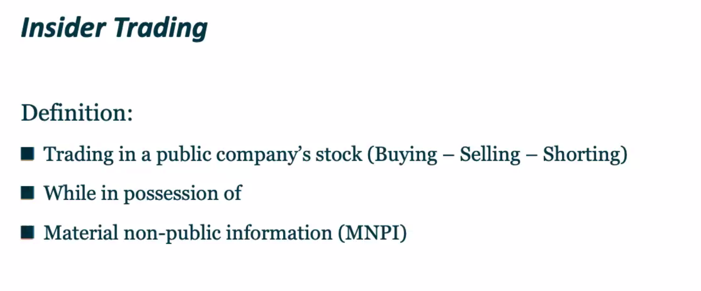
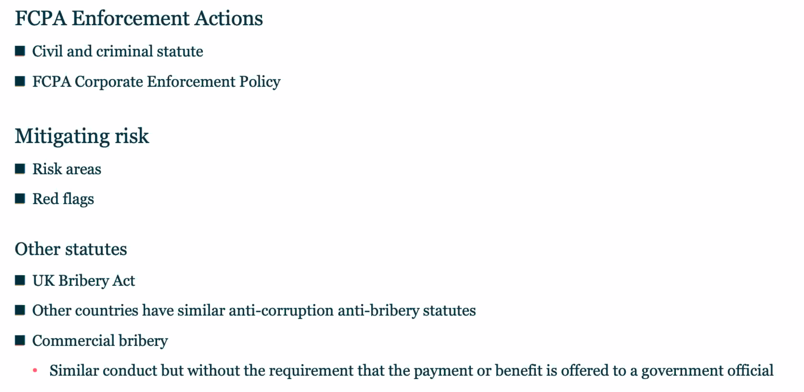

[toc]

# Inside Trading

## MNPI

## law

## Risk areas

## hypothetical

### Hypotheical 4

You pitch The Company's products to an app publisher in China that is a subsidiary of the Beijing Transportation Authority (BTA)

Your contact at the app publisher tells you they are interested in working with The Company, but in order to publish the deal through and get BTA to approve the contract, The Company or you needs to pay a standard "facilitation fee" to an executive at BTA.

# FCPA

Third-Party Liability

* The Company can be held liable for payments/ actions of third-parties acting on its behalf (e.g. partners, agents, resellers)

