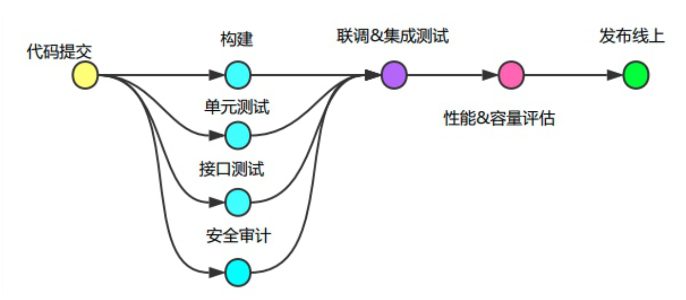

[toc]


# gitlab


# installation 


## Amazon linux

* CE

```
curl https://packages.gitlab.com/install/repositories/gitlab/gitlab-ce/script.rpm.sh | sudo bash

yum install gitlab-ce
```


* EE

```
curl https://packages.gitlab.com/install/repositories/gitlab/gitlab-ee/script.rpm.sh | sudo bash
```


## Ubuntu

* 12.8.1

```
sudo apt update
sudo apt install ca-certificates curl openssh-server postfix

curl -sS https://packages.gitlab.com/install/repositories/gitlab/gitlab-ce/script.deb.sh | sudo bash

sudo apt install gitlab-ce -y

gitlab-ctl reconfigure
```


* enable ssl by Letsencrypt 

    Your domain’s Certification Authority Authorization (CAA) record must allow Let’s Encrypt to issue a certificate for your domain.

```
apt install letsencrypt -y

sudo letsencrypt certonly --standalone --agree-tos --no-eff-email --agree-tos --email rickxu1989@gmail.com -d git.xurick.com

sudo mkdir -p /etc/gitlab/ssl/
sudo openssl dhparam -out /etc/gitlab/ssl/dhparams.pem 2048

# After long time
chmod 600 /etc/gitlab/ssl/*

vim /etc/gitlab/gitlab.rb
external_url 'https://git.xurick.com'
registry_external_url 'https://registry.xurick.com'
nginx['redirect_http_to_https'] = true
nginx['redirect_http_to_https_port'] = 80
mattermost_external_url 'http://mattermost.xurick.com'
letsencrypt['enable'] = true
letsencrypt['contact_emails'] = ['rickxu1989@gmail.com'] # This should be an array of email addresses to add as contacts
letsencrypt['auto_renew'] = true
letsencrypt['auto_renew_hour'] = 12
letsencrypt['auto_renew_minute'] = "30"
letsencrypt['auto_renew_day_of_month'] = "*/7"

gitlab-ctl reconfigure
```


## docker

```bash
sudo docker run --detach \
  --hostname gitlab.xurick.com \
  --publish 127.0.0.1:4443:443 --publish 127.0.0.1:4000:80 --publish 22:22\
  --name gitlab \
  --restart always \
  --volume /srv/gitlab/config:/etc/gitlab \
  --volume /srv/gitlab/logs:/var/log/gitlab \
  --volume /srv/gitlab/data:/var/opt/gitlab \
  gitlab/gitlab-ce:latest
```

> /srv/gitlab/config will hold GitLab's configuration
>
> /srv/gitlab/logs will hold the GitLab's logs
>
> /srv/gitlab/data will hold the actual git repo's data.

```
sudo apt update && sudo apt install nginx -y
```


vim /etc/nginx/sites-enabled/default

```
map $http_upgrade $connection_upgrade {
        default upgrade;
        '' close;
}
server {
        listen 80 default_server;
        listen [::]:80 default_server;


        root /var/www/html;

        index index.html index.htm index.nginx-debian.html;

        server_name _;

        location / {
                proxy_pass http://localhost:4000;

                proxy_read_timeout 3600s;
                proxy_http_version 1.1;
                proxy_set_header Upgrade $http_upgrade;
                proxy_set_header Connection $connection_upgrade;
        }


}
```


Go to web UI to complete Gitlab initilization by using root user


appendix

https://docs.gitlab.com/omnibus/docker/


### https 

Do not enable cloudflare DNS proxy

Go to https://certbot.eff.org/instructions to select certbot info


```
sudo snap install core; sudo snap refresh core
sudo snap install --classic certbot
sudo ln -s /snap/bin/certbot /usr/bin/certbot
sudo snap set certbot trust-plugin-with-root=ok
sudo apt -y install python3-certbot-dns-cloudflare
```

Setup dns plugins with cloudflare, details please go to https://certbot.eff.org/docs/using.html#dns-plugins

```
sudo snap install certbot-dns-cloudflare
```


go to cloudflare to get api token 

https://dash.cloudflare.com/?to=/:account/profile/api-tokens

The Token needed by Certbot requires `Zone:DNS:Edit` permissions for only the zones you need certificates for


```
vim ~/.secrets/certbot/cloudflare.ini
dns_cloudflare_api_token = 0123456789abcdef0123456789abcdef01234567
dns_cloudflare_email = cloudflare@example.com
dns_cloudflare_api_key = 0123456789abcdef0123456789abcdef01234 

chmod 600 ~/.secrets/certbot/cloudflare.ini
```

> Api_key is global api key


```
certbot certonly \
  --dns-cloudflare \
  --dns-cloudflare-credentials ~/.secrets/certbot/cloudflare.ini \
  -d gitlab.xurick.com \
  -i nginx 
```


Test auto renewal

```
sudo certbot renew --dry-run
```


set up your server inside the Nginx configuration. Certbot has already created a configuration for you inside `/etc/nginx/sites-enabled`. Alter the configuration for the host and the port that it points to like this

```
# make sure this map append into the config
map $http_upgrade $connection_upgrade {
        default upgrade;
        '' close;
}

server {
	server_name git.domain.com;
	client_max_body_size 256M;

	location / {
		proxy_pass http://localhost:4000;

		proxy_read_timeout 3600s;
		proxy_http_version 1.1;
		# Websocket connection
		proxy_set_header Upgrade $http_upgrade;
		proxy_set_header Connection $connection_upgrade;
	}

	listen [::]:443;

	listen 443 ssl; # managed by Certbot
    ssl_certificate /etc/letsencrypt/live/git.xurick.com/fullchain.pem; # managed by Certbot
    ssl_certificate_key /etc/letsencrypt/live/git.xurick.com/privkey.pem; # managed by Certbot
	include /etc/letsencrypt/options-ssl-nginx.conf; # managed by Certbot
	ssl_dhparam /etc/letsencrypt/ssl-dhparams.pem; # managed by Certbot

}
```


auto renew cronjob

```
43 6 * * * certbot renew --post-hook "systemctl reload nginx"
```


# Gitlab-runner


## installation in centos

```
arch=amd64
curl -LJO "https://gitlab-runner-downloads.s3.amazonaws.com/latest/rpm/gitlab-runner_${arch}.rpm"
```


```
gitlab-runner register
```


## installation by docker

```
docker run -d --name gitlab-runner --restart always \
  -v /srv/gitlab-runner/config:/etc/gitlab-runner \
  -v /var/run/docker.sock:/var/run/docker.sock \
  gitlab/gitlab-runner:latest
```

> mount the host’s `/srv/gitlab-runner/config` folder to the `/etc/gitlab-runner` location of the container


Go to http://your_domain.com/admin/runners

```
docker exec -ti gitlab-runner bash
```

```
root@55d9aff26c4d:/# gitlab-runner register
Runtime platform                                    arch=amd64 os=linux pid=65 revision=6fbc7474 version=13.1.1
Running in system-mode.                            
                                                   
Please enter the gitlab-ci coordinator URL (e.g. https://gitlab.com/):
http://public_ip
Please enter the gitlab-ci token for this runner:
ukcmybsDQxxzsomxxx6CN
Please enter the gitlab-ci description for this runner:
[55d9aff26c4d]: sample-docker-runner
Please enter the gitlab-ci tags for this runner (comma separated):

Registering runner... succeeded                     runner=ukcmybsD
Please enter the executor: kubernetes, custom, docker, docker-ssh, parallels, shell, ssh, docker+machine, virtualbox, docker-ssh+machine:
docker
Please enter the default Docker image (e.g. ruby:2.6):
alpine:latest
Runner registered successfully. Feel free to start it, but if it's running already the config should be automatically reloaded! 
```


docker network

```
docker network create gitlabnet
docker network connect gitlabnet gitlab
docker network connect gitlabnet gitlab-runner
```


Avoiding Docker-In-Docker and resolve public domain

This will give your Dockerfile full control, there is another option. You can configure your runner to use the host's docker when executing the Dockerfile commands. You can do that by configuring the `gitlab-runner` configuration to use the host docker. In our example, the configuration is located at `/srv/gitlab-runner/config/config.toml`. edit the file

```
concurrent = 1
check_interval = 0

[session_server]
  session_timeout = 1800

[[runners]]
  name = "sample-docker-runner"
  url = "http://45.77.13.173"
  token = "Liqf4STtEBdsasUZjqWD"
  executor = "docker"
  clone_url = "http://45.77.13.173"
  [runners.custom_build_dir]
  [runners.cache]
    [runners.cache.s3]
    [runners.cache.gcs]
  [runners.docker]
    tls_verify = false
    image = "alpine:latest"
    privileged = false
    disable_entrypoint_overwrite = false
    oom_kill_disable = false
    disable_cache = false
    volumes = ["/var/run/docker.sock:/var/run/docker.sock", "/cache"]
    shm_size = 0
    extra_hosts = ["localhost:45.77.13.173"]
```


## gitlab-ci.yml

```
image: docker:latest

build_job:
  stage: build
  script:
    - ls
    - echo "starting job..."
    - docker build -t "${CI_PROJECT_NAME}:${CI_COMMIT_REF_NAME}-0.1.${CI_JOB_ID}" .
    - echo job finished
  only:
    - develop
    - master
```


### note

to do after completing the steps in this post.

- Configure SSH checkouts. With this configuration, you should be able to use HTTPS for pulls and pushes. If you want to enable SSL, you will need to expose port 22 from the GitLab container and perform some more advanced configuration to avoid mixing GitLab’s SSL with your host machine’s SSL (which would run in the same port by default).
- Use external Docker Container Registries. You can use a free service like [canister.io](https://git.oramind.net/unicorn/unicorn-api/pipelines) to host your docker images.
- Use an image/container management tool like https://www.portainer.io/ to manage your containers/images on your host machine. That includes your GitLab installation and GitLab runners.


# secure gitlab


## two factor

root user settings -> account


## change root username

change from root to your personal admin user


## Admin area

### disable sign_up

go to https://gitlab.xurick.com/admin  and then Sign-up restrictions


### All user two factor

Require all users to set up two-factor authentication


### unknown notification

Notify users by email when sign-in location is not recognized


### Spam and Anti-bot Protection

Enable reCAPTCHA, Invisible Captcha, Akismet and set IP limits


### Visibility and access controls

Restricted visibility levels == Private

disable all import sources

disable project export 


# smtp setup


## mailgun

vim gitlab.rb

```
gitlab_rails['smtp_enable'] = true
gitlab_rails['smtp_address'] = "smtp.mailgun.org"
gitlab_rails['smtp_port'] = 587
gitlab_rails['smtp_authentication'] = "plain"
gitlab_rails['smtp_enable_starttls_auto'] = true
gitlab_rails['smtp_user_name'] = "postmaster@mg.gitlab.com"
gitlab_rails['smtp_password'] = "password"
gitlab_rails['smtp_domain'] = "mg.gitlab.com"
```


You can verify that GitLab can send emails properly using the Rails console. On the GitLab server, execute `gitlab-rails console` to enter the console. Then, you can enter the following command at the console prompt to cause GitLab to send a test email:

```
Notify.test_email('rickxu1989@gmail.com', 'Message Subject', 'Message Body').deliver_now
```


## aws ses

vim gitlab.rb

```
gitlab_rails['smtp_enable'] = true
gitlab_rails['smtp_address'] = "email-smtp.region-1.amazonaws.com"
gitlab_rails['smtp_port'] = 587
gitlab_rails['smtp_user_name'] = "IAMmailerKey"
gitlab_rails['smtp_password'] = "IAMmailerSecret"
gitlab_rails['smtp_domain'] = "yourdomain.com"
gitlab_rails['smtp_authentication'] = "login"
gitlab_rails['smtp_enable_starttls_auto'] = true
```


```
Notify.test_email('destination_email@address.com', 'Message Subject', 'Message Body').deliver_now
```


# backup 


## create backup

```
docker exec -it gitlab gitlab-rake gitlab:backup:create
```

or

```
tar zcvf gitlab.tar.gz gitlab
```


## restore backup

```
docker exec -it gitlab gitlab-rake gitlab:backup:restore --trace
```


## verify backup 

```
docker exec -it gitlab gitlab-rake gitlab:check SANITIZE=true
```


# gitlab.yml

```
variables:
  S3_BUCKET: "s3://xx"


before_script:
  - echo "Job-${CI_JOB_ID} ${CI_JOB_NAME} of ${CI_JOB_STAGE} is starting"

after_script:
  - echo "Job-${CI_JOB_ID} ${CI_JOB_NAME} of ${CI_JOB_STAGE} is finished"

stages:
  - deploy_stg_v1

stg_v1_5.21.0:
  stage: deploy_stg_v1
  when: manual
  only:
    - branches@repo
  variables:
    BDP_VERSION: "1.0"
    IMAGE_VERSION: "5.21.0"
  script:
    - echo "Deploying ${CI_COMMIT_REF_NAME}/${CI_COMMIT_SHA} to ${S3_STG_CODE_PATH}"
    - rm -rf ${CI_PROJECT_DIR}/configs/${BD_VERSION}/${IMAGE_VERSION}/build/
```


# example


## gitlab ci/cd 

https://gitlab.com/kargo-ci/kubernetes-sigs-kubespray





# Appendix

https://docs.gitlab.com/runner/install/linux-manually.html

