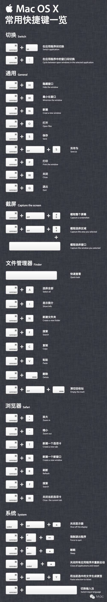

[TOC]

# 苹果设备


## 采购建议

https://buyersguide.macrumors.com/


## MacBook

### app已损坏，打不开。。”，或者“打不开。。

情况二：提示“app已损坏，打不开。。”，或者“打不开。。因为它来自身份不明的开发者”的解决办法；


打开「安全性偏好设置」- 「安全性与隐私」 - 「通用」，解开左下角的小锁，勾选允许「任何来源」，锁上小锁即可；但是 macOS Sierra 10.12 默认不显示“任何来源”，你可以打在终端执行 sudo spctl --master-disable 命令（在终端窗口粘贴代码，敲回车，提示输入password，输入密码，密码是看不见的，输完敲回车即可），退出『系统偏好设置』，再打开，『任何来源』就显示出来了；之前打不开的软件也可以打开了。


### Mac与其他iOS设备共享屏幕（投屏幕）


#### 有线共享

有线共享：这里说的有线无线中的"线"是指数据线，之前有介绍过QuickTime Player的录屏功能，除此之外，它还有屏幕共享功能，通过数据线将iPhone与Mac连接，打开Mac上的QuickTime Player，点击菜单栏文件选项中的新建影片录制；


点击新建屏幕录制后，Mac前置摄像头会开启,点击红色按钮旁边的菜单，会出现XX的iPhone选项，点击它，iPhone上的画面就会展现在Mac屏幕中了，这时你在iPhone中的操作就会在Mac屏幕上同步呈现。


####  无线共享

无线共享：此方法适用于Mac、iOS设备在同一局域网的情况下，如iPhone连接的是Mac共享的wifi或者Mac和iPhone连接的都是家里或公司的wifi，此时，在Mac上安装第三方软件Airserver，打开Airserver后Mac就变成了一个AirPlay终端，再打开iPhone中的控制中心，会有AirPlay选项出现，如果没有出现，请检查Mac和iPhone是不是在同一局域网中；


点击AirPlay，选择它所发现的 AirPlay 设备，也就是你的电脑，再点击打开镜像选项，然后屏幕就共享到Mac上了。


# 快捷键



```
https://mp.weixin.qq.com/s?__biz=MzAxNzcwMTA4Ng==&mid=100000103&idx=1&sn=462bdefe3b0054dd3b5c3d8e23189c81&chksm=1be0c0d62c9749c000a6b2667a7b585210f46fe08e3457f02a4819f0c7c938b5764514066d00&scene=20&key=399a205ce674169cddd368a413f6d8c792bfb8f69ab6c53524fdc820c082cfd5033a0c0abd73f1fb239c58b5349c492e5d0e3212806bdf6dbe0faa0543b7854bc13fc5aea034da9c98dba1f21ca441e5&ascene=0&uin=MjExMDA4MDk2Mg%3D%3D&devicetype=iMac+MacBookAir6%2C2+OSX+OSX+10.12.5+build(16F60a)&version=12020510&nettype=WIFI&fontScale=100&pass_ticket=mO5t8QhThwJHz79L6sgHzQVbgkVpHYs1EiXsa5dk0IE%2FDH7jtOhG%2FCCa3n5scP6G
```


# 保修

https://checkcoverage.apple.com/


# Installation

## How to boot a Mac from USB media

Getting your Mac to load from a USB drive is fairly straightforward.

1. Insert the USB boot media into an open USB slot.
2. Press the **Power** button to turn on your Mac (or **Restart** your Mac if it’s already on).
3. When you hear the startup chime, press and hold the **Option** key. Holding that key gives you access to OS X’s Startup Manager. Once the Startup Manager screen appears, release the Option key. The utility will look for any available drives that include bootable content.
4. Using either the pointer or arrow keys on the keyboard, select the USB drive you wish to boot from.
5. Once selected, either hit the **Return** key or double-click your selection. The machine will start to boot from the USB drive.

**NOTE:** Have multiple USB devices connected to your Mac? Don’t worry. The Startup Manager only lists drives that include bootable content.

## Boot from USB: Windows

Starting your PC using USB rescue media is not difficult, although it first requires an adjustment in the BIOS (Basic Input Output System). That’s because the BIOS settings include the boot sequence the machine follows when starting up. The boot order tells the machine which devices to search for the software needed to launch the computer and the priority each device in that search.

If you’re booting from USB media, you must change the BIOS boot order so the USB device is listed first. Otherwise the computer will load from the hard drive as normal.

Start by plugging the thumb drive into a USB port. Then t**o change the BIOS boot sequence**:

1. Press the **Power** button for your computer.

2. During the initial startup screen, press **ESC, F1, F2, F8** or **F10**. (Depending on the company that created your version of BIOS, a menu may appear.)

3. When you choose to enter BIOS Setup, the setup utility page will appear.

4. Using the arrow keys on your keyboard, select the ***BOOT\*** tab. All of the available system devices will be displayed in order of their boot priority. You can reorder the devices here.

5. Move

     

    USB

     

    to be first in the boot sequence.

    NOTE:

     

    If you cannot find

     

    USB

     

    or

     

    Removable Devices

     

    among the device options, your BIOS may list it under

     

    Hard Drive Devices

    . In that case, you’ll need to:

    - Move *Hard Drive Devices* to the top
    - Expand to show all hard drive device options
    - Move *USB device* to the top of that hard drive list
         

6. Save the change and then exit the BIOS Setup.

7. The computer will restart using the new settings, booting from your USB drive.

8. **Stay alert!** Depending on your BIOS, you may be prompted with a message to *Press any key to boot from external device* and you will only have a few seconds to respond. If you do nothing, your computer will go to the next device in the boot sequence list, which will likely be your hard drive.

In the future, your computer will first check the USB port for boot media when starting up. That won’t be a problem, since the BIOS will move to the next device in the boot sequence ... unless you keep the boot media in the USB port. Then the system will launch from that device every time.

## Linux USB Boot Process

**To boot Ubuntu from USB media, the process is very similar to the Windows instructions above.**

1. Confirm the BIOS boot sequence lists the USB drive first, or make that change as needed.
2. After the USB flash drive is inserted into the USB port, press the **Power** button for your machine (or **Restart** if the computer is running).
3. The installer boot menu will load, where you will select *Run Ubuntu from this USB*.
4. Ubuntu will launch and you can begin to working in the system – setting preferences, reconfiguring the system as needed, or running any diagnostic tools.

## Creating USB boot media

Regardless of the operating system you are using, booting your machine from USB media does not need to be difficult. A general understanding how your system loads can provide the basics needed to understand what is going on when you use boot media. 

Creating USB boot media doesn’t need to be difficult either, although there are several options to consider.

For Mac users, we recommend visiting Apple’s [support page on USB boot media](https://support.apple.com/en-us/HT201372). It provides guidance that is specific to the iteration of OS X you are running (i.e. Sierra, High Sierra, Yosemite, etc.) to help you get the boot version you need.

Windows and Linux users might consider [Acronis Disk Director 12](https://www.acronis.com/en-us/personal/disk-manager/), which includes an intuitive Boot Media Builder that streamlines the process and offers tremendous flexibility for the type and kind of boot media you can create, including WinPE media.


# Boot-camp (for windows OS)

https://support.apple.com/boot-camp


# Appendix

https://www.acronis.com/en-us/articles/usb-boot/#:~:text=Press%20the%20Power%20button%20to,appears%2C%20release%20the%20Option%20key.

