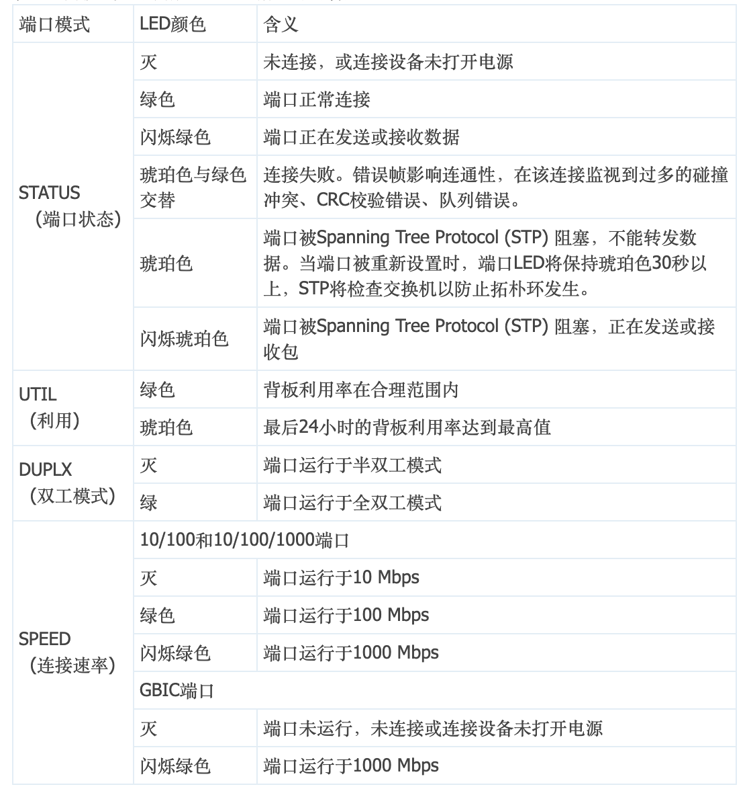

[TOC]


# Cisco


## Cisco Voice 7901


### reset to factory mode

```
Step 1
Unplug the power cable from the phone and then plug it back in.
The phone begins its power up cycle.

Step 2
Immediately press and hold # while the Headset, Mute, and Speaker buttons turn
on and off in sequence.
Release # after the Speaker button turns off.
the phones lights should be on and off.

Step 3
Press 123456789*0# within 60 seconds after the Headset, Mute, and Speaker
buttons begin to flash.
If you repeat a key within the sequence (for example, if you press
1223456789*0#), the sequence will still be accepted and the phone will reset.
```


## Cisco Voice 7945


### Hard Reset 7945

```
press Settings
enter **# to unlock the phone
More softkey will appear press it
You will see Erase softkey, press it
```


## 交换机面板指示灯

Catalyst 2950/3550系列交换机前面板LED指示灯标注

交换机LED指示灯标注
SYSTEM LED指示灯用于显示系统加电情况，各指示灯含义如表1所示。

| 颜色   | 系统状态                   |
| ------ | -------------------------- |
| 灭     | 系统未加电                 |
| 绿色   | 系统正常运行               |
| 琥珀色 | 系统虽然加电，但电源有问题 |

