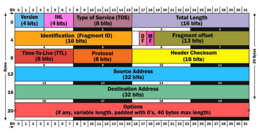
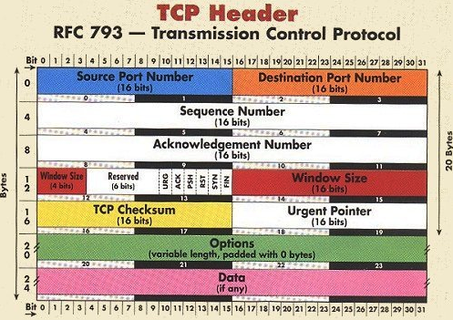
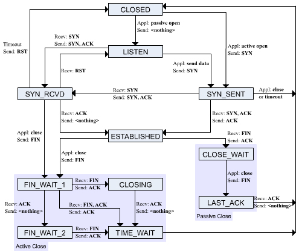
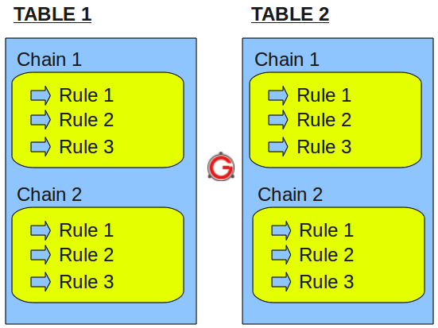
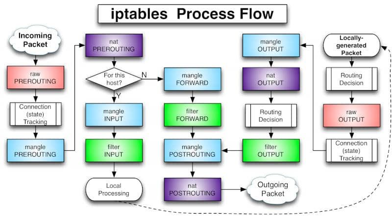

[TOC]


# iptables

Linux 下的网络防火墙


netfilter框架调用hooks 函数对报文进行处理

iptables 是规则管理工具


## Packages

### IPV4




Total Length：整个报文的总长度 

Fragment ID： 分片信息 

DF：Don't fragment 

MF: More fragment 

Fragment Offset: 片偏移，即对报文排序 


### TCP Header



Squence Number: 发送方告诉接收方的编号 

Acknowledgement Number：序列号加1，回复给对方 

Windows Size：报文的缓冲大小 

URG: 紧急指针，1表示有效，0无效 

ACK：确认号是否有效 

PSH：优先处理的保温 

RST：连接抖动 

SYN：同步请求 

FIN: 断开连接 


#### TCP 有限状态机




# iptables 处理流程及结构

iptables -> Tables -> Chains -> Rules







## 传输数据包的过程

当数据包进入系统时，系统首先根据路由表决定将数据包发给哪一条链，则可能有以下3种情况：

1. 数据包的目的地址是本机，则系统将数据包送往INPUT链，如果通过规则检查，则该包被发给相应的本地进程处理；如果没有通过规则检查，系统将丢弃该包。
2. 数据包的上的地址不是本机，也就是说这个包将被转发，则系统将数据包送往FORWARD链，如果通过规则检查，该包被发给相应的本地进程处理；如果没有通过规则检查，系统将丢弃该包。
3. 数据包是由本地系统进程产生的，则系统将其送往OUTPUT链，如果通过规则检查，则该包被发给相应的本地进程处理；如果没有通过规则检查，系统将丢弃该包。


用户可以给各链定义规则，当数据包到达其中的每一条链，iptables就会根据链中定义的规则来处理这个包。

iptables将数据包的头信息与它所传递到的链中的每条规则进行比较，看它是否和每条规则完全匹配。

如果数据包与某条规则匹配，iptables就对该数据包执行由该规则指定的操作。

例如某条链中的规则决定要丢弃(DROP)数据包，数据包就会在该链处丢弃；

如果链中规则接受(ACCEPT)数据包，数据包就可以继续前进；

但是，如果数据包与这条规则不匹配，那么它将与链中的下一条规则进行比较。

如果该数据包不符合该链中的任何一条规则，那么iptables将根据该链预先定义的默认策略来决 定如何处理该数据包

理想的默认策略应该告诉iptables丢弃(DROP)该数据包。


## Table 表结构

iptables具有Filter, NAT, Mangle, Raw四种内建表


优先级

```
raw > mangle > nat > filter
```


### Raw表

只使用在PREROUTING链和OUTPUT链上，优先级最高，可以对收到的数据包在连接跟踪前进行处理。

一但用户使用了RAW表，在某个链上RAW表处理完后，将跳过NAT表和 ip_conntrack处理，即不再做地址转换和数据包的链接跟踪处理了。


### Mangle表 (内建)

Mangle主要用作功能修改数据报文的属性。它能改变TCP头中的QoS位。


### NAT表 (内建)

主要用于网络地址转换NAT，该表可以实现一对一，一对多，多对多等NAT工作（SNAT，DNAT，PNAT）

在防火墙运作时，每个封包只会经过这个规则表一次。如果我们把数据包过滤的规则定义在这个数据表里，将会造成无法对同一包进行多次比对，因此这个规则表除了作网址转换外，请不要做其它用途。


### Filter表 (内建)

Filter表示iptables的默认表，因此如果你没有自定义表，那么就默认使用filter表

主要用于数据报文过滤。该表根据系统管理员预定义的一组规则过滤符合条件的数据包

在filter表中只能允许对数据包进行接受，丢弃的操作，而无法对数据包进行更改


## Chain 链

链（chains）是数据包传播的路径，每一条链其实就是众多规则中的一个检查清单，每一条链中可以有一条或数条规则。


### PREROUTING

处理刚到达本机并在路由转发前的数据包。它会转换数据包中的目标IP地址（destination ip address），通常用于DNAT(destination NAT)。 


### INPUT

只有要到达本机的封包才会由INPUT函式处理，所以会让来自内部网路的封包无条件放行

来自外部网路的封包则过滤是否为回应封包，若是则放行。


### FORWARD

所有转送封包都在这里处理，这部分的过滤规则最复杂


需要开启核心转发参数

```
/proc/sys/net/ipv4/ip_forward
/etc/sysct.conf
net.ipv4.ip_forward=1
```


### OUTPUT

从本机送出去的封包由这个函式处理，通常会放行所有封包


### POSTROUTIONG

处理即将离开本机的数据包。它会转换数据包中的源IP地址（source ip address），通常用于SNAT（source NAT）MASQUERADE


## Rules 规则

牢记以下三点式理解iptables规则的关键：

- Rules包括一个条件和一个目标(target)

- 如果满足条件，就执行目标(target)中的规则或者特定值。

- 如果不满足条件，就判断下一条Rules。


### Target 目标值

```
ACCEPT – 允许防火墙接收数据包
DROP – 防火墙丢弃包
QUEUE – 防火墙将数据包移交到用户空间
RETURN – 防火墙停止执行当前链中的后续Rules，并返回到调用链(the calling chain)中。
```


