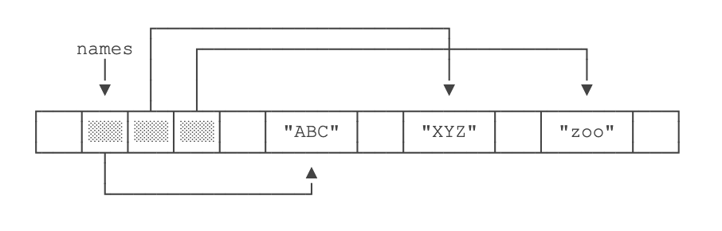
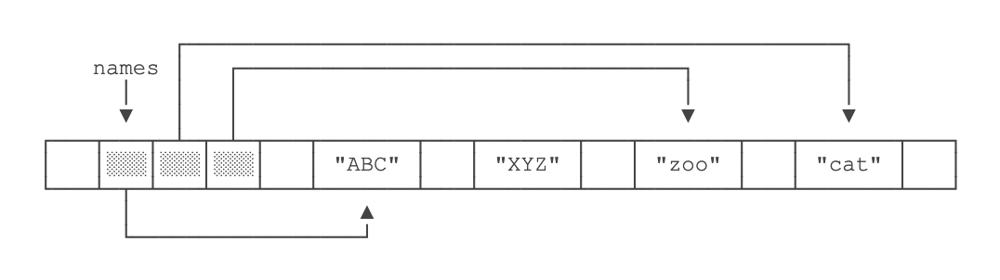

[TOC]

# Array 数组

数组所有元素初始化为默认值，整型都是`0`，浮点型是`0.0`，布尔型是`false`；

数组一旦创建后，大小就不可改变。


## 定义数组

元素个数必须是整数

元素个数必须给出

元素个数可以是变量

```
<类型>[] <名称> = new <类型>[元素个数]

int[] grades = new int[100];
double[] averages = new double[20];
```


### 字符串数组

```
String[] names = new String[10];
```

> 创建了一个包含10个字符串数组，所有字符串都为null
> 
> 可以为其内部元素指定空串

如果数组元素不是基本类型，而是一个引用类型，字符串是引用类型

```
String[] names = {
    "ABC", "XYZ", "zoo"
}
```

对于`String[]`类型的数组变量`names`，它实际上包含3个元素，但每个元素都指向某个字符串对象：




对`names[1]`进行赋值，例如`names[1] = "cat";`，效果如下：




这里注意到原来`names[1]`指向的字符串`"XYZ"`并没有改变，仅仅是将`names[1]`的引用从指向`"XYZ"`改成了指向`"cat"`，其结果是字符串`"XYZ"`再也无法通过`names[1]`访问到了

```
public class Main {
    public static void main(String[] args) {
        String[] names = {"ABC", "XYZ", "zoo"};
        String s = names[1];
        names[1] = "cat";
        System.out.println(s);
    }
}

>>>
XYZ
```

## 匿名数组

即创建数组对象并同时赋值初始值的简化写法

```
smallPrimes = new int[] {17, 19, 23, 29, 31, 37};
```

```
int [] ns = new int[] {68, 79, 91, 85, 62 };
System.out.println(ns.length);
```

还可以进一步简写为：

```
int[] ns = { 68, 79, 91, 85, 62 };
```

# 多维数组

## 二维数组

二维数组就是数组的数组

```
public class Main {
    public static void main(String[] args) {
        int[][] ns = {
                {1, 2, 3, 4},
                {5, 6, 7, 8},
                {9, 10, 11, 12}
        };
        System.out.println(ns.length);
    }
}

>>>
3
```

### for 循环打印

for each循环不能自动处理二维数组的每一个元素， 需要使用两个嵌套循环

```
for (double[] row: a)
    for (double value: row)
            do something with value
```

### deepToString 打印

使用Java标准库的`Arrays.deepToString()`打印一个二维数组

```
import java.util.Arrays;

public class Main {
    public static void main(String[] args) {
        int[][] ns = {
                {1, 2, 3, 4},
                {5, 6, 7, 8},
                {9, 10, 11, 12}
        };
        System.out.println(Arrays.deepToString(ns));
    }
}

>>>
[[1, 2, 3, 4], [5, 6, 7, 8], [9, 10, 11, 12]]
```

## 三维数组 （不常用）

三维数组就是二维数组的数组

定义

```
public class Main {
    public static void main(String[] args) {
        int[][][] ns = {
                {
                        {1, 2, 3},
                        {4, 5, 6},
                        {7, 8, 9}
                },
                {
                        {10, 11},
                        {12, 13}
                },
                {
                        {14, 15, 16},
                        {17, 18}
                }
        };
        System.out.println(ns[2][0][1]);
    }
}
```

# 数组操作

## 赋值

```
int [] ns = new int[5];
ns[0] = 69;
ns[1] = 80;
```


也可以在定义数组时直接指定初始化的元素，这样就不必写出数组大小，而是由编译器自动推算数组大小。

```
public class Main {
    public static void main(String[] args) {
        int[] ns = new int[] {68, 79, 81, 85, 62};
        System.out.println(ns.length);
    }
}

>>>
5
```


也可以进一步简写为

```
int[] ns = { 68, 79, 91, 85, 62 };
```


## 排序

### 冒泡排序

冒泡排序的特点是，每一轮循环后，最大的一个数被交换到末尾，因此，下一轮循环就可以“刨除”最后的数，每一轮循环都比上一轮循环的结束位置靠前一位

```
import java.util.Arrays;

public class Main {
    public static void main(String[] args) {
        int[] ns = { 28, 12, 89, 73, 65, 18, 96, 50, 8, 36 };
        // 排序前:
        System.out.println(Arrays.toString(ns));
        for (int i = 0; i < ns.length - 1; i++) {
            for (int j = 0; j < ns.length - i - 1; j++) {
                if (ns[j] > ns[j+1]) {
                    // 交换ns[j]和ns[j+1]:
                    int tmp = ns[j];
                    ns[j] = ns[j+1];
                    ns[j+1] = tmp;
                }
            }
        }
        // 排序后:
        System.out.println(Arrays.toString(ns));
    }
}

>>>
[28, 12, 89, 73, 65, 18, 96, 50, 8, 36]
[8, 12, 18, 28, 36, 50, 65, 73, 89, 96]
```


### sort( )

修改了每个数组元素的指向变化

```
import java.util.Arrays;

public class Main {
    public static void main(String[] args) {
        int[] ns = {28, 12, 89, 73, 65, 18, 96, 50, 8, 36};
        Arrays.sort(ns);
        System.out.println(Arrays.toString(ns));
    }
}

>>>
[8, 12, 18, 28, 36, 50, 65, 73, 89, 96]
```


## 索引访问

下标越界，编译器时检查不出来，只有运行的时候会出错，导致程序终止

```
public class Main {
    public static void main(String[] args) {
        int [] ns = new int[5];
        ns[0] = 0;
        ns[1] = 1;
        System.out.println(ns[0]);
    }
}

>>>
0
```


## 遍历数组

### for

通过`for`循环就可以遍历数组。因为数组的每个元素都可以通过索引来访问，因此，使用标准的`for`循环可以完成一个数组的遍历

```
public class Main {
    public static void main(String[] args) {
        int [] ns = {1, 4, 9, 16, 25};
        for (int i=0; i<ns.length; i++) {
            int n = ns[i];
            System.out.println(n);
        }
    }
}

>>>
1
4
9
16
25
```


### for each

只是获取数组中的value信息，无法修改数组元素内容

```
for (variable: collection) {
        statement;
}
```

```
public class Main {
    public static void main(String[] args) {
        int [] ns = {1, 4, 9, 16, 25};
        for (int n: ns) {
            System.out.println(n);
        }
    }
}

>>>
1
4
9
16
25
```

也可以使用for 循环获取

```
public class Main {
    public static void main(String[] args) {
        int[] ns = {1, 4, 9, 16, 25};
        for (int i=0; i<ns.length; i++) {
            System.out.println(ns[i]);
        }
    }
}

>>>
1
4
9
16
25
```

## 打印数组内容

### toString()

使用标准库中`Arrays.toString()`

```
import java.util.Arrays;

public class Main {
    public static void main(String[] args) {
        int [] ns = {1, 1, 2, 3, 5, 8};
        System.out.println(Arrays.toString(ns));
    }
}

>>>
[1, 1, 2, 3, 5, 8]
```

## length 获取长度

```
int [] ns = new int[5];
System.out.println(ns.length);
```

## copyOf 复制

```
int[] luckyNumbers = smallPrimes;
int[] copiedLuckyNumbers = Arrays.copyOf(luckyNumbers, luckyNumbers.length);
```
