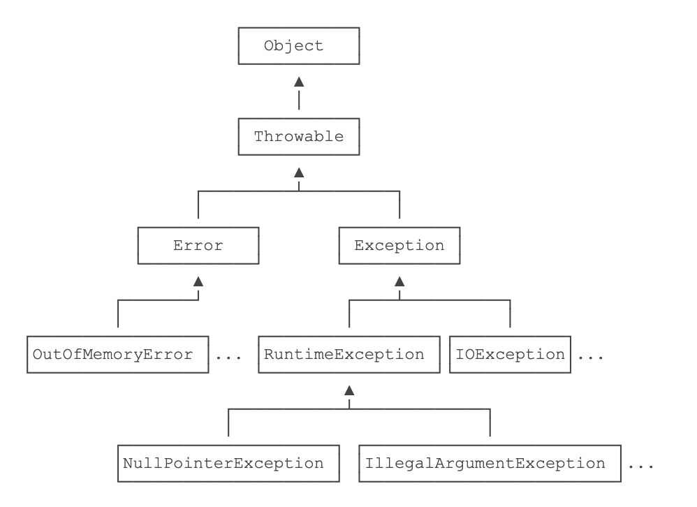

[TOC]

# 异常处理


## 获取调用失败

方法一：约定返回错误码。

例如，处理一个文件，如果返回`0`，表示成功，返回其他整数，表示约定的错误码：

```
int code = processFile("C:\\test.txt");
if (code == 0) {
    // ok:
} else {
    // error:
    switch (code) {
    case 1:
        // file not found:
    case 2:
        // no read permission:
    default:
        // unknown error:
    }
}
```


方法二：在语言层面上提供一个异常处理机制。

Java内置了一套异常处理机制，总是使用异常来表示错误。

异常是一种`class`，因此它本身带有类型信息。异常可以在任何地方抛出，但只需要在上层捕获，这样就和方法调用分离了：

```
try {
    String s = processFile(“C:\\test.txt”);
    // ok:
} catch (FileNotFoundException e) {
    // file not found:
} catch (SecurityException e) {
    // no read permission:
} catch (IOException e) {
    // io error:
} catch (Exception e) {
    // other error:
}
```


## 继承关系




### Error

`Error`表示严重的错误，程序对此一般无能为力，例如：

- `OutOfMemoryError`：内存耗尽
- `NoClassDefFoundError`：无法加载某个Class
- `StackOverflowError`：栈溢出


### Exception 

`Exception`则是运行时的错误，它可以被捕获并处理。

某些异常是应用程序逻辑处理的一部分，应该捕获并处理。例如：

- `NumberFormatException`：数值类型的格式错误
- `FileNotFoundException`：未找到文件
- `SocketException`：读取网络失败

还有一些异常是程序逻辑编写不对造成的，应该修复程序本身。例如：

- `NullPointerException`：对某个`null`的对象调用方法或字段
- `IndexOutOfBoundsException`：数组索引越界

`Exception`又分为两大类：

1. `RuntimeException`以及它的子类；
2. 非`RuntimeException`（包括`IOException`、`ReflectiveOperationException`等等）

Java规定：

- 必须捕获的异常，包括`Exception`及其子类，但不包括`RuntimeException`及其子类，这种类型的异常称为Checked Exception。
- 不需要捕获的异常，包括`Error`及其子类，`RuntimeException`及其子类


## 子类异常

当覆盖一个函数的时候，子类不能声明抛出比父类的版本更多的异常

在子类的构造函数中，必须声明父类可能抛出的全部异常


# 捕获异常

捕获异常使用`try...catch`语句，把可能发生异常的代码放到`try {...}`中，然后使用`catch`捕获对应的`Exception`及其子类

```
public class Main {
    public static void main(String[] args) {
        byte[] bs = toGBK("中文");
        System.out.println(Arrays.toString(bs));
    }

    static byte[] toGBK(String s) {
        try {
            // 用指定编码转换String为byte[]:
            return s.getBytes("GBK");
        } catch (UnsupportedEncodingException e) {
            // 如果系统不支持GBK编码，会捕获到UnsupportedEncodingException:
            System.out.println(e); // 打印异常信息
            return s.getBytes(); // 尝试使用用默认编码
        }
    }
}

>>>
[-42, -48, -50, -60]
```


## 多catch语句

可以使用多个`catch`语句，每个`catch`分别捕获对应的`Exception`及其子类。JVM在捕获到异常后，会从上到下匹配`catch`语句，匹配到某个`catch`后，执行`catch`代码块，然后*不再*继续匹配。

简单地说就是：多个`catch`语句只有一个能被执行。例如：

```
public static void main(String[] args) {
    try {
        process1();
        process2();
        process3();
    } catch (IOException e) {
        System.out.println(e);
    } catch (NumberFormatException e) {
        System.out.println(e);
    }
}
```


存在多个`catch`的时候，`catch`的顺序非常重要：子类必须写在前面。例如：

```
public static void main(String[] args) {
    try {
        process1();
        process2();
        process3();
    } catch (IOException e) {
        System.out.println("IO error");
    } catch (UnsupportedEncodingException e) { // 永远捕获不到
        System.out.println("Bad encoding");
    }
}
```

> `UnsupportedEncodingException`异常是永远捕获不到的，因为它是`IOException`的子类。当抛出`UnsupportedEncodingException`异常时，会被`catch (IOException e) { ... }`捕获并执行


## finally语句

Java`finally`语句块保证有无错误都会执行

```
public static void main(String[] args) {
    try {
        process1();
        process2();
        process3();
    } catch (UnsupportedEncodingException e) {
        System.out.println("Bad encoding");
    } catch (IOException e) {
        System.out.println("IO error");
    } finally {
        System.out.println("END");
    }
}
```


某些情况下，可以没有`catch`，只使用`try ... finally`结构。例如：

```
void process(String file) throws IOException {
    try {
        ...
    } finally {
        System.out.println("END");
    }
}
```


## 捕获多种异常

如果某些异常的处理逻辑相同，但是异常本身不存在继承关系，那么就得编写多条`catch`子句：

```
public static void main(String[] args) {
    try {
        process1();
        process2();
        process3();
    } catch (IOException e) {
        System.out.println("Bad input");
    } catch (NumberFormatException e) {
        System.out.println("Bad input");
    } catch (Exception e) {
        System.out.println("Unknown error");
    }
}
```


因为处理`IOException`和`NumberFormatException`的代码是相同的，所以我们可以把它两用`|`合并到一起：

```
public static void main(String[] args) {
    try {
        process1();
        process2();
        process3();
    } catch (IOException | NumberFormatException e) { // IOException或NumberFormatException
        System.out.println("Bad input");
    } catch (Exception e) {
        System.out.println("Unknown error");
    }
}
```


# 输出异常方法

## getMessage()

```
System.out.println(e.getMessage());
```


## toString()


## printStackTrace() 异常调用堆栈

即完整的异常位置和调用轨迹

```
public class Main {
    public static void main(String[] args) {
        try {
            process1();
        } catch (Exception e) {
            e.printStackTrace();
        }
    }

    static void process1() {
        process2();
    }

    static void process2() {
        Integer.parseInt(null); // 会抛出NumberFormatException
    }
}

>>>
java.lang.NumberFormatException: null
	at java.base/java.lang.Integer.parseInt(Integer.java:620)
	at java.base/java.lang.Integer.parseInt(Integer.java:776)
	at Main.process2(Main.java:15)
	at Main.process1(Main.java:11)
	at Main.main(Main.java:4)
```

> 1. `main()`调用`process1()`；
> 2. `process1()`调用`process2()`；
> 3. `process2()`调用`Integer.parseInt(String)`；
> 4. `Integer.parseInt(String)`调用`Integer.parseInt(String, int)`。


## Throwable.getCause() 获取原始异常

在代码中获取原始异常可以使用`Throwable.getCause()`方法。如果返回`null`，说明已经是“根异常”了。

# throw 抛出异常

用`throw`语句抛出

```
void process2(String s) {
    if (s==null) {
        NullPointerException e = new NullPointerException();
        throw e;
    }
}
```


实际上，绝大部分抛出异常的代码都会合并写成一行：

```
void process2(String s) {
    if (s==null) {
        throw new NullPointerException();
    }
}
```


# 异常屏蔽 (不常用)

`finally`抛出异常后，原来在`catch`中准备抛出的异常就“消失”了，因为只能抛出一个异常。没有被抛出的异常称为“被屏蔽”的异常（Suppressed Exception）

```
public class Main {
    public static void main(String[] args) {
        try {
            Integer.parseInt("abc");
        } catch (Exception e) {
            System.out.println("catched");
            throw new RuntimeException(e);
        } finally {
            System.out.println("finally");
            throw new IllegalArgumentException();
        }
    }
}

>>>
catched
Exception in thread "main" finally
java.lang.IllegalArgumentException
	at Main.main(Main.java:10)
```


绝大多数情况下，在`finally`中不要抛出异常。因此，我们通常不需要关心`Suppressed Exception`。


## 获知所有的异常 

在极少数的情况下，我们需要获知所有的异常

先用`origin`变量保存原始异常，然后调用`Throwable.addSuppressed()`，把原始异常添加进来，最后在`finally`抛出

```
public class Main {
    public static void main(String[] args) throws Exception {
        Exception origin = null;
        try {
            System.out.println(Integer.parseInt("abc"));
        } catch (Exception e) {
            origin = e;
            throw e;
        } finally {
            Exception e = new IllegalArgumentException();
            if (origin != null) {
                e.addSuppressed(origin);
            }
            throw e;
        }
    }
}

>>>
Exception in thread "main" java.lang.IllegalArgumentException
	at Main.main(Main.java:10)
	Suppressed: java.lang.NumberFormatException: For input string: "abc"
		at java.base/java.lang.NumberFormatException.forInputString(NumberFormatException.java:68)
		at java.base/java.lang.Integer.parseInt(Integer.java:658)
		at java.base/java.lang.Integer.parseInt(Integer.java:776)
		at Main.main(Main.java:5)
```


# 自定义异常

Java标准库定义的常用异常包括：

```ascii
Exception
│
├─ RuntimeException
│  │
│  ├─ NullPointerException
│  │
│  ├─ IndexOutOfBoundsException
│  │
│  ├─ SecurityException
│  │
│  └─ IllegalArgumentException
│     │
│     └─ NumberFormatException
│
├─ IOException
│  │
│  ├─ UnsupportedCharsetException
│  │
│  ├─ FileNotFoundException
│  │
│  └─ SocketException
│
├─ ParseException
│
├─ GeneralSecurityException
│
├─ SQLException
│
└─ TimeoutException

```


在代码中需要抛出异常时，尽量使用JDK已定义的异常类型

```
static void process1(int age) {
    if (age <= 0) {
        throw new IllegalArgumentException();
    }
}
```


## 异常继承

自定义新的异常类型

一个常见的做法是自定义一个`BaseException`作为“根异常”，然后，派生出各种业务类型的异常。

`BaseException`需要从一个适合的`Exception`派生，通常建议从`RuntimeException`派生：

```
public class BaseException extends RuntimeException {
}
```


其他业务类型的异常就可以从`BaseException`派生：

```
public class UserNotFoundException extends BaseException {
}

public class LoginFailedException extends BaseException {
}

...
```


自定义的`BaseException`应该提供多个构造方法：

```
public class BaseException extends RuntimeException {
    public BaseException() {
        super();
    }

    public BaseException(String message, Throwable cause) {
        super(message, cause);
    }

    public BaseException(String message) {
        super(message);
    }

    public BaseException(Throwable cause) {
        super(cause);
    }
}
```


# 断言 Assertion (不常用)

断言（Assertion）是一种调试程序的方式。在Java中，使用`assert`关键字来实现断言

实际开发中，很少使用断言。更好的方法是编写单元测试


## 开启

JVM默认关闭断言指令，即遇到`assert`语句就自动忽略了，不执行。

要执行`assert`语句，必须给Java虚拟机传递`-enableassertions`（可简写为`-ea`）参数启用断言

```
public static void main(String[] args) {
    double x = Math.abs(-123.45);
    assert x >= 0;
    System.out.println(x);
}
```

> assert x >= 0;`即为断言，断言条件`x >= 0`预期为`true`。如果计算结果为`false`，则断言失败，抛出`AssertionError


## AssertionError

断言失败时会抛出`AssertionError`，导致程序结束退出。因此，断言不能用于可恢复的程序错误，只应该用于开发和测试阶段


## 应用场景

对于可恢复的程序错误，不应该使用断言。例如：

```
void sort(int[] arr) {
    assert arr != null;
}
```

应该抛出异常并在上层捕获：

```
void sort(int[] arr) {
    if (x == null) {
        throw new IllegalArgumentException("array cannot be null");
    }
}
```


# 异常example

## 打开文件

```java
try {
 		// Business Logic
		open the file;
	 	determine its size;
	  allocate that much memory;
	 	read the file into memory;
	 	close the file;
} catch ( fileOpenFailed ) {
  	doSomething;
}	catch ( sizeDeterminationFailed ) {
  	doSomething;
} catch ( memoryAllocationFailed ) {
  	doSomething;
} catch ( readFailed ) {
  	doSomething;
} catch ( fileCloseFailed ) {
  	doSomething;
}
```

