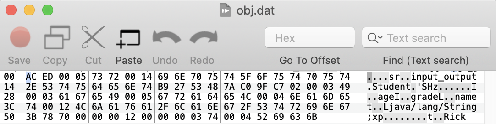

---

title: "input_output 输入输出"
date: 2020-01-31 11:35
---
[toc]


# Stream/Reader/Scanner

数据是二进制的，使用InputStream

非二进制的，表达是文本的，用Reader，否则用Scanner

# System.in 标准输入

## 输入 Scanner

从控制台读取一个字符串和一个整数的

```
import java.util.Scanner;

public class Main {
    public static void main(String[] args) {
        Scanner scanner = new Scanner(System.in); // 创建Scanner对象, 通过控制台输入
        System.out.print("Input your name: "); // 打印提示
        String name = scanner.nextLine(); // 读取一行输入并获取字符串
        System.out.print("Input your age: "); // 打印提示
        int age = scanner.nextInt(); // 读取一行输入并获取整数
        System.out.printf("Hi, %s, you are %d\n", name, age); // 格式化输出
    }
}

>>>
Input your name: Rick
Input your age: 18
Hi, Rick, you are 18
```


### 常用方法


| 方法          | 用途                                     |
| ------------- | ---------------------------------------- |
| nextLine      | 读取输入的下一行内容                     |
| next          | 读取下一个单词，以空格作为分隔符         |
| nextInt       | 读取下一个                               |
| nextDouble    | 读取下一个浮点数                         |
| hasNext       | 检测输入中是否还有其他单词               |
| hasNextInt    |                                          |
| hasNextDouble | 是否还有表示浮点数或整数的下一个字符序列 |


## read()

```
package input_output;

public class Main {
    public static void main(String[] args) {
        System.out.println("hello world");
        byte[] buffer = new byte[1024];
        try {
            int len = System.in.read(buffer);
            String s = new String(buffer, 0, len);
            System.out.println("Read:"+len+" bytes");
            System.out.println(s);
            System.out.println("Length of s is:"+s.length());
        } catch (Exception e) {
            e.printStackTrace();
        }
    }
}

>>>
hello world
Rick
Read:5 bytes
Rick

Length of s is:5
```


# System.out 标准输出

## println 

println 表示 print line ， 即输出并换行，如果不想换行使用print()


## 格式化输出

格式化输出使用`System.out.printf()`，通过使用占位符`%?`，`printf()`可以把后面的参数格式化成指定格式

Java的格式化功能提供了多种占位符，可以把各种数据类型“格式化”成指定的字符串


| 占位符 | 说明                   |
| :----- | :--------------------- |
| %d     | 十进制整数             |
| %x     | 十六进制整数           |
| %o     | 八进制整数             |
| %f     | 定点浮点数             |
| %e     | 科学计数法表示的浮点数 |
| %s     | 字符串                 |
| %c     | 字符                   |
| %b     | 布尔                   |
| %%     | 一个%字符本身          |
| %n     | 与平台有关的行分隔符   |


```
public class Main {
    public static void main(String[] args) {
        double d = 3.1415926;
        System.out.printf("%.2f\n", d);
        System.out.printf("%.4f\n", d);
    }
}

>>>
3.14
3.1416
```


### 日期时间转换符

| 转换符 | 类型                     | 例子                         |       |
| ------ | ------------------------ | ---------------------------- | ----- |
| c      | 完成的时间和日期         | Mon Feb 09 18:05:19 PST 2019 |       |
| D      | 美国格式日期（月/日/年） | 02/09/2019                   |       |
| T      | 24小时时间               | 18:05:09                     |       |
| Y      | 4位数字年                | 2019                         |       |
| B      | 月完整拼写               | February                     |       |
| m      | 2位数字月                | 02                           |       |
| d      | 2为数字日                | 09                           |       |
| A      | 星期完整拼写             | Monday                       |       |
| H      | 2位数字小时              | 18                           |       |
| M      | 2为数字分钟              | 05                           |       |
| S      | 2为数字秒                | 19                           | 1起起 |
| Z      | 时区                     | PST                          |       |


# 文本处理

read和write是处理unicode字符的，现在的文件形式可能不全是Unicode的形式，有可能是GBK或者ASCII， 即使是Unicode也是UTF-8的形式

非Unicode应该是借助Stream打开文件，然后在Stream上建立过滤器的方式建立read和write，完成文本的输出

## PrintWriter

```
package input_output;

import java.io.*;

public class DataStream {
    public static void main(String[] args) {
        System.out.println("hello world");
        byte[] buf = new byte[10];
        for (int i = 0; i < buf.length; i++) {
            buf[i] = (byte)i;
        }
        try {
            PrintWriter out = new PrintWriter(
                    new BufferedWriter(
                            new OutputStreamWriter(
                                    new FileOutputStream("a.txt")
                            )
                    )
            );
            int i = 123456;
            out.println(i);
            out.close();
        } catch (FileNotFoundException e) {
            e.printStackTrace();
        } catch (IOException e) {
            e.printStackTrace();
        }
    }
}
```

> a.txt 内容就是123456 的7字节文本，多的一个字节是换行


## BufferedReader 读文本

```
package input_output;

import java.io.*;

public class DataStream {
    public static void main(String[] args) {
        System.out.println("hello world");
        byte[] buf = new byte[10];
        for (int i = 0; i < buf.length; i++) {
            buf[i] = (byte)i;
        }
        try {
            PrintWriter out = new PrintWriter(
                    new BufferedWriter(
                            new OutputStreamWriter(
                                    new FileOutputStream("a.txt")
                            )
                    )
            );
            int i = 123456;
            out.println(i);
            out.close();

            BufferedReader in = new BufferedReader(
                    new InputStreamReader(
                            new FileInputStream("src/input_output/DataStream.java")
                    )
            );
            String line;
            while ((line = in.readLine()) != null) {
                System.out.println(line);
            }
        } catch (FileNotFoundException e) {
            e.printStackTrace();
        } catch (IOException e) {
            e.printStackTrace();
        }
    }
}

```


## FileReader (不常用)

InputStreamReader 类的子类，所有方法都是从父类中继承而来

即很少裸着操作文件，而是从其他地方来的


# 文件流 (不常用)

对文件的读写操作

更常用的是以在内存数据或通信数据上建立的流，如数据库的二进制数据读写或网络端口通信

具体的文件读写往往有更专业的类，比如配置文件和日志文件


## FileInputStream


## FileOutputStream

```
package input_output;

import java.io.FileNotFoundException;
import java.io.FileOutputStream;
import java.io.IOException;

public class FileStream {
    public static void main(String[] args) {
        System.out.println("hello world");
        byte[] buf = new byte[10];
        for (int i = 0; i < buf.length; i++) {
            buf[i] = (byte)i;
        }
        try {
            FileOutputStream out = new FileOutputStream("1.dat");
            out.write(buf);
            out.close();
        } catch (FileNotFoundException e) {
            e.printStackTrace();
        } catch (IOException e) {
            e.printStackTrace();
        }
    }
}
```

> 在对应路径下面会生成1.dat, mac下用0xED打开
>
> 


# 流过滤器

以一个介质流对象为基础层，构建过滤器流，最终形成的流对象能在数据的输入输出过程中，逐层使用过滤器流的方法来读写数据


## DataOutputStream

DataOutputStream以二进制的形式，把数据在内存中原封不动的写进文件中

```
package input_output;

import java.io.*;

public class DataStream {
    public static void main(String[] args) {
        System.out.println("hello world");
        byte[] buf = new byte[10];
        for (int i = 0; i < buf.length; i++) {
            buf[i] = (byte)i;
        }
        try {
            DataOutputStream out = new DataOutputStream(
                    new BufferedOutputStream(
                            new FileOutputStream("a.dat")
                    )
            );
            int i = 0xcafebabe;
            out.writeInt(i);
            out.close();
        } catch (FileNotFoundException e) {
            e.printStackTrace();
        } catch (IOException e) {
            e.printStackTrace();
        }
    }
}

```

> 打开a.dat文件，在内存中是4个字节
>
> 


## DataInputStream

```
package input_output;

import java.io.*;

public class DataStream {
    public static void main(String[] args) {
        System.out.println("hello world");
        byte[] buf = new byte[10];
        for (int i = 0; i < buf.length; i++) {
            buf[i] = (byte)i;
        }
        try {
            DataOutputStream out = new DataOutputStream(
                    new BufferedOutputStream(
                            new FileOutputStream("a.dat")
                    )
            );
            int i = 123456;
            out.writeInt(i);
            out.close();
            DataInputStream in = new DataInputStream(
                    new BufferedInputStream(
                            new FileInputStream("a.dat")
                    )
            );
            int j = in.readInt();
            System.out.println(j);
        } catch (FileNotFoundException e) {
            e.printStackTrace();
        } catch (IOException e) {
            e.printStackTrace();
        }
    }
}

```

> 显示为123456， 但十六进制存储的结果为
>
> 


# Socket


## 服务器端获取

Mac 下监听12345端口

```
$ nc -l 12345

Hello // 可以根据下面程序获取到该数据
```


```
package input_output;

import java.io.*;
import java.net.InetAddress;
import java.net.Socket;

public class SocketStream {
    public static void main(String[] args) {
        try {
            Socket socket = new Socket(InetAddress.getByName("localhost"), 12345);
            PrintWriter out = new PrintWriter(
                    new BufferedWriter(
                            new OutputStreamWriter(
                                    socket.getOutputStream()
                            )
                    )
            );
            out.println("Hello");
            out.close();
            socket.close();

        } catch (IOException e) {
            e.printStackTrace();
        }
    }
}

```


## 服务器端发送

```
$ nc -l 12345
Hello
World // 这是键盘输入
```


```
package input_output;

import java.io.*;
import java.net.InetAddress;
import java.net.Socket;

public class SocketStream {
    public static void main(String[] args) {
        try {
            Socket socket = new Socket(InetAddress.getByName("localhost"), 12345);
            PrintWriter out = new PrintWriter(
                    new BufferedWriter(
                            new OutputStreamWriter(
                                    socket.getOutputStream()
                            )
                    )
            );
            out.println("Hello");
            out.flush();

            BufferedReader in = new BufferedReader(
                    new InputStreamReader(
                            socket.getInputStream()
                    )
            );
            String line;
            line = in.readLine();
            System.out.println(line);

            out.close();
            socket.close();

        } catch (IOException e) {
            e.printStackTrace();
        }
    }
}

>>>
World
```


# 对象串行化


## ObjectInputStream

### readObject()

```
package input_output;

import java.io.*;

class Student implements Serializable {
    private String name;
    private int age;
    private int grade;

    public Student(String name, int age, int grade) {
        this.name = name;
        this.age = age;
        this.grade = grade;
    }

    public String toString() {
        return name+" "+age+" "+grade;
    }
}

public class SerializableStream {
    public static void main(String[] args) {
        try {
            Student s1 = new Student("Rick", 18, 3);
            System.out.println(s1);
            ObjectOutputStream out = new ObjectOutputStream(
                    new FileOutputStream("obj.dat")
            );
            out.writeObject(s1);
            out.close();

            ObjectInputStream in = new ObjectInputStream(
                    new FileInputStream("obj.dat")
            );
            Student s2 = (Student)in.readObject();
            System.out.println(s2);
            System.out.println(s1==s2);
        } catch (Exception e) {
            e.printStackTrace();
        }
    }
}

>>>
Rick 18 3
Rick 18 3
false // 值一样，但是是完全不同的对象
```


## ObjectOutputStream

### writeObject()

```
package input_output;

import java.io.FileOutputStream;
import java.io.ObjectOutputStream;
import java.io.Serializable;

class Student implements Serializable {
    private String name;
    private int age;
    private int grade;

    public Student(String name, int age, int grade) {
        this.name = name;
        this.age = age;
        this.grade = grade;
    }

    public String toString() {
        return name+" "+age+" "+grade;
    }
}

public class SerializableStream {
    public static void main(String[] args) {
        try {
            Student s1 = new Student("Rick", 18, 3);
            System.out.println(s1);
            ObjectOutputStream out = new ObjectOutputStream(
                    new FileOutputStream("obj.dat")
            );
            out.writeObject(s1);
            out.close();
        } catch (Exception e) {
            e.printStackTrace();
        }
    }
}

>>>
Rick 18 3
```


> 


## Serializable 接口

