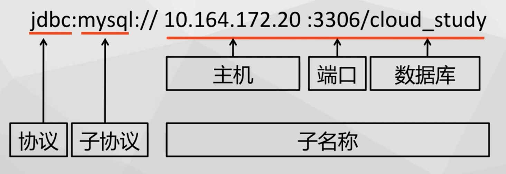

[toc]


# JDBC

Java DataBase Connectivity

驱动程序jar包


## 架构


## 安装

JDBC的API默认包含在JDK中


## JDBC API


## JDBC URL




## Hello World

```
wget https://cdn.mysql.com/archives/mysql-connector-java-8.0/mysql-connector-java-8.0.18.zip
```

将解压出的jar包放到目录下，配置project的module settings， 添加Dependencies


```
package jdbc_example;

import java.sql.Connection;
import java.sql.DriverManager;
import java.sql.ResultSet;
import java.sql.SQLException;
import java.sql.Statement;

public class HelloJDBC {

    static final String JDBC_DRIVER = "com.mysql.cj.jdbc.Driver";
    static final String DB_URL = "jdbc:mysql://127.0.0.1:8889/ginger";
    static final String USER = "root";
    static final String PASSWORD = "root";

    public static void helloworld() throws ClassNotFoundException {
        Connection conn = null;
        Statement stmt = null;
        ResultSet rs = null;

        // 装载驱动
        Class.forName(JDBC_DRIVER);
        // 建立数据库连接
        try {
            conn = DriverManager.getConnection(DB_URL, USER, PASSWORD);
            //执行SQL
            stmt = conn.createStatement();
            rs = stmt.executeQuery("select nickname from user");
            // 获取执行结果
            while (rs.next()) {
                System.out.println(rs.getString("nickname"));
            }
        } catch (SQLException e) {
            e.printStackTrace();
        } finally {
            // 清理环境
            try {
                if (conn != null) {
                    conn.close();
                }
                if (stmt != null) {
                    stmt.close();
                }
                if (rs != null) {
                    rs.close();
                }
            } catch (SQLException e) {
                e.printStackTrace();
            }
        }
    }

    public static void main(String[] args) throws ClassNotFoundException{
        helloworld();
    }
}
```

> 等同于执行 use ginger; select nickname from user; 获取nickname的结果


# 连接池

连接复用， 限制连接

本质上就是一组Java jar包


## DBCP

apache 开源项目，Tomcat的连接池组件

包括三个jar包

```
commons-dbcp.jar
commons-pool.jar
commons-logging.jar
```


### 创建连接池

使用BasicDataSource对象来创建连接池

```
wget http://mirror.bit.edu.cn/apache//commons/dbcp/binaries/commons-dbcp2-2.7.0-bin.tar.gz
wget https://mirrors.tuna.tsinghua.edu.cn/apache//commons/pool/binaries/commons-pool2-2.8.0-bin.tar.gz
wget https://mirrors.tuna.tsinghua.edu.cn/apache//commons/logging/binaries/commons-logging-1.2-bin.tar.gz
```


```
package jdbc_example;


import org.apache.commons.dbcp2.BasicDataSource;

import java.sql.Connection;
import java.sql.ResultSet;
import java.sql.SQLException;
import java.sql.Statement;

public class DBPoolTest {

    public static BasicDataSource ds = null;

    public final static String DRIVER_NAME = "com.mysql.cj.jdbc.Driver";
    public final static String USER_NAME = "root";
    public final static String PASSWORD = "root";
    public final static String DB_URL = "jdbc:mysql://127.0.0.1:8889/ginger";

    public static void dbpoolInit() {
        ds = new BasicDataSource();
        ds.setUrl(DB_URL);
        ds.setDriverClassName(DRIVER_NAME);
        ds.setUsername(USER_NAME);
        ds.setPassword(PASSWORD);
    }

    public void dbPoolTest() {
        Connection conn = null;
        Statement stmt = null;
        ResultSet rs = null;

        try {
            conn = ds.getConnection();
            stmt = conn.createStatement();
            rs = stmt.executeQuery("select * from user");
            while (rs.next()) {
                System.out.println(rs.getString("email"));
            }
        } catch (SQLException e) {
            e.printStackTrace();
        } finally {
            try {
                if (conn != null) {
                    conn.close();
                }
                if (stmt != null) {
                    stmt.close();
                }
                if (rs != null) {
                    rs.close();
                }
            } catch (SQLException e) {
                e.printStackTrace();
            }
        }
    }

    public static void main(String[] args) {
        dbpoolInit();
        new DBPoolTest().dbPoolTest();
    }
}

```


### 高级配置

setInitialSize() 预制一些连接，加快第一次访问

setMaxTotal() 连接池最大的连接数，新来的连接需要等待

```
ds = new BasicDataSource();
ds.setUrl(DB_URL);
ds.setDriverClassName(DRIVER_NAME);
ds.setUsername(USER_NAME);
ds.setPassword(PASSWORD);
ds.setMaxTotal(2);
```

setsetMaxWaitMillis() 设置最大等待时间，超过回抛出异常

setMaxIdle() 空闲连接超过了这个值，连接池会销毁连接

setMinIdle() 低于这个值会创建，保证连接池有足够的连接


### 定期检查

MySQL默认会清除超过8个小时的数据库连接，连接池会讲即将失效的连接租借给应用程序，需保证连接池中的连接都是有效的

setTestWhileIdle(True) 开启这个功能

setMinEvictableIdleTimeMillis() 销毁连接的最小空闲时间，超过该值会被销毁

setTimeBetweenEvictionRunsMillis() 检查运行时间的间隔


# 事务控制

默认Connection 对象都是以非事务来运行的


* 开启事务

.setAutoCommit(false)


* 提交事务

.commit()


* 回滚事务

.rollback()


```
package jdbc_example;


import org.apache.commons.dbcp2.BasicDataSource;

import java.sql.*;

public class DBPoolTest {

    public static BasicDataSource ds = null;

    public final static String DRIVER_NAME = "com.mysql.cj.jdbc.Driver";
    public final static String USER_NAME = "root";
    public final static String PASSWORD = "root";
    public final static String DB_URL = "jdbc:mysql://127.0.0.1:8889/ginger";

    public static void dbpoolInit() {
        ds = new BasicDataSource();
        ds.setUrl(DB_URL);
        ds.setDriverClassName(DRIVER_NAME);
        ds.setUsername(USER_NAME);
        ds.setPassword(PASSWORD);
    }

    public void dbPoolTest() {
        Connection conn = null;
        PreparedStatement ptmt = null;

        try {
            conn = ds.getConnection();
            conn.setAutoCommit(false);
            ptmt = conn.prepareStatement("update user set email = ? where id = ?");
            ptmt.setInt(1, 1);
            ptmt.setString(2, "rxu@xurick.com");
            ptmt.execute();
            conn.commit();
        } catch (SQLException e) {
            if (conn != null) {
                try {
                    conn.rollback();
                } catch (SQLException e1) {
                    e1.printStackTrace();
                }
            }
        } finally {
            try {
                if (conn != null) {
                    conn.close();
                }
                if (ptmt != null) {
                    ptmt.close();
                }
            } catch (SQLException e) {
                e.printStackTrace();
            }
        }
    }

    public static void main(String[] args) {
        dbpoolInit();
        new DBPoolTest().dbPoolTest();
    }
}

```


## 检查点

Connection.setSavePoint() 

Connection.rollback(SavePoint)

在执行到某一个点的时候保存状态，当执行错误的时候，在从这个点执行其他的操作

```
package jdbc_example;


import org.apache.commons.dbcp2.BasicDataSource;

import java.sql.*;

public class DBPoolTest {

    public static BasicDataSource ds = null;

    public final static String DRIVER_NAME = "com.mysql.cj.jdbc.Driver";
    public final static String USER_NAME = "root";
    public final static String PASSWORD = "root";
    public final static String DB_URL = "jdbc:mysql://127.0.0.1:8889/ginger";

    public static void dbpoolInit() {
        ds = new BasicDataSource();
        ds.setUrl(DB_URL);
        ds.setDriverClassName(DRIVER_NAME);
        ds.setUsername(USER_NAME);
        ds.setPassword(PASSWORD);
    }

    public void dbPoolTest() {
        Connection conn = null;
        PreparedStatement ptmt = null;
        Savepoint sp = null;

        try {
            conn = ds.getConnection();
            conn.setAutoCommit(false);
            ptmt = conn.prepareStatement("update user set email = ? where id = ?");
            ptmt.setInt(1, 1);
            ptmt.setString(2, "rxu@xurick.com");
            ptmt.execute();
            sp = conn.setSavepoint();
        } catch (SQLException e) {
            if (conn != null) {
                try {
                    conn.rollback(sp);
                    ptmt.setInt(1, 2);
                    ptmt.setString(2, "rxu@xuxuehua.com");
                    ptmt.execute();
                    conn.commit();
                } catch (SQLException e1) {
                    e1.printStackTrace();
                }
            }
        } finally {
            try {
                if (conn != null) {
                    conn.close();
                }
                if (ptmt != null) {
                    ptmt.close();
                }
            } catch (SQLException e) {
                e.printStackTrace();
            }
        }
    }

    public static void main(String[] args) {
        dbpoolInit();
        new DBPoolTest().dbPoolTest();
    }
}

```


## 事务并发


### 死锁

两个或这两个以上的事务在执行过程中，因争夺锁资源而造成的一种相互等待的现象

# 内存溢出问题

查询结果超过了JVM的内存限制， 一次性载入太多的数据导致的

配置游标Fetch Size 来持续获取部分处理


## 游标 Fetch Size

### 激活游标

useCursorFetch=true	

```
jdbc:mysql://<IP>:<PORT>/<database>?useCursorFetch=true
```


### 使用游标

PreparedStatement 替换statement

```
package jdbc_example;

import java.sql.*;

public class HelloJDBC {

    static final String JDBC_DRIVER = "com.mysql.cj.jdbc.Driver";
    static final String DB_URL = "jdbc:mysql://127.0.0.1:8889/ginger";
    static final String USER = "root";
    static final String PASSWORD = "root";

    public static void helloworld() throws ClassNotFoundException {
        Connection conn = null;
        Statement stmt = null;
        ResultSet rs = null;
        PreparedStatement ptmt = null;

        // 装载驱动
        Class.forName(JDBC_DRIVER);
        // 建立数据库连接
        try {
            conn = DriverManager.getConnection(DB_URL, USER, PASSWORD);
            //执行SQL
//            stmt = conn.createStatement();
//            rs = stmt.executeQuery("select nickname from user");
            ptmt = conn.prepareStatement("select nickname from user");
            ptmt.setFetchSize(1);
            rs = ptmt.executeQuery();

            // 获取执行结果
            while (rs.next()) {
                System.out.println(rs.getString("nickname"));
            }
        } catch (SQLException e) {
            e.printStackTrace();
        } finally {
            // 清理环境
            try {
                if (conn != null) {
                    conn.close();
                }
                if (stmt != null) {
                    stmt.close();
                }
                if (rs != null) {
                    rs.close();
                }
            } catch (SQLException e) {
                e.printStackTrace();
            }
        }
    }

    public static void main(String[] args) throws ClassNotFoundException{
        helloworld();
    }
}

```


# 大字段读取问题

读取一条很大的记录，JVM放不下导致内存溢出


## 流方式处理

将大字段的内容以二进制的形式，按照区间进行划分

使用getBinaryStream()


```
package jdbc_example;

import java.io.File;
import java.io.FileOutputStream;
import java.io.InputStream;
import java.io.OutputStream;
import java.sql.*;

public class HelloJDBC {

    static final String JDBC_DRIVER = "com.mysql.cj.jdbc.Driver";
    static final String DB_URL = "jdbc:mysql://127.0.0.1:8889/ginger";
    static final String USER = "root";
    static final String PASSWORD = "root";

    public static void helloworld() throws ClassNotFoundException {
        Connection conn = null;
        Statement stmt = null;
        ResultSet rs = null;
        PreparedStatement ptmt = null;

        // 装载驱动
        Class.forName(JDBC_DRIVER);
        // 建立数据库连接
        try {
            conn = DriverManager.getConnection(DB_URL, USER, PASSWORD);
            //执行SQL
//            stmt = conn.createStatement();
//            rs = stmt.executeQuery("select nickname from user");
            ptmt = conn.prepareStatement("select nickname from user");
            ptmt.setFetchSize(1);
            rs = ptmt.executeQuery();

            while (rs.next()) {
                // 获取对象流
                InputStream in = rs.getBinaryStream("nickname");
                //将对象流写入文件
                File f = new File("streamFile");
                OutputStream out = null;
                out = new FileOutputStream(f);
                int temp = 0;

                //边读边写
                while ((temp = in.read()) != -1) {
                    out.write(temp);
                }
            }
        } catch (SQLException e) {
            e.printStackTrace();
        } finally {
            // 清理环境
            try {
                if (conn != null) {
                    conn.close();
                }
                if (stmt != null) {
                    stmt.close();
                }
                if (rs != null) {
                    rs.close();
                }
            } catch (SQLException e) {
                e.printStackTrace();
            }
        }
    }

    public static void main(String[] args) throws ClassNotFoundException{
        helloworld();
    }
}
```

> 不完整代码


# 大量数据插入问题

循环插入的速度效率太低

采用批处理方式，发送一次sql，插入多条数据


## 批处理方式

addBatch()

executeBatch()

clearBatch()

```
package jdbc_example;

import java.sql.*;
import java.util.HashSet;
import java.util.Set;

public class HelloJDBC {

    static final String JDBC_DRIVER = "com.mysql.cj.jdbc.Driver";
    static final String DB_URL = "jdbc:mysql://127.0.0.1:8889/ginger";
    static final String USER = "root";
    static final String PASSWORD = "root";

    public static void helloworld(Set<String> users) throws ClassNotFoundException {
        Connection conn = null;
        Statement stmt = null;

        // 装载驱动
        Class.forName(JDBC_DRIVER);
        // 建立数据库连接
        try {
            conn = DriverManager.getConnection(DB_URL, USER, PASSWORD);
            //执行SQL
            stmt = conn.createStatement();
            for (String user: users) {
                stmt.addBatch("insert into users (userName) values(" + user + ")");
            }
            stmt.executeBatch();
            stmt.clearBatch();
        } catch (SQLException e) {
            e.printStackTrace();
        } finally {
            // 清理环境
            try {
                if (conn != null) {
                    conn.close();
                }
                if (stmt != null) {
                    stmt.close();
                }
            } catch (SQLException e) {
                e.printStackTrace();
            }
        }
    }

    public static void main(String[] args) throws ClassNotFoundException{
        Set<String> users = new HashSet<String>();
        users.add("rxu1");
        users.add("rxu2");
        users.add("rxu3");
        users.add("rxu4");
        users.add("rxu5");
        users.add("rxu6");
        users.add("rxu7");
        users.add("rxu8");
        helloworld(users);
    }
}
```

> 报错
> java.sql.BatchUpdateException: Unknown column 'rxu7' in 'field list'
> 	at java.base/jdk.internal.reflect.NativeConstructorAccessorImpl.newInstance0(Native Method)
> 	at java.base/jdk.internal.reflect.NativeConstructorAccessorImpl.newInstance(NativeConstructorAccessorImpl.java:62)
> 	at java.base/jdk.internal.reflect.DelegatingConstructorAccessorImpl.newInstance(DelegatingConstructorAccessorImpl.java:45)
> 	at java.base/java.lang.reflect.Constructor.newInstanceWithCaller(Constructor.java:500)
> 	at java.base/java.lang.reflect.Constructor.newInstance(Constructor.java:481)
> 	at com.mysql.cj.util.Util.handleNewInstance(Util.java:192)
> 	at com.mysql.cj.util.Util.getInstance(Util.java:167)
> 	at com.mysql.cj.util.Util.getInstance(Util.java:174)
> 	at com.mysql.cj.jdbc.exceptions.SQLError.createBatchUpdateException(SQLError.java:224)
> 	at com.mysql.cj.jdbc.StatementImpl.executeBatchInternal(StatementImpl.java:893)
> 	at com.mysql.cj.jdbc.StatementImpl.executeBatch(StatementImpl.java:796)
> 	at jdbc_example.HelloJDBC.helloworld(HelloJDBC.java:28)
> 	at jdbc_example.HelloJDBC.main(HelloJDBC.java:57)
> Caused by: java.sql.SQLSyntaxErrorException: Unknown column 'rxu7' in 'field list'
> 	at com.mysql.cj.jdbc.exceptions.SQLError.createSQLException(SQLError.java:120)
> 	at com.mysql.cj.jdbc.exceptions.SQLError.createSQLException(SQLError.java:97)
> 	at com.mysql.cj.jdbc.exceptions.SQLExceptionsMapping.translateException(SQLExceptionsMapping.java:122)
> 	at com.mysql.cj.jdbc.StatementImpl.executeUpdateInternal(StatementImpl.java:1335)
> 	at com.mysql.cj.jdbc.StatementImpl.executeBatchInternal(StatementImpl.java:859)
> 	... 3 more
>
> Process finished with exit code 0


# 中文显示问题

设置jdbc编码

characterEncoding=utf8


# SQL 注入问题

使用格式化参数 PreparedStatement

.setInt

.setString

.setBoolean

