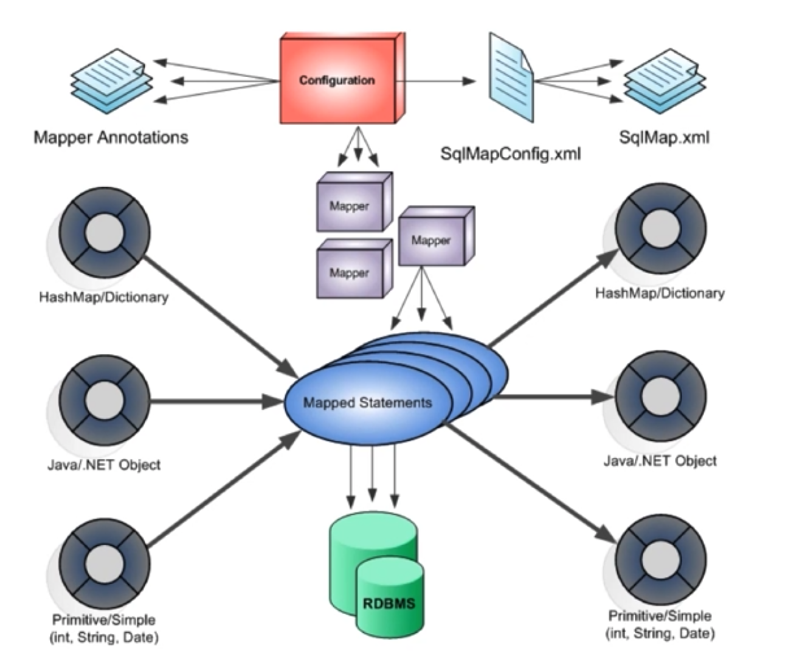

[toc]


# ORM 

Object Relation Mapping

持久化类与数据库表之间的映射关系

# Mybatis

实现对象和二元表之间的转换

本质上是一个ORM框架，但不同于通过Java 对象遍历数据库表之间的对应关系，而是建立对象的操作方法到SQL语句之间的关系

使用XML或者注解配置

底层基于JDBC实现数据库访问


## 特点

优势：门槛低，SQL优化

劣势：需要自己编写大量SQL，数据库移植性差


## 功能架构


## 工作流机制

根据XML或者注解加载SQL语句，参数映射，结果映射到内存中

应用程序调用API传入的参数和SQL ID

MyBatis 自动生成SQL语句完成数据库访问，转换执行结果返回应用程序




# MyBatis安装


```
wget mybatis-3.5.4.zip
```


# ResultMap

MyBatis中强大的元素，可以实现复杂查询结果到负载对象关联关系的转化

