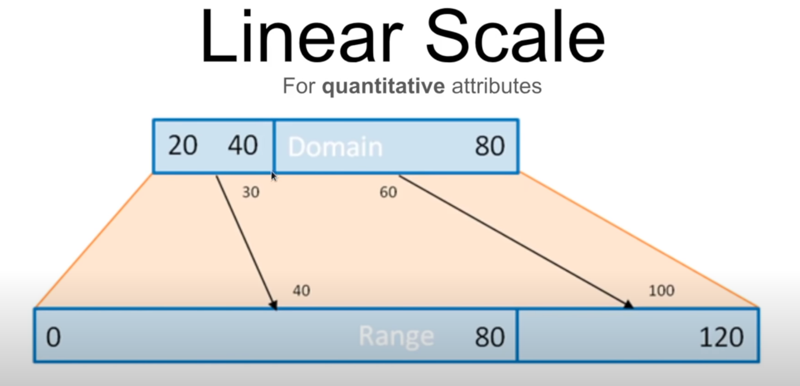

[toc]


# D3

Data-Driven Documents


## installation

```
<script src="https://d3js.org/d3.v5.min.js"></script>
```


# Functions


## append

index.html

```
<body>
		<svg width="960" height="500"></svg>
</body>
```


```
const svg = d3.select('svg');
const circle = svg.append('circle');
const width = parseFload(svg.attr('width'));
const height = +(svg.attr('height'));  // parse string to number
circle.attr('r', 200);
circle.attr('cx', width/2);
circle.attr('cy', height/2);
```


## attr

combine the attrs

```
const circle = svg.append('circle');
	.attr('r', height/2)
	.attr('cx', width/2)
	.attr('cy', height/2)
	.attr('fill', 'yellow')
	.attr('stroke', 'black')
```


## csv

```
import { select, csv } from 'd3';

const svg = select('svg');

csv('data.csv').then(data => {
		console.log(data);
});
```


## select 

```
d3.select('svg')
```


## scaleBand

Constructs a new band scale with the specified [*domain*](https://github.com/d3/d3-scale/blob/v2.2.2/README.md#band_domain) and [*range*](https://github.com/d3/d3-scale/blob/v2.2.2/README.md#band_range), no [padding](https://github.com/d3/d3-scale/blob/v2.2.2/README.md#band_padding), no [rounding](https://github.com/d3/d3-scale/blob/v2.2.2/README.md#band_round) and center [alignment](https://github.com/d3/d3-scale/blob/v2.2.2/README.md#band_align). If *domain* is not specified, it defaults to the empty domain. If *range* is not specified, it defaults to the unit range [0, 1].

柱条刻度


## scaleLinear 

Linear scales are a good default choice for continuous quantitative data because they preserve proportional differences. Each range value *y* can be expressed as a function of the domain value *x*: *y* = *mx* + *b*.

数值刻度定义




### domain

Data space 数据区域


### range

Screen space 


## 

# import d3 function

for ES6


Index.js

```
import { select } from 'd3';

const svg = select('svg');
svg.style('background-color', 'red');
```


# format convert


## string to number

data.csv

```
country,population
China,1415046
India,1364052
United States, 326767
Indonesia,266795
Brazil,210868
Pakistan,200814
Nigeria,195875
Bangladesh,166368
Russia,143965
Mexico,130759
```


index.js

```
import { select, csv } from 'd3';

const svg = select('svg');

csv('data.csv').then(data => {
		data.forEach(d => {
				d.population = +d.population * 1000; //symbal '+' could convert the type
		})
		console.log(data);
});
```


# example


## Bar chart

```
<!DOCTYPE html>
<html>
  <head>
    <title>HTML Starter</title>
    <script src="https://d3js.org/d3.v5.min.js"></script>
    <style>
      rect {
        fill: steelblue;
      }
      text {
        font-size: 1.6em;
      }
    </style>
  </head>
  <body>
    <svg width="960" height="500"></svg>


<script>
const svg = d3.select('svg')
const width = +svg.attr('width');
const height = +svg.attr('height');

const render = data => {
  const xValue = d => d.population;
  const yValue = d => d.country;
  const margin = {top: 20, right: 20, bottom: 20, left: 100};
  const innerWidth = width - margin.left - margin.right;
  const innerHeight = height - margin.top - margin.bottom;

  const xScale = d3.scaleLinear()
  .domain([0, d3.max(data, xValue)])
  .range([0, innerWidth]);

  const yScale = d3.scaleBand()
  .domain(data.map(yValue))
  .range([0, innerHeight])
  .padding(0.1)

  const g = svg.append('g')
  .attr('transform', `translate(${margin.left},${margin.top})`)

  g.append('g').call(d3.axisLeft(yScale));
  g.append('g').call(d3.axisBottom(xScale))  // tranlate it to bottom because it will stay at top by default
  .attr('transform', `translate(0, ${innerHeight})`)

  g.selectAll('rect').data(data)
  .enter().append('rect')
  .attr('y', d => yScale(yValue(d)))
  .attr('width', d => xScale(xValue(d)))
  .attr('height', yScale.bandwidth())
};


url = 'http://154.201.3.151/data.csv'
d3.csv(url).then(data => {
  data.forEach(d => {
    d.population = +d.population * 1000;
  });
  render(data);
})
</script>

  </body>
</html>
```


