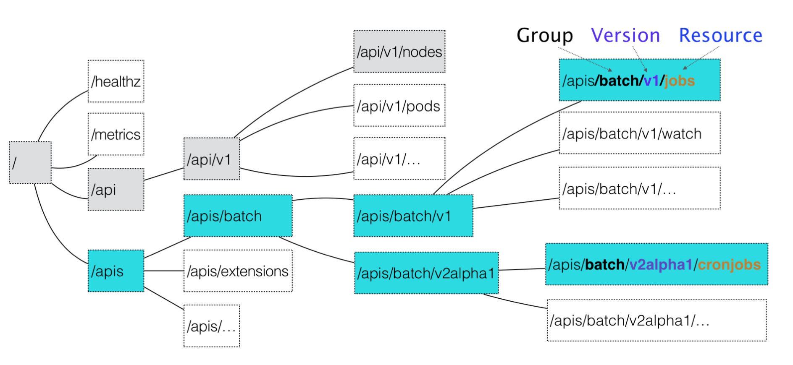
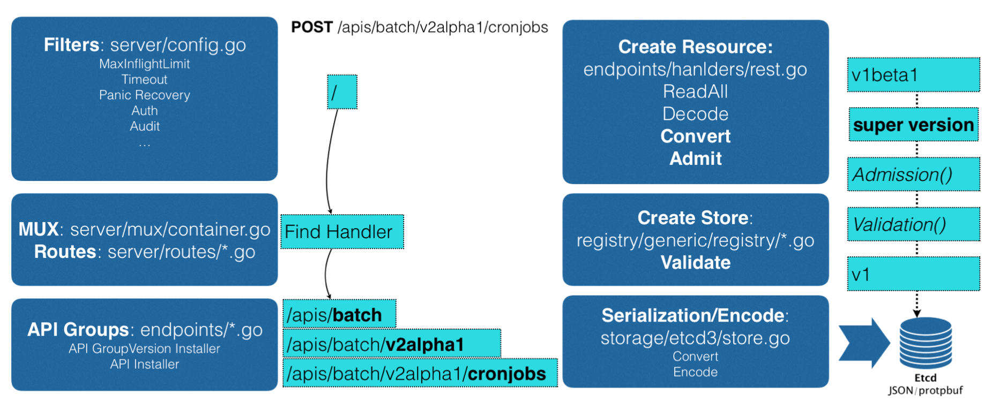

[toc]


# 声明式 API vs 命令式 API

[Declarative](https://en.wikipedia.org/wiki/Declarative_programming)（声明式设计）指的是这么一种软件设计理念和做法：我们向一个工具描述我们想要让一个事物达到的目标状态，由这个工具自己内部去figure out如何令这个事物达到目标状态。

和Declarative（声明式设计）相对的是[Imperative](https://en.wikipedia.org/wiki/Imperative_programming)或Procedural（过程式设计）。两者的区别是：在Declarative中，我们描述的是目标状态（Goal State），而在Imperative模式中，我们描述的是一系列的动作。这一系列的动作如果被正确的顺利执行，最终结果是这个事物达到了我们期望的目标状态的。

声明式（Declarative）的编程方式一直都会被工程师们拿来与命令式（Imperative）进行对比，这两者是完全不同的编程方法。我们最常接触的其实是命令式编程，它要求我们描述为了达到某一个效果或者目标所需要完成的指令，常见的编程语言 Go、Ruby、C++ 其实都为开发者了命令式的编程方法，

声明式和命令式是两种截然不同的编程方式:

- 在命令式 API 中，我们可以直接发出服务器要执行的命令，例如： “运行容器”、“停止容器”等；
- 在声明式 API 中，我们声明系统要执行的操作，系统将不断向该状态驱动。


## 声明式 API

SQL 其实就是一种常见的声明式『编程语言』，它能够让开发者自己去指定想要的数据是什么。或者说，告诉数据库想要的结果是什么，数据库会帮我们设计获取这个结果集的执行路径，并返回结果集。众所周知，使用 SQL 语言获取数据，要比自行编写处理过程去获取数据容易的多。

```sql
SELECT * FROM posts WHERE user_id = 1 AND title LIKE 'hello%';
```


我们来看看相同设计的 YAML，利用它，我们可以告诉 Kubernetes 最终想要的是什么，然后 Kubernetes 会完成目标。

例如，在 Kubernetes 中，我们可以直接使用 YAML 文件定义服务的拓扑结构和状态：

```yaml
apiVersion: v1
kind: Pod
metadata:
  name: rss-site
  labels:
    app: web
spec:
  containers:
    - name: front-end
      image: nginx
      ports:
        - containerPort: 80
    - name: rss-reader
      image: nickchase/rss-php-nginx:v1
      ports:
        - containerPort: 88
```

以下是 etcd 的 operator：

```yaml
apiVersion: extensions/v1beta1
kind: Deployment
metadata:
  name: etcd-operator
spec:
  replicas: 1
  template:
    metadata:
      labels:
        name: etcd-operator
    spec:
      containers:
      - name: etcd-operator
        image: quay.io/coreos/etcd-operator:v0.2.1
        env:
        - name: MY_POD_NAMESPACE
          valueFrom:
            fieldRef:
              fieldPath: metadata.namespace
        - name: MY_POD_NAME
          valueFrom:
            fieldRef:
              fieldPath: metadata.name
```

Kubernetes 中的 YAML 文件也有着相同的原理，我们可以告诉 Kubernetes 想要的最终状态是什么，而它会帮助我们从现有的状态进行迁移。

# API Server

提供资源统一的入口


## 资源路径

在 Kubernetes 项目中，一个 API 对象在 Etcd 里的完整资源路径，是由:Group(API 组)、 Version(API 版本)和 Resource(API 资源类型)三个部分组成的


若声明一个CronJob对象，

```
apiVersion: batch/v2alpha1 
kind: CronJob
...
```

> “CronJob”就是这个 API 对象的资源类型 (Resource)，
>
> “batch”就是它的组(Group)，
>
> v2alpha1 就是它的版本(Version)





## 对象创建



当我们发起了创建 CronJob 的 POST 请求之后，我们编写的 YAML 的信息就被提交给 了 APIServer。

而 APIServer 的第一个功能，就是过滤这个请求，并完成一些前置性的工作，比如授权、超时 处理、审计等。

然后，请求会进入 MUX 和 Routes 流程。如果你编写过 Web Server 的话就会知道，MUX 和 Routes 是 APIServer 完成 URL 和 Handler 绑定的场所。而 APIServer 的 Handler 要做的事 情，就是按照我刚刚介绍的匹配过程，找到对应的 CronJob 类型定义。

接着，APIServer 最重要的职责就来了:根据这个 CronJob 类型定义，使用用户提交的 YAML 文件里的字段，创建一个 CronJob 对象。

而在这个过程中，APIServer 会进行一个 Convert 工作，即:把用户提交的 YAML 文件，转换 成一个叫作 Super Version 的对象，它正是该 API 资源类型所有版本的字段全集。这样用户提 交的不同版本的 YAML 文件，就都可以用这个 Super Version 对象来进行处理了。

接下来，APIServer 会先后进行 Admission() 和 Validation() 操作。比如，我在上一篇文章中 提到的 Admission Controller 和 Initializer，就都属于 Admission 的内容。

而 Validation，则负责验证这个对象里的各个字段是否合法。这个被验证过的 API 对象，都保 存在了 APIServer 里一个叫作 Registry 的数据结构中。也就是说，只要一个 API 对象的定义能 在 Registry 里查到，它就是一个有效的 Kubernetes API 对象。

最后，APIServer 会把验证过的 API 对象转换成用户最初提交的版本，进行序列化操作，并调 用 Etcd 的 API 把它保存起来。

由此可见，声明式 API 对于 Kubernetes 来说非常重要。所以，APIServer 这样一个在其他项 目里“平淡无奇”的组件，却成了 Kubernetes 项目的重中之重。它不仅是 Google Borg 设计 思想的集中体现，也是 Kubernetes 项目里唯一一个被 Google 公司和 RedHat 公司双重控 制、其他势力根本无法参与其中的组件。


## 自定义API资源

此外，由于同时要兼顾性能、API 完备性、版本化、向后兼容等很多工程化指标，所以 Kubernetes 团队在 APIServer 项目里大量使用了 Go 语言的代码生成功能，来自动化诸如 Convert、DeepCopy 等与 API 资源相关的操作。这部分自动生成的代码，曾一度占到 Kubernetes 项目总代码的 20%~30%。

这也是为何，在过去很长一段时间里，在这样一个极其“复杂”的 APIServer 中，添加一个 Kubernetes 风格的 API 资源类型，是一个非常困难的工作。

不过，在 Kubernetes v1.7 之后，这个工作就变得轻松得多了。这，当然得益于一个全新的 API 插件机制:CRD。

CRD 的全称是 Custom Resource Definition。顾名思义，它指的就是，允许用户在 Kubernetes 中添加一个跟 Pod、Node 类似的、新的 API 资源类型，即:自定义 API 资源。


### Network API

若为 Kubernetes 添加一个名叫 Network 的 API 资源类型

一旦用户创建一个 Network 对象，那么 Kubernetes 就应该使用这个对象定义的 网络参数，调用真实的网络插件，比如 Neutron 项目，为用户创建一个真正的“网络”。这样，将来用户创建的 Pod，就可以声明使用这个“网络”了。


example-network.yaml

```
apiVersion: samplecrd.k8s.io/v1
kind: Network
metadata:
  name: example-network
spec:
  cidr: "192.168.0.0/16"
  gateway: "192.168.0.1"
```

> API 资源类型是 Network;
>
> API 组是 samplecrd.k8s.io;
>
> API 版本是 v1

其实，上面的这个 YAML 文件，就是一个具体的“自定义 API 资源”实例，也叫 CR(Custom Resource)。而为了能够让 Kubernetes 认识这个 CR，你就需要让 Kubernetes 明白这个 CR 的宏观定义是什么，也就是 CRD(Custom Resource Definition)


编写一个 CRD 的 YAML 文件，它的名字叫作 network.yaml

```
apiVersion: apiextensions.k8s.io/v1beta1
kind: CustomResourceDefinition
metadata:
  name: networks.samplecrd.k8s.io
spec:
  group: samplecrd.k8s.io
  version: v1
  names:
    kind: Network
    plural: networks
  scope: Namespaced
```

> 这里指定了“group: samplecrd.k8s.io”“version: v1”这样的 API 信息，也指定了这个 CR 的资源类型叫作 Network，复数(plural)是 networks
>
> scope 是 Namespaced，即:我们定义的这个 Network 是一个属于 Namespace 的对象，类似于 Pod


接下来，我还需要让 Kubernetes“认识”这种 YAML 文件里描述的“网络”部分，比 如“cidr”(网段)，“gateway”(网关)这些字段的含义。

要在 GOPATH 下，创建一个结构如下的项目 or download it at [https://github.com/resouer/k8s-controller-custom-resource.git](https://github.com/resouer/k8s-controller-custom-resource.git)

```
$ tree $GOPATH/src/github.com/<your-name>/k8s-controller-custom-resource
.
├── controller.go
├── crd
│   └── network.yaml
├── example
│   └── example-network.yaml
├── main.go
└── pkg
└── apis
  └── samplecrd
      ├── register.go
      └── v1
          ├── doc.go
          ├── register.go
          └── types.go
```

> pkg/apis/samplecrd 就是 API 组的名字，v1 是版本，而 v1 下面的 types.go 文件里，则定义了 Network 对象的完整描述


在 pkg/apis/samplecrd 目录下创建了一个 register.go 文件，用来放置后面要用到的全局变量

```
package samplecrd

const (
GroupName = "samplecrd.k8s.io"
Version   = "v1"
)
```


在 pkg/apis/samplecrd 目录下添加一个 doc.go 文件（Golang 的文档源文件）

```
// +k8s:deepcopy-gen=package

// +groupName=samplecrd.k8s.io
package v1
```

> 在这个文件中，你会看到 +<tag_name>[=value] 格式的注释，这就是 Kubernetes 进行代码生成要用的 Annotation 风格的注释。
>
> 其中，+k8s:deepcopy-gen=package 意思是，请为整个 v1 包里的所有类型定义自动生成 DeepCopy 方法；而`+groupName=samplecrd.k8s.io`，则定义了这个包对应的 API 组的名字。
>
> 可以看到，这些定义在 doc.go 文件的注释，起到的是全局的代码生成控制的作用，所以也被称为 Global Tags。


需要添加 types.go 文件**。顾名思义，它的作用就是定义一个 Network 类型到底有哪些字段（比如，spec 字段里的内容）

```
package v1
...
// +genclient
// +genclient:noStatus
// +k8s:deepcopy-gen:interfaces=k8s.io/apimachinery/pkg/runtime.Object

// Network describes a Network resource
type Network struct {
// TypeMeta is the metadata for the resource, like kind and apiversion
metav1.TypeMeta `json:",inline"`
// ObjectMeta contains the metadata for the particular object, including
// things like...
//  - name
//  - namespace
//  - self link
//  - labels
//  - ... etc ...
metav1.ObjectMeta `json:"metadata,omitempty"`

Spec networkspec `json:"spec"`
}
// networkspec is the spec for a Network resource
type networkspec struct {
Cidr    string `json:"cidr"`
Gateway string `json:"gateway"`
}

// +k8s:deepcopy-gen:interfaces=k8s.io/apimachinery/pkg/runtime.Object

// NetworkList is a list of Network resources
type NetworkList struct {
metav1.TypeMeta `json:",inline"`
metav1.ListMeta `json:"metadata"`

Items []Network `json:"items"`
}
```

> 在上面这部分代码里，你可以看到 Network 类型定义方法跟标准的 Kubernetes 对象一样，都包括了 TypeMeta（API 元数据）和 ObjectMeta（对象元数据）字段。
>
> 而其中的 Spec 字段，就是需要我们自己定义的部分。所以，在 networkspec 里，我定义了 Cidr 和 Gateway 两个字段。其中，每个字段最后面的部分比如`json:"cidr"`，指的就是这个字段被转换成 JSON 格式之后的名字，也就是 YAML 文件里的字段名字。
>
> 此外，除了定义 Network 类型，你还需要定义一个 NetworkList 类型，用来描述**一组 Network 对象**应该包括哪些字段。之所以需要这样一个类型，是因为在 Kubernetes 中，获取所有 X 对象的 List() 方法，返回值都是List 类型，而不是 X 类型的数组。这是不一样的。


其中，+genclient 的意思是：请为下面这个 API 资源类型生成对应的 Client 代码（这个 Client，我马上会讲到）。而 +genclient:noStatus 的意思是：这个 API 资源类型定义里，没有 Status 字段。否则，生成的 Client 就会自动带上 UpdateStatus 方法。

如果你的类型定义包括了 Status 字段的话，就不需要这句 +genclient:noStatus 注释了。

```
// +genclient

// Network is a specification for a Network resource
type Network struct {
metav1.TypeMeta   `json:",inline"`
metav1.ObjectMeta `json:"metadata,omitempty"`

Spec   NetworkSpec   `json:"spec"`
Status NetworkStatus `json:"status"`
}
```

需要注意的是，+genclient 只需要写在 Network 类型上，而不用写在 NetworkList 上。因为 NetworkList 只是一个返回值类型，Network 才是“主类型”。

而由于我在 Global Tags 里已经定义了为所有类型生成 DeepCopy 方法，所以这里就不需要再显式地加上 +k8s:deepcopy-gen=true 了。当然，这也就意味着你可以用 +k8s:deepcopy-gen=false 来阻止为某些类型生成 DeepCopy。

你可能已经注意到，在这两个类型上面还有一句`+k8s:deepcopy-gen:interfaces=k8s.io/apimachinery/pkg/runtime.Object`的注释。它的意思是，请在生成 DeepCopy 的时候，实现 Kubernetes 提供的 runtime.Object 接口。否则，在某些版本的 Kubernetes 里，你的这个类型定义会出现编译错误。这是一个固定的操作，记住即可。

不过，你或许会有这样的顾虑：这些代码生成注释这么灵活，我该怎么掌握呢？

其实，上面我所讲述的内容，已经足以应对 99% 的场景了。当然，如果你对代码生成感兴趣的话，我推荐你阅读[这篇博客](https://blog.openshift.com/kubernetes-deep-dive-code-generation-customresources/)，它详细地介绍了 Kubernetes 的代码生成语法。

**最后，我需要再编写的一个 pkg/apis/samplecrd/v1/register.go 文件**。

在前面对 APIServer 工作原理的讲解中，我已经提到，“registry”的作用就是注册一个类型（Type）给 APIServer。其中，Network 资源类型在服务器端的注册的工作，APIServer 会自动帮我们完成。但与之对应的，我们还需要让客户端也能“知道”Network 资源类型的定义。这就需要我们在项目里添加一个 register.go 文件。它最主要的功能，就是定义了如下所示的 addKnownTypes() 方法：

```
package v1
...
// addKnownTypes adds our types to the API scheme by registering
// Network and NetworkList
func addKnownTypes(scheme *runtime.Scheme) error {
scheme.AddKnownTypes(
SchemeGroupVersion,
&Network{},
&NetworkList{},
)

// register the type in the scheme
metav1.AddToGroupVersion(scheme, SchemeGroupVersion)
return nil
}
```

> 有了这个方法，Kubernetes 就能够在后面生成客户端的时候，“知道”Network 以及 NetworkList 类型的定义了。


像上面这种**register.go 文件里的内容其实是非常固定的，你以后可以直接使用我提供的这部分代码做模板，然后把其中的资源类型、GroupName 和 Version 替换成你自己的定义即可。**

这样，Network 对象的定义工作就全部完成了。可以看到，它其实定义了两部分内容：

- 第一部分是，自定义资源类型的 API 描述，包括：组（Group）、版本（Version）、资源类型（Resource）等。这相当于告诉了计算机：兔子是哺乳动物。
- 第二部分是，自定义资源类型的对象描述，包括：Spec、Status 等。这相当于告诉了计算机：兔子有长耳朵和三瓣嘴。

接下来，我就要使用 Kubernetes 提供的代码生成工具，为上面定义的 Network 资源类型自动生成 clientset、informer 和 lister。其中，clientset 就是操作 Network 对象所需要使用的客户端，而 informer 和 lister 这两个包的主要功能，我会在下一篇文章中重点讲解。

这个代码生成工具名叫`k8s.io/code-generator`，使用方法如下所示：

```
# 代码生成的工作目录，也就是我们的项目路径
$ ROOT_PACKAGE="github.com/resouer/k8s-controller-custom-resource"
# API Group
$ CUSTOM_RESOURCE_NAME="samplecrd"
# API Version
$ CUSTOM_RESOURCE_VERSION="v1"

# 安装 k8s.io/code-generator
$ go get -u k8s.io/code-generator/...
$ cd $GOPATH/src/k8s.io/code-generator

# 执行代码自动生成，其中 pkg/client 是生成目标目录，pkg/apis 是类型定义目录
$ ./generate-groups.sh all "$ROOT_PACKAGE/pkg/client" "$ROOT_PACKAGE/pkg/apis" "$CUSTOM_RESOURCE_NAME:$CUSTOM_RESOURCE_VERSION"
```

代码生成工作完成之后，我们再查看一下这个项目的目录结构：

```
$ tree
.
├── controller.go
├── crd
│   └── network.yaml
├── example
│   └── example-network.yaml
├── main.go
└── pkg
├── apis
│   └── samplecrd
│       ├── constants.go
│       └── v1
│           ├── doc.go
│           ├── register.go
│           ├── types.go
│           └── zz_generated.deepcopy.go
└── client
  ├── clientset
  ├── informers
  └── listers
```

其中，pkg/apis/samplecrd/v1 下面的 zz_generated.deepcopy.go 文件，就是自动生成的 DeepCopy 代码文件。

而整个 client 目录，以及下面的三个包（clientset、informers、 listers），都是 Kubernetes 为 Network 类型生成的客户端库，这些库会在后面编写自定义控制器的时候用到。

可以看到，到目前为止的这些工作，其实并不要求你写多少代码，主要考验的是“复制、粘贴、替换”这样的“基本功”。

而有了这些内容，现在你就可以在 Kubernetes 集群里创建一个 Network 类型的 API 对象了。我们不妨一起来实验一下。

**首先**，使用 network.yaml 文件，在 Kubernetes 中创建 Network 对象的 CRD（Custom Resource Definition）：

```
$ kubectl apply -f crd/network.yaml
customresourcedefinition.apiextensions.k8s.io/networks.samplecrd.k8s.io created
```

这个操作，就告诉了 Kubernetes，我现在要添加一个自定义的 API 对象。而这个对象的 API 信息，正是 network.yaml 里定义的内容。我们可以通过 kubectl get 命令，查看这个 CRD：

```
$ kubectl get crd
NAME                        CREATED AT
networks.samplecrd.k8s.io   2018-09-15T10:57:12Z
```

**然后**，我们就可以创建一个 Network 对象了，这里用到的是 example-network.yaml：

```
$ kubectl apply -f example/example-network.yaml 
network.samplecrd.k8s.io/example-network created
```

通过这个操作，你就在 Kubernetes 集群里创建了一个 Network 对象。它的 API 资源路径是`samplecrd.k8s.io/v1/networks`。

这时候，你就可以通过 kubectl get 命令，查看到新创建的 Network 对象：

```
$ kubectl get network
NAME              AGE
example-network   8s
```

你还可以通过 kubectl describe 命令，看到这个 Network 对象的细节：

```
$ kubectl describe network example-network
Name:         example-network
Namespace:    default
Labels:       <none>
...API Version:  samplecrd.k8s.io/v1
Kind:         Network
Metadata:
...
Generation:          1
Resource Version:    468239
...
Spec:
Cidr:     192.168.0.0/16
Gateway:  192.168.0.1
```

当然 ，你也可以编写更多的 YAML 文件来创建更多的 Network 对象，这和创建 Pod、Deployment 的操作，没有任何区别。


## 自定义控制器（Custom Controller）

声明式 API”并不像“命令式 API”那样有着明显的执行逻辑。这就使得**基于声明式 API 的业务功能实现，往往需要通过控制器模式来“监视”API 对象的变化（比如，创建或者删除 Network），然后以此来决定实际要执行的具体工作。**


接下来，我就和你一起通过编写代码来实现这个过程。这个项目和上一篇文章里的代码是同一个项目，你可以从[这个 GitHub 库](https://github.com/resouer/k8s-controller-custom-resource)里找到它们。我在代码里还加上了丰富的注释，你可以随时参考。

总得来说，编写自定义控制器代码的过程包括：编写 main 函数、编写自定义控制器的定义，以及编写控制器里的业务逻辑三个部分。


### 编写 main 函数

main 函数的主要工作就是，定义并初始化一个自定义控制器（Custom Controller），然后启动它。这部分代码的主要内容如下所示：

```go
func main() {
...

cfg, err := clientcmd.BuildConfigFromFlags(masterURL, kubeconfig)
...
kubeClient, err := kubernetes.NewForConfig(cfg)
...
networkClient, err := clientset.NewForConfig(cfg)
...

networkInformerFactory := informers.NewSharedInformerFactory(networkClient, ...)

controller := NewController(kubeClient, networkClient,
networkInformerFactory.Samplecrd().V1().Networks())

go networkInformerFactory.Start(stopCh)

if err = controller.Run(2, stopCh); err != nil {
glog.Fatalf("Error running controller: %s", err.Error())
}
}
```


可以看到，这个 main 函数主要通过三步完成了初始化并启动一个自定义控制器的工作。


### 编写自定义控制器的定义


### 编写控制器里的业务逻辑

