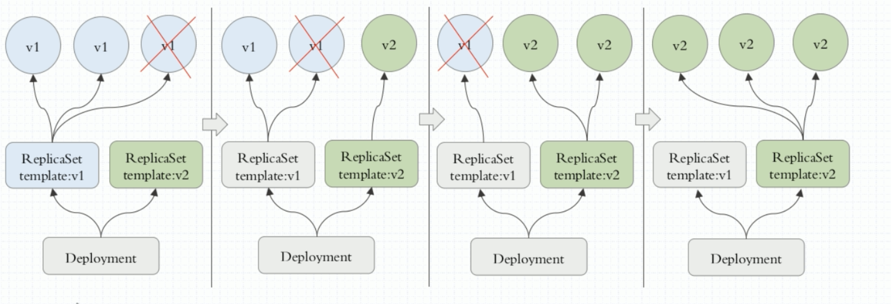
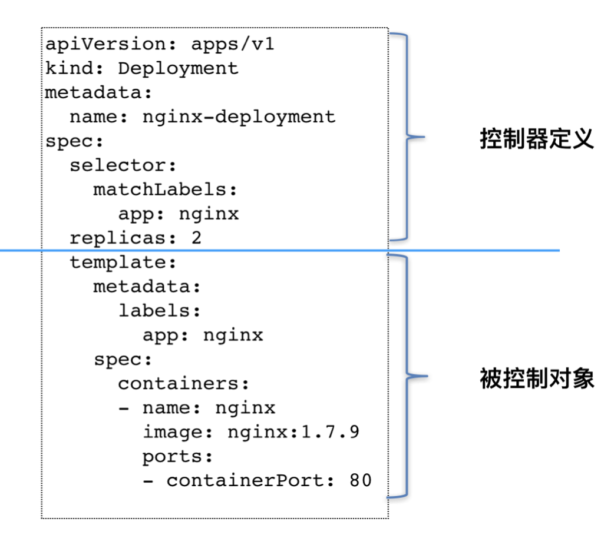

[toc]


# Deployment  无状态（常用）

Deployment 为Pod和ReplicaSet提供一个声明方法，用来替代Replication Controller 来方便管理

Deployment 控制器实际操纵的，是ReplicaSet 对象，而不是 Pod 对 象。

可以声明一个yaml文件，确保deployment的状态信息

管理无状态的应用


Deployment可以建立在ReplicasSet之上， 控制多个rs




```
apiVersion: apps/v1
kind: Deployment
metadata:
  name: myapp-deploy
  namespace: default
spec:
  replicas: 2
  selector:
    matchLabels:
      app: myapp
      release: canary
  template:
    metadata:
      labels:
        app: myapp
        release: canary
    spec:
      containers:
      - name: myapp
        image: ikubernetes/myapp:v1
        ports:
        - name: http
          containerPort: 80
```


```
# kubectl get pods
NAME                            READY   STATUS    RESTARTS   AGE
myapp-deploy-7d574d56c7-nphdc   1/1     Running   0          104s
myapp-deploy-7d574d56c7-t989l   1/1     Running   0          104s
```


## Pod Template

像 Deployment 这种控制器的设计原理

用一种对象管理另一种 对象”的“艺术”。其中，这个控制器对象本身，负责定义被管理对象的期望状态。比如，Deployment 里的 replicas=2 这个字段。

而被控制对象的定义，则来自于一个“模板”。比如，Deployment 里的 template 字段。

可以看到，Deployment 这个 template 字段里的内容，跟一个标准的 Pod 对象的 API 定义，丝毫 不差。而所有被这个 Deployment 管理的 Pod 实例，其实都是根据这个 template 字段的内容创 建出来的。

像 Deployment 定义的 template 字段，在 Kubernetes 项目中有一个专有的名字，叫作 PodTemplate(Pod 模板)。




类似 Deployment 这样的一个控制器，实际上都是由上半部分的控制器定义(包括期 望状态)，加上下半部分的被控制对象的模板组成的


## 水平扩展/收缩

```
$ kubectl scale deployment nginx-deployment --replicas=4 
deployment.apps/nginx-deployment scaled
```


```
$ kubectl create -f nginx-deployment.yaml --record

$ kubectl get deployments
NAME 							DESIRED 	CURRENT 	UP-TO-DATE 	AVAILABLE 	AGE 
nginx-deployment 	3 				0 				0 					0 					1s
```

> DESIRED: 用户期望的 Pod 副本个数(spec.replicas 的值);
>
> CURRENT: 当前处于 Running 状态的 Pod 的个数;
>
> UP-TO-DATE: 当前处于最新版本的 Pod 的个数，所谓最新版本指的是 Pod 的 Spec 部分 与 Deployment 里 Pod 模板里定义的完全一致;
>
> AVAILABLE: 当前已经可用的 Pod 的个数，即:既是 Running 状态，又是最新版本，并 且已经处于 Ready(健康检查正确)状态的 Pod 的个数。这是用户所期望的最终状态。


```
root@master:~# kubectl get rs
NAME                          DESIRED   CURRENT   READY   AGE
nginx-deployment-5bf87f5f59   3         3         3       42s
```

> 这个 ReplicaSet 的名字，则是由 Deployment 的名字和 一个随机字符串共同组成
>
> ReplicaSet 会把这个随机字符串加在它所控制的所有 Pod 的标签里，从而保证这些 Pod 不会 与集群里的其他 Pod 混淆

```
root@master:~# kubectl rollout status deployment/nginx-deployment
deployment "nginx-deployment" successfully rolled out
root@master:~# kubectl describe deployment nginx-deployment
Name:                   nginx-deployment
Namespace:              default
CreationTimestamp:      Sun, 12 Apr 2020 05:17:34 +0000
Labels:                 app=nginx
Annotations:            deployment.kubernetes.io/revision: 1
Selector:               app=nginx
Replicas:               5 desired | 5 updated | 5 total | 5 available | 0 unavailable
StrategyType:           RollingUpdate
MinReadySeconds:        0
RollingUpdateStrategy:  25% max unavailable, 25% max surge
Pod Template:
  Labels:  app=nginx
  Containers:
   nginx:
    Image:        nginx:1.7.9
    Port:         80/TCP
    Host Port:    0/TCP
    Environment:  <none>
    Mounts:       <none>
  Volumes:        <none>
Conditions:
  Type           Status  Reason
  ----           ------  ------
  Progressing    True    NewReplicaSetAvailable
  Available      True    MinimumReplicasAvailable
OldReplicaSets:  <none>
NewReplicaSet:   nginx-deployment-5bf87f5f59 (5/5 replicas created)
Events:
  Type    Reason             Age   From                   Message
  ----    ------             ----  ----                   -------
  Normal  ScalingReplicaSet  20m   deployment-controller  Scaled up replica set nginx-deployment-5bf87f5f59 to 3
  Normal  ScalingReplicaSet  21s   deployment-controller  Scaled up replica set nginx-deployment-5bf87f5f59 to 5
```


## RollingUpdateStrategy

那么控制器在“滚动更 新”的过程中永远都会确保至少有 2 个 Pod 处于可用状态，至多只有 4 个 Pod 同时存在于集 群中。这个策略，是 Deployment 对象的一个字段

```
apiVersion: apps/v1
kind: Deployment
metadata:
	name: nginx-deployment 
	labels:
    app: nginx
spec:
...
  strategy:
    type: RollingUpdate
    rollingUpdate:
      maxSurge: 1
      maxUnavailable: 1
```


