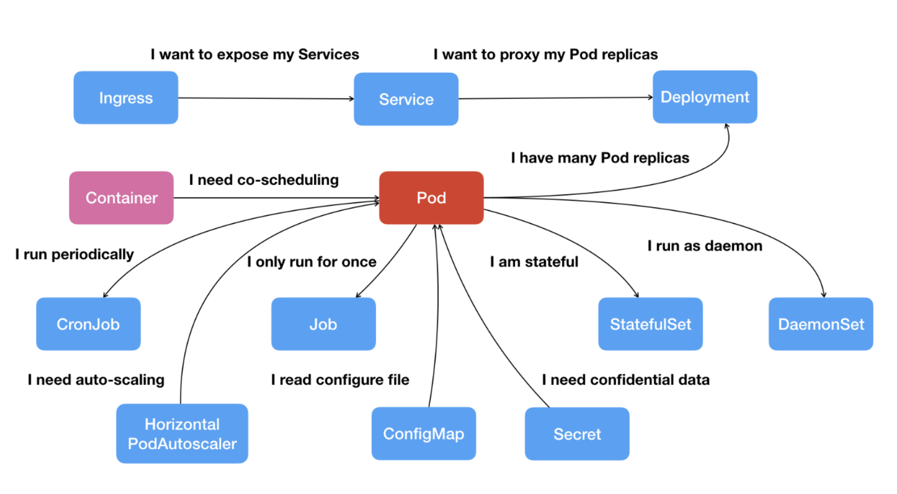
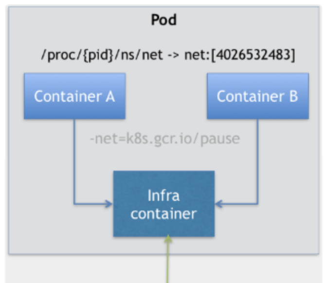

[TOC]


# Pod

容器的本质是进程，Kubernetes 相当于操作系统

Pod，其实是一组共享了某些资源的容器





标准的Kubernetes API资源，在yaml中使用kind，apiVersion，metadata和spec字段定义

status字段在对象创建后由系统自行维护


通过在spec字段中嵌套containers，将容器对象启动


Pod 里面的容器共享同一个Network Namespace，同一组数据卷，而达到高效率的交换信息，即保证了容器间的紧密协作关系


Pod类似于传统基础设置里面的虚拟机角色，而容器，就是虚拟机里面运行的用户程序


## 实现

Pod其实是一组共享了某些资源的容器

Pod里面所有容器，共享的是同一个Network Namespace，并且可以声明共享同一个Volume，从而达到高效率交换信息的目的。

为解决一个有 A、B 两个容器的 Pod，容器 B 就必须比容器 A 先启动，这样一个 Pod 里的 多个容器就不是对等关系，而是拓扑关系了，引入了infra 容器概念


### infra (中间容器)

在Kubernetes 中，Pod的实现需要使用一个中间容器称为Infra容器

Infra 容器永远都是第一个被创建的容器，而其他用户定义的容器，则通过 Join Network Namespace 的方式，与 Infra 容器关联在一起。这样的组织关系

而Pod的生命周期和Infra容器是一致的，与容器A和B无关





Infra 容器使用一个特殊的镜像 (k8s.gcr.io/pause)，占用资源极少， Infra 容器Hold住Network Namespace后，用户容器就可以加入到Infra 容器的Network Namespace中，所以在查看容器在宿主机的Namespace文件的时候，指向的值是完全一样的

这样，容器A和容器B可以直接通过localhost 进行通信，由于一个Pod值可以有一个IP地址，而这个地址就是Network Namespace 对应的IP地址

Infra 容器镜像的 rootfs 里几乎什么都没有，没有你随意发挥的空间。当然，这同时也意味着你的 网络插件完全不必关心用户容器的启动与否，而只需要关注如何配置 Pod，也就是 Infra 容器的 Network Namespace 即可。


## 设计

通常应该一个容器中仅运行一个进程，而日志信息通过输出至容器的标准输出，用户通过kubectl log 进行获取

省去了用户手动分拣日志信息


## 特点

Pod 的另一个重要特性是，它的所有容器都共享同一个 Network Namespace。这就 使得很多与 Pod 网络相关的配置和管理，也都可以交给 sidecar 完成，而完全无须干涉用户容器。 这里最典型的例子莫过于 Istio 这个微服务治理项目了

Istio 项目使用 sidecar 容器完成微服务治理的原理


## pod 属性

凡是调度、网络、存储，以及安全相关的属性，基本上是 Pod 级别的。

这些属性的共同特征是，它们描述的是“机器”这个整体，而不是里面运行的“程序”。比如，配 置这个“机器”的网卡(即:Pod 的网络定义)，配置这个“机器”的磁盘(即:Pod 的存储定 义)，配置这个“机器”的防火墙(即:Pod 的安全定义)。更不用说，这台“机器”运行在哪个 服务器之上(即:Pod 的调度)。


# Pod 生命周期（phase）

pod.status.phase 表示当前Pod的状态

极少使用，如依赖git仓库中的代码，在postStart的时候使用git clone


## Pending

Pod 的 YAML 文件已经提交给了 Kubernetes，API 对象已经被创建并保存在 Etcd 当中。但是，这个 Pod 里有些容器因为某种原因而不能被顺利创建。

比如，调度不成功。


## Running

Pod 已经调度成功，跟一个具体的节点绑定。它包含的容器都已经创 建成功，并且至少有一个正在运行中。


### 异常情况

Pod（即容器）的状态是 Running，但是应用其实已经停止服务的例子

```
1. 程序本身有 bug，本来应该返回 200，但因为代码问题，返回的是500；
2. 程序因为内存问题，已经僵死，但进程还在，但无响应；
3. Dockerfile 写的不规范，应用程序不是主进程，那么主进程出了什么问题都无法发现；
4. 程序出现死循环。
```


## Succeeded

Pod 里的所有容器都正常运行完毕，并且已经退出了。这种情 况在运行一次性任务时最为常见。


## Failed

Pod 里至少有一个容器以不正常的状态(非 0 的返回码)退出。这个状态的出现，意味着你得想办法 Debug 这个容器的应用，比如查看 Pod 的 Events 和日志。

所有容器都已经终止，但至少有一个容器终止失败，即容器返回了非0值的退出状态或已经被系统终止


## Unknown

Pod 的状态不能持续地被 kubelet 汇报给 kube- apiserver，这很有可能是主从节点(Master 和 Kubelet)间的通信出现了问题。


## CrashLoopBackOff

Kubernetes. 尝试一次又一次的重启Pod


# Pod 对象status

PodScheduled、Ready、Initialized，以及 Unschedulable。它们主要用于描述造成当前 Status 的具体原因是什么。


# PodPreset

开发人员只需要提交一个基本的、非常简单的 Pod YAML， Kubernetes 就可以自动给对应的 Pod 对象加上其他必要的信息，比如 labels，annotations， volumes 等等


* pod.yaml

```yaml
apiVersion: v1
kind: Pod
metadata:
	name: website
  labels:
    app: website
    role: frontend
spec:
  containers:
		- name: website 
			image: nginx 
			ports:
			- containerPort: 80
```


* preset.yaml

```yaml
apiVersion: settings.k8s.io/v1alpha1 
kind: PodPreset
metadata:
	name: allow-database 
spec:
  selector:
    matchLabels:
      role: frontend
  env:
		- name: DB_PORT 
		value: "6379"
	volumeMounts:
		- mountPath: /cache
			name: cache-volume 
	volumes:
		- name: cache-volume 
			emptyDir: {}
```

> selector意味着后面这些追加的定义，只会作用于 selector 所定义的、带有“role: frontend”标签的 Pod 对象，这就可以防止“误伤


```
$ kubectl create -f preset.yaml 
$ kubectl create -f pod.yaml
```

Pod 运行起来之后，我们查看一下这个 Pod 的 API 对象

```yaml
$ kubectl get pod website -o yaml 
apiVersion: v1
kind: Pod
metadata:
	name: website
	labels:
	app: website
	role: frontend	
	annotations:
		podpreset.admission.kubernetes.io/podpreset-allow-database: "resource version" 
spec:
	containers:
		- name: website 
			image: nginx 
	volumeMounts:
		- mountPath: /cache 
			name: cache-volume 
	ports:
		- containerPort: 80 
	env:
		- name: DB_PORT 
			value: "6379" 
	volumes:
		- name: cache-volume
			emptyDir: {}
```


需要说明的是，PodPreset 里定义的内容，只会在 Pod API 对象被创建之前追加在这个对象本身 上，而不会影响任何 Pod 的控制器的定义。

比如，我们现在提交的是一个 nginx-deployment，那么这个 Deployment 对象本身是永远不会被 PodPreset 改变的，被修改的只是这个 Deployment 创建出来的所有 Pod。这一点请务必区分清 楚。

这里有一个问题:如果你定义了同时作用于一个 Pod 对象的多个 PodPreset，会发生什么呢?

实际上，Kubernetes 项目会帮你合并(Merge)这两个 PodPreset 要做的修改。而如果它们要做 的修改有冲突的话，这些冲突字段就不会被修改。

# 容器探测

主容器定时探测容器状态

建立在pod.containers 之上

```
[root@master ~]# kubectl explain pods.spec.containers
KIND:     Pod
VERSION:  v1

RESOURCE: containers <[]Object>
```


## livenessProbe 存活探测

探测容器是否处于存活状态


### exec `<Object>` 用户指定命令

根据指令返回码判断

```
apiVersion: v1
kind: Pod
metadata:
  name: liveness-exec-pod
  namespace: default
spec:
  containers:
  - name: liveness-exec-container
    image: busybox:latest
    imagePullPolicy: IfNotPresent
    command: ["/bin/sh", "-c", "touch /tmp/healthy; sleep 30; rm -f /tmp/healthy; sleep 3600"]
    livenessProbe:
      exec:
        command: ["test", "-e", "/tmp/healthy"]
      initialDelaySeconds: 1
      periodSeconds: 3
```


### httpGet      `<Object>`

```
apiVersion: v1
kind: Pod
metadata:
  name: liveness-httpget-pod
  namespace: default
spec:
  containers:
  - name: liveness-httpget-container
    image: ikubernetes/myapp:v1
    imagePullPolicy: IfNotPresent
    ports:
    - name: http
      containerPort: 80
    livenessProbe:
      httpGet:
      	port: http
      	path: /index.html
      initialDelaySeconds: 1
      periodSeconds: 3
```


### tcpSocket    `<Object>`


## readiness 就绪探测   (重要)

探测容器中的服务和程序是否提供服务, 不设置会让未经探测的pod被selector匹配之后立即提供服务，从而导致错误


### exec `<Object>` 用户指定命令

根据指令返回码判断


### httpGet      `<Object>`

```
apiVersion: v1
kind: Pod
metadata:
  name: readiness-httpget-pod
  namespace: default
spec:
  containers:
  - name: readiness-httpget-container
    image: ikubernetes/myapp:v1
    imagePullPolicy: IfNotPresent
    ports:
    - name: http
      containerPort: 80
    readinessProbe:
      httpGet:
      	port: http
      	path: /index.html
      initialDelaySeconds: 1
      periodSeconds: 3
```


进入容器后创建和删除index文件，会看到以下效果

```
[root@master ~]# kubectl exec -it readiness-httpget-pod -- /bin/sh
```


```
[root@master manifests]# kubectl get pods -w
NAME                           READY   STATUS             RESTARTS   AGE
client                         1/1     Running            0          35h
liveness-exec-pod              0/1     CrashLoopBackOff   43         147m
liveness-httpget-pod           1/1     Running            1          12m
myapp-5bc569c47d-62hwb         1/1     Running            0          34h
myapp-5bc569c47d-kwlcp         1/1     Running            0          34h
myapp-5bc569c47d-tpns4         1/1     Running            0          34h
nginx-deploy-55d8d67cf-7zkxm   1/1     Running            0          44h
pod-demo                       2/2     Running            8          8h
readiness-httpget-pod          1/1     Running            0          67s
readiness-httpget-pod          0/1     Running            0          69s
readiness-httpget-pod          1/1     Running            0          4m48s
```


### tcpSocket    `<Object>`


### 


## restartPolicy 容器重启策略

### Always (默认)

pod对象终止就将其重启，默认设定


### OnFailure

只在pod对象出现错误时方将其重启


### Never

从不重启


## pod 资源需求

自主式Pod 要求stress 容器确保128Mi的内存及五分之一的CPU核心(200m) 资源可用

运行stress-ng 镜像启动一个进程(-m 1) 进行内存性能压力测试，满载测试时也会尽可能多地占用CPU资源

```
apiVersion: v1
kind: Pod
metadata:
  name: stress-pod
spec:
  containers:
    - name: stress
      image: ikubernetes/stress-ng
      command: ["/usr/bin/stress-ng", "-m 1", "-c 1", "-metrics-brief"]
      resources:
        requests:
          memory: "128Mi"
          cpu: "200m"

```


```
kubectl create -f pod-resources-test.yaml
```


top命令观察其CPU及内存资源占用状态

```
kubectl exec stress-pod -- top
```


### limits 资源限制

limits 属性为容器定义资源的最大可用量。

资源分配时，可压缩形资源的CPU的控制阀可以自由调节，容器进程无法获得超出其CPU配额的可用时间

如果超出，会被OOM kill 掉


```
apiVersion: v1
kind: Pod
metadata:
  name: memleak-pod
  labels:
    app: memleak
spec:
  containers:
    - name: simmemleak
      image: saadali/simmemleak
      resources:
        requests:
          memory: "64Mi"
          cpu: "1"
        limits:
          memory: "64Mi"
          cpu: "1"

```


## 分布式模型

### sidercar pattern 

边车模型或跨斗模型

即pod的主应用容器提供协同的辅助应用容器，每个应用独立运行

如主应用容器中的日志使用agent收集到日志服务器中，可以将agent运行为辅助应用容器，即sidecar

还如主应用容器中启动database 缓存，sidecar启动Redis Cache

yaml中的containers配合initContainers使用，组合成sidecar


### Ambassador pattern 

大使模型

即远程服务器创建本地代理，主容器应用通过代理容器访问远程服务


### Adapter pattern

适配器模式

将主应用容器中的内容进行标准化输出

如日志数据或者指标数据的输出，


# Pod 控制器 Controller

借助Controller 对Pod进行管理，实现一次性的Pod对象管理, 对同一类pod进行管理

包括以下多种调度器


## Replication Controller (淘汰)

定义了一个期望的场景，声明某种pod的副本数量在任意时刻都符合某个预期值

e.g. `apiVersion: extensions/v1beat1 kind: Replication metadata: name: frontend `


## HPA

Horizontal Pod Autoscaler

根据资源要求，自动扩展资源


## StatefulSet  有状态

管理有状态应用，每一个pod副本会单独管理

StatefulSet 可以说是 Kubernetes 中作业编排的“集大成者”。几乎每一种 Kubernetes 的编排功能，都可以在编写 StatefulSet 的 YAML 文件时被用 到。


### 原理

StatefulSet 的控制器直接管理的是 Pod。这是因为，StatefulSet 里的不同 Pod 实例， 不再像 ReplicaSet 中那样都是完全一样的，而是有了细微区别的。比如，每个 Pod 的 hostname、名字等都是不同的、携带了编号的。而 StatefulSet 区分这些实例的方式，就是通 过在 Pod 的名字里加上事先约定好的编号。

其次，Kubernetes 通过 Headless Service，为这些有编号的 Pod，在 DNS 服务器中生成带有 同样编号的 DNS 记录。只要 StatefulSet 能够保证这些 Pod 名字里的编号不变，那么 Service 里类似于 web-0.nginx.default.svc.cluster.local 这样的 DNS 记录也就不会变，而这条记录解 析出来的 Pod 的 IP 地址，则会随着后端 Pod 的删除和再创建而自动更新。这当然是 Service 机制本身的能力，不需要 StatefulSet 操心。

最后，StatefulSet 还为每一个 Pod 分配并创建一个同样编号的 PVC。这样，Kubernetes 就可 以通过 Persistent Volume 机制为这个 PVC 绑定上对应的 PV，从而保证了每一个 Pod 都拥有 一个独立的 Volume。

在这种情况下，即使 Pod 被删除，它所对应的 PVC 和 PV 依然会保留下来。所以当这个 Pod 被重新创建出来之后，Kubernetes 会为它找到同样编号的 PVC，挂载这个 PVC 对应的 Volume，从而获取到以前保存在 Volume 里的数据。

> nginx-deployment 的唯一区别，就是多了一个 serviceName=nginx 字段
>
> 这个字段的作用，就是告诉 StatefulSet 控制器，在执行控制循环(Control Loop)的时候， 请使用 nginx 这个 Headless Service 来保证 Pod 的“可解析身份”


### 拓扑状态

这种情况意味着，应用的多个实例之间不是完全对等的关系。这些应用实例，必 须按照某些顺序启动，比如应用的主节点 A 要先于从节点 B 启动。而如果你把 A 和 B 两个 Pod 删除掉，它们再次被创建出来时也必须严格按照这个顺序才行。并且，新创建出来的 Pod，必须和原来 Pod 的网络标识一样，这样原先的访问者才能使用同样的方法，访问到 这个新 Pod。


### 存储状态

这种情况意味着，应用的多个实例分别绑定了不同的存储数据。对于这些应用实 例来说，Pod A 第一次读取到的数据，和隔了十分钟之后再次读取到的数据，应该是同一份，哪怕在此期间 Pod A 被重新创建过。这种情况最典型的例子，就是一个数据库应用的 多个存储实例。


### Headless Servic

所谓的 Headless Service，其实仍是一个标准 Service 的 YAML 文件。只不过，它 的 clusterIP 字段的值是:None，即:这个 Service，没有一个 VIP 作为“头”。这也就是 Headless 的含义。所以，这个 Service 被创建后并不会被分配一个 VIP，而是会以 DNS 记录 的方式暴露出它所代理的 Pod

```
apiVersion: v1
kind: Service
metadata:
  name: nginx
  labels:
    app: nginx
spec:
  ports:
  - port: 80
    name: web
  clusterIP: None
  selector:
    app: nginx
```


当你按照这样的方式创建了一个 Headless Service 之后，它所代理的所有 Pod 的 IP 地址，都 会被绑定一个这样格式的 DNS 记录

```
<pod-name>.<svc-name>.<namespace>.svc.cluster.local
```

> 这个 DNS 记录，正是 Kubernetes 项目为 Pod 分配的唯一的“可解析身份”(Resolvable Identity)


```yaml
apiVersion: apps/v1
kind: StatefulSet
metadata:
  name: web
spec:
  serviceName: "nginx" 
  replicas: 2
  selector:
    matchLabels:
      app: nginx
  template:
    metadata:
      labels:
        app: nginx
    spec:
      containers:
      - name: nginx
        image: nginx:1.9.1 
        ports:
        - containerPort: 80
          name: web
```

> 与nginx-deployment 的唯一区别，就是多了一个 serviceName=nginx
>
> 这个字段的作用，就是告诉 StatefulSet 控制器，在执行控制循环(Control Loop)的时候， 请使用 nginx 这个 Headless Service 来保证 Pod 的“可解析身份”


```
root@master:~# kubectl get statefulset web
NAME   READY   AGE
web    2/2     28s
```


进入到容器中查看它们的 hostname

```
root@master:~# kubectl exec web-0 -- sh -c 'hostname'
web-0
root@master:~# kubectl exec web-1 -- sh -c 'hostname'
web-1
```


以 DNS 的方式，访问一下这个 Headless Service


### mysql 主从


将部署 MySQL 集群的流程迁移到 Kubernetes 项目上，需要 能够“容器化”地解决下面3个问题


#### Q1

Master 节点和 Slave 节点需要有不同的配置文件(即:不同的 my.cnf)


配置ConfigMap

```
apiVersion: v1
kind: ConfigMap
metadata:
  name: mysql
  labels:
    app: mysql
data:
  master.cnf: |
    [mysqld]
    log-bin
  slave.cnf: |
    [mysqld] 
    super-read-only
```

> master.cnf 开启了 log-bin，即:使用二进制日志文件的方式进行主从复制，这是一个标准 的设置。
> slave.cnf 的开启了 super-read-only，代表的是从节点会拒绝除了主节点的数据同步操作之 外的所有写操作，即:它对用户是只读的。
>
> “|”后面的内容，就是这份配置数据的 Value。这份数据将来挂载进Master 节点对应的 Pod 后，就会在 Volume 目录里生成一个叫作 master.cnf 的文件。


```
apiVersion: v1
kind: Service
metadata:
  name: mysql
  labels:
    app: mysql
spec:
  ports:
  - name: mysql
    port: 3306
  clusterIP: None
  selector:
  app: mysql 
---
apiVersion: v1
kind: Service
metadata:
  name: mysql-read 
  labels:
    app: mysql
spec:
ports:
  - name: mysql
    port: 3306
  selector:
    app: mysql
```

> 两个 Service 都代理了所有携带 app=mysql 标签的 Pod，也就是所有的 MySQL Pod。端口映射都是用 Service 的 3306 端口对应 Pod 的 3306 端口。
>
> 第一个名叫“mysql”的 Service 是一个 Headless Service(即:clusterIP= None)。所以它的作用，是通过为 Pod 分配 DNS 记录来固定它的拓扑状态，比如“mysql- 0.mysql”和“mysql-1.mysql”这样的 DNS 名字。其中，编号为 0 的节点就是我们的主节 点。
>
> 而第二个名叫“mysql-read”的 Service，则是一个常规的 Service。


#### Q2

Master 节点和 Salve 节点需要能够传输备份信息文件

通过 InitContainer 完成了对“主、从节点间备份文件传输”操作的处理

```
apiVersion: v1
kind: StatefulSet
metadata:
  name: mysql
spec:
  selector:
    matchLabels:
      app: mysql
  serviceName: mysql
  replicas: 3
  template: 
    metadata:
      labels:
        app: mysql
    spec:
      initContainers:
      - name: init-mysql
      - name: clone-mysql
      containers:
      - name: mysql
      - name: xtrabackup
      volumes:
      - name: conf
        emptyDir: {}
      - name: config-map
        configMap:
          name: mysql
  volumeClaimTemplates:
  - metadata:
      name: data
    spec:
      accessModes: ["ReadWriteOnce"]
      resources:
        requests:
          storage: 10Gi
```

> selector 表示，这个 StatefulSet 要管理的 Pod 必须携带 app=mysql 标签;它声明要 使用的 Headless Service 的名字是:mysql
>
> 通过 volumeClaimTemplate(PVC 模板)来为每个 Pod 定义 PVC。
>
> 这个 PVC 模板的 resources.requests.strorage 指定了存储的大小为 10 GB; ReadWriteOnce 指定了该存储的属性为可读写，并且一个 PV 只允许挂载在一个宿主机上。将 来，这个 PV 对应的的 Volume 就会充当 MySQL Pod 的存储数据目录。


#### Q3

在 Slave 节点第一次启动之前，需要执行一些初始化 SQL 操作

可以为这个 MySQL 容器额外定义一个 sidecar 容器，来完成这个操作


#### 完整yaml

https://kubernetes.io/docs/tasks/run-application/run-replicated-stateful-application/


## Operator 有状态

如果你的应用要求不同节点的镜像不一样，那就不能再使用 StatefulSet 了。对于这种情况，应该考虑我后面会讲解到的 Operator。


## CronJob

计划的任务


## DaemonSet 无状态

DaemonSet 的主要作用，是让你在 Kubernetes 集群里，运行一个 Daemon Pod

当有新的节点加入 Kubernetes 集群后，该 Pod 会自动地在新节点上被创建出来;而当旧 节点被删除后，它上面的 Pod 也相应地会被回收掉。

也可以通过定义污点的方式，定义具体哪个节点运行pod副本

```
apiVersion: apps/v1
kind: DaemonSet
metadata:
  name: myapp-ds
  namespace: default
spec:
  selector:
    matchLabels:
      app: filebeat
      release: stable
  template:
    metadata:
      labels:
        app: filebeat
        release: stable
    spec:
      containers:
      - name: filebeat
        image: ikubernetes/filebeat:5.6.5-alpine
        env:
        - name: REDIS_HOST
          value: redis.default.svc.cluster.local
        - name: REDIS_LOG_LEVEL
```


### 原理

跟其他编排对象不一样，DaemonSet 开始运行的时机，很多时候比整个 Kubernetes 集群出现的时机都要早


下面的yaml，是通过 fluentd 将 Docker 容器里的日志转发到 ElasticSearch 中

```
apiVersion: apps/v1
kind: DaemonSet
metadata:
  name: fluentd-elasticsearch 
  namespace: kube-system 
  labels:
    k8s-app: fluentd-logging 
spec:
  selector:
    matchLabels:
      name: fluentd-elasticsearch 
  template:
    metadata:
      labels:
        name: fluentd-elasticsearch 
    spec:
      tolerations:
      - key: node-role.kubernetes.io/master
        effect: NoSchedule 
      containers:
      - name: fluentd-elasticsearch
        image: k8s.gcr.io/fluentd-elasticsearch:1.20 
        resources:
          limits:
            memory: 200Mi
          requests:
            cpu: 100m
            memory: 200Mi
        volumeMounts:
        - name: varlog
          mountPath: /var/log
        - name: varlibdockercontainers
          mountPath: /var/lib/docker/containers
          readOnly: true
      terminationGracePeriodSeconds: 30 
      volumes:
      - name: varlog
        hostPath:
          path: /var/log
      - name: varlibdockercontainers 
        hostPath:
          path: /var/lib/docker/containers
```

> 没有 replicas 字段
>
> fluentd-elasticsearch:1.20 镜像容器挂载了两个 hostPath 类型的 Volume，分别对应宿主机的 /var/log 目录和 /var/lib/docker/containers 目录
>
> 在 DaemonSet 上，我们一般都应该加上 resources 字段，来限制它的 CPU 和 内存使用，防止它占用过多的宿主机资源


fluentd 启动之后，它会从这两个目录里搜集日志信息，并转发给 ElasticSearch 保存。 这样，我们通过 ElasticSearch 就可以很方便地检索这些日志了。

需要注意的是，Docker 容器里应用的日志，默认会保存在宿主机的 /var/lib/docker/containers/{{. 容器 ID}}/{{. 容器 ID}}-json.log 文件里，所以这个目录正是 fluentd 的搜集目标

DaemonSet Controller，首先从 Etcd 里获取所有的 Node 列表，然后遍历所有的 Node。这时，它就可以很容易地去检查，当前这个 Node 上是不是有一个携带了 name=fluentd- elasticsearch 标签的 Pod 在运行。

而检查的结果，可能有这三种情况:

1. 没有这种 Pod，那么就意味着要在这个 Node 上创建这样一个 Pod
2. 有这种 Pod，但是数量大于 1，那就说明要把多余的 Pod 从这个 Node 上删除掉
3. 正好只有一个这种 Pod，那说明这个节点是正常的


针对情况1，通过nodeAffinity来创建新 Pod

```
apiVersion: v1
kind: Pod
metadata:
	name: with-node-affinity 
spec:
  affinity:
    nodeAffinity:
      requiredDuringSchedulingIgnoredDuringExecution: 
        nodeSelectorTerms:
        - matchExpressions:
          - key: metadata.name 
            operator: In 
            values:
            - node-geektime  
```

> requiredDuringSchedulingIgnoredDuringExecution: 表示这个 nodeAffinity 必须在每次调度的时候予以考虑。同时，这也意味着你可以设置在某些情况 下不考虑这个 nodeAffinity
>
> operator: In(即:部分匹配;如果你定义 operator: Equal，就是完全匹配)，这也正是 nodeAffinity 会 取代 nodeSelector 的原因之一

DaemonSet Controller 会在创建 Pod 的时候，自动在这个 Pod 的 API 对象 里，加上这样一个 nodeAffinity 定义。其中，需要绑定的节点名字，正是当前正在遍历的这个 Node

DaemonSet 并不需要修改用户提交的 YAML 文件里的 Pod 模板，而是在向 Kubernetes 发起请求之前，直接修改根据模板生成的 Pod 对象

DaemonSet 还会给这个 Pod 自动加上另外一个与调度相关的字段，叫作 tolerations。 这个字段意味着这个 Pod，会“容忍”(Toleration)某些 Node 的“污点”(Taint)

```
apiVersion: v1
kind: Pod
metadata:
  name: with-toleration
spec:
  tolerations:
  - key: node.kubernetes.io/unschedulable
    operator: Exists
    effect: NoSchedule
```

> Toleration: “容忍”所有被标记为 unschedulable“污点”的 Node;“容 忍”的效果是允许调度

而在正常情况下，被标记了 unschedulable“污点”的 Node，是不会有任何 Pod 被调度上去 的(effect: NoSchedule)。可是，DaemonSet 自动地给被管理的 Pod 加上了这个特殊的 Toleration，就使得这些 Pod 可以忽略这个限制，继而保证每个节点上都会被调度一个 Pod。

这种机制，正是我们在部署 Kubernetes 集群的时候，能够先部署 Kubernetes 本身、再部署网 络插件的根本原因:因为当时我们所创建的 Weave 的 YAML，实际上就是一个 DaemonSet

### Example

若当前 DaemonSet 管理的，是一个网络插件的 Agent Pod，那么你就必须在这个 DaemonSet 的 YAML 文件里，给它的 Pod 模板加上一个能够“容忍”node.kubernetes.io/network-unavailable“污点”的 Toleration

```
template:
    metadata:
      labels:
        name: network-plugin-agent
    spec:
      tolerations:
      - key: node.kubernetes.io/network-unavailable
        operator: Exists
        effect: NoSchedule
```

在 Kubernetes 项目中，当一个节点的网络插件尚未安装时，这个节点就会被自动加上名为 node.kubernetes.io/network-unavailable的“污点”


Pod 模板里加上更多种类的 Toleration，从而利用 DaemonSet 实现自己的 目的。比如，在这个 fluentd-elasticsearch DaemonSet 里，我就给它加上了这样的 Toleration

```
tolerations:
- key: node-role.kubernetes.io/master
  effect: NoSchedule
```

这是因为在默认情况下，Kubernetes 集群不允许用户在 Master 节点部署 Pod。因为， Master 节点默认携带了一个叫作node-role.kubernetes.io/master的“污点”。所以， 为了能在 Master 节点上部署 DaemonSet 的 Pod，我就必须让这个 Pod“容忍”这个“污 点”


## Services

允许多个deployments之间通信，从而确保pods之间通信

Services 通过标签选择器来关联后端的pod

其本质就是iptables的DNAT规则， 在1.11版本之后，使用ipvs来实现更好的负载均衡效果


实例

```
kind: Service
opiVersion: v1
metadata:
  name: my-service
spec:
  selector:
    app: MyApp
  ports:
    - protocol: TCP
      port: 80
      targetPort: 9376
```


### Services 类型

```
Internal:仅用于集群内部通信的ClusterIP类型，即internal IP

External: 接入集群外部请求的NodePort类型， 工作于每个节点的主机IP之上，

LoadBalance: 可以把外部请求负载均衡至多个Node主机IP的NodePort之上
```


## 环境变量

通过环境变量在容器启动时传递配置信息


### env

在容器配置段中嵌套env字段，值是环境变量构成的列表

```
name <string>  环境变量名称，必须字段
value <string>  传递值，通过$(VAR_NAME) 引用
```


#### example

```
apiVersion: v1
kind: Pod
metadata:
  name: pod-with-env
spec: 
  containers:
  - name: filebeat
    image: ikubernetes/filebeat:5.6.5-alpine
    env: 
    - name: REDIS_HOST
      value: db.xurick.com:6379
    - name: LOG_LEVEL
      value: info
```


### envFrom


## Pod Probe 探针

健康检查探针，kubelet会根据Probe返回值来决定这个容器的状态


test-liveness-exec.yaml

```
apiVersion: v1
kind: Pod
metadata:
  labels:
    test: liveness
  name: test-liveness-exec
spec:
  containers:
  - name: liveness
    image: busybox
    args:
    - /bin/sh
    - -c
    - touch /tmp/healthy; sleep 30; rm -rf /tmp/healthy; sleep 600
    livenessProbe:
      exec:
        command:
        - cat
        - /tmp/healthy
      initialDelaySeconds: 5
      periodSeconds: 5
```

> 与此同时，我们定义了一个这样的 livenessProbe（健康检查）。它的类型是 exec，这意味着，它会在容器启动后，在容器里面执行一句我们指定的命令，比如：“cat /tmp/healthy”。这时，如果这个文件存在，这条命令的返回值就是 0，Pod 就会认为这个容器不仅已经启动，而且是健康的。这个健康检查，在容器启动 5 s 后开始执行（initialDelaySeconds: 5），每 5 s 执行一次（periodSeconds: 5）。


```
$ kubectl create -f test-liveness-exec.yaml
```

```
$ kubectl get pod
NAME                READY     STATUS    RESTARTS   AGE
test-liveness-exec   1/1       Running   0          10s
```


30s 之后查看

```
$ kubectl describe pod test-liveness-exec
```

```
FirstSeen LastSeen    Count   From            SubobjectPath           Type        Reason      Message
--------- --------    -----   ----            -------------           --------    ------      -------
2s        2s      1   {kubelet worker0}   spec.containers{liveness}   Warning     Unhealthy   Liveness probe failed: cat: can't open '/tmp/healthy': No such file or directory
```

> 这里报错，表示文件已经不存在了


然而pod并没有Fail，而是进入了running 状态，是因为Pod的恢复机制，即restartPolicy

Pod的恢复过程永远发生在当前节点(Node), 除非pod.spec.node字段被更改