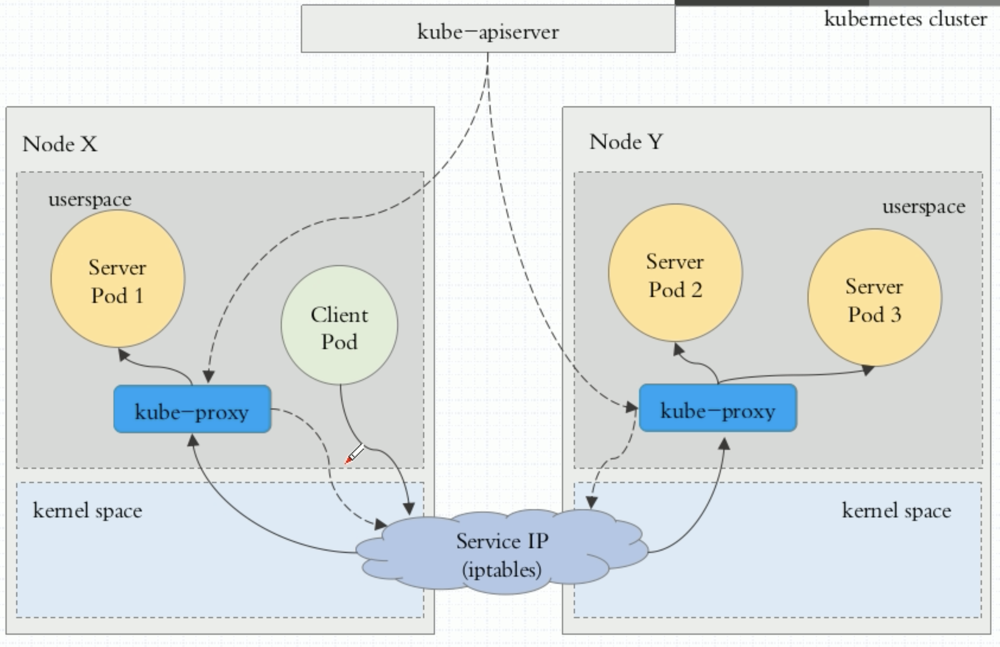
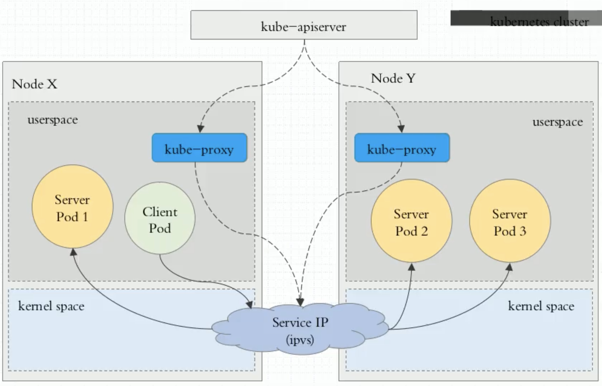

[toc]


# service 服务

依赖于kubernetes的dns 服务器，默认使用CoreDNS, 或kube-dns(1.11之前)


## 原理

worker node上的kube-proxy通过master apiServer 获取任何一个和service相关的变动状态

kube-proxy会watch apiServer中etcd的变化，然后转换为相应的规则


# 实现的工作模式


## user space 模型




来自外部，先到达当前节点内核空间的service 规则，kube-proxy是工作在用户空间的进程

但是效率很低


## iptables 模型


直接工作在内核空间，直接由service的iptables负责调度相关的pod


## ipvs 模型




1.11之后使用ipvs，若没有安装ipvs模块，自动降级为iptables


# 类型 type


## ExternalName 

把集群外部的服务映射到集群内部来使用, 即service与外部联系

使集群内部的Pod像使用集群内部的服务一样，使用集群外部的服务

ExternalName (CNAME) 需要被DNS服务解析，才能被访问


## ClusterIP 默认 （内部访问）

私网地址，默认分配一个IP地址，仅用于集群内部通信

```
[root@master ~]# cat redis-svc.yaml
apiVersion: v1
kind: Service
metadata:
  name: redis
  namespace: default
spec:
  selector:
    app: redis
    role: logstor
  clusterIP: 10.97.97.97
  type: ClusterIP
  ports:
  - port: 6379
    targetPort: 6379
```

```
# kubectl get svc
NAME         TYPE        CLUSTER-IP    EXTERNAL-IP   PORT(S)    AGE
kubernetes   ClusterIP   10.96.0.1     <none>        443/TCP    6d1h
redis        ClusterIP   10.97.97.97   <none>        6379/TCP   4s
```


那么解析的地址就是clusterIP的地址

```
[root@master ~]# dig -t A redis.default.svc.cluster.local. @10.96.0.10

; <<>> DiG 9.9.4-RedHat-9.9.4-73.el7_6 <<>> -t A redis.default.svc.cluster.local. @10.96.0.10
;; global options: +cmd
;; Got answer:
;; ->>HEADER<<- opcode: QUERY, status: NOERROR, id: 60931
;; flags: qr aa rd; QUERY: 1, ANSWER: 1, AUTHORITY: 0, ADDITIONAL: 1
;; WARNING: recursion requested but not available

;; OPT PSEUDOSECTION:
; EDNS: version: 0, flags:; udp: 4096
;; QUESTION SECTION:
;redis.default.svc.cluster.local. IN    A

;; ANSWER SECTION:
redis.default.svc.cluster.local. 5 IN   A       10.97.97.97

;; Query time: 0 msec
;; SERVER: 10.96.0.10#53(10.96.0.10)
;; WHEN: Sun Apr 07 08:54:29 UTC 2019
;; MSG SIZE  rcvd: 107
```


## NodePort （外部访问）

接入集群外部流量，是以ClusterIP为前提的

但是会将流量接入到同一个node节点之上，所以需要在NodeIP之前加上负载均衡器

若为公有云，可以通过支持LBAAS的环境，通过调用对应的API实现后端servcie的添加和删除


访问方式为

```
client -> NodeIP:NodePort -> ClusterIP:ServicePort -> PodIP: containerPort
```


```
[root@master ~]# cat myapp-svc.yaml 
apiVersion: v1
kind: Service
metadata:
  name: myapp
  namespace: default
spec:
  selector:
    app: myapp
    release: canary
  clusterIP: 10.99.99.99
  type: NodePort
  ports:
  - port: 80
    targetPort: 80
    nodePort: 30080
```

> 30080如果不指定，默认会从宿主机上选择没有使用的随机端口，确保该端口没有被占用


```
[root@master ~]# kubectl  apply -f myapp-svc.yaml
service/myapp created
[root@master ~]# kubectl  get svc
NAME         TYPE        CLUSTER-IP    EXTERNAL-IP   PORT(S)        AGE
kubernetes   ClusterIP   10.96.0.1     <none>        443/TCP        5d17h
myapp        NodePort    10.99.99.99   <none>        80:30080/TCP   4s
redis        ClusterIP   10.97.97.97   <none>        6379/TCP       7m35s
```


在集群外部访问

```
xhxu-mac:~ xhxu$ while True; do curl http://worker_node_ip:30080/hostname.html; sleep 1 ; done
myapp-deployment-67b6dfcd8-rc7t8
myapp-deployment-67b6dfcd8-g2cnc
myapp-deployment-67b6dfcd8-g2cnc
myapp-deployment-67b6dfcd8-59wxt
myapp-deployment-67b6dfcd8-59wxt
```


## LoadBalancer

自动触发创建web的负载均衡器，是在NodePort上增强的功能

将外部LoadBalancer(aliyun LBS)的请求分散到NodePort上，再由NodePort转发到Service上，Service再转发到Pod之上

### 


## No ClusterIP (Headless)

无头服务，将service name直接解析为Pod IP


```
[root@master ~]# cat myapp-svc-headless.yaml
apiVersion: v1
kind: Service
metadata:
  name: myapp-svc-headless
  namespace: default
spec:
  selector:
    app: myapp
    release: canary
  clusterIP: "None"
  ports:
  - port: 80
    targetPort: 80
```


```
[root@master ~]# kubectl get svc
NAME                 TYPE        CLUSTER-IP    EXTERNAL-IP   PORT(S)        AGE
kubernetes           ClusterIP   10.96.0.1     <none>        443/TCP        5d20h
myapp                NodePort    10.99.99.99   <none>        80:30080/TCP   174m
myapp-svc-headless   ClusterIP   None          <none>        80/TCP         6s
redis                ClusterIP   10.97.97.97   <none>        6379/TCP       3h1m
```


```
[root@master ~]# kubectl get svc -n kube-system
NAME       TYPE        CLUSTER-IP   EXTERNAL-IP   PORT(S)                  AGE
kube-dns   ClusterIP   10.96.0.10   <none>        53/UDP,53/TCP,9153/TCP   5d20h

# 指定本地dns解析结果
[root@master ~]# dig -t A myapp-svc-headless.default.svc.cluster.local. @10.96.0.10

; <<>> DiG 9.9.4-RedHat-9.9.4-73.el7_6 <<>> -t A myapp-svc-headless.default.svc.cluster.local. @10.96.0.10
;; global options: +cmd
;; Got answer:
;; ->>HEADER<<- opcode: QUERY, status: NOERROR, id: 63517
;; flags: qr aa rd; QUERY: 1, ANSWER: 3, AUTHORITY: 0, ADDITIONAL: 1
;; WARNING: recursion requested but not available

;; OPT PSEUDOSECTION:
; EDNS: version: 0, flags:; udp: 4096
;; QUESTION SECTION:
;myapp-svc-headless.default.svc.cluster.local. IN A

;; ANSWER SECTION:
myapp-svc-headless.default.svc.cluster.local. 5 IN A 10.244.2.29
myapp-svc-headless.default.svc.cluster.local. 5 IN A 10.244.1.38
myapp-svc-headless.default.svc.cluster.local. 5 IN A 10.244.2.30

;; Query time: 0 msec
;; SERVER: 10.96.0.10#53(10.96.0.10)
;; WHEN: Sun Apr 07 08:51:30 UTC 2019
;; MSG SIZE  rcvd: 253

# 上面的pod地址，就是实际请求访问的地址
[root@master ~]# kubectl get pods -o wide -l app=myapp
NAME                                READY   STATUS    RESTARTS   AGE     IP            NODE     NOMINATED NODE   READINESS GATES
myapp-deployment-675558bfc5-q8gxv   1/1     Running   0          3m49s   10.244.1.38   node01   <none>           <none>
myapp-deployment-675558bfc5-tdfk7   1/1     Running   0          3m48s   10.244.2.30   node02   <none>           <none>
myapp-deployment-675558bfc5-zhn8b   1/1     Running   0          3m51s   10.244.2.29   node02   <none>           <none>
```


