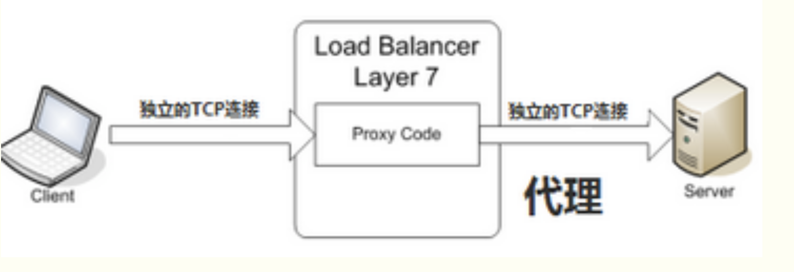

[toc]

# 负载均衡

负载均衡（Load Balance）建立在现有网络结构之上，它提供了一种廉价有效透明的方法扩展网络设备和服务器的带宽、增加吞吐量、加强网络数据处理能力、提高网络的灵活性和可用性

## 二层负载均衡（mac）

根据OSI模型分的二层负载，一般是用虚拟mac地址方式，外部对虚拟MAC地址请求，负载均衡接收后分配后端实际的MAC地址响应.

### 软件实现

链路聚合（Trunking）技术（第二层负载均衡）将多条物理链路当作一条单一的聚合逻辑链路使用，网络数据流量由聚合逻辑链路中所有物理链路共同承担，由此在逻辑上增大了链路的容量，使其能满足带宽增加的需求。

## 三层负载均衡（ip）

一般采用虚拟IP地址方式，外部对虚拟的ip地址请求，负载均衡接收后分配后端实际的IP地址响应. (即一个ip对一个ip的转发, 端口全放开)

## 四层负载均衡（tcp）

在三层负载均衡的基础上，通过发布三层的IP地址（VIP），然后加四层的端口号，来决定哪些流量需要做负载均衡，对需要处理的流量进行NAT处理，转发至后台服务器，并记录下这个TCP或者UDP的流量是由哪台服务器处理的，后续这个连接的所有流量都同样转发到同一台服务器处理。

对应的负载均衡器称为四层交换机（L4 switch），主要分析IP层及TCP/UDP层，实现四层负载均衡。此种负载均衡器不理解应用协议（如HTTP/FTP/MySQL等等）。

### 原理

通过报文中的目标地址和端口，再加上负载均衡设备设置的服务器选择方式，决定最终选择的内部服务器。

以常见的TCP为例，负载均衡设备在接收到第一个来自客户端的SYN 请求时，即通过上述方式选择一个最佳的服务器，并对报文中目标IP地址进行修改(改为后端服务器IP），直接转发给该服务器。TCP的连接建立，即三次握手是客户端和服务器直接建立的，负载均衡设备只是起到一个类似路由器的转发动作。在某些部署情况下，为保证服务器回包可以正确返回给负载均衡设备，在转发报文的同时可能还会对报文原来的源地址进行修改。

### 特点

**四层负载均衡**在中间传输层执行，它处理消息的传递，但不考虑消息的内容。例如TCP是网络上Hypertext Transfer Protocol（HTTP）流量的第四层协议。在这一过程中，4层负载均衡会将网络数据包转发到上游服务器，但不会检查数据包的内容，只能通过检查TCP流中的前几个包来做出有限的路由决策。

四层负载均衡主要是较为灵活，可以作为多种软件的负载均衡器。

可以防御SYN cookie 和SYN flood等

### 软件实现

lvs：重量级的四层负载软件
nginx：轻量级的四层负载软件（通过stream模块实现），带缓存功能，正则表达式较灵活 
haproxy：模拟四层转发，较灵活

### 硬件实现

F5：硬件负载均衡器，功能很好，但是成本很高。

## 七层负载均衡（http）

在四层负载均衡的基础上（没有四层是绝对不可能有七层的），再考虑应用层的特征，比如同一个Web服务器的负载均衡，除了根据VIP加80端口辨别是否需要处理的流量，还可根据七层的URL、浏览器类别、语言来决定是否要进行负载均衡

对应的负载均衡器称为七层交换机（L7 switch），除了支持四层负载均衡以外，还有分析应用层的信息，如HTTP协议URI或Cookie信息，实现七层负载均衡。此种负载均衡器能理解应用协议

### 原理

通过报文中的真正有意义的应用层内容，再加上负载均衡设备设置的服务器选择方式，决定最终选择的内部服务器。

以常见的TCP为例，负载均衡设备如果要根据真正的应用层内容再选择服务器，只能先代理最终的服务器和客户端建立连接(三次握手)后，才可能接受到客户端发送的真正应用层内容的报文，然后再根据该报文中的特定字段，再加上负载均衡设备设置的服务器选择方式，决定最终选择的内部服务器。

### 特点

**七层负载均衡**不同于四层负载均衡，它在高级应用层上执行，会处理每个消息的实际内容。HTTP是网络上网站流量的主要7层协议。七层负载均衡以比四层负载均衡更复杂的方式路由网络流量，尤其适用于基于TCP的流量（如HTTP）。七层负载均衡会终止网络流量并读取器中消息，它可以根据消息内容（如URL或cookie）做出负载均衡决策。随后，七层负载均衡与选定上有服务器建立新的TCP连接并将请求写入服务器。

七层应用负载的好处，是使得整个网络更”智能化“。例如访问一个网站的用户流量，可以通过七层的方式，将对图片类的请求转发到特定的图片服务器并可以使用缓存技术；将对文字类的请求可以转发到特定的文字服务器并可以使用压缩技术。当然这只是七层应用的一个小案例，从技术原理上，这种方式可以对客户端的请求和服务器的响应进行任意意义上的修改，极大的提升了应用系统在网络层的灵活性。很多在后台，例如Nginx或者Apache上部署的功能可以前移到负载均衡设备上，例如客户请求中的Header重写，服务器响应中的关键字过滤或者内容插入等功能。

### 软件实现

haproxy：天生负载均衡技能，全面支持七层代理，会话保持，标记，路径转移
nginx：只在http协议和mail协议上功能比较好，性能与haproxy差不多
apache：功能较差
Mysql proxy：功能尚可

# 负载均衡策略

## 轮循均衡（Round Robin）

每一次来自网络的请求轮流分配给内部中的服务器，从1至N然后重新开始。此种均衡算法适合于服务器组中的所有服务器都有相同的软硬件配置并且平均服务请求相对均衡的情况。

## 权重轮循均衡（Weighted Round Robin）

根据服务器的不同处理能力，给每个服务器分配不同的权值，使其能够接受相应权值数的服务请求。例如：服务器A的权值被设计成1，B的权值是 3，C的权值是6，则服务器A、B、C将分别接受到10%、30％、60％的服务请求。此种均衡算法能确保高性能的服务器得到更多的使用率，避免低性能的服务器负载过重。

## 随机均衡（Random）

把来自网络的请求随机分配给内部中的多个服务器。

## 权重随机均衡（Weighted Random）

此种均衡算法类似于权重轮循算法，不过在处理请求分担时是个随机选择的过程。

## 响应速度均衡（Response Time）

负载均衡设备对内部各服务器发出一个探测请求（例如Ping），然后根据内部中各服务器对探测请求的最快响应时间来决定哪一台服务器来响应客户端的服务请求。此种均衡算法能较好的反映服务器的当前运行状态，但这最快响应时间仅仅指的是负载均衡设备与服务器间的最快响应时间，而不是客户端与服务器间的最快响应时间。

## 最少连接数均衡（Least Connection）

客户端的每一次请求服务在服务器停留的时间可能会有较大的差异，随着工作时间加长，如果采用简单的轮循或随机均衡算法，每一台服务器上的连接进程可能会产生极大的不同，并没有达到真正的负载均衡。最少连接数均衡算法对内部中需负载的每一台服务器都有一个数据记录，记录当前该服务器正在处理的连接数量，当有新的服务连接请求时，将把当前请求分配给连接数最少的服务器，使均衡更加符合实际情况，负载更加均衡。此种均衡算法适合长时处理的请求服务，如FTP。

## 处理能力均衡

此种均衡算法将把服务请求分配给内部中处理负荷（根据服务器CPU型号、CPU数量、内存大小及当前连接数等换算而成）最轻的服务器，由于考虑到了内部服务器的处理能力及当前网络运行状况，所以此种均衡算法相对来说更加精确，尤其适合运用到第七层（应用层）负载均衡的情况下。

## DNS响应均衡（Flash DNS）

在Internet上，无论是HTTP、FTP或是其它的服务请求，客户端一般都是通过域名解析来找到服务器确切的IP地址的。在此均衡算法下，分处在不同地理位置的负载均衡设备收到同一个客户端的域名解析请求，并在同一时间内把此域名解析成各自相对应服务器的IP地址（即与此负载均衡设备在同一位地理位置的服务器的IP地址）并返回给客户端，则客户端将以最先收到的域名解析IP地址来继续请求服务，而忽略其它的IP地址响应。在种均衡策略适合应用在全局负载均衡的情况下，对本地负载均衡是没有意义的。

