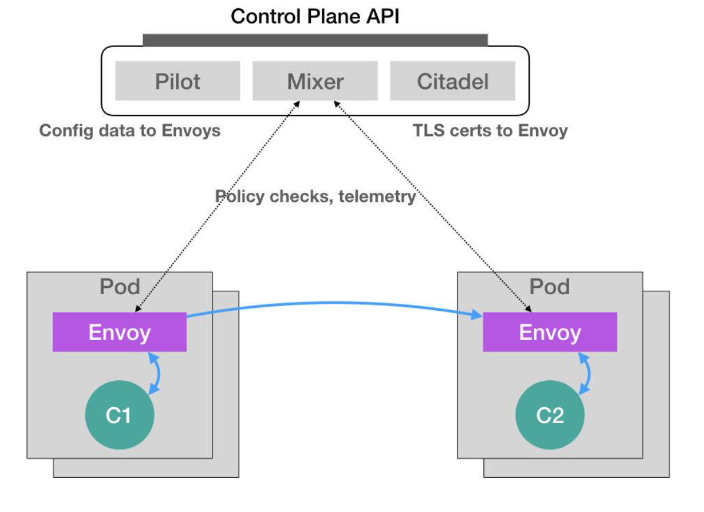

[toc]


# Lstio

在 2017 年 5 月，Google、IBM 和 Lyft 公司，共同宣布了 Istio 开源项目的诞生。很快，这个 项目就在技术圈儿里，掀起了一阵名叫“微服务”的热潮，把 Service Mesh 这个新的编排概念 推到了风口浪尖。

而 Istio 项目，实际上就是一个基于 Kubernetes 项目的微服务治理框架。它的架构非常清晰



如果所知，Istio 最根本的组件，是运行在 每一个应用 Pod 里的 Envoy 容器

这个 Envoy 项目是 Lyft 公司推出的一个高性能 C++ 网络代理，也是 Lyft 公司对 Istio 项目的 唯一贡献。

而 Istio 项目，则把这个代理服务以 sidecar 容器的方式，运行在了每一个被治理的应用 Pod 中。我们知道，Pod 里的所有容器都共享同一个 Network Namespace。所以，Envoy 容器就 能够通过配置 Pod 里的 iptables 规则，把整个 Pod 的进出流量接管下来。

这时候，Istio 的控制层(Control Plane)里的 Pilot 组件，就能够通过调用每个 Envoy 容器的 API，对这个 Envoy 代理进行配置，从而实现微服务治理。


## Service Mesh

Istio 项目 的核心，就是由无数个运行在应用 Pod 中的 Envoy 容器组成的服务代理网格。这也正是 Service Mesh 的含义


## Dynamic Admission Control

假设这个 Istio 架构图左边的 Pod 是已经在运行的应用，而右边的 Pod 则是我们刚刚上线的应 用的新版本。这时候，Pilot 通过调节这两 Pod 里的 Envoy 容器的配置，从而将 90% 的流量分 配给旧版本的应用，将 10% 的流量分配给新版本应用，并且，还可以在后续的过程中随时调 整。这样，一个典型的“灰度发布”的场景就完成了。比如，Istio 可以调节这个流量从 90%-10%，改到 80%-20%，再到 50%-50%，最后到 0%-100%，就完成了这个灰度发布的 过程。

更重要的是，在整个微服务治理的过程中，无论是对 Envoy 容器的部署，还是像上面这样对 Envoy 代理的配置，用户和应用都是完全“无感”的。

实际上，Istio 项目使用的，是 Kubernetes 中的一个非常重要的功能，叫作 Dynamic Admission Control。

在 Kubernetes 项目中，当一个 Pod 或者任何一个 API 对象被提交给 APIServer 之后，总有一 些“初始化”性质的工作需要在它们被 Kubernetes 项目正式处理之前进行。比如，自动为所有 Pod 加上某些标签(Labels)。

而这个“初始化”操作的实现，借助的是一个叫作 Admission 的功能。它其实是 Kubernetes 项目里一组被称为 Admission Controller 的代码，可以选择性地被编译进 APIServer 中，在 API 对象创建之后会被立刻调用到。

但这就意味着，如果你现在想要添加一些自己的规则到 Admission Controller，就会比较困 难。因为，这要求重新编译并重启 APIServer。显然，这种使用方法对 Istio 来说，影响太大 了。

所以，Kubernetes 项目为我们额外提供了一种“热插拔”式的 Admission 机制，它就是 Dynamic Admission Control，也叫作:Initializer。


### 原理

```
apiVersion: v1
kind: Pod
metadata:
name: myapp-pod 
  labels:
    app: myapp
spec:
  containers:
  - name: myapp-container
    image: busybox
    command: ['sh', '-c', 'echo Hello Kubernetes! && sleep 3600']
```

这个 Pod 里面只有一个用户容器，叫作:myapp-container。

接下来，Istio 项目要做的，就是在这个 Pod YAML 被提交给 Kubernetes 之后，在它对应的 API 对象里自动加上 Envoy 容器的配置，使这个对象变成如下所示的样子

```
apiVersion: v1
kind: Pod
metadata:
name: myapp-pod 
  labels:
    app: myapp
spec:
  containers:
  - name: myapp-container
    image: busybox
    command: ['sh', '-c', 'echo Hello Kubernetes! && sleep 3600']
  - name: envoy
    image: lyft/envoy:845747b88f102c0fd262ab234308e9e22f693a1 
    command: ["/usr/local/bin/envoy"]
    ...
```


可以看到，被 Istio 处理后的这个 Pod 里，除了用户自己定义的 myapp-container 容器之外， 多出了一个叫作 envoy 的容器，它就是 Istio 要使用的 Envoy 代理。

Istio 要做的，就是编写一个用来为 Pod“自动注入”Envoy 容器的 Initializer。

首先，Istio 会将这个 Envoy 容器本身的定义，以 ConfigMap 的方式保存在 Kubernetes 当 中。这个 ConfigMap(名叫:envoy-initializer)的定义如下所示

```
apiVersion: v1
kind: ConfigMap
metadata:
  name: envoy-initializer 
data:
  config: 
    containers:
    - name: envoy
      image: lyft/envoy:845747db88f102c0fd262ab234308e9e22f693a1 
      command: ["/usr/local/bin/envoy"]
      args:
      - "--concurrency 4"
      - "--config-path /etc/envoy/envoy.json" 
      - "--mode serve"
      ports:
        - containerPort: 80
          protocol: TCP
      resources:
        limits:
          cpu: "1000m" 
          memory: "512Mi"
        requests:
          cpu: "100m" 
          memory: "64Mi"
      volumeMounts:
        - name: envoy-conf
          mountPath: /etc/envoy
    volumes:
    - name: envoy-conf
      configMap:
        name: envoy
```

这个 ConfigMap 的 data 部分，正是一个 Pod 对象的一部分定义。其 中，我们可以看到 Envoy 容器对应的 containers 字段，以及一个用来声明 Envoy 配置文件的 volumes 字段。

不难想到，Initializer 要做的工作，就是把这部分 Envoy 相关的字段，自动添加到用户提交的 Pod 的 API 对象里。可是，用户提交的 Pod 里本来就有 containers 字段和 volumes 字段，所 以 Kubernetes 在处理这样的更新请求时，就必须使用类似于 git merge 这样的操作，才能将 这两部分内容合并在一起。

所以说，在 Initializer 更新用户的 Pod 对象的时候，必须使用 PATCH API 来完成。而这种 PATCH API，正是声明式 API 最主要的能力。


接下来，Istio 将一个编写好的 Initializer，作为一个 Pod 部署在 Kubernetes 中。这个 Pod 的 定义非常简单

```
apiVersion: v1
kind: Pod
metadata:
  labels:
    app: envoy-initializer
  name: envoy-initializer 
spec:
  containers:
    - name: envoy-initializer
      image: envoy-initializer:0.0.1 
      imagePullPolicy: Always
```

这个 envoy-initializer 使用的 envoy-initializer:0.0.1 镜像，就是一个事先编写 好的“自定义控制器”(Custom Controller)

Kubernetes 的控制器，实际上就是一个“死循环”:它不断地获取“实际状态”，然后与“期 望状态”作对比，并以此为依据决定下一步的操作。

而 Initializer 的控制器，不断获取到的“实际状态”，就是用户新创建的 Pod。而它的“期望 状态”，则是:这个 Pod 里被添加了 Envoy 容器的定义。