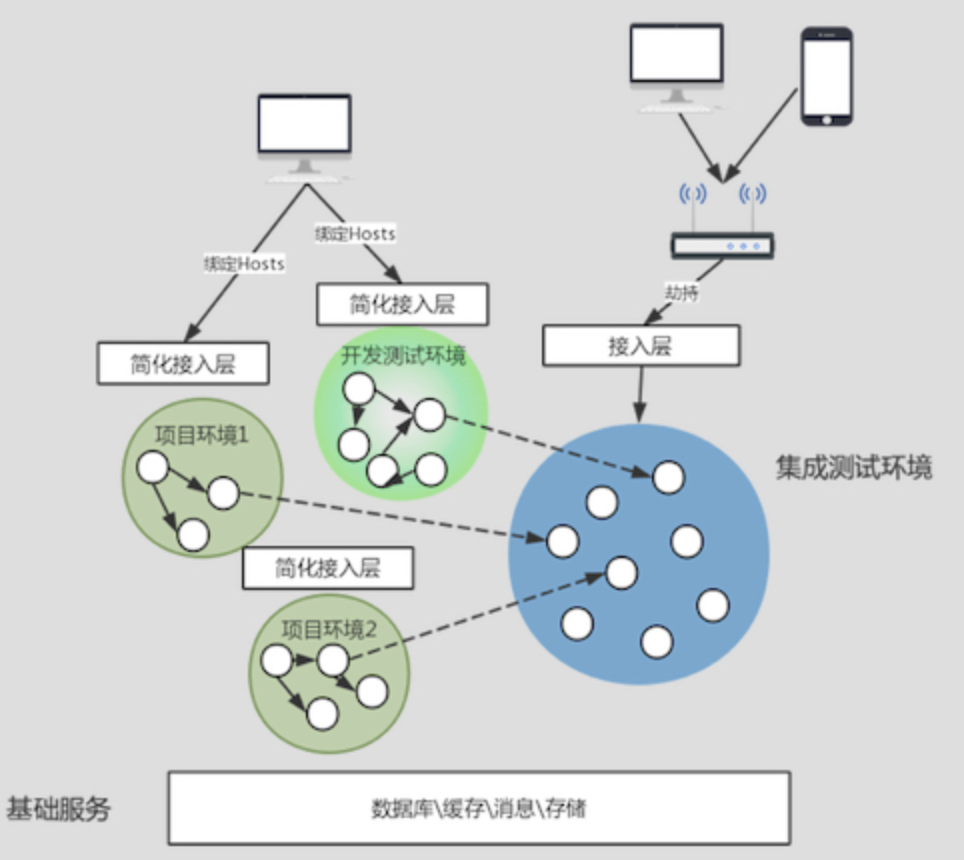

[toc]

# 多环境部署

DNS 服务保持一套，域名保持一套，但是做域名的 hosts 绑定，也就是自己来设置要访问域名所对应的环境。这样一来，如果相对固定的开发测试环境和集成测试环境所对应的 hosts 相对固定，那么只需要绑定一次就可以通用。但是项目环境始终在不断的变化中，绑定规则可能随时在变化，所以这种方案的复杂度在于对 hosts 配置的管理上。

和

对于公网域名，可以直接通过无线路由劫持的方式访问，可以在无线路由器上配置多个接入点，这样一来，连接不同的接入点，就会自动对应到不同环境的域名 IP 地址上去。

