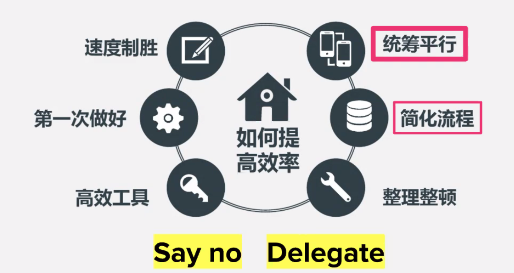
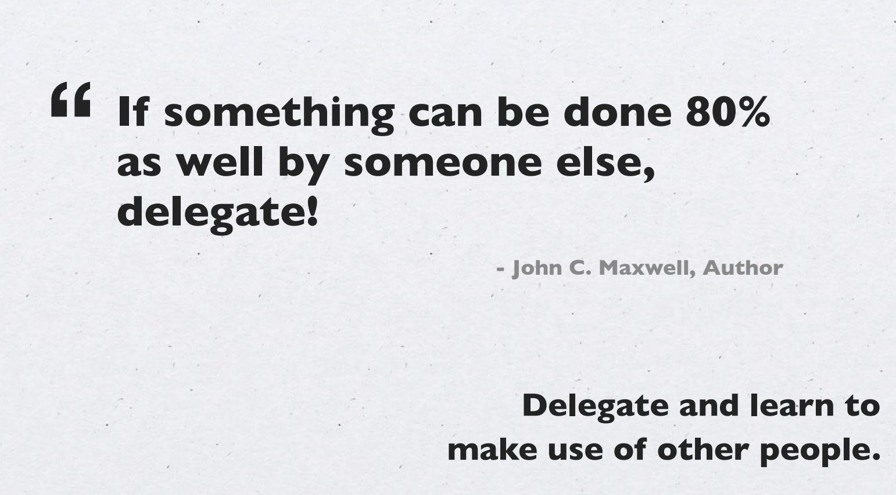
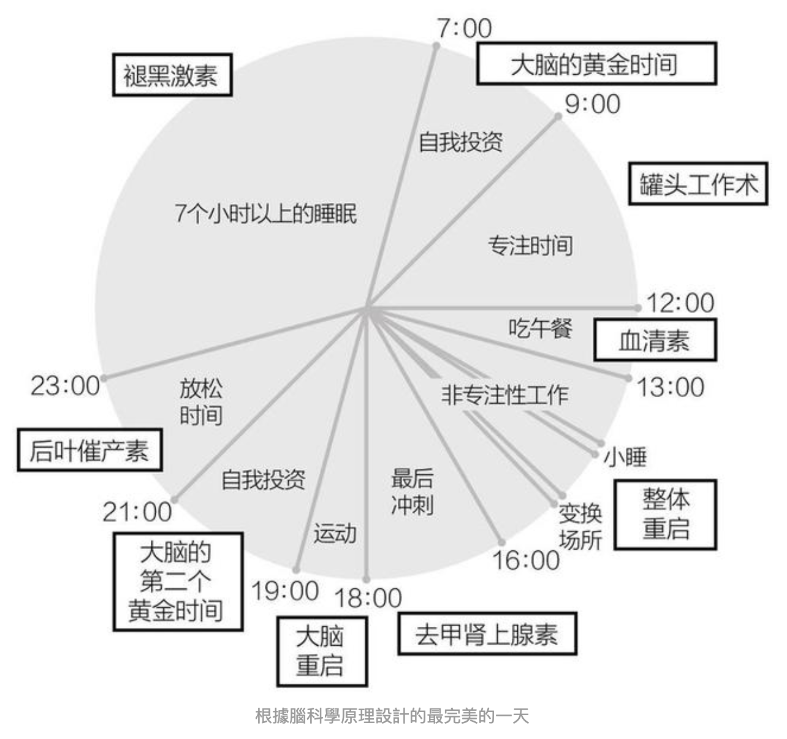
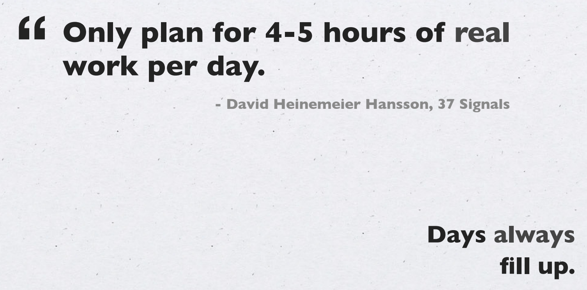
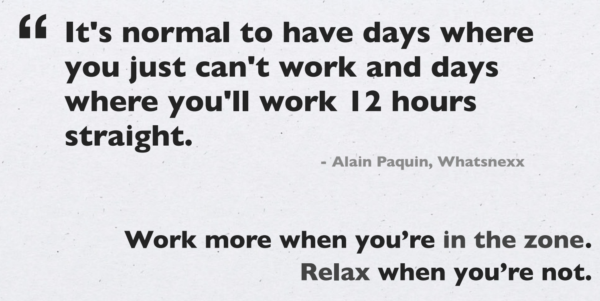

[toc]

# Time Management

## say no

拒绝相悖的任务

## Delegate

把相关的任务分给别人

# One day schedule

## 轻松起床

开窗帘睡觉，保持室内温度舒适

## 起床2-3小时

大脑黄金时间，专注力强的事情上午做

## 罐头工作法

就好比把自己关在罐头瓶里，隔绝了外界的干扰，可以一心一意地埋头工作。而罐头瓶就是专注空间。找到适合自己的专注空间，就可以在其中高效率的工作。

## 外出午餐

尽量外出，散步，享受日光浴，激活血清素

## 午睡

最佳时间20-30mins，最佳睡姿躺着，不要超过1小时

## 下午2-4 犯困

起身走动，看看窗外风景，闭目养神，重启专注力

## 设定下班时间

若晚上有约，设定工作截止时间，集中精神工作

## 晚上运动

晚上运动一会，可以重启脑力和专注力

## 睡前2小时

不要让当天的压力和情绪过夜

不要运动，吃东西等

可以和家人聊天，读书，思考，冥想，听音乐等

## 睡前15mins

不需要太多信息，想想美好快乐的事情，可以轻松入睡

## 周末

不用刻意补充睡眠，越是疲惫，越是需要运动

## 运动安排

重脑力劳动者，需要多运动

## 与人交流

聊天时最好的减压方式

## 投资学习方法

锻炼好自己的主要专长，培养创造自由时间的能力，再把创造出的时间用于学习其他能力

## 

## real work per day 

## work-life balance 

