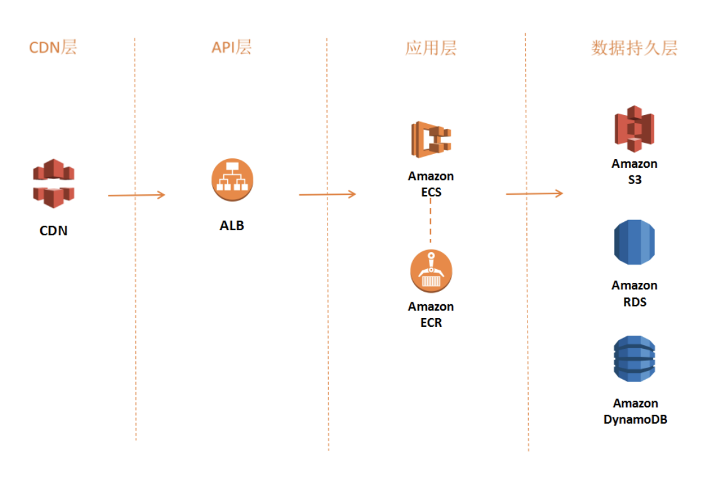
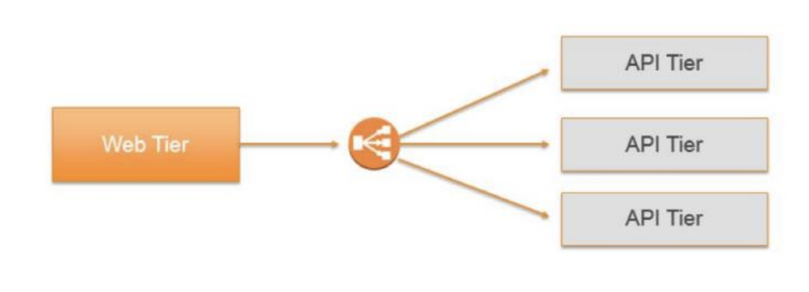
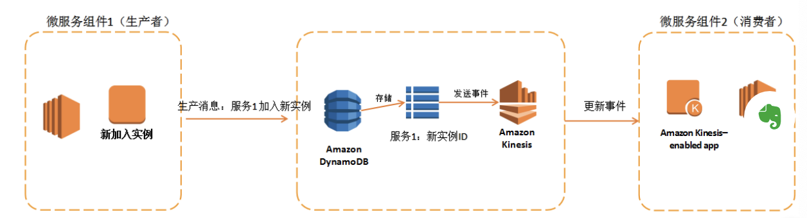
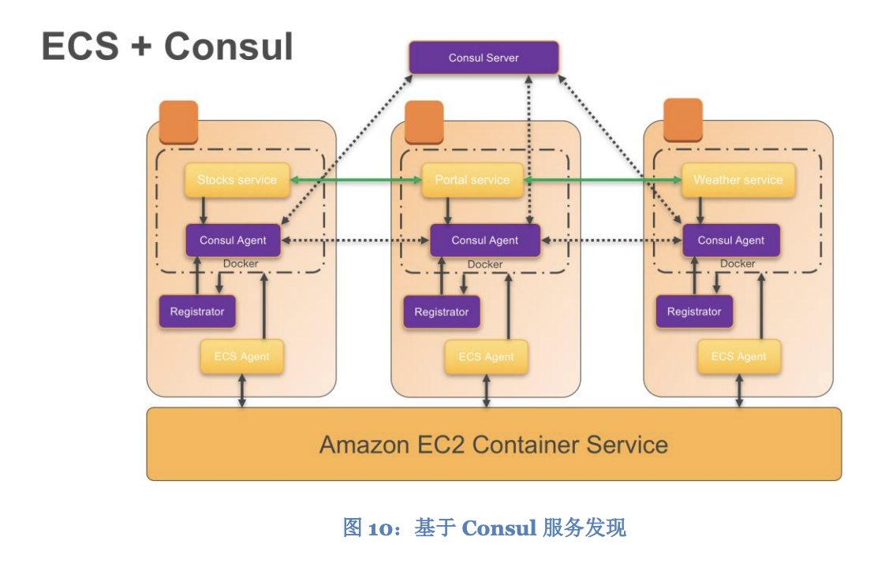

[toc]

# 微服务

微服务是一种软件开发的组织和架构方法，它可以加快软件交付周期、增强创新和自主性，提高软件的可维护性和可伸缩、可扩展性，同时也提高了企业开发和发布软件服务的能力。

使用微服务架构，软件产品将由多个独立的、可通过 API 进行交互的服务组成。这些服务将由各个小团队独自负责。

## 微服务架构特性

* 去中心化

微服务架构是由去中心化数据管理的分布式系统组成。它不依赖中心数据库上统一的数据库模式。每一个服务都有自己独立的数据模型。 去中心化的另一个含义是，每个服务在开发、部署、管理和维护过程中也是 相互独立的，不依赖某个中心系统。 

* 独立

微服务架构中各个服务组件都可以独立进行更改、升级和替换，而不 会影响其他服务组件的正常功能。同样，负责各个服务组件的团队之间也都 是相互独立的，互不干扰的。 

* 专注做好一件事

每个服务组件都是专注于某个问题域的功能集合，一旦某 个服务复杂度到达一定程度，则应该考虑将其进行服务切分或对其进行再次微服务架构。 

* 多语种

微服务并不是“一体通用”的方法，它允许各个团队根据自己的喜 好选择最适合自己问题域的开发语言、开发工具。因此，微服务无论在操作系统、开发语言、数据存储还是工具，都是兼容的。也就是说，微服务是 “多语种”的。

* 黑盒子

微服务中的服务都是按照“黑盒”设计的，也就是说，它们将内部逻辑对外隐藏进来，各个服务间通过定义良好的 API 进行通信，避免了暗含的相互依赖。

* 谁构建，谁运行

通常情况下，在生产环境中，构建了某个服务的团队负责 该服务的运行和维护。这条规则也称之为 DevOps。DevOps 除了能让各个 团队按照自己的安排独立工作外，还可以让开发人员更贴近软件产品的真正 使用者，能帮助他们更好地了解用户的需求。

## 架构复杂度

在传统单体型架构中，所有的复杂度和依赖都存在项目的代码库中。而对于微服务 架构而言，复杂度变成了各个服务间的交互。

在架构上面临的挑战有处理异步通信、连锁故障、数据一致性问题、服务发现和授 权认证等问题。

# 分层构建微服务方案

## CDN

CDN 层 CDN 层的意义在于加速静态和动态资源的传输，并潜在地减轻后端服务器的压 力。

## API

API 层是所有请求的入口，它可以隐藏应用程序的业务逻辑细节，通过诸如 HTTP REST API 接受外部请求。API 层一般还需要对所接收的请求进行流量管理、请求 过滤、缓存及访问授权和控制。您可以使用 Application Load Balancer（ALB）来实现您的 API 层。

## 应用层

应用层实现了具体的应用程序业务逻辑。AWS 提供了多种方式来运行应用程序， 您可以将程序直接部署到 EC2 上、或者使用 Elastic Beanstalk 服务快速构建运行 环境，或者使用无服务器服务 AWS Lambda、当然也可以使用容器管理服务 ECS

## 数据持久层

数据持久层负责将业务中使用到的数据进行存储和管理。将数据管理和持久化单独 封装一层，可以让应用层实现无状态化，从而便于应用层进行水平伸缩扩展和实现 容错机制。

静态数据一般可以存储在 AWS Simple Storage Service（S3）服务上，并通过 AWS CloudFront 进行分发。

会话数据和常用的数据，可以存储在数据缓存中间件中，比如 Memcached 或者 Redis。AWS 提供了 ElasticCache 服务管理这两种缓存服务。

对一致性要求较高的业务数据可以存储在关系型数据库中，AWS Relational Database Service（RDS）服务可以管理六大常见关系型数据库引擎（Microsoft SQL Serve,Oracle,MySQL,MariaDB,PostgreSQL, Amazon Aurora）

关系型数据库不利于伸缩和业务扩展，利用 NoSQL 数据库得到了更好的可扩展 性、可用性和性能。您可以使用 Amazon DynamoDB 创建可以存储任意数据、应 对大量访问的数据库表。DynamoDB 可以将表中数据分布到足够多的服务器上， 以满足高性能、大数据量、大访问量的存储要求。

# 解决微服务架构中的常见问题

## 基于 Application Load Balancer 实现的服务发现

ALB 具有健康检查和服务上线注册下线注销的功能，将这些功能与 DNS 解析服务 相结合，可以低成本地轻松解决服务发现问题。 您可以给每个微服务设置自定义的域名，然后通过一个 CNAME 入口，将这些服 务绑定到某个 Elastic Load Balancer 的 DNS 下。这些服务的 DNS 名将会被发布 给所有需要访问服务的应用程序, 同时结合 ALB 基于路径路由的功能，能够利用 Target Group 和 Path 的结合分发给不同的微服务，节省资源和成本。

## 基于 Key-Value 对存储的服务发现

还可以使用 Key-Value 键值对存储的形式来实现服务发现，虽然这种方式实现 起来需要您花费比其他方式更多的时间，但是它能提供更好的灵活性和扩展性，并 且不用担心 DNS 缓存问题。这种方式天生与客户端负载均衡技术相吻合，客户端 负载均衡可以解决性能瓶颈并简化流量管理。

利用 Amazon DynamoDB 作为 Key-Value 键值存储，并结合 DynamoDB Stream 以生产者消费者模式来实现服务状态更改通知的架构

## 基于第三方开源组件的服务发现

Hadoop 的子项 目 ZooKeeper 或者 Hashicorp 公司的 Consul8, 这种方式的好处在于合理利用了已有的开源社区中的优秀框架来提供基于 Key-Value 的特定服务

Consul 与 ECS 的协同工作, 宿主机将会首先利用 Registrator9的 Agent 在 Docker 启动时将 Consul Agent 注册到 Consul Server，由于 Consul 基于 消息订阅的模型设计，所以其他服务很快收到订阅知道新的组件上线并且能够通过 其 API 了解到其他服务的状态. 

## 数据一致性

