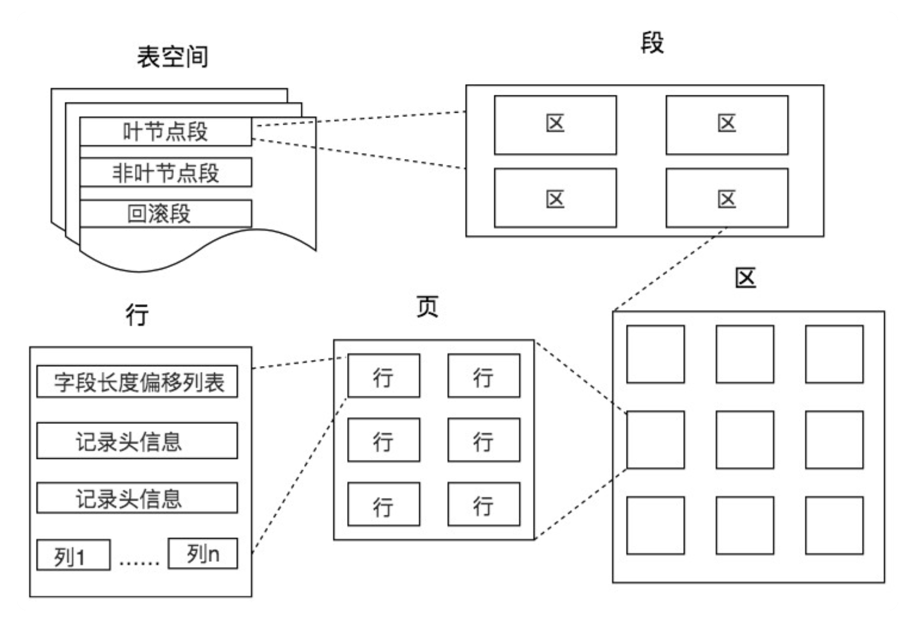
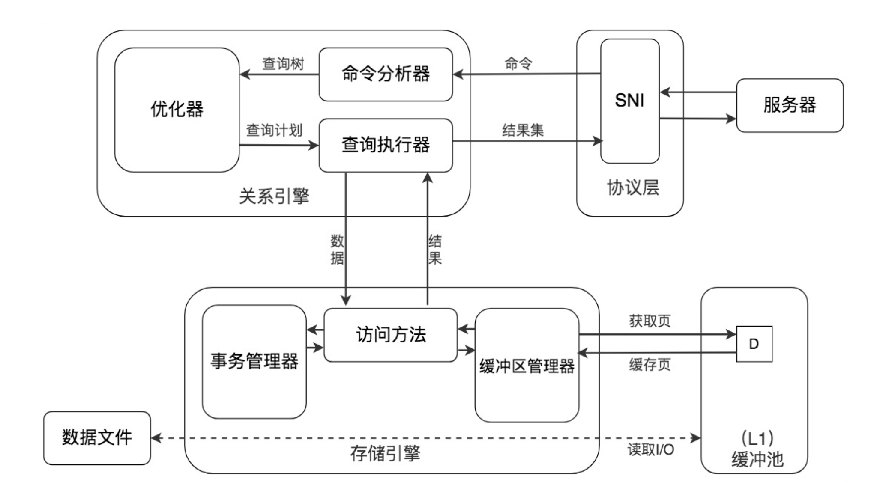
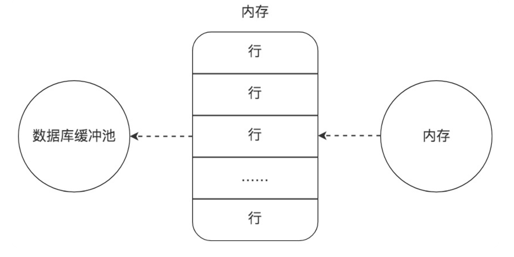
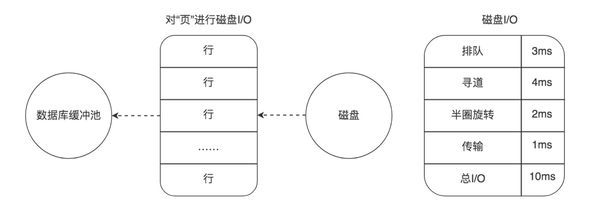

[TOC]


# RDBMS 关系型数据库管理系统

**关系型数据库**又称`为关系型数据库管理系统`(RDBMS),它是利用数据概念实现对数据处理的算法，达到对数据及其快速的增删改查操作


`表单A` 中有一个名为user_id的字段

`表单B` 中也有一个名为user_id的字段

现在我把他们建立一种联系，当我去修改`表单A`的user_id的值时，`表单B` 中的user_id的值也会自动进行修改，因为他们建立的一种`关系`，因为这种关系，使得数据具有一致性


## DB ranking

https://db-engines.com/en/ranking


键值型数据库通过 Key-Value 键值的方式来存储数据，其中 Key 和 Value 可以是简单的对象，也可以是复杂的对象。Key 作为唯一的标识符，优点是查找速度快，在这方面明显优于关系型数据库，同时缺点也很明显，它无法像关系型数据库一样自由使用条件过滤（比如 WHERE），如果你不知道去哪里找数据，就要遍历所有的键，这就会消耗大量的计算。键值型数据库典型的使用场景是作为内容缓存。Redis 是最流行的键值型数据库。

文档型数据库用来管理文档，在数据库中文档作为处理信息的基本单位，一个文档就相当于一条记录，MongoDB 是最流行的文档型数据库。

搜索引擎也是数据库检索中的重要应用，常见的全文搜索引擎有 Elasticsearch、Splunk 和 Solr。虽然关系型数据库采用了索引提升检索效率，但是针对全文索引效率却较低。搜索引擎的优势在于采用了全文搜索的技术，核心原理是“倒排索引”。

列式数据库是相对于行式存储的数据库，Oracle、MySQL、SQL Server 等数据库都是采用的行式存储（Row-based），而列式数据库是将数据按照列存储到数据库中把一列的数据都串起来进行存储，然后再存储下一列。
这样做的好处，就是相邻的数据的数据类型是一样的，因此也更容易压缩。在读取时，可以只读取需要的列到内存中。 这样做的好处是可以大量降低系统的 I/O，适合于分布式文件系统，不足在于功能相对有限。

图形数据库，利用了图这种数据结构存储了实体（对象）之间的关系。最典型的例子就是社交网络中人与人的关系，数据模型主要是以节点和边（关系）来实现，特点在于能高效地解决复杂的关系问题。


# SQL 标准

SQL 有两个重要的标准，分别是 SQL92 和 SQL99，它们分别代表了 92 年和 99 年颁布的 SQL 标准

还存在 SQL-86、SQL-89、SQL:2003、SQL:2008、SQL:2011 和 SQL:2016 等其他的标准。


## 主键

你可以理解为**主要关键字.  主键在当前表单的当前字段是唯一的** 

比如数据库通常都是在第一个字段是 `ID`，这个通常就是一个主键，它默认会自增长。它在名为`ID`的字段下是不会重复的，每行的值与其他行的值不会重复。


### 优化

尽量避免字符字段作为主键


## 外键 

主要用于两个表直接的关联, 必须使用InnoDB 表引擎

外键可以方便的解决数据关联和一致性的问题，但是由于目前互联网数据流量很大，一般在中间层实现约束和控制，尤其是面向Web 应用，


用于A表存储B表的主键值以便和B表建立联系的关系字段

比如我现在有一个名为`A` 和 `B` 的表单，在`A` 中有一个名为 **username**的字段，在`B`中有一个名为**user_email**的字段，这时**username去关联user_emai**l的字段，这时的**username**字段就叫做**外键.**


user 表：id 为主键

profile 表： uid 为主键

简单来说，若表 profile 的 uid 列 作为表外键（外建名称：user_profile），以表 user 做为主表，以其 id列 做为参照（references），且联动删除/更新操作（on delete/update cascade）。则 user表 中删除 id 为 1 的记录，会联动删除 profile 中 uid 为 1 的记录。user 表中更新 id 为 1 的记录至 id 为 2，则profile 表中 uid 为 1 的记录也会被联动更新至 uid 为 2，这样即保持了数据的完整性和一致性。


## 索引

把表中的特殊数据提取出来

利用一定的算法方法，对专门的字段进行优化，使其加快查询速率。


# 数据库

一份好的 SQL 执行计划就会尽量减少 I/O 操作，因为 I/O 是 DBMS 最容易出现瓶颈的地方，可以说数据库操作中有大量的时间都花在了 I/O 上

在 SQL 语句中使用 GROUP BY、ORDER BY 等这些语句会消耗大量的 CPU 计算资源，因此我们需要从全局出发，不仅需要考虑数据库的 I/O 性能，还需要考虑 CPU 计算、内存使用情况等


## DDL 定义语言

Data Definition Language，也就是数据定义语言，它用来定义我们的数据库对象，包括数据库、数据表和列。通过使用 DDL，我们可以创建，删除和修改数据库和表结构。


## DML 操作语言

Data Manipulation Language，数据操作语言，我们用它操作和数据库相关的记录，比如增加、删除、修改数据表中的记录。


## DCL 控制语言

Data Control Language，数据控制语言，我们用它来定义访问权限和安全级别。


## DQL 查询语言

Data Query Language，数据查询语言，我们用它查询想要的记录，它是 SQL 语言的重中之重。在实际的业务中，我们绝大多数情况下都是在和查询打交道，因此学会编写正确且高效的查询语句，是学习的重点。


## 模式 schema

用于定义表结构信息


## 表 table

存储数据的特定结构


## 列/字段 (column/field)

表中的列，存储一系列特定的数据，列组成表


## 行/记录 (row/record)

表中的行，代表一条记录


## 标量 scalar 

指单一数据，与之相对的是集合collection


# 数据表设计原则

1.数据表的个数越少越好RDBMS 的核心在于对实体和联系的定义，也就是 E-R 图（Entity Relationship Diagram），数据表越少，证明实体和联系设计得越简洁，既方便理解又方便操作。

2.数据表中的字段个数越少越好字段个数越多，数据冗余的可能性越大。设置字段个数少的前提是各个字段相互独立，而不是某个字段的取值可以由其他字段计算出来。当然字段个数少是相对的，我们通常会在数据冗余和检索效率中进行平衡。

3.数据表中联合主键的字段个数越少越好设置主键是为了确定唯一性，当一个字段无法确定唯一性的时候，就需要采用联合主键的方式（也就是用多个字段来定义一个主键）。联合主键中的字段越多，占用的索引空间越大，不仅会加大理解难度，还会增加运行时间和索引空间，因此联合主键的字段个数越少越好。

4.使用主键和外键越多越好数据库的设计实际上就是定义各种表，以及各种字段之间的关系。超大型的数据应用场景，大量的插入，更新和删除在外键的约束下会降低性能，同时数据库在水平拆分和分库的情况下，数据库端也做不到执行外键约束。另外，在高并发的情况下，外键的存在也会造成额外的开销。因为每次更新数据，都需要检查另外一张表的数据，也容易造成死锁。


# 设计范式

在设计关系型数据库模型的时候，需要对关系内部各个属性之间联系的合理化程度进行定义，这就有了不同等级的规范要求，这些规范要求被称为范式（NF）。你可以把范式理解为，一张数据表的设计结构需要满足的某种设计标准的级别。


目前关系型数据库一共有 6 种范式，按照范式级别，从低到高分别是：1NF（第一范式）、2NF（第二范式）、3NF（第三范式）、BCNF（巴斯 - 科德范式）、4NF（第四范式）和 5NF（第五范式，又叫做完美范式）

数据库的范式设计越高阶，冗余度就越低，同时高阶的范式一定符合低阶范式的要求，比如满足 2NF 的一定满足 1NF，满足 3NF 的一定满足 2NF，依次类推


1NF 指的是数据库表中的任何属性都是原子性的，不可再分。这很好理解，我们在设计某个字段的时候，对于字段 X 来说，就不能把字段 X 拆分成字段 X-1 和字段 X-2。事实上，任何的 DBMS 都会满足第一范式的要求，不会将字段进行拆分

2NF 指的数据表里的非主属性都要和这个数据表的候选键有完全依赖关系。所谓完全依赖不同于部分依赖，也就是不能仅依赖候选键的一部分属性，而必须依赖全部属性。

3NF 在满足 2NF 的同时，对任何非主属性都不传递依赖于候选键。也就是说不能存在非主属性 A 依赖于非主属性 B，非主属性 B 依赖于候选键的情况。


数据库设计三重境：
第一重：山无棱，天地合，乃敢与君绝。（1NF：列的原子性，不可拆分）
第二重：玲珑骰子安红豆，入骨相思知不知。（2NF：完全性, 针对于联合主键，非主属性完全依赖于联合主键，而非部分）
第三重：问世间，情为何物，直教人生死相许？（3NF：直接性, 即非主属性只能直接依赖于主键）


姓名，年龄分开就是一范
加个id 就二范
加个foreign key 就三范
三降二 通过冗余字断提效率性能，取了个装x 的名字叫反范式。
其它的范式，没事别管，不论是开发效率，还是查询效率都很感人。
需要时google 下


## 反范式设计

尽管围绕着数据表的设计有很多范式，但事实上，我们在设计数据表的时候却不一定要参照这些标准。

越高阶的范式得到的数据表越多，数据冗余度越低。但有时候，我们在设计数据表的时候，还需要为了性能和读取效率违反范式化的原则。反范式就是相对范式化而言的，换句话说，就是允许少量的冗余，通过空间来换时间。


想对查询效率进行优化，有时候反范式优化也是一种优化思路


反范式优化也常用在数据仓库的设计中，因为数据仓库通常存储历史数据，对增删改的实时性要求不强，对历史数据的分析需求强。这时适当允许数据的冗余度，更方便进行数据分析

数据库设计需要尽量避免冗余，但为了提高查询效率也允许一定的冗余度，而数据仓库在设计上更偏向采用反范式设计。


# 数据库存储结构

在数据库中，不论读一行，还是读多行，都是将这些行所在的页进行加载。也就是说，数据库管理存储空间的基本单位是页

一个页中可以存储多个行记录（Row），同时在数据库中，还存在着区（Extent）、段（Segment）和表空间（Tablespace）。行、页、区、段、表空间的关系如下图




## Extent

区（Extent）是比页大一级的存储结构，在 InnoDB 存储引擎中，一个区会分配 64 个连续的页。因为 InnoDB 中的页大小默认是 16KB，所以一个区的大小是 64*16KB=1MB


## Segment

段（Segment）由一个或多个区组成，区在文件系统是一个连续分配的空间（在 InnoDB 中是连续的 64 个页），不过在段中不要求区与区之间是相邻的。段是数据库中的分配单位，不同类型的数据库对象以不同的段形式存在。当我们创建数据表、索引的时候，就会相应创建对应的段，比如创建一张表时会创建一个表段，创建一个索引时会创建一个索引段。


## Tablespace

表空间（Tablespace）是一个逻辑容器，表空间存储的对象是段，在一个表空间中可以有一个或多个段，但是一个段只能属于一个表空间。数据库由一个或多个表空间组成，表空间从管理上可以划分为系统表空间、用户表空间、撤销表空间、临时表空间等。


## Page

页（Page）如果按类型划分的话，常见的有数据页（保存 B+ 树节点）、系统页、Undo 页和事务数据页等。数据页是我们最常使用的页。

比如在 MySQL 的 InnoDB 存储引擎中，默认页的大小是 16KB

```
mysql> show variables like '%innodb_page_size%';
```


数据库 I/O 操作的最小单位是页，与数据库相关的内容都会存储在页结构里。

数据页包括七个部分，分别是文件头（File Header）、页头（Page Header）、最大最小记录（Infimum+supremum）、用户记录（User Records）、空闲空间（Free Space）、页目录（Page Directory）和文件尾（File Tailer）


采用链表的结构让数据页之间不需要是物理上的连续，而是逻辑上的连续


# MySQL

与MariaDB的接口基本兼容

使用插件式存储引擎

单进程多线程的模型（连接线程和守护线程）


## 逻辑架构划分

### Server 层

包含连接器，查询缓存，分析器，优化器，执行器等，以及所有的内置函数（时间，日期，数学和加密函数等）

所有跨存储引擎的功能都在这一层体现，比如存储过程，触发器，视图等


#### 连接器

负责和客户端建立连接，获取权限，维持和管理连接，如

```
mysql -h$ip -P$port -u$user -p
```

连接器会到权限表里面查出你拥有的权限。用户一旦成功建立连接，也不会影响已经存在的连接权限

```
MariaDB [(none)]> show processlist\G;
*************************** 1. row ***************************
      Id: 75
    User: root
    Host: localhost
      db: NULL
 Command: Query
    Time: 0
   State: NULL
    Info: show processlist
Progress: 0.000
1 row in set (0.00 sec)
```

> 客户端长时间没有动静，Command会显示Sleep，自动断开连接
>
> 默认8小时，由参数wait_timeout控制


避免长连接期间，执行过程中因临时使用内存导致内存增长过快，因为资源会在连接断开的时候才释放，可以在mysql5.7之后的新版本执行

```
mysql_reset_connection
```

从而初始化连接资源，此过程不需要重连接和重新做权限认证


#### 查询缓存（不建议使用）

查询缓存是提前把查询结果缓存起来，这样下次就不需要执行可以直接拿到结果。需要说明的是，在MySQL中的查询缓存，不是缓存查询计划，而是查询及对应的查询结果。这就意味着查询匹配的鲁棒性大大降低，只有相同的查询操作才会命中查询缓存。因此在MySQL的查询缓存命中率不高，在MySQL8.0版本中已经弃用了查询缓存功能。


#### 分析器 （做什么）

SQL命令传递到解析器的时候会被解析器验证和解析

如果没有命中查询缓存，分析器会对语句做词法分析，根据语法规则做判断


#### 优化器 （怎么做）

SQL语句在查询之前会使用查询优化器对查询进行优化

优化器是在表里面有多个索引的时候，决定使用哪个索引，或者在一个语句有多个关联（join）的时候，决定各个表的连接顺序


#### 执行器 （执行）

执行SQL 语句

慢查询日志中 `rows_examined` 表示语句执行过程中描述了多少行， 这个值在执行器每次调用引擎获取数据行的时候累加


### 存储引擎层

存储引擎层，存储引擎真正的负责了MySQL中数据的存储和提取，服务器通过API与存储引擎进行通信。不同的存储引擎具有的功能不同，这样我们可以根据自己的实际需要进行选取。

负责数据的存储和读取，其架构模式是插件式的，支持InnoDB，MyISAM，Memory等多个存储引擎


# Hello World

profiling 是否开启，开启它可以让 MySQL 收集在 SQL 执行时所使用的资源情况，

```
mysql> select @@profiling;
+-------------+
| @@profiling |
+-------------+
|           0 |
+-------------+
1 row in set, 1 warning (0.00 sec)
```


profiling=0 代表关闭，我们需要把 profiling 打开，即设置为 1

```
mysql> set profiling=1;
```


查看到语句的执行时间

```
mysql> show profiles;
+----------+------------+--------------------------+
| Query_ID | Duration   | Query                    |
+----------+------------+--------------------------+
|        1 | 0.00092575 | select @@profiling       |
|        2 | 0.00438100 | show databases           |
|        3 | 0.00211300 | create database rxu_test |
|        4 | 0.00151725 | SELECT DATABASE()        |
|        5 | 0.00224000 | show databases           |
|        6 | 0.00063400 | show tables              |
+----------+------------+--------------------------+
6 rows in set, 1 warning (0.00 sec)
```


查询指定语句的执行时间

```
mysql> show profile for query 3;
+----------------------+----------+
| Status               | Duration |
+----------------------+----------+
| starting             | 0.000490 |
| checking permissions | 0.001193 |
| query end            | 0.000013 |
| closing tables       | 0.000025 |
| freeing items        | 0.000289 |
| cleaning up          | 0.000103 |
+----------------------+----------+
6 rows in set, 1 warning (0.00 sec)
```


```
DROP TABLE IF EXISTS `player`;
CREATE TABLE `player`  (
  `player_id` int(11) NOT NULL AUTO_INCREMENT,
  `team_id` int(11) NOT NULL,
  `player_name` varchar(255) CHARACTER SET utf8 COLLATE utf8_general_ci NOT NULL,
  `height` float(3, 2) NULL DEFAULT 0.00,
  PRIMARY KEY (`player_id`) USING BTREE,
  UNIQUE INDEX `player_name`(`player_name`) USING BTREE
) ENGINE = InnoDB CHARACTER SET = utf8 COLLATE = utf8_general_ci ROW_FORMAT = Dynamic;
```

> 数据表和字段都使用了反引号，这是为了避免它们的名称与 MySQL 保留字段相同，对数据表和字段名称都加上了反引号。
>
> player_name 字段的字符编码是 utf8，排序规则是utf8_general_ci，代表对大小写不敏感，如果设置为utf8_bin，代表对大小写敏感
>
> player_id 设置为了主键，因此在 DDL 中使用PRIMARY KEY进行规定，同时索引方法采用 BTREE


## 随机代码

用户表随机生成 100 万用户

这个数据集都是百万条记录的，如果直接导入MySQL比较慢。如果先做以下设置会大大提高导入的速度：

```
SET GLOBAL unique_checks=0;
SET GLOBAL innodb_flush_log_at_trx_commit=0;
SET GLOBAL sync_binlog=0;
```


```

CREATE DEFINER=`root`@`localhost` PROCEDURE `insert_many_user`(IN start INT(10), IN max_num INT(10))
BEGIN
DECLARE i INT DEFAULT 0;
DECLARE date_start DATETIME DEFAULT ('2017-01-01 00:00:00');
DECLARE date_temp DATETIME;
SET date_temp = date_start;
SET autocommit=0;
REPEAT
SET i=i+1;
SET date_temp = date_add(date_temp, interval RAND()*60 second);
INSERT INTO user(user_id, user_name, create_time)
VALUES((start+i), CONCAT('user_',i), date_temp);
UNTIL i = max_num
END REPEAT;
COMMIT;
END
```


# 约束


## 主键约束

主键起的作用是唯一标识一条记录，不能重复，不能为空，即 UNIQUE+NOT NULL。一个数据表的主键只能有一个。主键可以是一个字段，也可以由多个字段复合组成。


## 外键约束

外键确保了表与表之间引用的完整性。一个表中的外键对应另一张表的主键。外键可以是重复的，也可以为空


## 唯一性约束

唯一性约束表明了字段在表中的数值是唯一的，即使我们已经有了主键，还可以对其他字段进行唯一性约束

比如我们在 player 表中给 player_name 设置唯一性约束，就表明任何两个球员的姓名不能相同。需要注意的是，唯一性约束和普通索引（NORMAL INDEX）之间是有区别的。唯一性约束相当于创建了一个约束和普通索引，目的是保证字段的正确性，而普通索引只是提升数据检索的速度，并不对字段的唯一性进行约束。


### NOT NULL 

对字段定义了 NOT NULL，即表明该字段不应为空，必须有取值。


### DEFAULT

表明了字段的默认值。如果在插入数据的时候，这个字段没有取值，就设置为默认值。比如我们将身高 height 字段的取值默认设置为 0.00，即DEFAULT 0.00。


### CHECK 

用来检查特定字段取值范围的有效性，CHECK 约束的结果不能为 FALSE，比如我们可以对身高 height 的数值进行 CHECK 约束，必须≥0，且＜3，即CHECK(height>=0 AND height<3)


# 数据库缓冲池

为什么要使用缓冲池技术呢，这时因为InnoDB存储引擎是基于磁盘文件存储的，我们在访问物理硬盘和在内存中进行访问速度相差很大，为了尽可能弥补这中间的IO效率鸿沟，我们就需要把经常使用的数据加载到缓冲池中，避免每次访问都进行磁盘IO，从而提升数据库整体的访问性能。所以说“频次X位置”的原则，帮我们对IO访问效率进行了优化

磁盘 I/O 需要消耗的时间很多，而在内存中进行操作，效率则会高很多，为了能让数据表或者索引中的数据随时被我们所用，DBMS 会申请占用内存来作为数据缓冲池，这样做的好处是可以让磁盘活动最小化，从而减少与磁盘直接进行 I/O 的时间。

缓冲池管理器会尽量将经常使用的数据保存起来，在数据库进行页面读操作的时候，首先会判断该页面是否在缓冲池中，如果存在就直接读取，如果不存在，就会通过内存或磁盘将页面存放到缓冲池中再进行读取。





实际上，当我们对数据库中的记录进行修改的时候，首先会修改缓冲池中页里面的记录信息，然后数据库会以一定的频率刷新到磁盘上。注意并不是每次发生更新操作，都会立刻进行磁盘回写。缓冲池会采用一种叫做 checkpoint 的机制将数据回写到磁盘上，这样做的好处就是提升了数据库的整体性能。

比如，当缓冲池不够用时，需要释放掉一些不常用的页，就可以采用强行采用 checkpoint 的方式，将不常用的脏页回写到磁盘上，然后再从缓冲池中将这些页释放掉。这里脏页（dirty page）指的是缓冲池中被修改过的页，与磁盘上的数据页不一致。


## 缓冲池操作

```
mysql> show variables like 'innodb_buffer_pool_size';
+-------------------------+-----------+
| Variable_name           | Value     |
+-------------------------+-----------+
| innodb_buffer_pool_size | 134217728 |
+-------------------------+-----------+
1 row in set (0.09 sec)
```

>  134217728/1024/1024=128MB


```
mysql> set global innodb_buffer_pool_size = 268435456;
Query OK, 0 rows affected (0.00 sec)

mysql> show variables like 'innodb_buffer_pool_size';
+-------------------------+-----------+
| Variable_name           | Value     |
+-------------------------+-----------+
| innodb_buffer_pool_size | 268435456 |
+-------------------------+-----------+
1 row in set (0.01 sec)
```

> mysql 8.8 默认128MB，无法向下修改


同时开启多个缓冲池

```
mysql> show variables like 'innodb_buffer_pool_instances';
+------------------------------+-------+
| Variable_name                | Value |
+------------------------------+-------+
| innodb_buffer_pool_instances | 1     |
+------------------------------+-------+
1 row in set (0.01 sec)
```

> 如果想要开启多个缓冲池，你首先需要将innodb_buffer_pool_size参数设置为大于等于 1GB，这时innodb_buffer_pool_instances才会大于 1。
>
> 你可以在 MySQL 的配置文件中对innodb_buffer_pool_size进行设置，大于等于 1GB，然后再针对innodb_buffer_pool_instances参数进行修改。


## 缓冲池效率

位置决定效率。如果页就在数据库缓冲池中，那么效率是最高的，否则还需要从内存或者磁盘中进行读取，当然针对单个页的读取来说，如果页存在于内存中，会比在磁盘中读取效率高很多。


批量决定效率。如果我们从磁盘中对单一页进行随机读，那么效率是很低的（差不多 10ms），而采用顺序读取的方式，批量对页进行读取，平均一页的读取效率就会提升很多，甚至要快于单个页面在内存中的随机读取。


## 内存读取方式

如果该数据存在于内存中，基本上执行时间在 1ms 左右，效率还是很高的。




## 随机读取方式

如果数据没有在内存中，就需要在磁盘上对该页进行查找，整体时间预估在 10ms 左右，这 10ms 中有 6ms 是磁盘的实际繁忙时间（包括了寻道和半圈旋转时间），有 3ms 是对可能发生的排队时间的估计值，另外还有 1ms 的传输时间，将页从磁盘服务器缓冲区传输到数据库缓冲区中。这 10ms 看起来很快，但实际上对于数据库来说消耗的时间已经非常长了，因为这还只是一个页的读取时间。




## 顺序读取方式

顺序读取其实是一种批量读取的方式，因为我们请求的数据在磁盘上往往都是相邻存储的，顺序读取可以帮我们批量读取页面，这样的话，一次性加载到缓冲池中就不需要再对其他页面单独进行磁盘 I/O 操作了。如果一个磁盘的吞吐量是 40MB/S，那么对于一个 16KB 大小的页来说，一次可以顺序读取 2560（40MB/16KB）个页，相当于一个页的读取时间为 0.4ms。采用批量读取的方式，即使是从磁盘上进行读取，效率也比从内存中只单独读取一个页的效率要高。


# MySQL 安装部署


## docker

* 启动

```
docker run --name some-mysql -p 3306:3306 -e MYSQL_ROOT_PASSWORD='123456' -d mysql:latest
```


```
#!/bin/bash
cur_dir=`pwd`
docker stop example-mysql
docker rm example-mysql
docker run --name example-mysql -v ${cur_dir}/conf:/etc/mysql/conf.d -v ${cur_dir}/data:/var/lib/mysql -p 3306:3306 -e MYSQL_ROOT_PASSWORD=1
234@abcd -d mysql:latest
```


* 访问

```
mysql -uroot -p123456 -h 127.0.0.1 -P3306
```

# 


## 配置文件

集中式的配置文件，能够为mysql的各应用程序提供配置信息

```
[mysqld]
[mysql_safe] 线程安全的mysql配置
[mysqld_multi] 多实例模型的mysql，共享的参数在这里
[server]
[mysql]
[mysqldump] 备份
[client]
```


### 查找路径

依次找到，越靠后，越是最终生效的

```
/etc/my.cnf -> /etc/mysql/my.cnf -> $MYSQL_HOME/my.cnf -> --default-extra-file=/path/to/somedir/my.cnf -> ~/.my.cnf
```


## 安装后设定

```
mysql_secure_installation
```


设置root密码

```
mysql> SET PASSWORD;
or
mysql> update mysql.user SET password=PASSWORD('your pass') WHERE cluase;
mysql> flush privileges;
```


删除匿名用户

```
mysql> DROP USER ''@'localhost';
```


关闭主机名反解

```
skip name resolve
```


## 客户端程序

### mysql

命令行工具

#### 可用选项

```
-u, --user=
-h, --host=
-p, --password=
-P, --port=
--protocol={tcp|sock}
-S, --socket=
-D, --database=  #指定数据库
-C, --compress=  #压缩
```

```
mysql -e "SQL" #在非交互模式中，指定SQL指令并返回
```


#### 脚本模式操作

```
$ mysql -uUSERNAME -hHOST -pPASSWORD < /path/from/somefile.sql
or 
mysql> source /path/from/somefile.sql
```


#### 免密码

方式一 `my.cnf`增加`[client]`标签

```
[client] 
user="root" 
password="你的密码"
单对定义不同的客户端
```

```
[mysql] # 这个是给/usr/loca/mysql/bin/mysql 使用的
user=root
password="你的密码"

[mysqladmin] # 这个是给/usr/local/mysql/bin/mysqladmin使用的
user=root
password="你的密码"
```

> 每个不同的客户端需要定义不同的标签，使用`[client]`可以统一


方式二 `login-path`

```
shell> mysql_config_editor set -G vm1 -S /tmp/mysql.sock -u root -p
Enter password [输入root的密码]

shell> mysql_config_editor print --all
[vm1]
user=root
password=*****
socket=/tmp/mysql.sock

#login

shell> mysql --login-path=vm1 # 这样登录就不需要密码，且文件二进制存储 ,位置是 ~/.mylogin.cnf
```

> 该方式相对安全。如果server被黑了，该二进制文件还是会被破解


方式三 `~/.my.cnf`, 自己当前家目录

```
#Filename: ~/.my.cnf

[client]
user="root"
password="你的密码"
```


### mysqldump 

备份工具，基于mysql协议想mysqld发起查询请求，并将查到的所有数据转换成insert等写操作语句保存到文本文件中


### mysqladmin

基于mysql协议管理mysqld


### mysqlimport

数据导入工具


## 程序默认使用的配置

```
mysql --print-defaults
or
mysqld --print-defaults
```


## 服务器端 mysqld 


### 获取参数列表

```
mysql --help --verbose
```


### 服务器参数及其值

有些参数支持运行时修改，会立即生效；

有些参数不支持，且只能通过修改配置文件，并重启服务器程序生效

```
mysql> SHOW GLOBAL VARIABLES:
mysql> SHOW SESSION VARIABLES;
```

> 有些参数作用域是全局的，且不可改变
>
> 有些可以为每个用户提供单独的配置


### 修改服务器变量的值

```
mysql> help SET
```


* 全局

```
mysql> SET GLOBAL system_var_name=value;
mysql> SET @@global.system_var_name=value;
```


* 会话

```
mysql> SET [SESSION] system_var_name=value;
mysql> SET @@[session.]system_var_name=value;
```


### 状态变量

用于保存mysqld运行中统计数据的变量

```
mysql> SHOW GLOBAL STATUS;
mysql> SHOW [SESSION] STATUS;
```


# UTF-8 模式

* 设置utf-8

MySQL的配置文件默认存放在`/etc/my.cnf`或者`/etc/mysql/my.cnf`：

```
[client]
default-character-set = utf8

[mysqld]
default-storage-engine = INNODB
character-set-server = utf8
character-set-client = utf8
collation-server = utf8_general_ci
```


* 显示utf-8

```
mysql> show variables like '%char%';
+--------------------------+----------------------------+
| Variable_name            | Value                      |
+--------------------------+----------------------------+
| character_set_client     | utf8                       |
| character_set_connection | utf8                       |
| character_set_database   | utf8                       |
| character_set_filesystem | binary                     |
| character_set_results    | utf8                       |
| character_set_server     | utf8                       |
| character_set_system     | utf8                       |
| character_sets_dir       | /usr/share/mysql/charsets/ |
+--------------------------+----------------------------+
8 rows in set (0.00 sec)
```


* 查看源库字符集

```
show create database mydb;
```


* 修改已生成库表字符集

```
alter database mydb character set 'utf8';

alter table mytbl convert to character set 'utf8';
```

> 若原有数据是非UTF8编码，数据本身不会发生改变


# sql执行周期


## 开启功能

```
show variables like '%profiling%';

set profiling=1;
```


显示最近的几次查询

```
show profiles;
```


查看程序执行步骤

```
show profile cpu,block io for query 5;
```


# 并发控制

## 锁分类

### 隐式锁 （ 推荐）

有存储引擎自动施加的锁， 推荐使用

### 显式锁

手动添加的锁，如LOCK TABLES


## 锁控制

### 读锁

共享锁


### 写锁

独占锁


## 锁粒度


### 表级锁

用户可以显示请求， 但不建议手动显示请求施加写操作


### 行级锁


### 锁策略

在锁粒度及数据安全性寻求的平衡机制

每种存储引擎都可以自行实现其锁策略和锁粒度

MySQL在服务器级也实现了锁


#### 方法一

语法

```
LOCK TABLES tbl_name [[AS] alias] lock_type [, tbl_name [[AS] alias] lock_type]
```

```
UNLOCK TABLES
```


* lock_type

```
READ [LOCAL] | [LOW_PRIORITY] WRITE
```


```
LOCK TABLES students READ;
UNLOCK TABLES;
LOCK TABLES students WRITE;
```


#### 方法二

```
FLUSH TABLES tb_name[,...] [WITH READ LOCK]
```


#### 方法三

```
SELECT class [FOR UPDATE] [WITH READ LOCK]
```


# 优化 EXPLAIN

## 数据过多

分库分表


## 关联了太多表，太多join

sql 优化


## 建立索引机制


## 服务器调优

调整my.cnf


# 监控mysql状态


## show processlist

查询所有用户的操作

出现异常就kill掉

