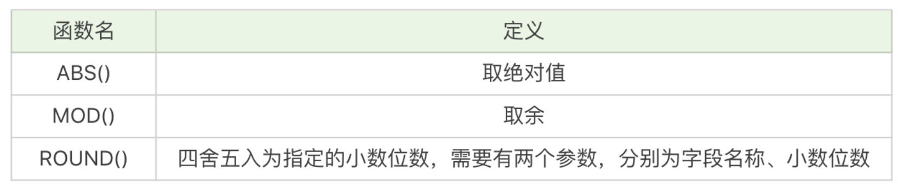
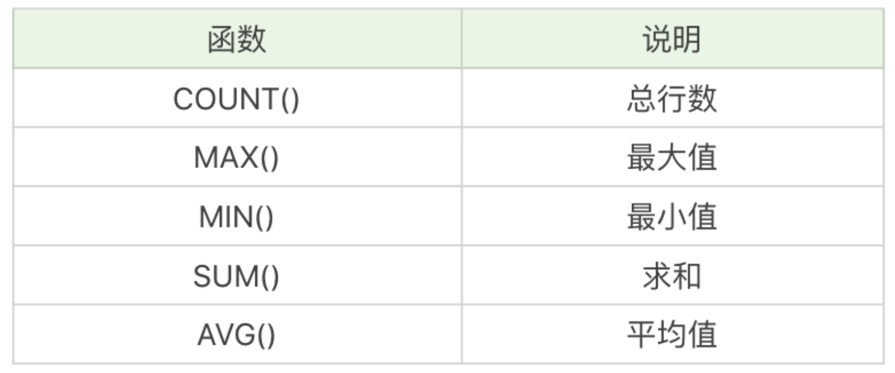

[toc]


# 函数

大部分 DBMS 会有自己特定的函数，这就意味着采用 SQL 函数的代码可移植性是很差的，因此在使用函数的时候需要特别注意。


## 算术函数



```
SELECT ABS(-2)，运行结果为 2。
SELECT MOD(101,3)，运行结果 2。
SELECT ROUND(37.25,1)，运行结果 37.3。
```


## 字符串函数


```
SELECT CONCAT('abc', 123)，运行结果为 abc123。
SELECT LENGTH('你好')，运行结果为 6。
SELECT CHAR_LENGTH('你好')，运行结果为 2。
SELECT LOWER('ABC')，运行结果为 abc。
SELECT UPPER('abc')，运行结果 ABC。
SELECT REPLACE('fabcd', 'abc', 123)，运行结果为 f123d。
SELECT SUBSTRING('fabcd', 1,3)，运行结果为 fab。
```


## 日期函数


```
SELECT CURRENT_DATE()，运行结果为 2019-04-03。
SELECT CURRENT_TIME()，运行结果为 21:26:34。
SELECT CURRENT_TIMESTAMP()，运行结果为 2019-04-03 21:26:34。
SELECT EXTRACT(YEAR FROM '2019-04-03')，运行结果为 2019。
SELECT DATE('2019-04-01 12:00:05')，运行结果为 2019-04-01。
```


## 转换函数


```
SELECT CAST(123.123 AS INT)，运行结果会报错。
SELECT CAST(123.123 AS DECIMAL(8,2))，运行结果为 123.12。
SELECT COALESCE(null,1,2)，运行结果为 1。
```


## 聚集函数




```
SELECT COUNT(role_assist) FROM heros WHERE hp_max > 6000;
```


```
SELECT MIN(CONVERT(name USING gbk)), MAX(CONVERT(name USING gbk)) FROM heros;
```


HAVING 的作用和 WHERE 一样，都是起到过滤的作用，只不过 WHERE 是用于数据行，而 HAVING 则作用于分组

```
SELECT COUNT(*) as num, role_main, role_assist FROM heros GROUP BY role_main, role_assist HAVING num > 5 ORDER BY num DESC
```


