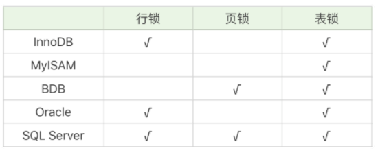

[toc]


# 锁

加锁是为了保证数据的一致性，这个思想在程序开发领域中同样很重要。

在程序开发中也会存在多线程同步的问题。当多个线程并发访问某个数据的时候，尤其是针对一些敏感的数据（比如订单、金额等），我们就需要保证这个数据在任何时刻最多只有一个线程在进行访问，保证数据的完整性和一致性。


## 锁粒度

锁用来对数据进行锁定，我们可以从锁定对象的粒度大小来对锁进行划分，分别为行锁、页锁和表锁。




### 行锁

行锁就是按照行的粒度对数据进行锁定。锁定力度小，发生锁冲突概率低，可以实现的并发度高，但是对于锁的开销比较大，加锁会比较慢，容易出现死锁情况。


#### 死锁

两个或者多个事物在一组资源上相互占用，并请求锁定对方占用的资源的状态。


### 页锁

页锁就是在页的粒度上进行锁定，锁定的数据资源比行锁要多，因为一个页中可以有多个行记录。当我们使用页锁的时候，会出现数据浪费的现象，但这样的浪费最多也就是一个页上的数据行。页锁的开销介于表锁和行锁之间，会出现死锁。锁定粒度介于表锁和行锁之间，并发度一般。


### 表锁

表锁就是对数据表进行锁定，锁定粒度很大，同时发生锁冲突的概率也会较高，数据访问的并发度低。不过好处在于对锁的使用开销小，加锁会很快。


## 数据库管理的角度

除了按照锁粒度大小对锁进行划分外，我们还可以从数据库管理的角度对锁进行划分


### 共享锁

共享锁也叫读锁或 S 锁，共享锁锁定的资源可以被其他用户读取，但不能修改。在进行SELECT的时候，会将对象进行共享锁锁定，当数据读取完毕之后，就会释放共享锁，这样就可以保证数据在读取时不被修改。


```
LOCK TABLE product_comment READ;
```

> product_comment 在表上加共享锁


对表上的共享锁进行解锁，可以使用下面这行命令

```
UNLOCK TABLE;
```


```
SELECT comment_id, product_id, comment_text, user_id FROM product_comment WHERE user_id = 912178 LOCK IN SHARE MODE
```

> 对 user_id=912178 的数据行加上共享锁


### 排它锁

排它锁也叫独占锁、写锁或 X 锁。排它锁锁定的数据只允许进行锁定操作的事务使用，其他事务无法对已锁定的数据进行查询或修改。

当我们对数据进行更新的时候，也就是INSERT、DELETE或者UPDATE的时候，数据库也会自动使用排它锁，防止其他事务对该数据行进行操作


```
LOCK TABLE product_comment WRITE;
```

> 给 product_comment 数据表添加排它锁


释放掉排它锁，使用这行命令即可

```
UNLOCK TABLE;
```


```
SELECT comment_id, product_id, comment_text, user_id FROM product_comment WHERE user_id = 912178 FOR UPDATE;
```

> 针对 user_id=912178 的数据行添加排它锁


### 意向锁

意向锁（Intent Lock），简单来说就是给更大一级别的空间示意里面是否已经上过锁。


返回数据表的场景，如果我们给某一行数据加上了排它锁，数据库会自动给更大一级的空间，比如数据页或数据表加上意向锁，告诉其他人这个数据页或数据表已经有人上过排它锁了，这样当其他人想要获取数据表排它锁的时候，只需要了解是否有人已经获取了这个数据表的意向排他锁即可。


## 程序员的角度

分成乐观锁和悲观锁，从名字中也可以看出这两种锁是两种看待数据并发的思维方式。


### 乐观锁

乐观锁（Optimistic Locking）认为对同一数据的并发操作不会总发生，属于小概率事件，不用每次都对数据上锁，也就是不采用数据库自身的锁机制，而是通过程序来实现。

在程序上，我们可以采用版本号机制或者时间戳机制实现。

当我们修改了代码进行提交时，首先会检查当前版本号与服务器上的版本号是否一致，如果一致就可以直接提交，如果不一致就需要更新服务器上的最新代码，然后再进行提交。


乐观锁适合读操作多的场景，相对来说写的操作比较少。它的优点在于程序实现，不存在死锁问题，不过适用场景也会相对乐观，因为它阻止不了除了程序以外的数据库操作。


#### version

使用数据版本（Version）记录机制，即为数据增加一个版本标识，一般是通过为数据库表增加一个数字类型的 “version” 字段来实现的。当读取数据时，将 version 字段的值一同读出，数据每更新一次，对此 version 值加一。

当我们提交更新的时候，数据库表对应记录的当前版本信息与第一次取出来的 version 值进行比对。如果数据库表当前版本号与第一次取出来的 version 值相等，则予以更新，否则认为是过期数据。更新语句写成 SQL 大概是下面这个样子：

```
UPDATE table_name SET xxx = #{xxx}, version=version+1 where version =#{version};
复制代码
```

这不就是乐观锁吗？是的，这是乐观锁最常用的一种实现方式。**是的，如果我们使用版本号，或是 fence token 这种方式，就不需要使用分布式锁服务了。**

另外，多说一下。这种 fence token 的玩法，在数据库那边一般会用 timestamp 时间截来玩。也是在更新提交的时候检查当前数据库中数据的时间戳和自己更新前取到的时间戳进行对比，如果一致则 OK，否则就是版本冲突。

还有，我们有时候都不需要增加额外的版本字段或是 fence token。比如，如果想更新库存，我们可以这样操作：

```
SELECT stock FROM tb_product where product_id=#{product_id};
UPDATE tb_product SET stock=stock-#{num} WHERE product_id=#{product_id} AND stock=#{stock};
```

先把库存数量（stock）查出来，然后在更新的时候，检查一下是否是上次读出来的库存。如果不是，说明有别人更新过了，我的 UPDATE 操作就会失败，得重新再来。

细心的你一定发现了，这不就是计算机汇编指令中的原子操作 CAS（Compare And Swap）嘛，大量无锁的数据结构都需要用到这个。（关于 CAS 的话题，你可以看一下我在 CoolShell 上写的[无锁队列的实现](https://coolshell.cn/articles/8239.html) ）。


### 悲观锁

悲观锁（Pessimistic Locking）也是一种思想，对数据被其他事务的修改持保守态度，会通过数据库自身的锁机制来实现，从而保证数据操作的排它性。


悲观锁适合写操作多的场景，因为写的操作具有排它性。采用悲观锁的方式，可以在数据库层面阻止其他事务对该数据的操作权限，防止读 - 写和写 - 写的冲突。


`