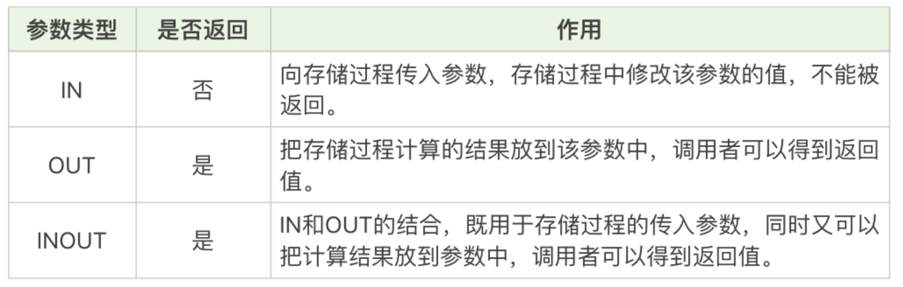

[toc]


# 存储过程

就是 SQL 语句的封装。一旦存储过程被创建出来，使用它就像使用函数一样简单，我们直接通过调用存储过程名即可


## 优点

存储过程可以一次编译多次使用。存储过程只在创造时进行编译，之后的使用都不需要重新编译，这就提升了 SQL 的执行效率。其次它可以减少开发工作量。将代码封装成模块，实际上是编程的核心思想之一，这样可以把复杂的问题拆解成不同的模块，然后模块之间可以重复使用，在减少开发工作量的同时，还能保证代码的结构清晰。还有一点，存储过程的安全性强，我们在设定存储过程的时候可以设置对用户的使用权限，这样就和视图一样具有较强的安全性。最后它可以减少网络传输量，因为代码封装到存储过程中，每次使用只需要调用存储过程即可，这样就减少了网络传输量。同时在进行相对复杂的数据库操作时，原本需要使用一条一条的 SQL 语句，可能要连接多次数据库才能完成的操作，现在变成了一次存储过程，只需要连接一次即可。


## 缺点

可移植性差，存储过程不能跨数据库移植，比如在 MySQL、Oracle 和 SQL Server 里编写的存储过程，在换成其他数据库时都需要重新编写。

调试困难，只有少数 DBMS 支持存储过程的调试。对于复杂的存储过程来说，开发和维护都不容易。

存储过程的版本管理也很困难，比如数据表索引发生变化了，可能会导致存储过程失效。我们在开发软件的时候往往需要进行版本管理，但是存储过程本身没有版本控制，版本迭代更新的时候很麻烦。

**它不适合高并发的场景**，高并发的场景需要减少数据库的压力，有时数据库会采用分库分表的方式，而且对可扩展性要求很高，在这种情况下，存储过程会变得难以维护，增加数据库的压力，显然就不适用了。


## 创建

```
CREATE PROCEDURE 存储过程名称([参数列表])
BEGIN
    需要执行的语句
END    
```


```
DELIMITER //
CREATE PROCEDURE `add_num`(IN n INT)
BEGIN
       DECLARE i INT;
       DECLARE sum INT;
       
       SET i = 1;
       SET sum = 0;
       WHILE i <= n DO
              SET sum = sum + i;
              SET i = i +1;
       END WHILE;
       SELECT sum;
END //
DELIMITER ;
```


## 存储过程参数




IN 和 OUT 的结合，既用于存储过程的传入参数，同时又可以把计算结果放到参数中，调用者可以得到返回值。你能看到，IN 参数必须在调用存储过程时指定，而在存储过程中修改该参数的值不能被返回。而 OUT 参数和 INOUT 参数可以在存储过程中被改变，并可返回。


```
CREATE PROCEDURE `get_hero_scores`(
       OUT max_max_hp FLOAT,
       OUT min_max_mp FLOAT,
       OUT avg_max_attack FLOAT,  
       s VARCHAR(255)
       )
BEGIN
       SELECT MAX(hp_max), MIN(mp_max), AVG(attack_max) FROM heros WHERE role_main = s INTO max_max_hp, min_max_mp, avg_max_attack;
END
```


然后调用存储过程

```
CALL get_hero_scores(@max_max_hp, @min_max_mp, @avg_max_attack, '战士');
SELECT @max_max_hp, @min_max_mp, @avg_max_attack;
```


## 流控制语句

BEGIN…END：BEGIN…END 中间包含了多个语句，每个语句都以（;）号为结束符。

DECLARE：DECLARE 用来声明变量，使用的位置在于 BEGIN…END 语句中间，而且需要在其他语句使用之前进行变量的声明。

SET：赋值语句，用于对变量进行赋值。

SELECT…INTO：把从数据表中查询的结果存放到变量中，也就是为变量赋值。

IF…THEN…ENDIF：条件判断语句，我们还可以在 IF…THEN…ENDIF 中使用 ELSE 和 ELSEIF 来进行条件判断。

CASE：CASE 语句用于多条件的分支判断，使用的语法是下面这样的。

```

CASE 
  WHEN expression1 THEN ...
  WHEN expression2 THEN ...
  ...
    ELSE 
    --ELSE语句可以加，也可以不加。加的话代表的所有条件都不满足时采用的方式。
END
```

LOOP、LEAVE 和 ITERATE：LOOP 是循环语句，使用 LEAVE 可以跳出循环，使用 ITERATE 则可以进入下一次循环。如果你有面向过程的编程语言的使用经验，你可以把 LEAVE 理解为 BREAK，把 ITERATE 理解为 CONTINUE。

REPEAT…UNTIL…END REPEAT：这是一个循环语句，首先会执行一次循环，然后在 UNTIL 中进行表达式的判断，如果满足条件就退出，即 END REPEAT；如果条件不满足，则会就继续执行循环，直到满足退出条件为止。

WHILE…DO…END WHILE：这也是循环语句，和 REPEAT 循环不同的是，这个语句需要先进行条件判断，如果满足条件就进行循环，如果不满足条件就退出循环。