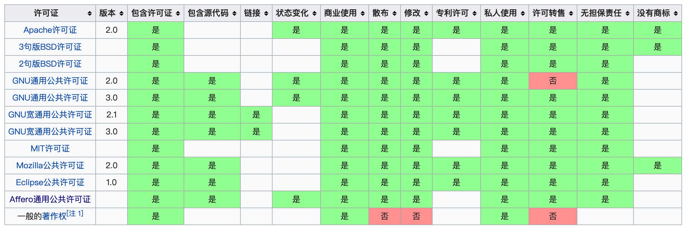

[toc]


# 开源许可证

开源许可证是一种法律许可。通过它，版权拥有人明确允许，用户可以免费地使用、修改、共享版权软件。

版权法默认禁止共享，也就是说，没有许可证的软件，就等同于保留版权，虽然开源了，用户只能看看源码，不能用，一用就会侵犯版权。所以软件开源的话，必须明确地授予用户开源许可证。





## Tool

https://choosealicense.com/


## 宽松式（permissive）许可证

宽松式许可证（permissive license）是最基本的类型，对用户几乎没有限制。用户可以修改代码后闭源。


### 特点

* 没有使用限制

用户可以使用代码，做任何想做的事情。


* 没有担保

不保证代码质量，用户自担风险。


* 披露要求（notice requirement

用户必须披露原始作者。


### BSD（二条款版）

分发软件时，必须保留原始的许可证声明。


### BSD（三条款版）

分发软件时，必须保留原始的许可证声明。不得使用原始作者的名字为软件促销。


### MIT

分发软件时，必须保留原始的许可证声明，与 BSD（二条款版）基本一致。

MIT是和BSD一样宽范的许可协议,作者只想保留版权,而无任何其他了限制.也就是说,你必须在你的发行版里包含原许可协议的声明,无论你是以二进制发布的还是以源代码发布的.

- 被授权人有权利使用、复制、修改、合并、出版发行、散布、再授权及贩售软体及软体的副本。
- 被授权人可根据程式的需要修改授权条款为适当的内容。
- 在软件和软件的所有副本中都必须包含版权声明和许可声明


### Apache 2

分发软件时，必须保留原始的许可证声明。凡是修改过的文件，必须向用户说明该文件修改过；没有修改过的文件，必须保持许可证不变。


## Copyleft 许可证

Copyleft 是理查德·斯托曼发明的一个词，作为 Copyright （版权）的反义词。

Copyright 直译是"复制权"，这是版权制度的核心，意为不经许可，用户无权复制。

作为反义词，Copyleft 的含义是不经许可，用户可以随意复制。


### 核心

修改后的 Copyleft 代码不得闭源

它带有前提条件，比宽松式许可证的限制要多。

```
如果分发二进制格式，必须提供源码

修改后的源码，必须与修改前保持许可证一致

不得在原始许可证以外，附加其他限制
```


### Affero GPL (AGPL)

如果云服务（即 SAAS）用到的代码是该许可证，那么云服务的代码也必须开源。


### GPL

如果项目包含了 GPL 许可证的代码，那么整个项目都必须使用 GPL 许可证。


### LGPL

如果项目采用动态链接调用该许可证的库，项目可以不用开源。


### AGPL

此许可协议最新版本为“第3版”（v3）

GPL（2.x ~ 3.x） 协议还有一个非常大的“漏洞”，就是软件“发布” 才必须开源。也就是说，我的软件不发布，即使使用 GPL (2.x ~ 3.x) 也可以不用开源。随着以Google为代表的软件作为服务的互联网公司的兴起，它们的“不分发软件，为客户提供网络服务”的商业模式就不受GPL协议的约束

AGPL则增加了对此做法的约束：

```
AGPL = GPL + 一条限制
```

一条限制：如果使用AGPL许可的软件与用户通过网络进行交互，也需要提供源代码给用户，所有的修改也要给用户。


### Mozilla（MPL）

只要该许可证的代码在单独的文件中，新增的其他文件可以不用开源。

