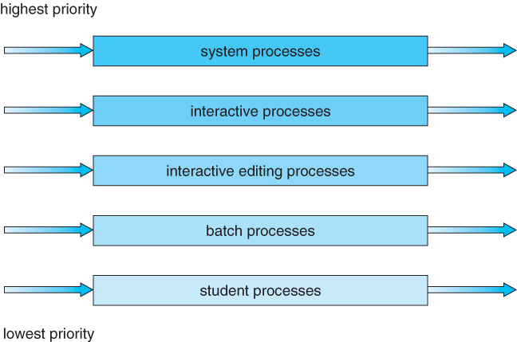
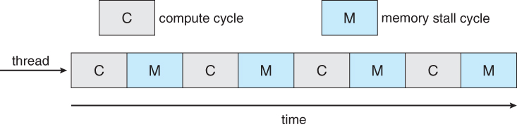
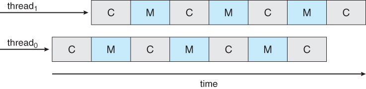
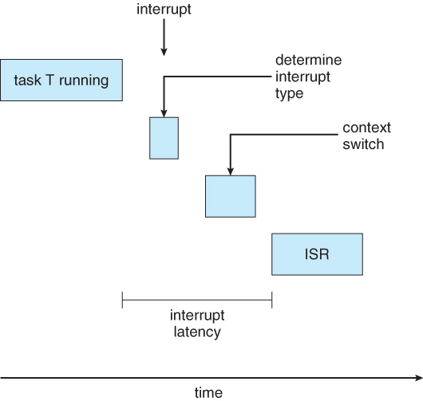
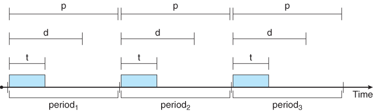

[toc]

# CPU 调度

分时系统令 CPU 可以在多个任务间进行切换，每个任务都可以持续运行一定的时间。 或者当一个任务需要等待 I/O 时，切换到另一个任务，尽可能的不浪费 CPU 时间。

挑战在于让 CPU 保持高效运行和尽可能的让多个任务公平运行。

当 CPU 处于空闲时，就需要 CPU 调度器（short-term scheduler）从**就绪队列（ready queue）**中选择一个新的任务来执行。

## CPU 密集型 & I/O 密集型

CPU 基本上处于两个状态的轮替之中：

- CPU：执行运算任务；
- I/O：等待数据的输入输出。

这两种状态的轮替，称为 CPU burst，从 load 监控上看，就是呈高峰、低谷的循环。

## 抢占式调度 preemptive

CPU 有四个可能发生调度的时机：

1. 任务因为等待 I/O 等原因从 running 状态转变为 waiting 状态；
2. 当任务从 running 变为 ready；
3. 当任务从 waiting 变为 ready；
4. 当一个任务终止。

对于情形 1 和 4，必须发生调度。对于 2 和 3 则是可选的。

当仅在 1 和 4 的情形时才会发生调度，我们称这样的系统为**非抢占系统（non-preemptive）**，或协作系统（cooperative）。 在这种系统上，一个进程一旦开始运行，会一直运行到其结束。而支持 2、3 的系统，称之为**抢占式系统（preemptive）**。

Windows 在 3.x 以前，Mac 在 OSX 以前，都是非抢占系统。

抢占式系统的一些困难：

- 进程间共享数据时，其中一个进程在更新数据的过程中被切换，可能会导致问题；
- 如果进程正在执行 system call，被切换可能会引发问题。有些系统会禁止 syscall 被中断，而这会导致无法实时响应。
- 个别程序因为特殊原因，会在进入敏感区前禁用中断。

## Dispatcher

负责：

- 上下文切换
- 用户／内核态切换
- 跳到刚加载的程序位置。

# 调度算法（针对内核态线程）

一些常用的调度算法

## FCFS

First-Come First-Serve Scheduling

最简单的算法，仅仅是一个 FIFO 的队列。

这是一个非抢占式的实现，所以如果遇到某个进程运行时间特别长，后续进程的等待时间就会很久。

而这也容易导致**护航效果（convoy effect）**：当 CPU 在执行一个长时间计算任务时， 会导致大量短耗时的 I/O 任务排队。而当 CPU 执行 I/O 的时候，又会陷入等待。

## SJF

Shortest-Job-First Scheduling

给予运行最快的程序最高的优先级。

这种算法拥有最少的 wait time，不过问题在于你如何预判进程的执行耗时呢？ 常用的方法有：

- 让用户设定；
- 如果任务重复执行，则记录运行耗时（不一定准）；
- 使用历史预测算法，如指数平均

该算法也可以有抢占式的实现：当就绪队列里出现了一个执行耗时比当前进程剩余耗时更短的任务。

## 优先级调度 Priority

为每一个任务配置一个优先级，然后按照优先级来调度任务。

所以 SJF 其实是优先级调度的一个特例，将运行时长作为了优先级。

优先级可以由外部指定，也可以由内部根据任务耗时、CPU 和 I/O 使用率、系统资源状况动态指定。

优先级算法也可以是抢占式或非抢占式的。

优先级调度有可能会导致饿死，低优先级任务一直无法得到执行。 可以引入**年龄（aging）**，一个就绪任务等待的时间越长，附加的优先级越高， 这样即使是低优先级任务最重也会变成高优先级。

## Round Robin

基于 FCFS 扩充的“随机”算法。

首先，初始化一个**时间阈值（time quantum）**，然后按照 FCFS 将任务交给 CPU 运行。 不过每一个任务开始运行时，都记录其运行时间，一但任务运行的时间超过了时间阈值， 则停止其运行，并将其置于就绪队列的末端（就绪队列为一个环）。

理论上来说，时间阈值选择的越小，任务等待和响应时间越短。 不过，时间阈值越小，上下文切换也就越多，不过，一般一次上下文切换的开销是 10μs， 而现代系统的时钟一般为 10～100ms，所以上下文的影响较小。

## 多级队列 Multilevel Queue Scheduling

如果任务可以被分类，那么可以将其置于不同的队列之中。每个队列都可以有自己的调度算法。

队列之间也应该有调度，决定当前处理那一个队列，常见的做法是采用优先级调度或 RR。

一个任务一旦进入队列，就不能变换队列，直到其执行完毕。

## 多级反馈队列

和多级队列最大的区别在于，任务可以在队列间变动。判定条件包括：

- 如果一个任务从 I/O 型变成了计算型；
- 如果有任务因为等待过久导致变为高优先级；

多级反馈队列最为复杂，因为有大量的可调参数，包括：

- 队列数量
- 每一个队列的调度算法
- 对任务的升级或降级算法
- 决定一个任务的初始队列

# 线程调度

## 竞争范围 Contention Scope

竞争范围指线程竞争物理 CPU 的资源。

PCS（Process Contention Scope）：发生在 M:N 和 M:1 模型， 此时竞争的线程属于同一个进程之内，在同一个系统线程内调度多个用户线程。

SCS（System Contention）：由操作系统调度内核线程。

## Pthread 调度

Pthread 提供了不同的竞争范围：

- `PTHREAD_SCOPE_PROCESS` 使用 PCS
- `PTHREAD_SCOPE_SYSTEM` 使用 SCS

# 多处理器调度

`Load sharing` 解决多处理器间的负载平衡。

多核还需要考虑是**同构（homogenous）**的还是**异构（heterogeneous）**的。

## 多处理器调度方案

**非对称处理器（asymmetric multiprocessing）**：一个处理器作为 master， 负责运行内核代码。而其他核负责用户代码。这是最简单的模型。

**对称处理器（symmetric multiprocessing, SMP）**：每一个处理器都处理类似的任务， 来自于同一个就绪队列，或者来自每个处理器各自的就绪队列。

## 处理器亲和性 Affinity

处理器内包含 cache，用于提高存取速度。

如果一个任务从一个处理器被调度到另一个处理器，那么它在上一个处理器的缓存数据就全部失效了。 需要重新从主存中载入。

SMP 提供了 processor affinity：

- soft affinity：尽可能让进程在同一个处理器上运行；
- hard affinity：为进程执行要运行的处理器。

## 负载均衡

如果所有的处理器都适用一个通用就绪队列的话，那么天然就是均衡的。 不过实际上，大部分系统都为每个处理器准备了各自的就绪队列。

平衡方法包括：

- push migration：为每一个进程分时（一般 200ms），并且将进程从高负载的处理器移动到低负载的处理器；
- pull migration：空闲的处理器从其他处理器的就绪队列里拉取任务。

需要注意的是，为了负载平衡而在就绪队列间移动任务，违背了处理器亲和性。

## 多核处理器

传统的 SMP 要求多个 CPU 芯片来实现多线程并行。现在的趋势是在一个处理器芯片里放置多核， 表象上和多处理器一样。

**memory stall**：处理器试图加载缓存时，会阻塞，所以每一个核的运行周期都是运算和内存加载间隔。

所以在一个处理器上分配两个内核线程交错运行可以避免阻塞。

所以，在双核系统上，可以实现 4 个逻辑处理器。

在处理器上有两种切换多线程的方法：

- 粗粒率：当一个线程阻塞时，切换另一个线程。上下文切换代价接近进程切换，开销较大。
- 细粒度：按照一个固定的间隔切换。一般由硬件提供优化，代价较小。

对于多核多线程系统，在内核级别由两种级别的调度：

- OS 调度器决定将内核线程分配给哪一个逻辑处理器，以及何时切换；
- 更底层的，硬件调度器分配逻辑处理器到物理核上，有不同的实现算法

# 实时调度

实时系统指的是对任务响应时间要求极高的系统。根据对实时性的不同要求，可以分为：

- 软实时系统（soft real-time system）：响应不实时会导致服务质量变差，如流媒体；
- 硬实时系统（hard real-time system）：响应不实时会导致服务完全失败。

### 最小化延迟

**事件延迟（event latency）**指从事件发生到完成（响应）的耗时。

在事件响应函数（Interrupt Service Routne，ISR）真正开始处理事件以前，还存在一段**中断延迟（interrupt latency）**：

1. 中断处理器判断发生了什么中断，以及该交给哪一个 ISR。如果有多个中断同时发生，则还需要判断优先级。
2. 从当前程序切换到 ISR 的上下文交换。

而上下文切换的延迟（dispatch latency）又可以分为两部分：

1. 将当前运行的进程移出 CPU，准备 ISR 所需的资源（对于抢占式系统，这段会很快）；
2. 加载 ISR

### 基于优先级的调度

实时系统一般都需要抢占式的优先级调度系统来实现。 根据优先级的状态，可以进一步分为：

- 静态优先级：RMS
- 动态优先级：EDF

软实时系统一般就可以实现大部分需求，不过并不提供硬性保障。

硬实时系统可以采用 `admission-control` 算法。 这一算法要求每一个任务必须声明运行所需的资源， 系统仅仅会执行那些需求已经满足的任务。

硬实时系统中，一般按照一个固定的周期（p）切换任务， 每个任务可以持续运行一段时间（t），而且要求每一个任务必须在一定时间（d）内结束。 而且 t <= d <= p。

### 单调速率调度 RMS

Rate-Monotonic Scheduling

该算法使用固定优先级的抢占式系统。

任务的优先级反比于其所需时间。谁执行的时间短谁先执行。

### 最早截止时间优先 EDF

Earliest-Deadline-First Scheduling

EDF 是一种动态优先级算法，谁先结束，谁优先级最高。

在每一个切换周期时，判断当前任务中谁剩余的结束时间最少，就执行哪个任务。

### 时间共享调度

Proportional Share Scheduling

将可用时间分片，然后每个任务都声明所需的时间份额。 如果调度器判断在当前周期内无法保证所需的时间份额，则不运行该任务。

