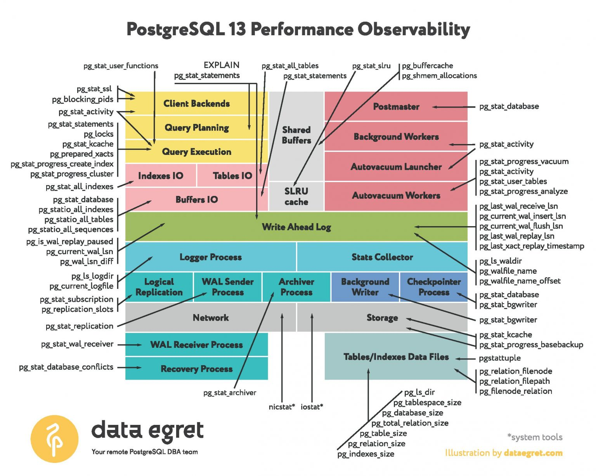

[toc]


# Performance 




## pg_stat_activity

pg_stat_activity是一个非常有用的视图，可以帮助排查pg的一些问题（如连接数目过多问题）。pg_stat_activity每行展示的是一个“process”的相关信息，这里的“process”可以理解为一个DB连接。


### query_start

状态的查询开始时间，如果状态不是active的，那么就是最后一次查询开始的时间


### state

运行状态，可以为几种值。

active:正在执行查询；

idle:等待新的命令；

idle in transaction:后端是一个事务，但是尚未执行查询；

idle in transaction(aborted):和idle in transaction类似，除了事务执行出错。


查询闲置连接数。如果数字过大，可以认为是有问题的（如连接忘记关闭）。
如果想进一步定位到有问题的SQL，可以如下查询：

```
select count(*) from pg_stat_activity where state='idle';
select query,count(*) as num from pg_stat_activity where state='idle' group by query order by num desc;
```


### query

执行的查询文本（即SQL）。

如果状态是active，那么就是正在执行的SQL；如果是其他状态，则展示最后一次执行的SQL。


# Long Query SQL


long running queries may interfere on the overall database performance and probably they are stuck on some background process.

```
SELECT
  pid,
  now() - pg_stat_activity.query_start AS duration,
  query,
  state
FROM pg_stat_activity
WHERE (now() - pg_stat_activity.query_start) > interval '5 minutes';
```


In order to cancel these long running queries you should execute:

```
SELECT pg_cancel_backend(__pid__);
```


If the you find the process is stuck you can kill it by running:

```
SELECT pg_terminate_backend(__pid__);
```

> pg_terminate_backend is the kill -9 in PostgreSQL

