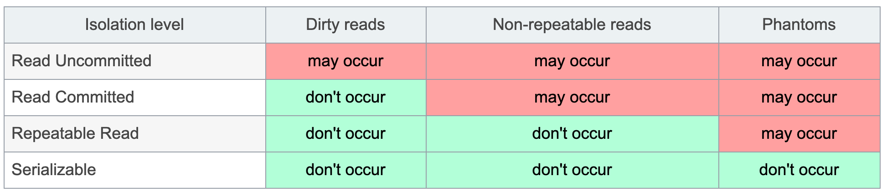

[toc]


# 事务


## 事务隔离级别

对于两个并发执行的事务，如果涉及到操作同一条记录的时候，可能会发生问题。因为并发操作会带来数据的不一致性，包括脏读、不可重复读、幻读等。数据库系统提供了隔离级别来让我们有针对性地选择事务的隔离级别，避免数据不一致的问题。




### Read Uncommitted

读未提交，也就是允许读到未提交的数据，这种情况下查询是不会使用锁的，可能会产生脏读、不可重复读、幻读等情况。


### Read Committed

Postgresql 默认隔离级别

读已提交就是只能读到已经提交的内容，可以避免脏读的产生，属于 RDBMS 中常见的默认隔离级别（比如说 Oracle 和 SQL Server），但如果想要避免不可重复读或者幻读，就需要我们在 SQL 查询的时候编写带加锁的 SQL 语句


### Repeatable Read

MySQL 默认的隔离级别

可重复读，保证一个事务在相同查询条件下两次查询得到的数据结果是一致的，可以避免不可重复读和脏读，但无法避免幻读。


### Serializable 

可串行化，将事务进行串行化，也就是在一个队列中按照顺序执行，可串行化是最高级别的隔离等级，可以解决事务读取中所有可能出现的异常情况，但是它牺牲了系统的并发性。

如果没有特别重要的情景，一般都不会使用Serializable隔离级别。


## 事务错误现象


### Dirty Read 脏读 

事务A会读到事务B未提交的数据，在事务B回滚后，事务A读到的数据无意义。(包括insert，update，delete)


### Non-repeatable reads 不可重复读

在一个事务内，多次读同一数据，在这个事务还没有结束时，如果另一个事务恰好修改了这个数据，那么，在第一个事务中，两次读取的数据就可能不一致。

不可重复读是同一条记录的内容被修改了，重点在于UPDATE或DELETE


### Phantoms 幻读


针对于查询结果集的前后不一致，查询的数据表在事务的执行期间有执行插入删除的操作，导致查询结果的增加或减少。

一个事务内，在前后两次查询同一个范围的时候，后一次查询看到了前一次查询没有看到的行。

# 操作


## 查看

查询postgreSQL默认的隔离级别

```
test=> show default_transaction_isolation;

 default_transaction_isolation 

-------------------------------

 read committed

(1 row)
```


检查当前隔离级别

```
test=# show transaction_isolation;

 transaction_isolation 

-----------------------

 read committed

(1 row)
```


## 修改

修改当前事务的隔离级别，须在事物中执行：

```
test=# begin;

test=# set transaction isolation level serializable;

SET

test=# show transaction_isolation; 

transaction_isolation 

----------------------- 

serializable

(1 row)
```


修改当前会话默认的隔离级别

```
test=# begin;
test=# set default_transaction_isolation='repeatable read';
SET
test=# show transaction_isolation;
 transaction_isolation 
-----------------------
 serializable
(1 row)


test=#  show default_transaction_isolation;
 default_transaction_isolation 
-------------------------------
 repeatable read
(1 row)

test=# commit;
COMMIT
test=# show transaction_isolation;
 transaction_isolation 
-----------------------
 repeatable read
(1 row)

--

test=#  show default_transaction_isolation;
 default_transaction_isolation 
-------------------------------
 read committed
(1 row)

test=#  set default_transaction_isolation='repeatable read';
SET
test=#  show default_transaction_isolation;
 default_transaction_isolation 
-------------------------------
 repeatable read
(1 row)


test=#  show transaction_isolation;
 transaction_isolation 
-----------------------
 repeatable read
(1 row)

```


如果在事物中修改默认的隔离级别是不影响当前事物的。否则即时生效。

也可以在数据库级别设置默认的隔离级别：

```
[test@db1 data]$ cat postgresql.conf |grep default_transaction_isolation

#default_transaction_isolation = 'read committed'
```


# Auto commit

## 配置

Although autocommit is enabled by default in PostgreSQL database's `psql` command-line tool, it can be easily disabled using `\set AUTOCOMMIT off` explicitly in a session or via configuration in the personal `~/.psqlrc`file or in the global system configuration `psqlrc` file

```
\echo :AUTOCOMMIT

\set AUTOCOMMIT off
\set AUTOCOMMIT on
```


## 使用

事务可以使用 BEGIN TRANSACTION 命令或简单的 BEGIN 命令来启动。此类事务通常会持续执行下去，直到遇到下一个 COMMIT 或 ROLLBACK 命令。不过在数据库关闭或发生错误时，事务处理也会回滚

启动一个事务的简单语法：

```
BEGIN;

或者

BEGIN TRANSACTION;
```


COMMIT 命令是用于把事务调用的更改保存到数据库中的事务命令，即确认事务

```
COMMIT;

或者

END TRANSACTION;
```


ROLLBACK 命令是用于撤消尚未保存到数据库的事务命令，即回滚事务

```
ROLLBACK;
```


