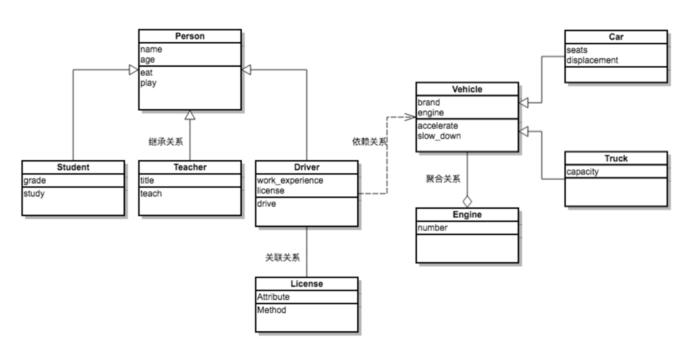
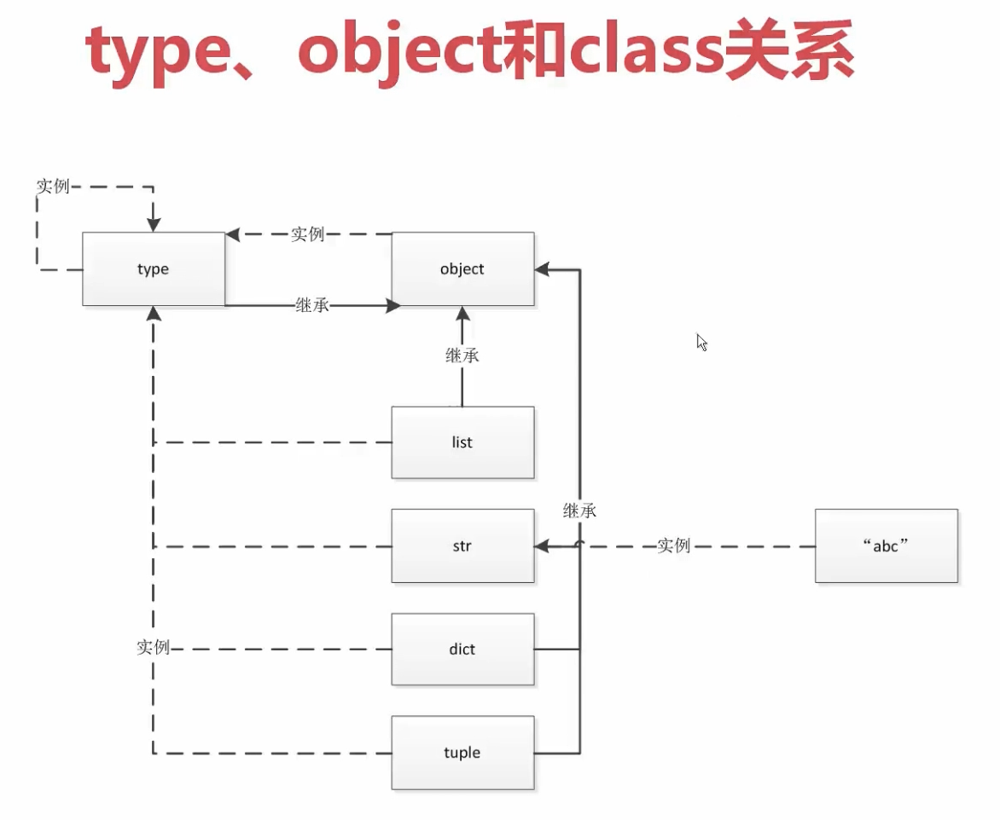

[TOC]

# 类之间的关系

类和类之间的关系有三种：is-a、has-a和use-a关系

- is-a关系也叫继承或泛化，比如学生和人的关系、手机和电子产品的关系都属于继承关系。
- has-a关系通常称之为关联，比如部门和员工的关系，汽车和引擎的关系都属于关联关系；关联关系如果是整体和部分的关联，那么我们称之为聚合关系；如果整体进一步负责了部分的生命周期（整体和部分是不可分割的，同时同在也同时消亡），那么这种就是最强的关联关系，我们称之为合成关系。
- use-a关系通常称之为依赖，比如司机有一个驾驶的行为（方法），其中（的参数）使用到了汽车，那么司机和汽车的关系就是依赖关系。

使用一种叫做[UML](https://zh.wikipedia.org/wiki/统一建模语言)（统一建模语言）的东西来进行面向对象建模，其中一项重要的工作就是把类和类之间的关系用标准化的图形符号描述出来。

利用类之间的这些关系，我们可以在已有类的基础上来完成某些操作，也可以在已有类的基础上创建新的类，这些都是实现代码复用的重要手段。



# 类的定义

类是现实世界或者思维世界中的实体在计算机中的反映

它将数据以及这些数据上的操作封装在一起

```python
class ClassName:
    pass

# 等价于

class ClassName(object):
    pass
```

```python
class Person:          #定义一个类Person
    def SayHi(self):   #类成员函数必须要有一个参数self,表示类的实例(对象)自身
        print('Hi')

p = Person()           #定义类Person的对象p, 用p来访问类的成员变量和成员函数
p.SayHi()              #调用类Person的成员函数SayHi() 
>>>
hi
```


## 方法定义 (类中的函数)

写在类中的函数，我们通常称之为（对象的）方法

```python
class ClassName:
    def method_name(self):
        pass
```

相对于普通函数，需要传入self参数，即实例方法

```
class A:
    def print_file(self):
        pass
```


## 内部方法 (仅单下划线开头)

以单个下划线开头的变量或方法仅供内部使用。 该约定在PEP 8中有定义。

它通常不由Python解释器强制执行，仅仅作为一种对程序员的提示。

但是，前导下划线的确会影响从模块中导入名称的方式。

```
# This is my_module.py:

def external_func():
    return 23

def _internal_func():
    return 42
   
>>> from my_module import *
>>> external_func()
23
>>> _internal_func()
NameError: "name '_internal_func' is not defined"
```


## 解决变量冲突 (仅单下划线结尾)

有时候，一个变量的最合适的名称已经被一个关键字所占用。 因此，像class或def这样的名称不能用作Python中的变量名称。 在这种情况下，你可以附加一个下划线来解决命名冲突：

单个末尾下划线（后缀）是一个约定，用来避免与Python关键字产生命名冲突。 PEP 8解释了这个约定。

```text
>>> def make_object(name, class):
SyntaxError: "invalid syntax"

>>> def make_object(name, class_):
...    pass
```


## 私有方法 (仅双下划线开头)

`__private_method`：两个下划线开头，声明该方法为私有方法，不能在类地外部调用

在类的内部调用需要 `self.__private_methods`

```
class A:
    def __init__(self, x):
        self.__val = x

    def __add(self, i):
        self.__val += i

    def get_val(self):
        return self.__val

    def increase(self):
        self.__add(1)

a = A(5)
dir(a)

>>>
['_A__add',  #Python解释器所做的名称修饰。 它这样做是为了防止变量在子类中被重写。
 '_A__val',	 #Python解释器所做的名称修饰。 它这样做是为了防止变量在子类中被重写。
 '__class__',
 '__delattr__',
 '__dict__',
 '__dir__',
 '__doc__',
 '__eq__',
 '__format__',
 '__ge__',
 '__getattribute__',
 '__gt__',
 '__hash__',
 '__init__',
 '__init_subclass__',
 '__le__',
 '__lt__',
 '__module__',
 '__ne__',
 '__new__',
 '__reduce__',
 '__reduce_ex__',
 '__repr__',
 '__setattr__',
 '__sizeof__',
 '__str__',
 '__subclasshook__',
 '__weakref__',
 'get_val',
 'increase']

a.__add
>>>
Traceback (most recent call last):
  File "/Users/xhxu/python/python3/test/10.py", line 15, in <module>
    a.__add()
AttributeError: 'A' object has no attribute '__add'
```


### 私有方法原理

python并没有真正的私有，变量改名 _classname__val来绕过

```
class A:
    def __init__(self, x):
        self.__val = x

    def __add(self, i):
        self.__val += i

    def get_val(self):
        return self.__val

    def increase(self):
        self.__add(1)

a = A(5)
print(a.get_val())

a.increase()
print(a.get_val())

print(dir(a))
print(a._A__val)

print(a.__dict__)

>>>
5
6
['_A__add', '_A__val', '__class__', '__delattr__', '__dict__', '__dir__', '__doc__', '__eq__', '__format__', '__ge__', '__getattribute__', '__gt__', '__hash__', '__init__', '__init_subclass__', '__le__', '__lt__', '__module__', '__ne__', '__new__', '__reduce__', '__reduce_ex__', '__repr__', '__setattr__', '__sizeof__', '__str__', '__subclasshook__', '__weakref__', 'get_val', 'increase']
6
{'_A__val': 6}
```

```
class Student():
    sum1 = 0

    def __init__(self, name, age):
        self.name = name
        self.age = age
        self.__score = 0
        self.__class__.sum1 += 1
        print("Total students is " + str(self.__class__.sum1))

    def marking(self, score):
        self.score = score
        if self.score < 0:
            print('Invalid num')
        else:
            print('score', self.score)


    def do_homework(self):
        pass

    def do_english_homework(self):
        pass

student = Student('Rick', 18)
student = Student('Michelle', 18)
student1 = Student('Sam', 18)
result = student.marking(-1)
student1.__score = -1
print(student1.__dict__)
print(student1._Student__score)

>>>
Total students is 1
Total students is 2
Total students is 3
Invalid num
{'age': 18, '__score': -1, 'name': 'Sam', '_Student__score': 0}
0
```

> 这里将`__score` 的私有变量重新命名成`_Student__score` 这种类名+score 的形式
> 
> 但是可以强行读取到数值


## self

self就是当前调用某一个方法的对象， self 代表的是一个实例，而不是一个类

可以在类中定义成为任意的标识，比如this， 但约定统一使用self

```python
class A:
    name = 'Rick'
    age = 18

    def __init__(this, name, age):
        this.name = name
        this.age = age
```

# 类的属性

## 实例变量

定义在方法中的变量，只作用于当前实例的类。

实例变量的作用域，就是实例本身

类可以访问；类内部可以访问；派生类中可以访问

```
class C:

    def __init__(self):
        self.var = 'public var'

    def func(self):
        print(self.var)


class D(C):

    def show(self):
        print(self.var)

obj = C()
obj.var   # 对象的属性引用
obj.func()

obj_son = D()
obj_son.show()
>>>
public var
public var
```


## 保护变量（仅单下划线开头）

"单下划线" 开始的成员变量叫做保护变量，意思是只有类对象和子类对象自己能访问到这些变量

不过根据python的约定，应该将其视作private，而不要在外部使用它们

​    

## 私有实例变量 (仅双下划线开头)

"双下划线" 开始的是私有成员，意思是只有类对象自己能访问，连子类对象也不能访问到这个数据

仅类内部可以访问, 无法被外部调用修改

都是在init方法中定义的

```
class C:

    def __init__(self):
        self.__var = 'private var'

    def func(self):
        print(self.__var)


class D(C):

    def show(self):
        print(self.__var)

obj = C()
obj.__var # 通过对象访问    ==> 错误
obj.func() # 类内部访问        ==> 正确

obj_son = D()
obj_son.show() # 派生类中访问  ==> 错误
```


## 类变量

类变量对所有的实例都是可见的，可以共享，且初值都是一样的

定义在方法体之外，可以通过类名访问，对所有方法共享

实例变量没有，会找类变量调用

类变量通常不作为实例变量使用, 即类变量不用做定义实例变量

也称为数据成员，用于描述刻画类的特征

```python
class A:
    val = 3  #类变量
    def __init__(self, x):
        self.x = 3

a1 = A(5)
print(a1.val)

a2 = A(9)
print(a2.val)

a1.val += 1
print(a1.val)
>>>
3
3
4
```

对不可变对象赋值，就会变成新的变量

```
class A:
    val = [1, 2, 3]
    val_s = 'a'

    def __init__(self):
        pass

a1 = A()
a2 = A()
a1.val.append(4)
print(a1.val, id(a1.val))
print(a2.val, id(a2.val))

a3 = A()
a4 = A()
a3.val_s = 's'
print(a3.val_s, id(a3.val_s))
print(a4.val_s, id(a4.val_s))
>>>
[1, 2, 3, 4] 4442997640
[1, 2, 3, 4] 4442997640
s 4437293632
a 4437455120
```


在类内部中的实例方法内，访问类变量的方式

```
class Student():
    sum1 = 0

    def __init__(self, name, age):
        self.name = name
        self.age = age
        print(Student.sum1)


student = Student('Rick', 18)
>>>
0
```


或者通过内置变量`__class__`访问类变量的值

```
class Student():
    sum1 = 0

    def __init__(self, name, age):
        self.name = name
        self.age = age
        print(self.__class__.sum1)


student = Student('Rick', 18)
>>>
0
```


通过类赋值类变量，并调用

```
class B:
    name = None
    role = None
    id = None

    @classmethod
    def run(cls):
        print(B.name)
        print(B.role)
        print(B.id)

    @classmethod
    def get(cls, name, role, id):
        B.name = name
        B.role = role
        B.id = id

        cls.run()

B.run()
B.get(name='rick', role='prod', id=1)
>>>
None
None
None
rick
prod
1
```


## 私有类变量 (仅双下划线开头)

私有类变量不能被实例访问

类内部可以通过方法访问

`__private_attrs`：两个下划线开头，声明该属性为私有，不能在类的外部被使用或直接访问。在类内部的方法中使用时 `self.__private_attrs`。

```python
class C:
    __name = 'private var'
    name = 'publibc var'

    def func(self):
        print('func in C', C.__name)


class D(C):

    def show(self):
        print('show in D', C.__name)

C.__name # 类访问 错误
>>>
AttributeError                            Traceback (most recent call last)
<ipython-input-38-08cb1bfc384f> in <module>
----> 1 B.__name

C.name # 可以访问
>>>
'publibc var'

obj = C()
obj.func() # 类内部可以访问
>>>
func in C private var

obj_son = D()
obj_son.show() # 派生类中访问错误
>>>
AttributeError: type object 'C' has no attribute '_D__name'
```

# 类及变量权限访问

|              | 类能否访问 | 实例能否访问 | 类是否能够通过公有类方法调用私有变量 | 实例是否能够通过公有实例方法调用私有变量 |
| :----------- | :--------- | :----------- | :----------------------------------- | :--------------------------------------- |
| 私有类变量   | ×          | ×            | √                                    | √                                        |
| 私有类方法   | ×          | ×            | N/A                                  | N/A                                      |
| 私有实例变量 | ×          | ×            | ×                                    | √                                        |
| 私有实例方法 | ×          | ×            | N/A                                  | N/A                                      |
| 公有类变量   | √          | √            | √                                    | √                                        |
| 公有类方法   | √          | √            | N/A                                  | N/A                                      |
| 公有实例变量 | ×          | √            | ×                                    | √                                        |
| 公有实例方法 | ×          | √            | N/A                                  | N/A                                      |

# 实例化

`__init__` 只是初始化类变量的作用

```python
class A:
    def __init__(self, x):
        self.x = x

# 实例化
a = A(5)

# 绑定实力变量
print(a.x)
>>>
5
```


## 实例化类原理

```
class A:
    def __new__(cls, *args, **kwargs):
        print("call __new__")
        print("type cls", type(cls))
        return object.__new__(cls)

    def __init__(self, x):
        print("call __init__")
        print("type self", type(self))
        s1 = set (dir(self))
        self.x = x
        s2 = set(dir(self))
        print(s2 - s1)


a = A(5)
>>>
call __new__
type cls <class 'type'>
call __init__
type self <class '__main__.A'>
{'x'}
```

> cls 代表class A这个对象
> 
> dir 会返回所有属性

若new方法不返回，init方法不执行

```
class A:
    def __new__(cls, *args, **kwargs):
        print("call __new__")
        print("type cls", type(cls))
        # return object.__new__(cls)

    def __init__(self, x):
        print("call __init__")
        print("type self", type(self))
        s1 = set (dir(self))
        self.x = x
        s2 = set(dir(self))
        print(s2 - s1)


a = A(5)
>>>
call __new__
type cls <class 'type'>
```

# 封装

封装只能在类的内部访问

```python
class A:
    def __init__(self, x):
        self.__value = x

    def __add(self):
        self.__value += i

    def get_value(self):
        return self.__value

    def __increase(self):
        self.__add(1)

a = A(5)
print(a.get_value())
print(a.__value)
>>>
5
Traceback (most recent call last):
  File "/Users/xhxu/python/python3/test/3.py", line 17, in <module>
    print(a.__value)
AttributeError: 'A' object has no attribute '__value'
```


## 数据及行为封装

```python
class Door():
    def __init__(self, number, status):
        self.number = number
        self.status = status

    def open(self):
        self.status = 'opening'

    def close(self):
        self.status = 'closed'

door1 = Door(1, 'closed')
```

```
from time import sleep

class Clock(object):
    """My Clock"""

    def __init__(self, hour=0, minute=0, second=0):
        """Initial method
        :param hour: hour:
        :param minute: minute
        :param second: second
        """
        self._hour = hour
        self._minute = minute
        self._second = second

    def run(self):
        """Working on Clock
        """
        self._second += 1
        if self._second == 60:
            self._second = 0
            self.minute += 1
            if self._minute == 60:
                self._minute = 0
                self._hour += 1
                if self._hour == 24:
                    self._hour = 0

    def show(self):
        """Display time
        """
        return '%02d:%02d:%02d' % \
            (self._hour, self._minute, self._second)

def main():
    clock = Clock(23, 59, 48)
    while True:
        print(clock.show())
        sleep(1)
        clock.run()


if __name__ == "__main__":
    main()    
```

# type 类 (metaclass底层实现)

类 是由 type 类实例化产生

type 类的基类是object

type类中实现的创建类

类中有一个属性 __metaclass__，其用来表示该类由 谁 来实例化创建，所以，我们可以为 __metaclass__ 设置一个type类的派生类，从而查看 类 创建的过程。

type 由解释器封装生成

```
Foo = type('Foo',(object,), {'func': func})
#type第一个参数：类名
#type第二个参数：当前类的基类
#type第三个参数：类的成员
```

```
def func(self):
    print("hello %s"%self.name)

def __init__(self,name,age):
    self.name = name
    self.age = age
Foo = type('Foo',(object,),{'func':func,'__init__':__init__})

f = Foo("jack",22)
f.func()

>>>
hello jack
```


```
def say(self):
    return 'I am saying'

User = type("User", (), {'name': 'I am user', 'say': say})
my_obj = User()
print(my_obj.say())
print(my_obj.name)

>>>
I am saying
I am user
```

> 可以实现动态添加属性和方法


  


## Type, object, class 关系




```
In [22]: type(object)                                                                                                                                                        Out[22]: type

In [23]: object.__bases__                                                                                                                                                    Out[23]: ()

In [24]: type.__bases__                                                                                                                                                      Out[24]: (object,)

In [26]: class Student: 
    ...:     pass 
    ...:                                                                                                                                                                     
In [27]: Student.__bases__                                                                                                                                                   Out[27]: (object,)

In [28]: class MyStudent(Student): 
    ...:     pass 
    ...:                                                                                                                                                                     
In [29]: MyStudent.__bases__                                                                                                                                                 Out[29]: (__main__.Student,)

In [30]: type(list)                                                                                                                                                          Out[30]: type
```


# 元类 metaclass

metadata 默认继承元类

类的生成 调用 顺序依次是 `__new__` --> `__init__` --> `__call__`

```
class MyType(type):
    def __init__(self,*args,**kwargs):

        print("Mytype __init__",*args,**kwargs)

    def __call__(self, *args, **kwargs):
        print("Mytype __call__", *args, **kwargs)
        obj = self.__new__(self)
        print("obj ",obj,*args, **kwargs)
        print(self)
        self.__init__(obj,*args, **kwargs)
        return obj

    def __new__(cls, *args, **kwargs):
        print("Mytype __new__",*args,**kwargs)
        return type.__new__(cls, *args, **kwargs)

print('here...')
class Foo(object,metaclass=MyType):


    def __init__(self,name):
        self.name = name

        print("Foo __init__")

    def __new__(cls, *args, **kwargs):
        print("Foo __new__",cls, *args, **kwargs)
        return object.__new__(cls)

f = Foo("Rick")
print("f",f)
print("fname",f.name)

>>>
here...
Mytype __new__ Foo (<class 'object'>,) {'__module__': '__main__', '__qualname__': 'Foo', '__init__': <function Foo.__init__ at 0x10f59c6a8>, '__new__': <function Foo.__new__ at 0x10f59c598>}
Mytype __init__ Foo (<class 'object'>,) {'__module__': '__main__', '__qualname__': 'Foo', '__init__': <function Foo.__init__ at 0x10f59c6a8>, '__new__': <function Foo.__new__ at 0x10f59c598>}
Mytype __call__ Rick
Foo __new__ <class '__main__.Foo'>
obj  <__main__.Foo object at 0x10f4b21d0> Rick
<class '__main__.Foo'>
Foo __init__
f <__main__.Foo object at 0x10f4b21d0>
fname Rick
```


## 特性

yaml是一个家喻户晓的 Python 工具，可以方便地序列化 / 逆序列化结构数据。YAMLObject 的任意子类支持序列化和反序列化（serialization & deserialization）

```
import yaml
class Monster(yaml.YAMLObject):
    yaml_tag = u'!Monster'
    def __init__(self, name, hp, ac, attacks):
        self.name = name
        self.hp = hp
        self.ac = ac
        self.attacks = attacks
    def __repr__(self):
        return "%s(name=%r, hp=%r, ac=%r, attacks=%r)" % (
        self.__class__.__name__, self.name, self.hp, self.ac,      
        self.attacks)

yaml.load("""
--- !Monster
name: Cave spider
hp: [2,6]    # 2d6
ac: 16
attacks: [BITE, HURT]
""", Loader=yaml.FullLoader)

Monster(name='Cave spider', hp=[2, 6], ac=16, attacks=['BITE', 'HURT'])

print(yaml.dump(Monster(name='Cave lizard', hp=[3,6], ac=16, attacks=['BITE','HURT'])))

>>>
!Monster
ac: 16
attacks:
- BITE
- HURT
hp:
- 3
- 6
name: Cave lizard
```

> 调用统一的 yaml.load()，就能把任意一个 yaml 序列载入成一个 Python Object；而调用统一的 yaml.dump()，就能把一个 YAMLObject 子类序列化。对于 load() 和 dump() 的使用者来说，他们完全不需要提前知道任何类型信息，这让超动态配置编程成了可能。在我的实战经验中，许多大型项目都需要应用这种超动态配置的理念。
>
> 比方说，在一个智能语音助手的大型项目中，我们有 1 万个语音对话场景，每一个场景都是不同团队开发的。作为智能语音助手的核心团队成员，我不可能去了解每个子场景的实现细节。
>
> 在动态配置实验不同场景时，经常是今天我要实验场景 A 和 B 的配置，明天实验 B 和 C 的配置，光配置文件就有几万行量级，工作量不可谓不小。而应用这样的动态配置理念，我就可以让引擎根据我的文本配置文件，动态加载所需要的 Python 类。
>
> 对于 YAML 的使用者，这一点也很方便，你只要简单地继承 yaml.YAMLObject，就能让你的 Python Object 具有序列化和逆序列化能力。是不是相比普通 Python 类，有一点“变态”，有一点“超越”？


## metaclass底层实现

在 Python 的类型世界里，type 这个类就是造物的上帝

```
# Python 3 和 Python 2 类似
class MyClass:
    pass

instance = MyClass()

type(instance)
# 输出
<class '__main__.C'>

type(MyClass)
# 输出
<class 'type'>
```

> instance 是 MyClass 的实例，而 MyClass 不过是“上帝”type 的实例

当我们定义一个类的语句结束时，真正发生的情况，是 Python 调用 type 的`__call__`, 运算符。简单来说，当你定义一个类时，写成下面这样时：

```
class MyClass:
    data = 1
```

Python 真正执行的是下面这段代码：

```
class = type(classname, superclasses, attributedict)
```

这里等号右边的`type(classname, superclasses, attributedict)`  ，就是 type 的 `__call__` 运算符重载，它会进一步调用：

```
type.__new__(typeclass, classname, superclasses, attributedict)
type.__init__(class, classname, superclasses, attributedict)
```

代码验证 

```
class MyClass:
    data = 1

instance = MyClass()
MyClass, instance
# 输出
(__main__.MyClass, <__main__.MyClass instance at 0x7fe4f0b00ab8>)
instance.data
# 输出
1

MyClass = type('MyClass', (), {'data': 1})
instance = MyClass()
MyClass, instance
# 输出
(__main__.MyClass, <__main__.MyClass at 0x7fe4f0aea5d0>)

instance.data
# 输出
1
```


## 元类实现ORM

# instance() 函数判断对象类型

使用instance()函数检测一个给定的对象是否属于（继承）某个类或类型，是为True，否为False

```python
class MyClass:
    val1 = "String1"   #静态变量
    def __init__(self):
        self.val2 = "Value 2"

c = MyClass()
print(isinstance(c, MyClass))
l = [1, 2, 3, 4]
print(isinstance(l, list))
>>> 
True
True
```

# 函数重载

使子类必须重新写一遍 方法，来覆盖掉原有函数， 这里通过raise 一个exception来提示

```
class Entity():
      def __init__(self, object_type):
          print('parent class init called')
          self.object_type = object_type
      def get_context_length(self):
          raise Exception('get_context_length not implemented')
      def print_title(self):
          print(self.title)


class Document(Entity):
    def __init__(self, title, author, context):
        print('Document class init called')
        Entity.__init__(self, 'document')
        self.title = title
        self.author = author
        self.__context = context
    def get_context_length(self):
        return len(self.__context)
```

# 类拆分 （优化）

job 在其中出现了很多次，而且它们表达的是一个意义实体，这种情况下，我们可以考虑将这部分分解出来，作为单独的类。

```
class Person:
    def __init__(self, name, sex, age, job_title, job_description, company_name):
        self.name = name
        self.sex = sex
        self.age = age
        self.job_title = job_title
        self.job_description = description
        self.company_name = company_name
```

```
class Person:
    def __init__(self, name, sex, age, job_title, job_description, company_name):
        self.name = name
        self.sex = sex
        self.age = age
        self.job = Job(job_title, job_description, company_name)

class Job:
    def __init__(self, job_title, job_description, company_name):

        self.job_title = job_title
        self.job_description = description
        self.company_name = company_name
```
