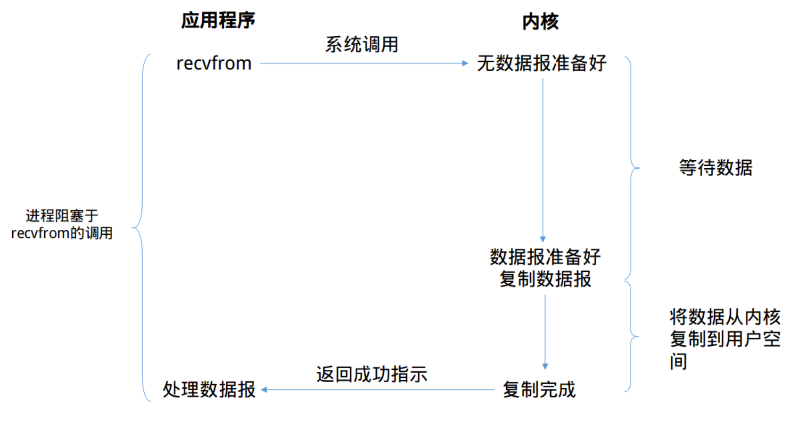
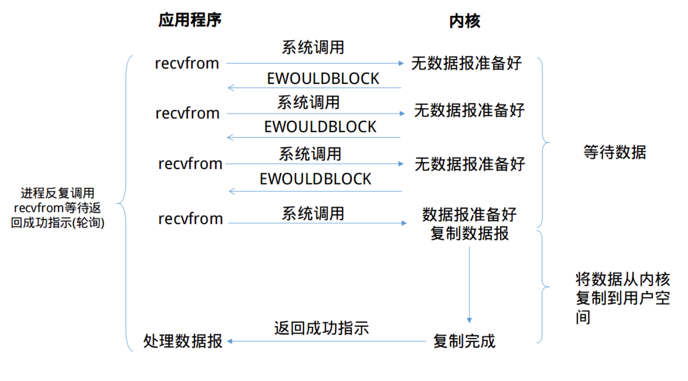
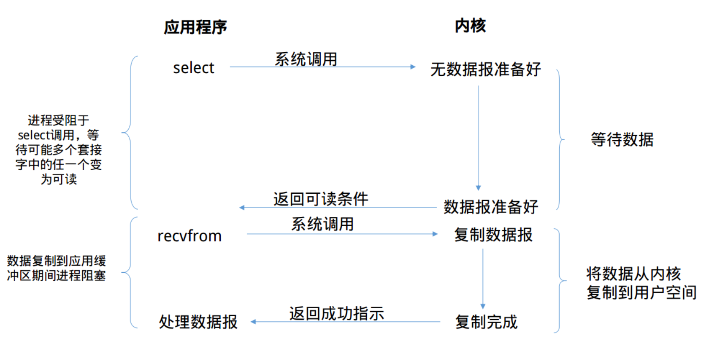
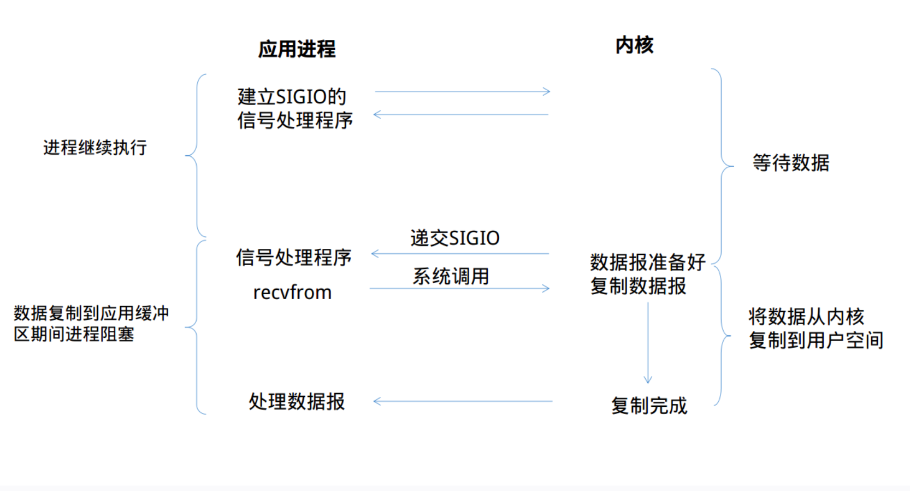
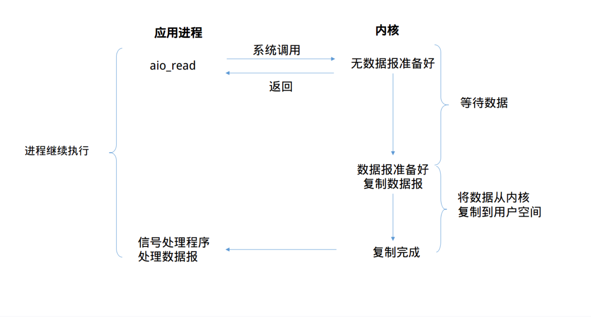

[TOC]


# coroutine 协程

协程是实现并发编程的一种方式。

协程相对于多线程，其为单线程

是一种可以暂停的函数，可以在暂停的地方传入值

协程需要配合事件循环来使用的


## 优势

协程解决了

1. 回调模式编写难的问题

2. 同步编程的并发性不高

3. 多线程编程需要线程间同步（Lock）的问题


实现了

1. 采用同步的方式编写异步代码
2. 使用单线程去切换任务


```
In [24]: import asyncio 
    ...:  
    ...:  
    ...: async def crawl_page(url): 
    ...:     print('crawling {}'.format(url)) 
    ...:     sleep_time = int(url.split('_')[-1]) 
    ...:     await asyncio.sleep(sleep_time) 
    ...:     print('OK {}'.format(url)) 
    ...:  
    ...:  
    ...: async def main(urls): 
    ...:     for url in urls: 
    ...:         await crawl_page(url) 
    ...:  
    ...: %time asyncio.run(main(['url_1', 'url_2', 'url_3', 'url_4'])) 
    ...:  

>>>
crawling url_1
OK url_1
crawling url_2
OK url_2
crawling url_3
OK url_3
crawling url_4
OK url_4
CPU times: user 2.16 ms, sys: 2.87 ms, total: 5.04 ms
Wall time: 10 s
```


## C10M问题

如何利用8核心CPU，64GB内存，在10Gbps的网络上保持1000万的并发连接


## 同步

代码调用IO操作时，必须等待IO操作完成才能返回


## 异步

代码调用IO操作时，不必等待IO操作完成返回


## 阻塞

调用函数时，当前线程被挂起


## 非阻塞

调用函数时，当前线程不会被挂起，而是立即返回


## async 

声明异步函数， 而调用异步函数，便可以得到一个协程对象coroutine object


## await 

可以通过await方法调用协程对象，await 执行的效果，和 Python 正常执行是一样的，也就是说程序会阻塞在这里，进入被调用的协程函数，执行完毕返回后再继续，而这也是 await 的字面意思

await是同步调用


# Unix下I/O 模型

## 阻塞式I/O （常用）

通常我们使用的I/O都是阻塞式I/O，在编程时使用的大多数也是阻塞式I/O。在默认情况下，所有的套接字(socket)都是阻塞的。

浪费时间很严重




**优点**
阻塞式I/O很容易上手，一般程序按照read-process的顺序进行处理就好。通常来说我们编写的第一个TCP的C/S程序就是阻塞式I/O模型的。并且该模型定位错误，在阻塞时整个进程将被挂起，基本不会占用CPU资源。

**缺点**
该模型的缺点也十分明显。作为服务器，需要处理同时多个的套接字，使用该模型对具有多个的客户端并发的场景时就显得力不从心。
当然也有补救方法，我们使用多线程技术来弥补这个缺陷。但是多线程在具有大量连接时，多线程技术带来的资源消耗也不容小看：

> 如果我们现在有1000个连接时，就需要开启1000个线程来处理这些连接，于是就会出现下面的情况
>
> - 线程有内存开销，假设每个线程需要512K的存放栈，那么1000个连接就需要月512M的内存。当并发量高的时候，这样的内存开销是无法接受的。
> - 线程切换有CPU开销，这个CPU开销体现在上下文切换上，如果线程数越多，那么大多数CPU时间都用于上下文切换，这样每个线程的时间槽会非常短，CPU真正处理数据的时间就会少了非常多。


## 非阻塞式I/O

有阻塞I/O，那么也会有非阻塞I/O，在上文说过默认情况下，所有的套接字都是阻塞的，那么通过设置套接字的NONBLOCK(一般在`open()`,`socket()`等调用中设置)标志或者设置`recv`、`send`等输入输出函数的**MSG_DONTWAIT**标志就可以实现非阻塞操作。



> 可以看到，前三次*recvfrom*时没有数据可以返回，此时内核不阻塞进程，转而立即返回一个**EWOULDBLOCK**错误。
>
> 第四次调用*recvfrom*时已经有一个数据报准备好了，此时它将被复制到应用进程的缓冲区，于是*recvfrom*调用成功返回。
> 当一个应用进程像这样对一个非阻塞描述符循环调用*recvfrom*时，我们称之为**轮询(polling)**

**优点**：
这种I/O方式也有明显的优势，即不会阻塞在内核的等待数据过程，每次发起的I/O请求可以立即返回，不用阻塞等待。在数据量收发不均，等待时间随机性极强的情况下比较常用。

**缺点**
轮询这一个特征就已近暴露了这个I/O模型的缺点。轮询将会不断地询问内核，这将占用大量的CPU时间，系统资源利用率较低。同时，该模型也不便于使用，需要编写复杂的代码。


## I/O复用

在出现大量的链接时，使用多线程+阻塞I/O的编程模型会占用大量的内存。那么I/O复用技术在内存占用方面，就有着很好的控制。
当前的高性能反向代理服务器**Nginx**使用的就是I/O复用模型(epoll),它以高性能和低资源消耗著称，在大规模并发上也有着很好的表现。




那到底什么是I/O复用(I/O multiplexing)。根据我的理解，复用指的是复用线程，从阻塞式I/O来看，基本一个套接字就霸占了整个线程。例如当对一个套接字调用*recvfrom*调用时，整个线程将被阻塞挂起，直到数据报准备完毕。
多路复用就是复用一个线程的I/O模型，Linux中拥有几个调用来实现I/O复用的系统调用——`select`,`poll`,`epoll`（Linux 2.6+）

线程将阻塞在上面的三个系统调用中的某一个之上，而不是阻塞在真正的I/O系统调用上。I/O复用允许对多个套接字进行监听，当有某个套接字准备就绪(可读/可写/异常)时，系统调用将会返回。
然后我们可能将重新启用一个线程并调用*recvfrom*来将特定套接字中的数据报从内核缓冲区复制到进程缓冲区。


**优点**
I/O复用技术的优势在于，只需要使用一个线程就可以管理多个socket，系统不需要建立新的进程或者线程，也不必维护这些线程和进程，所以它也是很大程度上减少了资源占用。
另外I/O复用技术还可以同时监听不同协议的套接字

**缺点**
在只处理连接数较小的场合，使用select的服务器不一定比多线程+阻塞I/O模型效率高，可能延迟更大，因为单个连接处理需要2次系统调用，占用时间会有增加。


## 信号驱动式I/O （使用少）

当然你可能会想到使用信号这一机制来避免I/O时线程陷入阻塞状态。那么内核开发者怎么可能会想不到。



> 首先开启套接字的信号驱动式I/O功能，并通过*sigaction*系统调用来安装一个信号处理函数，我们进程不会被阻塞。
> 当数据报准备好读取时，内核就为该进程产生一个**SIGIO**信号，此时我们可以在信号处理函数中调用*recvfrom*读取数据报，并通知数据已经准备好，正在等待处理。


**优点**
很明显，我们的线程并没有在等待数据时被阻塞，可以提高资源的利用率
**缺点**
其实在Unix中，信号是一个被过度设计的机制(这句话来自知乎大神,有待考究)
信号I/O在大量IO操作时可能会因为**信号队列溢出**导致没法通知——这个是一个非常严重的问题。


## 异步I/O 

前面说过这4种I/O模型都可以划分为同步I/O方式，那我们来看看为什么。
了解了４种I/O模型的调用过程后，我们可以注意到，在数据从内核缓冲区复制到用户缓冲区时，都需要进程显示调用*recvfrom*，并且这个复制过程是阻塞的。
也就是说真正I/O过程(这里的I/O有点狭义，指的是内核缓冲区到用户缓冲区)是同步阻塞的，不同的是各个I/O模型在数据报准备好之前的动作不一样。


异步I/O，是由POSIX规范定义的。这个规范定义了一些函数，这些函数的工作机制是：告知内核启动某个操作，并让内核在整个操作完成后再通知我们。(包括将数据从内核复制到我们进程的缓冲区)

POSIX的aio_系列函数， aio函数比较复杂

目前高并发框架并不使用aio，而都是io多路复用技术，成熟并稳定

异步I/O在Linux2.6才引入，而且到现在仍然未成熟。
虽然有知名的异步I/O库 `glibc`，但是听说`glibc`采用多线程模拟，但存在一些bug和设计上的不合理。




## IO多路复用（实际常用）

IO多路复用就是通过一种机制，一个进程可以监视多个描述符（socket），一旦某个描述符就绪（一般是读就绪或者是写就绪），能够通知程序进行相应的读写操作。

但select，poll， epoll本质上都是同步I/O，都需要读写事件就绪之后自己负责读写，即这个自己读写的过程是阻塞的。

而异步I/O（aio系列函数）则无需自己负责进行读写，异步I/O的实现会负责把数据从内核copy到用户空间


### select

select 函数监视的文件描述符为3类， writefsd， readfds，execptfds

调用后select函数会阻塞，直到有描述符就绪（即有数据读写，或者except）或者超时（timeout所指定的等待时间，如果立刻返回设置为null即可），函数返回。

select函数返回后，可以通过遍历所有的fdset找到就绪描述符


在并发不高，同时连接很活跃的情况下，select 比epoll要好


select目前几乎在所有平台上都支持

缺点是单个进程能够监视的文件描述符的数量存在最大限制，Linux一般是1024，可以通过修改宏定义甚至重新编译内核的方式提升限制，但是也会造成效率低下


### poll

不同于select使用三个位图来表示三个fdset的方式，poll使用一个pollfd的指针实现


pollfd结构包含了要监视的event和发生的event，不再适用select的参数-值的传递方式。

pollfd没有最大数量限制（但数量过大后性能也会下降）

和selec函数一样，poll返回后，需要轮询pollfd来获取就绪的socket，但事实上，同时连接的大量客户端再一个时刻只有很少的处于就绪状态，因此随着监视的socket数量增长，效率也会线性下降


### epoll （only Linux)

Linux 2.6 内核中提出，是之前select 和poll的增强版本。

epoll也没有最大socket的数量限制，epoll使用一个文件描述符，管理多个描述符，将用户关系的文件描述符的事件，存放到内核的一个事件表中，这样用户空间和内核空间的copy只需要一次即可

epoll的查询采用红黑树的方式提高效率


在高并发的情况下，连接活跃度不是很高（如网站访问），epoll比select 要好


#### 回调模式（不常用）

不停的请求socket的状态并调用对应的回调函数 (回调函数代码很难维护， 可读性差，异常处理困难)

select本身是不支持register 模式，socket 状态变化后的回调是由程序员完成的

```python
def loop():
    while not stop:
        ready = selector.select()
        for key, mask in ready:
            call_back = key.data
            call_back(key)
```

> 完成回调+事件循环+select(epoll), 只有一个线程，减少了线程切换的IO消耗，减少了内存的使用

# asyncio （异步IO并发）

由于多线程的局限性， （多线程运行中容易被打断，即出现race condition情况， 再者，线程切换本身存在一定的损耗， 线程数不能无限增加，若I/O操作非常频繁，多线程很可能满足不了高效率，高质量需求）

异步IO并发编程的核心模块， 产生来解决这些问题


Asyncio也是单线程的，只有一个主线程，可以进行多个不同的任务(就是future对象)， 不同的任务被event loop对象控制


## 特点

包含各种特定系统实现的模块化时间循环

对TCP， UDP， SSL， 子进程，延时调用以及其他的具体支持

模仿future 模块，但适用于时间循环使用的Future 类

基于yield from的协议和任务，可以用顺序的编码方式并发代码

必须使用一个将产生阻塞IO的调用时，有接口可以把这个时间转移到线程池

模仿threading模块中的同步语法，可以用在单线程内的协程之间


## 局限性

常用的requests库不兼容asyncio ，只能使用aiohttp库

pymysql， mysql-client 并不支持asyncio，所以并发性并不高

使用asyncio在任务调度有更多主权，但是逻辑书写要注意，很容易出错


## 上下文切换

操作系统及多线程/多进程中称为“上下文切换” (context switch)。其中“上下文”记录了某个线程执行的状态，包括线程里用到的各个变量，线程的调用栈等。而“切换”指的就是保存某个线程当前的运行状态，之后再从之前的状态中恢复。只不过线程相关的工作是由操作系统完成，而协程则是由应用程序自己来完成。

与线程不同的时，协程完成的功能通常较小，所以会有需求将不同的协程串起来，我们暂时称它为协程链 (coroutine chain)。


## hello world

```
import asyncio
import time


async def get_html(url):
    print("start get_html")
    await asyncio.sleep(2)
    print("end get_html")

if __name__ == '__main__':
    start_time = time.time()
    loop = asyncio.get_event_loop()
    tasks = [get_html("https://www.xurick.com") for i in range(10)]
    loop.run_until_complete(asyncio.wait(tasks))
    print(time.time()-start_time)
    
>>>
start get_html
start get_html
start get_html
start get_html
start get_html
start get_html
start get_html
start get_html
start get_html
start get_html
end get_html
end get_html
end get_html
end get_html
end get_html
end get_html
end get_html
end get_html
end get_html
end get_html
2.0054919719696045
```


## event loop

若任务有两个状态，

预备状态：任务当前空闲，随时准备运行。

等待状态：任务已经运行，但正在等待外部的操作完成，如I/O操作

event loop会维护这两个任务列表，并且选取预备状态的一个任务，使其运行，一直到把这个任务控制权交还给event loop 为止。

当任务把控制权交还给event loop， event loop会根据其是否完成，放置在不同的状态列表中，然后遍历等待状态列表中的任务，查看其是否完成。

* 完成就放到预备状态
* 未完成就继续放在等待状态

这样，所有任务被重新放置在合适的列表后，开始新的循环，直到所有任务完成。

根据event loop的特点， 任务运行时不会被外部的一些因素打断，因此Asyncio内的操作不会出现race condition情况，也就不会出现线程安全的问题


## create_task()

可以通过 asyncio.create_task() 来创建任务

asyncio.create_task(coro)表示对输入的协程 coro创建一个任务，安排其执行，并返回次任务对象

```
In [26]: import asyncio 
    ...:  
    ...:  
    ...: async def crawl_page(url): 
    ...:     print('crawling {}'.format(url)) 
    ...:     sleep_time = int(url.split('_')[-1]) 
    ...:     await asyncio.sleep(sleep_time) 
    ...:     print('OK {}'.format(url)) 
    ...:  
    ...:  
    ...: async def main(urls): 
    ...:     tasks = [asyncio.create_task(crawl_page(url)) for url in urls] 
    ...:     for task in tasks: 
    ...:         await task 
    ...:  
    ...: %time asyncio.run(main(['url_1', 'url_2', 'url_3', 'url_4'])) 
    ...:  
    ...:                                                                                              
crawling url_1
crawling url_2
crawling url_3
crawling url_4
OK url_1
OK url_2
OK url_3
OK url_4
CPU times: user 2.52 ms, sys: 1.77 ms, total: 4.29 ms
Wall time: 4.01 s
```


### add_done_callback()

协程实现callback函数, 即绑定特定回调函数获得返回值

```
In [29]: import asyncio 
    ...:  
    ...:  
    ...: async def crawl_page(url): 
    ...:     print('crawling {}'.format(url)) 
    ...:     sleep_time = int(url.split('_')[-1]) 
    ...:     await asyncio.sleep(sleep_time) 
    ...:     print('OK {}'.format(url)) 
    ...:  
    ...:  
    ...: async def main(urls): 
    ...:     tasks = [asyncio.create_task(crawl_page(url)) for url in urls] 
    ...:     for task in tasks: 
    ...:         task.add_done_callback(lambda future: print('result: ', future.result())) 
    ...:     await asyncio.gather(*tasks) 
    ...:  
    ...:  
    ...: %time asyncio.run(main(['url_1', 'url_2', 'url_3', 'url_4'])) 
    ...:  
    ...:                                                                                              
crawling url_1
crawling url_2
crawling url_3
crawling url_4
OK url_1
result:  None
OK url_2
result:  None
OK url_3
result:  None
OK url_4
result:  None
CPU times: user 2.12 ms, sys: 1.85 ms, total: 3.97 ms
Wall time: 4 s
```


## gather()

另一种task写法， 针对await的一系列操作，如果只是单个future，只用asyncio.wait() 即可

asyncio.gather(*coro, loop=None, return_exception=False) 表示在event loop中运行coro序列中的所有任务

```
In [27]: import asyncio 
    ...:  
    ...:  
    ...: async def crawl_page(url): 
    ...:     print('crawling {}'.format(url)) 
    ...:     sleep_time = int(url.split('_')[-1]) 
    ...:     await asyncio.sleep(sleep_time) 
    ...:     print('OK {}'.format(url)) 
    ...:  
    ...:  
    ...: async def main(urls): 
    ...:     tasks = [asyncio.create_task(crawl_page(url)) for url in urls] 
    ...:     await asyncio.gather(*tasks) 
    ...:  
    ...: %time asyncio.run(main(['url_1', 'url_2', 'url_3', 'url_4'])) 
    ...:  
    ...:                                                                                              
crawling url_1
crawling url_2
crawling url_3
crawling url_4
OK url_1
OK url_2
OK url_3
OK url_4
CPU times: user 2.56 ms, sys: 2.5 ms, total: 5.05 ms
Wall time: 4.01 s
```


## run()

asyncio.run 来触发运行, 是Asyncio的root call， 表示拿到event loop，直到结束才关闭这个event loop

asyncio.run 这个函数是 Python 3.7 之后才有的特性，可以让 Python 的协程接口变得非常简单，你不用去理会事件循环怎么定义和怎么使用的问题，一个非常好的编程规范是，asyncio.run(main()) 作为主程序的入口函数，在程序运行周期内，只调用一次 asyncio.run。


# 原理

```
import asyncio

async def worker_1():
    print('worker_1 start')
    await asyncio.sleep(1)
    print('worker_1 done')

async def worker_2():
    print('worker_2 start')
    await asyncio.sleep(2)
    print('worker_2 done')

async def main():
    print('before await')
    await worker_1()
    print('awaited worker_1')
    await worker_2()
    print('awaited worker_2')

%time asyncio.run(main())

>>>
before await
worker_1 start
worker_1 done
awaited worker_1
worker_2 start
worker_2 done
awaited worker_2
Wall time: 3 s
```


```
import asyncio

async def worker_1():
    print('worker_1 start')
    await asyncio.sleep(1)	# 2. 从当前任务切出，调度worker2  # 3. 事件调度器这时候开始暂停调度，等待1秒后，sleep完成，事件调度器控制器交给task1
    print('worker_1 done') # 4. 完成任务退出

async def worker_2():
    print('worker_2 start')
    await asyncio.sleep(2)	# 3. 从当前任务切出
    print('worker_2 done') # 6. 2秒后事件调度器将控制器交给task2， 输出结果

async def main():
    task1 = asyncio.create_task(worker_1()) 
    task2 = asyncio.create_task(worker_2())
    print('before await')
    await task1		# 1. 从main任务中切出，调度worker1
    print('awaited worker_1') # 5. 完成task1， 控制器交给主任务， 输出结果
    await task2 
    print('awaited worker_2') # 7. 输出结果，协程结束

%time asyncio.run(main())	

>>>

before await
worker_1 start
worker_2 start
worker_1 done
awaited worker_1
worker_2 done
awaited worker_2
Wall time: 2.01 s
```


## 错误处理

worker3执行过长会被cancel掉

```
import asyncio

async def worker_1():
    await asyncio.sleep(1)
    return 1

async def worker_2():
    await asyncio.sleep(2)
    return 2 / 0

async def worker_3():
    await asyncio.sleep(3)
    return 3

async def main():
    task_1 = asyncio.create_task(worker_1())
    task_2 = asyncio.create_task(worker_2())
    task_3 = asyncio.create_task(worker_3())

    await asyncio.sleep(2)
    task_3.cancel()

    res = await asyncio.gather(task_1, task_2, task_3, return_exceptions=True)
    print(res)

%time asyncio.run(main())

>>>

[1, ZeroDivisionError('division by zero'), CancelledError()]
Wall time: 2 s

```


## 生产者消费者模型

```
import asyncio
import random

async def consumer(queue, id):
    while True:
        val = await queue.get()
        print('{} get a val: {}'.format(id, val))
        await asyncio.sleep(1)

async def producer(queue, id):
    for i in range(5):
        val = random.randint(1, 10)
        await queue.put(val)
        print('{} put a val: {}'.format(id, val))
        await asyncio.sleep(1)

async def main():
    queue = asyncio.Queue()

    consumer_1 = asyncio.create_task(consumer(queue, 'consumer_1'))
    consumer_2 = asyncio.create_task(consumer(queue, 'consumer_2'))

    producer_1 = asyncio.create_task(producer(queue, 'producer_1'))
    producer_2 = asyncio.create_task(producer(queue, 'producer_2'))

    await asyncio.sleep(10)
    consumer_1.cancel()
    consumer_2.cancel()
    
    await asyncio.gather(consumer_1, consumer_2, producer_1, producer_2, return_exceptions=True)

%time asyncio.run(main())

>>>

producer_1 put a val: 5
producer_2 put a val: 3
consumer_1 get a val: 5
consumer_2 get a val: 3
producer_1 put a val: 1
producer_2 put a val: 3
consumer_2 get a val: 1
consumer_1 get a val: 3
producer_1 put a val: 6
producer_2 put a val: 10
consumer_1 get a val: 6
consumer_2 get a val: 10
producer_1 put a val: 4
producer_2 put a val: 5
consumer_2 get a val: 4
consumer_1 get a val: 5
producer_1 put a val: 2
producer_2 put a val: 8
consumer_1 get a val: 2
consumer_2 get a val: 8
Wall time: 10 s
```


# example


## 效率对比

```
import asyncio
import requests
from bs4 import BeautifulSoup

def main():
    url = "https://movie.douban.com/cinema/later/beijing"
    init_page = requests.get(url).content
    init_soup = BeautifulSoup(init_page, 'lxml')

    all_movies = init_soup.find('div', id='showing-soon')
    for each_movie in all_movies.find_all('div', class_="item"):
        all_a_tag = each_movie.find_all('a')
        all_li_tag = each_movie.find_all('li')

        movie_name = all_a_tag[1].text
        url_to_fetch = all_a_tag[1]['href']
        movie_date = all_li_tag[0].text
        
        response_item = requests.get(url_to_fetch).content
        soup_item = BeautifulSoup(response_item, 'lxml')
        img_tag = soup_item.find('img')
        print('{} {} {}'.format(movie_name, movie_date, img_tag['src']))

%time main()

>>>
CPU times: user 1.3 s, sys: 46.2 ms, total: 1.35 s
Wall time: 19.8 s
```


```
import asyncio, aiohttp
import time
from bs4 import BeautifulSoup

def cost_time(func):
    def wrapper(*args, **kwargs):
        start = time.perf_counter()
        res = func(*args, **kwargs)
        end = time.perf_counter()
        print('Time costs: {}s'.format(end - start))
        return res
    return wrapper


async def fetch_content(url):
    header={"User-Agent": "Mozilla/5.0 (Windows NT 6.1; Win64; x64) AppleWebKit/537.36 (KHTML, like Gecko) Chrome/74.0.3729.157 Safari/537.36"}
    async with aiohttp.ClientSession(
        headers=header,  connector=aiohttp.TCPConnector(ssl=False)
    ) as session:
        async with session.get(url) as response:
            return await response.text()
    
@cost_time
async def main():
    url = "https://movie.douban.com/cinema/later/beijing"
    init_page = await fetch_content(url)
    init_soup = BeautifulSoup(init_page, 'lxml')

    movie_names, urls_to_fetch, movie_dates = [], [], []

    all_movies = init_soup.find('div', id='showing-soon')
    for each_movie in all_movies.find_all('div', class_="item"):
        all_a_tag = each_movie.find_all('a')
        all_li_tag = each_movie.find_all('li')

        movie_names.append(all_a_tag[1].text)
        urls_to_fetch.append(all_a_tag[1]['href'])
        movie_dates.append(all_li_tag[0].text)

    tasks = [fetch_content(url) for url in urls_to_fetch]
    pages = await asyncio.gather(*tasks)

    for movie_name, movie_date, page in zip(movie_names, movie_dates, pages):
        soup_item = BeautifulSoup(page, 'lxml')
        img_tag = soup_item.find('img')
        print('{} {} {}'.format(movie_name, movie_date, img_tag['src']))

asyncio.run(main())

>>>
Time costs: 1.5269999948941404e-06s
```


# 多线程 vs Asyncio

```
if io_bound:
    if io_slow:
        print('Use Asyncio')
    else:
        print('Use multi-threading')
else if cpu_bound:
    print('Use multi-processing')
```

如果是 I/O bound，并且 I/O 操作很慢，需要很多任务 / 线程协同实现，那么使用 Asyncio 更合适。

如果是 I/O bound，但是 I/O 操作很快，只需要有限数量的任务 / 线程，那么使用多线程就可以了。

如果是 CPU bound，则需要使用多进程来提高程序运行效率。


# 多进程

```
import time
def cpu_bound(number):
    print(sum(i * i for i in range(number)))

def calculate_sums(numbers):
    for number in numbers:
        cpu_bound(number)

def main():
    start_time = time.perf_counter()  
    numbers = [10000000 + x for x in range(20)]
    calculate_sums(numbers)
    end_time = time.perf_counter()
    print('Calculation takes {} seconds'.format(end_time - start_time))
    
if __name__ == '__main__':
    main()

>>>
Calculation takes 17.826206894 seconds


```

