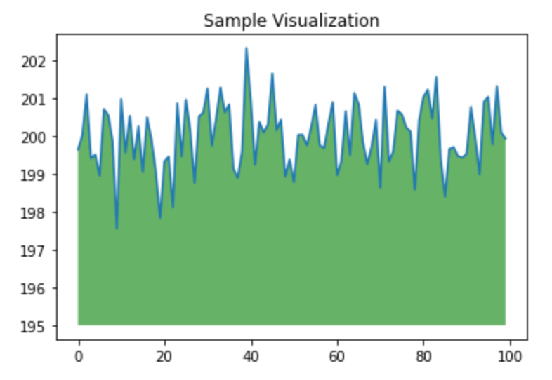
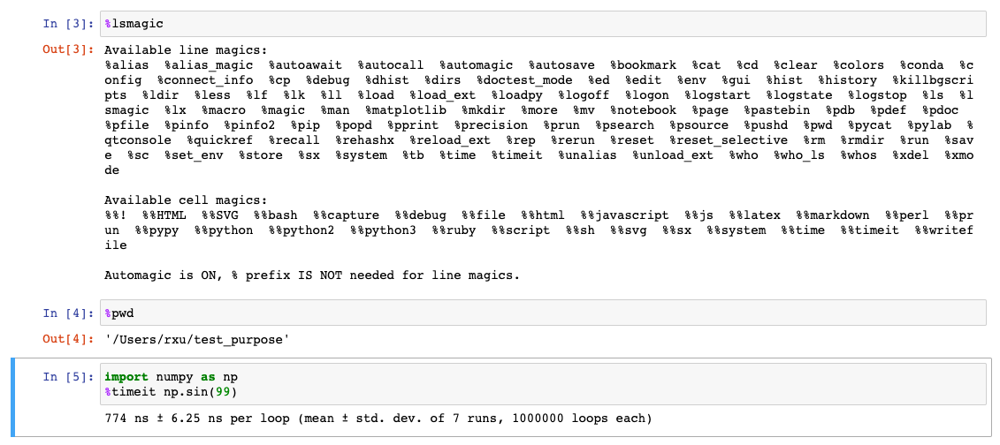

[TOC]


# Jupyter Notebook

综合Julia Python R 三种科学运算语言的计算工具平台


## Online Binder 工具 

https://ovh.mybinder.org/

https://github.com/jupyterhub/binderhub


## Online colab 工具

[https://colab.research.google.com](https://colab.research.google.com/)


## Colaboratory

Colaboratory是谷歌开发的在浏览器上运行Python的工具，其支持GPU和TPU。使用体验与Jupyter Notebook一致，但更方便。以我个人使用为例，它免费赠送12.72GB内存和107.77GB的硬盘。简单来说，它比一般的个人电脑要快。Colab支持付费版，性能更高。

https://colab.research.google.com/


# Installation


## Anaconda

We **strongly recommend** installing Python and Jupyter using the [Anaconda Distribution](https://www.anaconda.com/downloads), which includes Python, the Jupyter Notebook, and other commonly used packages for scientific computing and data science.

First, download Anaconda We recommend downloading Anaconda’s latest Python 3 version.


Mac OSX

```
wget https://repo.anaconda.com/archive/Anaconda3-2020.11-MacOSX-x86_64.pkg
```


Linux 

```
wget https://repo.anaconda.com/archive/Anaconda3-2020.11-Linux-x86_64.sh
```


Second, install the version of Anaconda which you downloaded, following the instructions on the download page.

Congratulations, you have installed Jupyter Notebook! To run the notebook, run the following command at the Terminal (Mac/Linux) or Command Prompt (Windows):

```
jupyter notebook
```


## pip

As an existing or experienced Python user, you may wish to install Jupyter using Python’s package manager, pip, instead of Anaconda.

If you have Python 3 installed (which is recommended):

```
python3 -m pip install --upgrade pip
python3 -m pip install jupyter
```

If you have Python 2 installed:

```
python -m pip install --upgrade pip
python -m pip install jupyter
```

Congratulations, you have installed Jupyter Notebook! To run the notebook, run the following command at the Terminal (Mac/Linux) or Command Prompt (Windows):

```
jupyter notebook
```


# Hello World

```
import numpy as np
from matplotlib import pyplot as plt

ys = 200 + np.random.randn(100)
x = [x for x in range(len(ys))]

plt.plot(x, ys, '-')
plt.fill_between(x, ys, 195, where=(ys > 195), facecolor='g', alpha=0.6)

plt.title("Sample Visualization")
plt.show()
```

> 


# 操作


## 新建单元格，自动补全 

按B（Below）键，在单元格下方新建单元格。

输入下方代码，按`Shift+Enter`执行单元格。试试在输入`np.lins`时按Tab键，Jupyter将自动补全代码


## 代码提示 

输入`myarray`，按`Alt+Enter`执行选中单元格，并在下方插入新的单元格。

我们将光标放在代码后方，按`Shift+Tab`查看代码提示。按**两次**`Shift+Tab`可查看代码详情。


## Markdown 

选中myarray单元格，按 `A` （Above）在myarray上方插入单元格，再按 `M` 将单元格格式转换为Markdown格式。

```
## markdown
在此处点击**Shift+Tab**可查看myarray数据类型。
```


新建Markdown代码格式单元格,输入下方文本将显示LaTeX公式

```
### variance 方差公式
$$s^2 = \frac{\sum_{i=1}^{n}{(x_i -x)^2}}{n}$$
(其中`x`为均值)
```

执行后会显示


## 魔法命令

输入`%lsmagic`查看所有可用魔法命令

其中比较常见的如 %pwd, %timeit等




