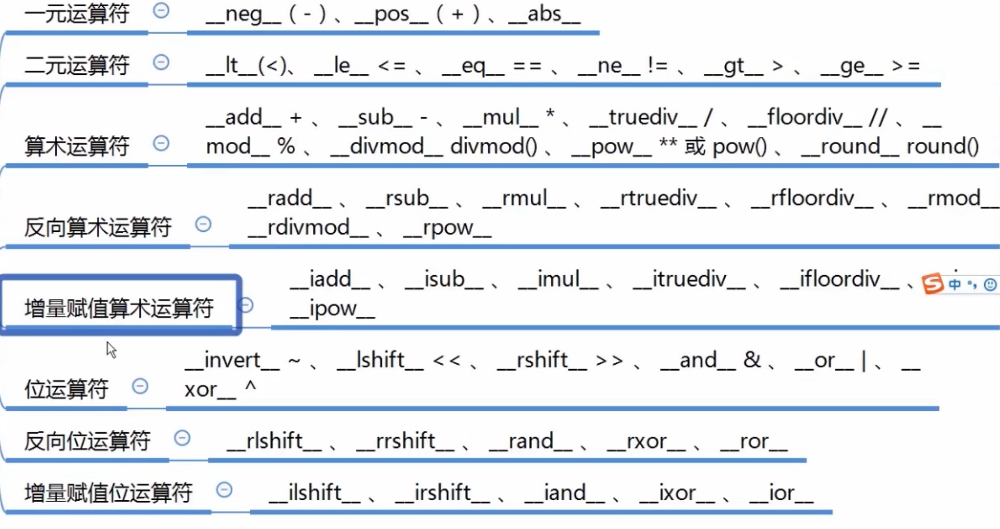

[TOC]

# 魔术方法和特殊方法


## 对象的创建与销毁

Python保留了有双前导和双末尾下划线的名称，用于特殊用途。

不建议自定义魔术方法，python 解释器会自动调用相应的魔术方法

`__new__` 创建对象
`__init__` 初始化对象
`__del__` 销毁对象 （销毁对象时调用）

```python
class A:
    def __new__(cls):
        print('call __new__')
        return object.__new__(cls)

    def __init__(self):
        print('call __init__')

    def method(self):
        print('call method')

    def __del__(self):
        print('call __del__')

a = A()

a.method()

del a
>>>
call __new__
call __init__
call method
call __del__
```

### 可视化对象

```python
class A:
    def __init__(self, name):
        self.name = name

    def __repr__(self):
        return self.name

    def __str__(self):
        return 'call __str__ name is {0}'.format(self.name)

    def __bytes__(self):
        return 'call __bytes__ name is {0}'.format(self.name).encode('utf-8')

a = A('Rick')

#其实调用的是print(repr(a))
print(a)
print(str(a))
print(bytes(a))
>>>
call __str__ name is Rick
call __str__ name is Rick
b'call __bytes__ name is Rick'
```

内置变量属性（魔法方法）

以前后双下划线显示


# 非数学计算分类


## 字符串表示


### `__str__` 默认输出其返回值

如果一个类中定义了`__str__`方法，那么在打印 对象时，默认输出该方法的返回值。

```
class A:

    def __str__(self):
        return &#39;Rick&#39;

obj = A()
print(obj)
>>>
Rick
```


### `__repr__` 开发的时候使用

`__repr__`和`__str__`这两个方法都是用于显示的，`__str__`是面向用户的，而`__repr__`面向程序员。

打印操作会首先尝试`__str__`和str内置函数(print运行的内部等价形式)，它通常应该返回一个友好的显示。`__repr__`用于所有其他的环境中：用于交互模式下提示回应以及repr函数，如果没有使用`__str__`，会使用print和str。它通常应该返回一个编码字符串，可以用来重新创建对象，或者给开发者详细的显示。

当我们想所有环境下都统一显示的话，可以重构`__repr__`方法；当我们想在不同环境下支持不同的显示，例如终端用户显示使用`__str__`，而程序员在开发期间则使用底层的`__repr__`来显示，实际上`__str__`只是覆盖了`__repr__`以得到更友好的用户显示。


## 集合序列相关


### `__len__`

```
len([1, 2, 3])
# 实际上是调用的
[1, 2, 3].__len__()
```


### `__getitem__` `__setitem__` `__delitem__`

用于索引操作，如字典。以上分别表示获取、设置、删除数据

```
class A:

    def __getitem__(self, item):
        print(item)

    def __setitem__(self, key, value):
        print(key, value)

    def __delitem__(self, key):
        print(key)

obj = A()

ret = obj['key1'] # 自动触发执行 __getitem__
objobj['key1'] = 'Value2'  # 自动触发执行 __getitem__
del obj['key1']    # 自动触发执行 __getitem__
>>>
key1
key2 Value2
key1
```


表元素引用方式, 调用`__getitem__()`方法

```
In [1]: li = [1, 2, 3, 4, 5]

In [2]: li[3]
Out[2]: 4

In [3]: li.__getitem__(3)
Out[3]: 4
```


### `__contains__`


## 迭代相关

### `__iter__`

可迭代对象都有这个方法

用于迭代器，之所以列表、字典、元组可以进行for循环，是因为类型内部定义了 `__iter__`

```
class A:

    def __init__(self, sq):
        self.sq = sq

    def __iter__(self):
        return iter(self.sq)

obj = A([1, 2, 3, 4])

for i in obj:
    print(i)

>>>
1
2
3
4
```


#### 实现m生成器

将`__iter__` 方法实现成生成器函数， 每次yield 返回一个素数

```
class PrimeNum:
    def __init__(self, start, end):
        self.start = start
        self.end = end 

    def Is_Prime_num(self, k):
        if k < 2:
            return False

        for i in range(2, k):
            if k % i == 0:
                return False
        return True

    def __iter__(self):
        for k in range(self.start, self.end + 1):
            if self.Is_Prime_num(k):
                yield k 

for x in PrimeNum(1, 20):
    print(x)

>>>
2
3
5
7
11
13
17
19
```


### `__next__`

返回下一个迭代数据的

实现迭代器必须要要实现该方法


## 可调用


### `__call__`

对象后面加括号，触发执行

构造方法的执行是由创建对象触发的，即：对象 = 类名() ；

而对于 `__call__` 方法的执行是由对象后加括号触发的，即：对象() 或者 类()()

```
class A:

    def __init__(self):
        pass

    def __call__(self, *args, **kwargs):
        print('__call__')

obj = A()
obj()
>>>
__call__
```


```
class InjectUser:
    def __init__(self, default_user):
        self.user = default_user

    def __call__(self, fn):
        def wrap(*args, **kwargs):
            if 'user' not in kwargs.keys():
                kwargs['user'] = self.user
            return fn(*args, **kwargs)
        return wrap

@InjectUser('Rick')
def do_something(*args, **kwargs):
    print(kwargs.get('user'))

do_something()
>>>
Rick
```


## with 上下文管理器


### `__enter__` ,  `__exit__`

with 语句可以自动关闭资源

任何定义了`__enter__()` 和`__exit__()`方法的对象都可以用于上下文管理器。文件对象f是内置对象，所以f自动带有这两种特殊方法

```python
class Resource:
    def __init__(self):
        print('init')

    def __enter__(self):
        print('enter')
        print(self)
        return self

    def __exit__(self, *args, **kwargs):
        print('exit')

with Resource() as res:
    print(res)
>>>
init
enter
<__main__.Resource object at 0x103995da0>
<__main__.Resource object at 0x103995da0>
exit
```


## 数值转换


### `__abs__`

```
class Nums:
    def __init__(self, num):
        self.num = num

    def __abs__(self):
        return abs(self.num)

my_num = Nums(-1)
abs(my_num)

>>>
1
```


### `__bool__`

```python
class Grok:
    def __init__(self, val):
        self.val = val

    def __bool__(self):
        return not self.val

grok1 = Grok(True)
grok2 = Grok(False)

print(bool(grok1))
print(bool(grok2))
>>>
False
True
```

```python
class LIST:
    def __init__(self, *args):
        self.val = args

    def __len__(self):
        return len(self.val)

lst = LIST(1, 2, 3)
lst2 = LIST()

print(len(lst))
print(len(lst2))
>>>
3
0
```


### `__int__`


### `__float__`


### `__hash__`

```
class Grok:
    def __init__(self, val):
        self.val = val

    def __hash__(self):
        return id(self.val)

grok = Grok(123)
print(hash(grok))

>>>
4306027616
```


### `__index__`


### 

## 元类相关

### `__new__`

控制对象的生成过程，即当前对象创建之前的时候，会被调用。可以添加一些生成对象的逻辑

先调用`__new__`, 完成表示对象创建完成，然后调用`__init__` 方法实例化

```python
class Student(object):
    def __new__(cls, *args, **kwargs):
        print(args, kwargs)
        return object.__new__(cls)

    def __init__(self, name, age):
        print('Initializing')
        self.name = name
        self.age = age

student = Student('Rick Xu', 18)

>>>
('Rick Xu', 18) {}
Initializing
```

> new 方法必须返回，相当于创建对象，否则不会调用`__init__`  函数

## 

### `__init__`

构造函数, 通过类创建对象时，自动触发执行， 用于初始化类的特征值或属性值

不能有返回值，也就是None， 而且只能返回None

```python
class ClassName:
    def __init__(self):
        pass
```

```python
class MyString:
    def __init__(self):      # __init__构造函数, 通过构造函数对类进行初始化操作
        self.str = "MyString"

    def output(self):
        print(self.str)

s = MyString()
s.output()
>>>
MyString
```

构造方法无参数，可以省略构造方法

```
class A:
    __val = 3

    def get_val(self):
        return self.__val

a = A()
print(a.get_val())
a.__val
>>>
Traceback (most recent call last):
  File "/Users/xhxu/python/python3/test/9.py", line 9, in <module>
    a.__val
AttributeError: &#39;A&#39; object has no attribute &#39;__val&#39;
3
```

该模块中的代码在导入的时候会被自动执行，可以在其内部写入复用导入的模块名称

```
import os
import sys
import datetime
```

## 


## 属性相关


### `__getattr__`

`__getattr__(self, name)` 来查询即时生成的属性。

如果通过`__dict__`方法无法找到改属性，Python会调用`__getattr__`方法来即时生成属性。

```
class Bird(object):
    feather = True


class Chicken(Bird):
    fly = False
    def __init__(self, age):
        self.age = age

    def __getattr__(self, item):
        if item == 'adult':
            if self.age > 1.0:
                return True
            else:
                return False
        raise AttributeError(item)

summer = Chicken(2)
print(summer.adult)
summer.age = 0.5
print(summer.adult)
>>>
True
False
```


#### url 案例

```
class UrlGenerator(object):
    def __init__(self, root_url):
        self.url = root_url

    def __getattr__(self, item):
        if item == 'get' or item == 'post':
            print self.url
        return UrlGenerator('{}/{}'.format(self.url, item))


url_gen = UrlGenerator('http://xxxx')
url_gen.users.show.get

>>> 
http://xxxx/users/show
```


### `__setattr__`

`__setattr__(self, name, value)` 
可用于修改属性，可用于任意属性


### `__delattr__`

`__delattr__(self, name)` 
可用于删除属性，可用于任意属性。


### `__getattribute__ `（不建议修改）

属性访问入口，优先级高于`__getattr__` , 无论属性是否存在都会被调用

一般编写框架的时候使用


### `__setattribute__`


### `__dir__`


## 描述器/属性描述符

### `__get__`, `__set__`,  `__delete__`

实现了`__get__`, `__set__`, `__delete__` 的方法成为描述器

只实现了`__get__` 成为非属性描述符

可以对输入的数据进行校验

```python
class Number:

    def __init__(self, name):
        self.name = name

    def __get__(self, instance, cls):
        print('get name', self.name)
        if instance is not None:
            return instance.__dict__[self.name]

    def __set__(self, instance, value):
        print('set value: ', value)
        if isinstance(value, (int, float)):
            instance.__dict__[self.name] = value
        else:
            raise TypeError('excepted int or float')

    def __delete__(self, instance):
        print('delete name', self.name)
        del instance.__dict__[self.name]

class Point:
    x = Number('x')
    y = Number('y')
    def __init__(self, x, y):
        self.x = x
        self.y = y

point = Point(1, 2)

print(point.x)  # 其调用Point.x.__get__(point, Point)
print(point.y)

>>>
set value:  1
set value:  2
get name x
1
get name y
2
```


## 协程


### `__await__`


### `__aiter__`


### `__anext__`


### `__aenter__`


### `__aexit__`


## 其他

### `__all__`

指定所导入的变量

```
__all__ = ['a', 'b']
__all__ = ['Module1', 'Module2']
```

指定可导入的模块


### `__dict__` 对象所有变量

类或对象中的所有的变量信息

对象的属性可能来自与其类定义，叫做类属性(class attribute)。

类属性可能来自类定义自身，也可能根据类定义继承来的。一个对象的属性还可能是该对象实例定义的，叫做对象属性(object attribute)

对象的属性存储在对象的`__dict__`属性中，`__dict__`为一个词典，键为属性名，对应的值为属性本身。

```
class bird(object):
    feather = True

class chicken(bird):
    fly = False
    def __init__(self, age):
        self.age = age

summer = chicken(2)

print(bird.__dict__)
print(chicken.__dict__)
print(summer.__dict__)

# 利用__class__属性找到对象的类，然后调用类的__base__属性来查询父类
summer.__dict__['age'] = 3
print(summer.__dict__['age'])

summer.age = 5
print(summer.age)

>>>
{'__module__': '__main__', 'feather': True, '__dict__': <attribute '__dict__' of 'bird' objects>, '__weakref__': <attribute '__weakref__' of 'bird' objects>, '__doc__': None}
{'__module__': '__main__', 'fly': False, '__init__': <function chicken.__init__ at 0x109f9fea0>, '__doc__': None}
{'age': 2}
3
5
```

```
class Exam:
    &#39;hahaha&#39;

    def __init__(self, name, score):
        self.name = name
        self.score = score
        Exam.name = "hehehe"

print(Exam.__dict__)
>>>
{&#39;__module__&#39;: &#39;__main__&#39;, &#39;__weakref__&#39;: <attribute &#39;__weakref__&#39; of &#39;Exam&#39; objects>, &#39;__dict__&#39;: <attribute &#39;__dict__&#39; of &#39;Exam&#39; objects>, &#39;__init__&#39;: <function Exam.__init__ at 0x10f056488>, &#39;__doc__&#39;: &#39;hahaha&#39;}
```

### `__doc__` 类的文档字符串

```
class Exam:
    &#39;hahaha&#39;

    def __init__(self, name, score):
        self.name = name
        self.score = score
        Exam.name = "hehehe"

print(Exam.__doc__)
>>>
hahaha
```


### `__name__` 模块对象的名称

类名， 即模块对象的名称， Python的魔术内置参数，即被赋值为该模块的名字

查询对象所属的类和类名称

```
In [12]: a = [1, 2, 3]

In [13]: print(a.__class__)
<class 'list'>

In [15]: print(a.__class__.__name__)
list
```


### `__module__`

`__module__`: 类定义所在的模块（类的全名是'`__main__`.className'，如果类位于一个导入模块mymod中，那么className.`__module__` 等于 mymod）

```
class Exam:
    &#39;hahaha&#39;

    def __init__(self, name, score):
        self.name = name
        self.score = score
        Exam.name = "hehehe"

print(Exam.__module__)
>>>
__main__
```


### `__bases__`

`__bases__` : 类的所有父类构成元素（包含了一个由所有父类组成的元组）

```
class Exam:
    &#39;hahaha&#39;

    def __init__(self, name, score):
        self.name = name
        self.score = score
        Exam.name = "hehehe"

print(Exam.__bases__)
>>>
(<class &#39;object&#39;>,)
```


### `__class__`

表示当前操作的对象的类是什么, 指向当前类

```
class A:

    def __init__(self):
        self.name = &#39;Rick&#39;


obj = A()
print(obj.__class__)
>>>
<class &#39;__main__.A&#39;>
```


### `__del__` 销毁对象

析构方法，当对象在内存中被释放时，自动触发执行。

通常用于收尾工作，如数据库链接打开的临时文件

```python
class MyString:
    def __init__(self):  #构造函数
        self.str = "MyString"
    def __del__(self):   #析构函数
        print("Bye")

    def output(self):
        print(self.str)

s = MyString()

s.output()
del s   # 删除对象
>>>
MyString
Bye
```

> 此方法一般无须定义，因为Python是一门高级语言，程序员在使用时无需关心内存的分配和释放，因为此工作都是交给Python解释器来执行，所以，析构函数的调用是由解释器在进行垃圾回收时自动触发执行的。


## 

### `__slots__` 限定绑定属性

动态语言允许我们在程序运行时给对象绑定新的属性或方法，当然也可以对已经绑定的属性和方法进行解绑定。

但是如果我们需要限定自定义类型的对象只能绑定某些属性，可以通过在类中定义`__slots__`变量来进行限定。

需要注意的是`__slots__`的限定只对当前类的对象生效，对子类并不起任何作用。

```python
class Student(object):
    __slots__ = ("name", "age")

    def __init__(self, name, age):
        self.name = name
        self.age = age

student = Student('Rick Xu', 18)

student.gender = 'Male'

>>>
Traceback (most recent call last):
  File "c1.py", line 10, in <module>
    student.gender = 'Male'
AttributeError: 'Student' object has no attribute 'gender'
```


### `__import__` 动态加载类和函数

如果一个模块经常变化就可以使用 `__import__()` 来动态载入

```
__import__(name[, globals[, locals[, fromlist[, level]]]])
```

```
a.py
### 
#!/usr/bin/env python    
#encoding: utf-8  

import os  

print ('在 a.py 文件中 %s' % id(os))
```

```
test.py
###
#!/usr/bin/env python    
#encoding: utf-8  

import sys  
__import__('a')        # 导入 a.py 模块

>>>
在 a.py 文件中 4394716136
```


# 数学运算分类




### `__lt__` , `__le__`, `__eq__`, `__ne__`, `__gt__`, `__ge__`

```
class Person:
    def __init__(self, age):
        self.age = age

    def __lt__(self, other):
        print('lt')
        return self.age < other.age

    def __le__(self, other):
        print('le')
        return self.age <= other.age

    def __eq__(self, other):
        print('eq')
        return self.age == other.age

    def __ne__(self, other):
        print('ne')
        return self.age != other.age

    def __gt__(self, other):
        print('gt')
        return self.age > other.age

    def __ge__(self, other):
        print('ge')
        return self.age >= other

p1 = Person(18)

p2 = Person(13)

print(p1 > p2)
print(p1 < p2)

>>>
gt
True
lt
False
```


### `__add__`

在Python中，运算符也是通过相应函数实现的

运算符对应的其实就是类中的一些魔术方法（专有方法）。比如加、减、乘、除对应的就是`__add__`、`__sub__`、`__mul__`、`__div__`

```
class Mylist(object):

    def __init__(self, *args):
        self.__mylist= []
        for arg in args:
            self.__mylist.append(arg)

    def __add__(self, other):
        for i in range(len(self.__mylist)):
            self.__mylist[i] = self.__mylist[i] + other

    def show(self):
        print(self.__mylist)


l = Mylist(1, 2, 3, 4)
l.show()
l + 10
l.show()
>>>
[1, 2, 3, 4]
[11, 12, 13, 14]
```


# 反射

过字符串映射或修改程序运行时的状态、属性、方法,

## getattr

getattr 可以拿到对象所对应的属性的值

```
getattr(object, name, default=None)
```


一般情况我们这么用getattr(object,name)。一般来说这里的object是对象，name传的是字符串。

对又是什么呢？可以简单的理解为：在import 引入模块时，通过dir可查询的目标就是对象，而查询得到的结果就是属性，属性就是getattr用法中name部分传入的值。

```
>>> class test:
...     cal=1
...
>>> getattr(test,"cal")
1
>>> test.cal
```

```
>>> dir(test)
['__doc__', '__module__', 'cal']
>>> getattr(test,__doc__)
Traceback (most recent call last):
  File "<stdin>", line 1, in <module>
TypeError: getattr(): attribute name must be string
>>> getattr(test,'__doc__')
```


## hasattr

```
hasattr(object,name)
```


## setattr

```
setattr(object, name, value)
```


```
In [2]: class A: 
   ...:     bar = 1 
   ...:                                                                             

In [3]: a = A()                                                                     

In [4]: setattr(a, 'bar', 5)                                                        

In [5]: a.bar                                                                       
Out[5]: 5

# 若key不存在，会创建新的对象属性
In [6]: setattr(a, 'Age', 31)                                                       

In [7]: a.Age                                                                       
Out[7]: 31
```


## delattr

delattr(x, y)

## 


# property 装饰器的实现

通过描述器实现

描述器就是一个传递协议

```python
class Property:
    def __init__(self, fget=None, fset=None, fdel=None):
        self.fget = fget
        self.fset = fset
        self.fdel = fdel

    def __get__(self, instance, cls):
        if self.fget is not None:
            return self.fget(instance)

    def __set__(self, instance, value):
        if self.fset is not None:
            return fset(instance, value)

    def __delete__(self, instance):
        if self.fdel is not None:
            return fdel(instance)

    def getter(self, fn):
        self.fget = fn

    def setter(self, fn):
        self.fset = fn

    def deler(self, fn):
        self.fdel = fn

class Spam:
    def __init__(self, val):
        self.__val = val

    @property
    def val(self):
        return self.__val

    @val.setter
    def val(self, value):
        self.__val = value

s = Spam(3)
print(s.val)
>>>
3
```

## 