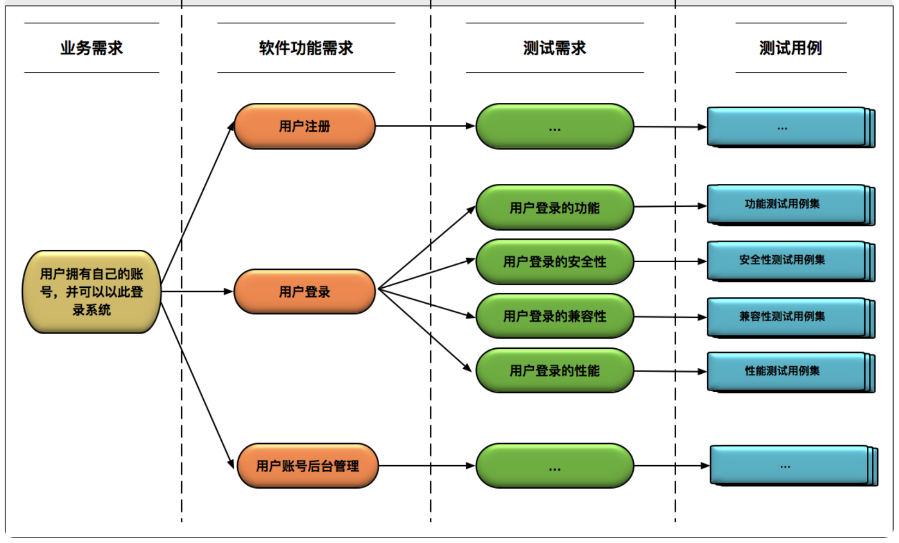
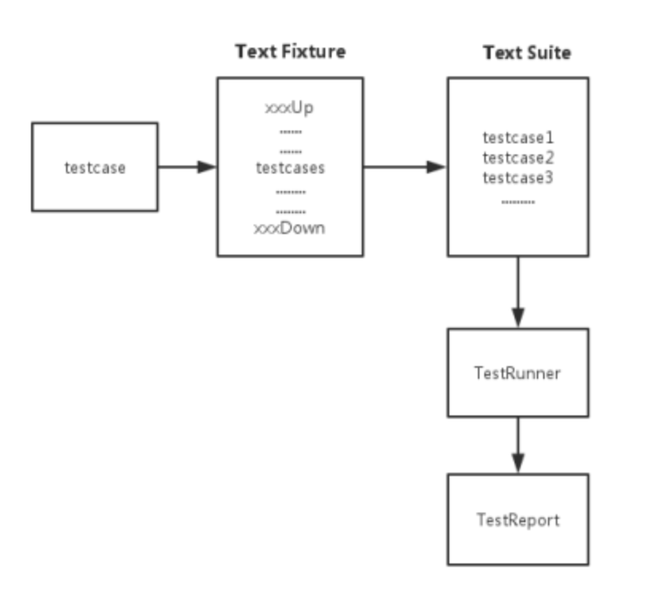

[TOC]


# 软件测试

等价类划分方法，是将所有可能的输入数据划分成若干个子集，在每个子集中，如果任意一个输入数据对于揭露程序中潜在错误都具有同等效果，那么这样的子集就构成了一个等价类。后续只要从每个等价类中任意选取一个值进行测试，就可以用少量具有代表性的测试输入取得较好的测试覆盖结果。

边界值分析方法，是选取输入、输出的边界值进行测试。因为通常大量的软件错误是发生在输入或输出范围的边界上，所以需要对边界值进行重点测试，通常选取正好等于、刚刚大于或刚刚小于边界的值作为测试数据。


## 好的测试

一个“好的”测试用例，必须具备以下三个特征。

整体完备性： “好的”测试用例一定是一个完备的整体，是有效测试用例组成的集合，能够完全覆盖测试需求。

等价类划分的准确性： 指的是对于每个等价类都能保证只要其中一个输入测试通过，其他输入也一定测试通过。

等价类集合的完备性： 需要保证所有可能的边界值和边界条件都已经正确识别。





# 单元测试

单元测试，通俗易懂地讲，就是编写测试来验证某一个模块的功能正确性，一般会指定输入，验证输出是否
符合预期


“预计输出” 绝对不是只有函数返回值这么简单，还应该包括函数执行完成后所改写的所有数据

具体来看有以下几大类

被测试函数的返回值；被测试函数的输出参数；被测试函数所改写的成员变量；被测试函数所改写的全局变量；被测试函数中进行的文件更新；被测试函数中进行的数据库更新；被测试函数中进行的消息队列更新；


## 流程

并不是所有的代码都要进行单元测试，通常只有底层模块或者核心模块的测试中才会采用单元测试。

为了能够衡量单元测试的代码覆盖率，通常你还需要引入计算代码覆盖率的工具

最后你需要把单元测试执行、代码覆盖率统计和持续集成流水线做集成，以确保每次代码递交，都会自动触发单元测试，并在单元测试执行过程中自动统计代码覆盖率，最后以“单元测试通过率”和“代码覆盖率”为标准来决定本次代码递交是否能够被接受。


## 实践注意点

单元测试本身并不复杂，但在实践中又经常需要十填许多坑，如：事务的传递可能导致单元测试结束后事务回滚失败（若用内存数据库又存在解决sql兼容性的烦恼），多线程执行单元测试导致测试结果不正确，对第三方接口做mock困难，实现逻辑中会周期性计划任务的功能也不好做单元测试。

涉及数据库的单元测试建议不要操作真实的数据库，而是使用dbmock。


# 结构




## TestCase 测试用例

TestCase是创建不同的测试用例的父类


### setUp 

单元测试顺利运行的预备方法。

每次执行测试用例之前调用。无参数，无返回值。该方法抛出的异常都视为error，而不是测试不通过。没有默认的实现

**每个测试case运行前**运行

### setUpClass

setUpClass():必须使用@classmethod 装饰器,**所有case运行前只运行一次**


### tearDown 

单元测试顺利运行的预备方法。

每次执行测试用例之后调用。无参数，无返回值。测试方法抛出异常，该方法也正常调用，该方法抛出的异常都视为error，而不是测试不通过。只要setUp()调用成功，该方法才会被调用。没有默认的实现。通过setup 和 tesrDown组装一个module成为一个固定的测试装置。

**每个测试case运行完后**执行


### tearDownClass

tearDownClass():必须使用@classmethod装饰器,**所有case运行完后只运行一次**


## TestSuite 测试套件

测试套件也可以表示其他测试套件的集合。unittest.TestSuite 为创建测试套件提供了一个父类。TestSuite没有定义任何的单元测试，它只将单元测试或其他测试套件聚集起来。


```
import unittest

class MyUnitTestA(unittest.TestCase):
    def test_a2(self):
        print('This is test_a2')
        self.assertNotEqual(4*4, 19)

    def test_a1(self):
        print('This is test_a1')
        self.assertTrue(4+4 == 8)

    def will_not_be_called_by_default(self):
        print('This method will not be called by default')


class MyUnitTestB(unittest.TestCase):
    def test_b2(self):
        print('This is test_b2')
        self.assertNotEqual(4*4, 19)

    def test_b1(self):
        print('This is test_b1')
        self.assertTrue(4+4 == 8)

    def not_be_called_by_default(self):
        print('This method will not be called by default')


def suite():
    print("Inside suite()")

    suite_a = unittest.makeSuite(MyUnitTestA)

    suite_b = unittest.makeSuite(MyUnitTestB)

    suite_b.addTest(MyUnitTestB("not_be_called_by_default"))

    return unittest.TestSuite((suite_a, suite_b))


if __name__ == "__main__":
    unittest.main(defaultTest='suite')
    
>>>
Inside suite()
This is test_a1
.This is test_a2
.This is test_b1
.This is test_b2
.This method will not be called by default
.
----------------------------------------------------------------------
Ran 5 tests in 0.000s

OK
```


# Hello World

```
import unittest
# 将要被测试的排序函数 
  def sort(arr):
      l = len(arr)
      for i in range(0, l):
          for j in range(i + 1, l):
              if arr[i] >= arr[j]:
                  tmp = arr[i]
                  arr[i] = arr[j]
                  arr[j] = tmp

# 编写子类继承unittest.TestCase 
class TestSort(unittest.TestCase):  # 以test开头的函数将会被测试, 即只有test开头才会被测试
		def test_sort(self):
				arr = [3, 4, 1, 5, 6]
				sort(arr)
				# assert 结果跟我们期待的一样 
				self.assertEqual(arr, [1, 3, 4, 5, 6])

if __name__ == '__main__':
		## 如果在Jupyter下，请用如下方式运行单元测试 
		unittest.main(argv=['first-arg-is-ignored'], exit=False)
# 如果是命令行下运行，则: 
		## unittest.main()

>>>
Ran 2 tests in 0.002s
OK
```


```
import unittest

class MyTestCase(unittest.TestCase):  # 继承unittest.TestCase

    @classmethod
    def setUpClass(cls):
        # 必须使用 @classmethod 装饰器,所有test运行前运行一次
        print('这是所有case的前置条件')

    @classmethod
    def tearDownClass(cls):
        # 必须使用 @classmethod 装饰器, 所有test运行完后运行一次
        print('这是所有case的后置条件')

    def setUp(self):
        # 每个测试用例执行之前的操作
        print('这是每条case的前置条件')

    def tearDown(self):
        # 每个用例执行之后的操作
        print('这是每条case的后置条件')

    def test_Third(self):  # 测试用例的命名必须以test开头，否则不予执行
        print('03: 第三条case')

    def test_First(self):
        print('01: 第一条case')

    @unittest.skip('不执行这条case')  # 跳过这条case
    def test_Second(self):
        print('02: 第二条case')

    def test_Fourth(self):
        print('04: 第四条case')


if __name__ == '__main__':
    # unittest.main() # 使用main()直接运行时，将按case的名称顺序执行
    suite = unittest.TestSuite()
    suite.addTest(MyTestCase("test_Third"))  # 将需要执行的case添加到Test Suite中，没有添加的不会被执行
    suite.addTest(MyTestCase("test_Second"))
    suite.addTest(MyTestCase("test_First"))
    runner = unittest.TextTestRunner()
    runner.run(suite)  # 将根据case添加的先后顺序执行
```


## patching itself

```
>>> import unittest
>>> class MyTest(unittest.TestCase):
...     exists_patcher = mock.patch.object(MyClass, 'file_exists')
...
...     def setUp(self):
...         self.mock_exists = self.exists_patcher.start()
...         self.mock_exists.return_value = False
...
...     def tearDown(self):
...         self.exists_patcher.stop()
...
...     def test_process_file(self):
...         my_obj = MyClass()
...         my_obj.process_file('my_file')
...         my_obj.file_exists.assert_called_once_with('my_file')
...
>>> MyTest('test_process_file').run()
```


```
>>> class MyTest(unittest.TestCase):
...     exists_patcher = mock.patch.object(MyClass, 'file_exists')
...     process_file_patcher = mock.patch.object(MyClass, 'process_file')
...
...     def setUp(self):
...         self.mock_exists = self.exists_patcher.start()
...         self.mock_process_file = self.process_file_patcher.start()
...
...     def tearDown(self):
...         mock.patch.stopall()
```


# 分类及特点

小型测试，针对单个函数的测试，关注其内部逻辑，mock所有需要的服务。小型测试带来优秀的代码质量、良好的异常处理、优雅的错误报告

中型测试，验证两个或多个制定的模块应用之间的交互

大型测试，也被称为“系统测试”或“端到端测试”。大型测试在一个较高层次上运行，验证系统作为一个整体是如何工作的


## 集成测试

集成测试则要把好几个单元组装到一起才能测试，测试通过的前提条件是，所有这些单元都写好了，这个周期就明显比单元测试要长；系统测试则要把整个系统的各个模块都连在一起，各种数据都准备好，才可能通过。


# 控制执行

## 跳过 skip

```
    @unittest.skip("Skip test_1")
    def test_1(self):
        print('In the test_1')
        self.assertTrue(1+1 == 2)
```


## 执行失败 expectedFailure

期望一些测试用例执行失败。例如，测试可能由于开发环境与生产环境的差异而失败，或者是由于预期的数据库内容的存在或不存在而导致失败

```
    @unittest.expectedFailure
    def test_2(self):
        print('In the test_2')
        self.assertEqual(1+1, 2)
```


# mock.patch 补丁 

patch给开发者提供了非常便利的函数mock方法。它可以应用Python的decoration模式或是context manager概念，快速自然地mock所需的函数

补丁可以使用不同的方式来调用，即patch、patch.object、patch.dict以及patch.multiple等4种方式

patch装饰器函数将target作为一个必需的参数，后面是可选参数的长列表。这里只有（new）一个是可选参数。其他可选参数信息可以参照unittest文档

```
patch(target, new=DEFAULT)
```

> 在前面的函数中，参数target是你想打补丁的目标。它可以是任何函数、类方法或者对象。
>
>  target是被导入的，应该由字符串表示，类似于典型的导入语句（但是没有import关键字）


```
    def test_compute_with_patch(self):
        with unittest.mock.patch('__main__.MyClassA.foo', new = Mock(return_value=500)):
            a = MyClassA()
            result = a.compute()
            self.assertEqual(result, 400)
```


```
from unittest.mock import patch

@patch('sort')
def test_sort(self, mock_sort):
    ...
with patch.object(A, '__init__', lambda x: None):
    ...
```

> 在with语句里面，我们通过patch，将A类的构造函数mock为一个do nothing的函数，这样就可以很方便地避免一些复杂的初始化(initialization)

另一种patch的常见用法，是mock类的成员函数，这个技巧我们在工作中也经常会用到，比如说一个类的构 造函数非常复杂，而测试其中一个成员函数并不依赖所有初始化的object


```
>>> @mock.patch('__main__.MyClass.file_exists')
... def test_process_file(mock_exists):
...     mock_exists.return_value = False
...     my_obj = MyClass()
...     my_obj.process_file('my_file')
...     my_obj.file_exists.assert_called_once_with('my_file')
...
>>> test_process_file()
```


```
>>> from StringIO import StringIO
>>> def foo():
...     print 'Something'
...
>>> with mock.patch('sys.stdout', new_callable=StringIO) as mock_stdout:
...     foo()
...     assert mock_stdout.getvalue() == 'Something\\n'
```


## looking up

```python
# a.py
class MyClass(object):
    pass
    
    
# b.py
from a import MyClass

def my_func():
    my_obj = MyClass()


# test_b.py
import b

@mock.patch.object(b, 'MyClass')
def test_func(mock_my_class):
    b.my_func()
```


```python
# b.py
import a

def my_func():
    my_obj = a.MyClass()


# test_b.py
import b

@mock.patch('a.MyClass')
def test_func(mock_my_class):
    b.my_func()
```


## mock.patch.object

```
>>> @mock.patch.object(MyClass, 'file_exists')
... def test_process_file(mock_exists):
...
```


## mock.patch.dict

```
>>> import os
>>> with mock.patch.dict('os.environ', {'new_key': 'new_value'}):
...     print os.environ['new_key']
...
new_value
>>> assert 'new_key' not in os.environ
```


# mock 

mock是单元测试中最核心重要的一环。mock的意思，便是通过一个虚假对象，来代替被测试函数或模块需要的对象。 

Mock库提供了一种灵活的方法来创建空对象，这些对象可以用来替换正在测试的程序中的某些部分。

举个例子，比如你要测一个后端API逻辑的功能性，但一般后端API都依赖于数据库、文件系统、网络等。这 样，你就需要通过mock，来创建一些虚假的数据库层、文件系统层、网络层对象，以便可以简单地对核心 后端逻辑单元进行测试。


Python mock则主要使用mock

```
import unittest
from unittest.mock import Mock, call


class MyClassA:
    def foo(self):
        return 100

    def foo2(self, num):
        return num + 200

    def compute(self):
        x1 = self.foo()
        x2 = self.foo2(x1)
        print('x1 = %d, x2 = %d' % (x1, x2))
        result = x1 + x2
        print('Result: ', result)
        return result


class TestA(unittest.TestCase):

    def test_compute(self):
        a = MyClassA()

        mockObj = Mock()
        a.foo = mockObj.foo
        a.foo2 = mockObj.foo2

        a.foo.return_value = 100
        a.foo2.return_value = 300

        result = a.compute()
        print('mock result', result)

        self.assertEqual(result, 400)

        test_call_list = mockObj.mock_calls
        print('test_call_list =', test_call_list)

        reference_call_list = [call.foo(), call.foo2(100)]
        self.assertEqual(test_call_list, reference_call_list)

if __name__ == "__main__":
    unittest.main()
    
>>>
x1 = 100, x2 = 300
Result:  400
mock result 400
test_call_list = [call.foo(), call.foo2(100)]
.
----------------------------------------------------------------------
Ran 1 test in 0.000s

OK
```


## MagicMock

MagicMock类是Mock类的一个子类。它本质上提供了你期望从Mock类中所能得到的一切功能。另外，它还为很多Python中的魔法方法提供默认的实现。

魔法方法是这样一种特殊的方法：其名称都以双下划线为前缀和后缀。一些魔法方法的例子包括`__init__`、`__iter__`、`__len__`等。

MagicMock对象

```
import unittest

from unittest.mock import MagicMock


class A(unittest.TestCase):
    def m1(self):
        val = self.m2()
        self.m3(val)

    def m2(self):
        pass

    def m3(self, val):
        pass

    def test_m1(self):
        a = A()
        a.m2 = MagicMock(return_value='custom_val')
        a.m3 = MagicMock()
        a.m1()
        self.assertTrue(a.m2.called)  # 验证m2被call过
        a.m3.assert_called_with("custom_val")  # 验证m3被指定参数call过

if __name__ == "__main__":
    unittest.main(argv=['first-arg-is-ignored'], exit=False)
    
>>>
Ran 1 test in 0.001s

OK
```

> 我们需要对m1()进行单元测试，但是m1()取决于m2()和m3()。如果m2()和m3()的内部比较复杂, 你就不能只是简单地调用m1()函数来进行测试，可能需要解决很多依赖项的问题。
>
> 有了mock其实就很好办了。我们可以把m2()替换为一个返回具体数值的value，把m3()替换为另一个mock(空函数)。这样，测试m1()就很容易了，我们可以测试m1()调用m2()，并且用m2()的返回值调用m3()。


## Mock Side Effect

通过side_effect指定它的副作用，这个副作用就是当你调用这个mock对象是会调用的函数,也可以选择抛出一个异常，来对程序的错误状态进行测试。

```
from unittest.mock import MagicMock

def side_effect(arg):
    if arg < 0:
        return 1
    else:
        return 2

mock = MagicMock()
mock.side_effect = side_effect

print(mock(-1))
print(mock(1))

>>>
1
2
```

> 测试的是输入参数是否为负数，输入小于0则输出为1 ，否则输出为2


### Multiple calls

```
>>> mock_obj.file_exists.side_effect = [True, False]
>>> mock_obj.file_exists('filename')
True
>>> mock_obj.file_exists('filename')
False
```


### return_value 

```
>>> mock_obj.foo.return_value = 'val'
>>> mock_obj.foo('bar')
'val'
```


### Raising exceptions

```
>>> mock_obj.open_file.side_effect = [IOError('File not found')]
>>> mock_obj.open_file()
Traceback (most recent call last):
...
IOError: File not found
```


### Dynamic results

```
>>> vals = {'file1': True, 'file2': False}
>>> def side_effect(arg):
...     return vals[arg]
...
>>> mock_obj.file_exists.side_effect = side_effect
>>> mock_obj.file_exists('file1')
True
>>> mock_obj.file_exists('file2')
False
```


### Tracking calls

```
>>> mock_obj.file_exists.called
True

>>> mock_obj.file_exists.call_count
4

>>> mock_obj.file_exists.call_args
call('file2')

>>> mock_obj.file_exists.call_args_list
[call('filename'), call('filename'), call('file1'), call('file2')]

>>> mock_obj.file_exists.method_calls
[]

>>> mock_obj.file_exists.mock_calls
[call('filename'), call('filename'), call('file1'), call('file2')]

>>> mock_obj.method_calls
[call.foo('bar'),
 call.open_file(),
 call.file_exists('filename'),
 call.file_exists('filename'),
 call.file_exists('file1'),
 call.file_exists('file2')]
```


### Resetting calls

```
>>> mock_obj.reset_mock()
>>> mock_obj.file_exists.call_count
0
>>> mock_obj.file_exists.call_args_list
[]
```


## mock.PropertyMock

```
>>> class Storage(object):
...     def __init__(self, base_dir):
...         self.base_dir = base_dir
...     @property
...     def subfolder_dir(self):
...         return os.path.join(self.base_dir, self.subfolder_base)
...     def get_file_path(self, filename):
...         return os.path.join(self.subfolder_dir, filename)
...
>>> class StorageTestCase(unittest.TestCase):
...
...     @mock.patch.object(Storage, 'subfolder_dir',
...                        new_callable=mock.PropertyMock)
...     def test_get_file_path(self, mock_subfolder):
...         mock_subfolder.return_value = 'base_dir/subfolder'
...         storage = api.Storage('base_dir')
...         file_path = storage.get_file_path('filename')
...         self.assertEqual(file_path, 'base_dir/subfolder/filename')
```


## mock.mock_open

```
>>> def read():
...     with open('/some/path', 'r') as f:
...         return f.read()
>>> def write(msg):
...     with open('/some/path', 'w') as f:
...         f.write(msg)
...
>>> m = mock.mock_open(read_data='some_data')
>>> with mock.patch('__builtin__.open', m):
...     data = read()
...     write('something')
...
>>> f = m.return_value
>>> # Read checks
>>> m.assert_any_call('/some/path', 'r')
>>> assert data == 'some_data'
>>> f.read.assert_called_once_with()
>>> # Write checks
>>> m.assert_any_call('/some/path', 'w')
```


# Assertion Methods 断言方法


## assertTrue(x, msg=None)

```
# 检测bool(x) is True
assertTrue(x [,msg])

# 检测某个元素是否在页面上
assertTrue(element.is_dispalyed())
```


## assertFalse(x, msg=None)

```
bool(x) is False
```


## assertIsNone(x, msg=None)

```
x is None
```


## assertIsNotNone(x, msg=None)

```
x is not None
```


## assertEqual(a, b, msg=None)

```
# 检测 a == b
assertEqual(a,b [,msg]):

# 常用语检测元素属性等
assertEqual(element.text, "10")
```


## assertNotEqual(a, b, msg=None) 

```
# 检测 a! == b
assertNotEqual(a,b [,msg]):
```


## assertIs(a, b, msg=None)

```
a is b
```


## assertIsNot(a, b, msg=None)

```
a is not b
```


## assertIn(a, b, msg=None)

```
a in b
```


## assertNotIn(a, b, msg=None)

```
a not in b
```


## assertIsInstance(a, b, msg=None) 

```
isinstance(a, b)
```


## assertNotIsInstance(a, b, msg=None) 

```
not isinstnace(a, b)

```


## assertAlmostEqual(a, b, places=7, msg=None, delta=None) 

```
# 检测round(a-b,7)==0
assertAlmostEqual(a, b) 
```


## assertNotAlmostEqual(a, b, places=7, msg=None, delta=None) 

```
# 检测round(a-b,7)!=0
assertNotAlmostEqual(a, b) 
```


## assertGreater(a, b, msg=None)

```
# 检测a > b
assertGreater(a, b) 
```


## assertGreaterEqual(a, b, msg=None)

```
# 检测a >= b
assertGreaterEqual(a ,b) 
```


## assertLess(a, b, msg=None)

```
#检测 a < b
assertLess(a, b) 
```


## assertLessEqual(a, b, msg=None)

```
# 检测 a <= b
assertLessEqual(a, b) 
```


## assertItemsEqual(a, b, msg=None)

```
sorted(a) == sorted(b)
```

Works with unhashable objects


## assertRegex(text, regexp, msg=None)

```
检测正则是否匹配给定的text

# 检测r.search(s)
assertRegexpMatches(s, r) 

# 检测not r.search(s)
assertNotRegexpMatches(s, r) 
```


## assertNotRegex(text, regexp, msg=None)


## assertRaises(exc, fun, *args, **kwds)

```
import unittest
import sys


# 除法函数
def div(a, b):
    return a/b
    
# 测试用例
class demoRaiseTest(unittest.TestCase):
    def test_raise(self):
        self.assertRaises(ZeroDivisionError, div, 1, 0)
        
# 主函数
if __name__ == '__main__':
    unittest.main()
```


## assertRaiseRegexp(exc, r, fun, *args, **kwds)


## assertCountEqual(a, b, msg=None)

## assertMultiLineEqual(a, b, msg=None)

```
# 检测string
assertMultiLineEqual(a, b) 
```


## assertSequenceEqual(a, b, msg=None)

## assertListEqual(a, b, msg=None)

```
# 检测lists
assertListEqual(a, b) 
```


## assertTupleEqual(a, b, msg=None)

## assertSetEqual(a, b, msg=None)

## assertDictEqual(a, b, msg=None) 


## assertDictContainsSubset(a, b) 

All the key/value pairs in a exist in b 


# mocking & patching examples


## mocking imported function

Application code (**main.py**)

```python
from myproject.helpers import complex_function

# function_a is coupled to the output of complex_function
def function_a():
    return complex_function().upper()
```

Test code for `function_a()`

```python
from unittest.mock import patch

from myproject.main import function_a

def test_function_a():
    # note that you must pass the name as it is imported on the application code
    with patch("myproject.main.complex_function") as complex_function_mock:

        # we dont care what the return value of the dependency is
        complex_function_mock.return_value = "foo"

        # we just want our function to work
        assert function_a() == "FOO"
```


## Patch object of class

application code

```python
class MyClass:
    def __init__(self, name):
        self.name = name

    def sayhi(self):
        return "hi my name is: {}".format(self.name)

# instantiates MyClass and calls a method on the object
def function_b():
    param1 = MyClass("foo")

    # returns "hi my name is: foo"
    return param1.sayhi()
```

test code

```python
from unittest.mock import patch

def test_function_b():

    # mock an object of class 
    with patch.object(MyClass, 'sayhi', return_value="hi i'm a mock object"):

        # the MyClass object used within function_b will
        # be replaced by a mock defined in the
        # patch.object call above
        assert function_b() == "hi i'm a mock object"
```


## Assert patched function is called

Application code (**main.py**)

```python
from myproject.helpers import complex_function

def function_a():
    return complex_function().upper()
```

Test code:

```python
from unittest.mock import patch

from myproject.main import function_a

def test_called_patch():
    with patch("myproject.main.complex_function") as patched_function:
        function_a()

    patched_function.assert_called()
```


## Assert mocked method is called with arguments

```
from unittest.mock import Mock


def function_with_call(some_obj, argument):
    return some_obj.some_method(argument)


def test_called():
    mock = Mock()
    mock.some_method = Mock(return_value=None)

    function_with_call(mock, "foo bar")

    # will return true if method was called one or more times
    mock.some_method.assert_called_with("foo bar")
```


## Assert patched function is called with arguments

application code (**main.py**)

```python
from myproject.helpers import complex_function_with_params

# this function takes both params, modifies them and send to 
# complex_function_with_params
def function_e(param1, param2):
    return complex_function_with_params(param1.upper(), param2.upper())
```

test code

```python
from unittest.mock import patch

from myproject.main import function_e

def test_called_with_patch():
    with patch("myproject.main.complex_function_with_params") as patched_function:
        # function_e converts the params to upper case and
        # calls another function with those
        function_e("foo", "bar")

    patched_function.assert_called_with("FOO", "BAR")
```


## Mock object methods

```python
from unittest.mock import Mock

# function_c takes a parameter and calls .sayhi() on it
def function_c(param):
    output = param.sayhi()

    return output.upper()


def test_function_c():

    mock_obj = Mock()
    mock_obj.sayhi = Mock(return_value="foo")

    # function_c takes as input a MyClass object, calls sayhi() on it
    # and makes the result upper case
    assert function_c(mock_obj) == "FOO"
```


## Mock object attributes

application code

```python
# function_d takes a parameter and uses its .name attribute
def function_d(param):
    output = param.name

    return output.upper()
```

test code

```python
from unittest.mock import Mock

def test_function_d():

    mock_obj = Mock()
    mock_obj.name = "foo"

    assert function_d(mock_obj) == "FOO"
```


## Mock chained method calls

```
from unittest.mock import Mock

# this function calls a chain of methods on the given object
def my_function(some_object):

    output = some_object.foo().bar.baz().quux()

    return output.upper()


def test_chained():
    mock_obj = Mock()

    result_1 = mock_obj.foo.return_value
    result_2 = result_1.bar.baz.return_value
    result_2.quux.return_value = "hello world"

    assert my_function(mock_obj) == "HELLO WORLD"
```


## Patch open file

application code (**main.py**)

```python
# reads a file and converts the contents to upper case
def file_contents_to_uppercase(path_to_file):
    with open(path_to_file, "r") as f:
        contents = f.read()

        return contents.upper()
```

test code

```python
from unittest.mock import mock_open, patch

from myproject.main import file_contents_to_uppercase

def test_file_contents_to_upper_case():
    # pass the desired content as parameter
    m = mock_open(read_data="foo bar")

    with patch('myproject.main.open', m):
        # it does not matter what file path you pass,
        # the file contents are mocked
        assert file_contents_to_uppercase("path/to/file") == "FOO BAR"
```


## Get arguments passed to mocked method

```
from unittest.mock import Mock

def function_e(some_obj, argument):
    return some_obj.some_method(argument)

def test_arguments():

    mock = Mock() # mock object
    mock.some_method = Mock(return_value=None) # mock method

    function_e(mock, "foo bar")

    mock.some_method.assert_called()

    # arguments passed to method some_method
    arguments_tuple = mock.some_method.call_args[0]

    assert "foo bar" in arguments_tuple
```


# 模块化

高质量单元测试，不仅要求我们提高Test Coverage，尽量让所写的测试能够cover每个模块中的每条语句;
还要求我们从测试的角度审视codebase，去思考怎么模块化代码，以便写出高质量的单元测试。


```
def work(arr):
      # pre process
      ...
      ...
      # sort
      l = len(arr)
      for i in range(0, l):
          for j in range(i + 1, j):
              if arr[i] >= arr[j]:
                  tmp = arr[i]
                  arr[i] = arr[j]
                  arr[j] = tmp
      # post process
      ...
      ...
      Return arr
```


正确的测试方法，应该是先模块化代码，写成下面的形式

```
  def preprocess(arr):
      ...
      ...
      return arr
  def sort(arr):
      ...
      ...
      return arr
  def postprocess(arr):
      ...
      return arr
      
  def work(self):
      arr = preprocess(arr)
      arr = sort(arr)
      arr = postprocess(arr)
      return arr
```


接着再进行相应的测试，测试三个子函数的功能正确性;然后通过mock子函数，调用work()函数，来验证
三个子函数被call过

```
from unittest.mock import patch
  def test_preprocess(self):
      ...
  def test_sort(self):
      ...
  def test_postprocess(self):
      ...
  @patch('%s.preprocess')
  @patch('%s.sort')
  @patch('%s.postprocess')
  def test_work(self,mock_post_process, mock_sort, mock_preprocess):
      work()
      self.assertTrue(mock_post_process.called)
      self.assertTrue(mock_sort.called)
      self.assertTrue(mock_preprocess.called)
```


