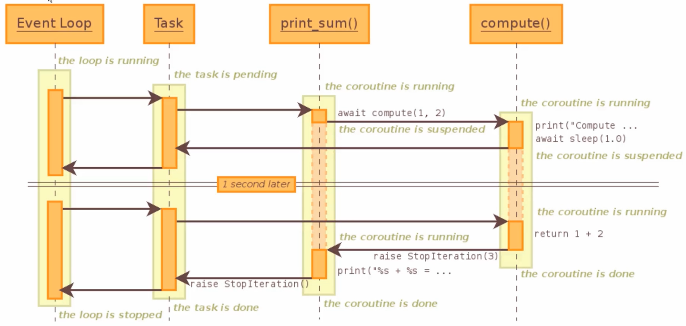

[toc]


# asyncio （异步IO并发）

由于多线程的局限性， 

* 多线程运行中容易被打断，即出现race condition情况， 需要引用锁来保护敏感区。
* 但是锁又会降低并发度，所以我们需要探索无锁的并发方案。
* 线程切换本身存在一定的损耗， 线程数不能无限增加
* 若I/O操作非常频繁，多线程很可能满足不了高效率，高质量需求


可以使用线程模型来提高并发度，但是每一个线程都需要独立的栈空间（64-bit JVM 中是 1024 KB），这还只是不包含任何资源的初始栈空间，而且栈空间的大小和线程切换的开销成正比。所以我们需要寻找比线程更轻量的解决方案。


asyncio是异步IO并发编程的核心模块， 可以解决协程，多线程，多进程的问题

Asyncio也是单线程的，只有一个主线程，可以进行多个不同的任务(就是future对象)， 不同的任务被event loop对象控制


## 特点

包含各种特定系统实现的模块化事件循环

对TCP， UDP， SSL， 子进程，延时调用以及其他的具体支持

模仿future 模块，但适用于时间循环使用的Future 类

基于yield from的协议和任务，可以用顺序的编码方式并发代码

必须使用一个将产生阻塞IO的调用时，有接口可以把这个时间转移到线程池

模仿threading模块中的同步语法，可以用在单线程内的协程之间


## 局限性

常用的requests库不兼容asyncio ，只能使用aiohttp库

pymysql， mysql-client 并不支持asyncio，所以并发性并不高

使用asyncio在任务调度有更多主权，但是逻辑书写要注意，很容易出错


## 上下文切换

操作系统及多线程/多进程中称为“上下文切换” (context switch)。其中“上下文”记录了某个线程执行的状态，包括线程里用到的各个变量，线程的调用栈等。而“切换”指的就是保存某个线程当前的运行状态，之后再从之前的状态中恢复。只不过线程相关的工作是由操作系统完成，而协程则是由应用程序自己来完成。

与线程不同的时，协程完成的功能通常较小，所以会有需求将不同的协程串起来，我们暂时称它为协程链 (coroutine chain)。


# hello world

Python 3.6 之后的写法

```
import asyncio
import time


async def get_html(url):  # 第一个调用的协程
    print("start get_html")
    await asyncio.sleep(2)  # 执行另一个协程，此时会在loop挂起一个事件，然后立刻返回
    print("end get_html")

if __name__ == '__main__':
    start_time = time.time()
    loop = asyncio.get_event_loop()  # 创建事件循环loop
    tasks = [get_html("https://www.xurick.com") for i in range(10)]
    loop.run_until_complete(asyncio.ensure_future(asyncio.wait(tasks)))  # 将其封装为 Future 对象， 并等待该future对象完成
    print(time.time()-start_time)
    
>>>
start get_html
start get_html
start get_html
start get_html
start get_html
start get_html
start get_html
start get_html
start get_html
start get_html
end get_html
end get_html
end get_html
end get_html
end get_html
end get_html
end get_html
end get_html
end get_html
end get_html
2.0054919719696045
```


# event loop 原理

若任务有两个状态，

* 预备状态：任务当前空闲，随时准备运行。

* 等待状态：任务已经运行，但正在等待外部的操作完成，如I/O操作


event loop会维护这两个任务列表，并且选取预备状态的一个任务，使其运行，一直到把这个任务控制权交还给event loop 为止。

当任务把控制权交还给event loop， event loop会根据其是否完成，放置在不同的状态列表中，然后遍历等待状态列表中的任务，查看其是否完成。

- 完成就放到预备状态
- 未完成就继续放在等待状态

这样，所有任务被重新放置在合适的列表后，开始新的循环，直到所有任务完成。

根据event loop的特点， 任务运行时不会被外部的一些因素打断，因此Asyncio内的操作不会出现race condition情况，也就不会出现线程安全的问题


## call_soon / call_at / call_later

```
import asyncio


def callback(sleep_times, loop):
    print(f'sleep {sleep_times} successfully, and time={loop.time()}')


def stop_loop():
    loop.stop()


if __name__ == '__main__':
    loop = asyncio.get_event_loop()
    now = loop.time()

    loop.call_later(now+2, callback, 2, loop)
    loop.call_later(now+1, callback, 1, loop)
    loop.call_later(now+3, callback, 3, loop)
    loop.call_soon(callback, 4, loop)
    loop.call_later(callback=stop_loop, delay=5)
    loop.run_forever()

>>>
sleep 4 successfully, and time=0.08188118
sleep 1 successfully, and time=1.168273224
sleep 2 successfully, and time=2.16562231
sleep 3 successfully, and time=3.168296887
```


# asyncio方法

async 函数被调用后会创建一个 coroutine，这时候该协程并不会运行，需要通过 ensure_future 或 create_task 方法生成 Task 后才会被调度执行。


## run()

asyncio.run 来触发运行, 是Asyncio的root call入口方法， 表示拿到event loop，直到结束才关闭这个event loop

asyncio.run 这个函数是 Python 3.7 之后才有的特性，可以让 Python 的协程接口变得非常简单，你不用去理会事件循环怎么定义和怎么使用的问题，一个非常好的编程规范是，asyncio.run(main()) 作为主程序的入口函数，在程序运行周期内，只调用一次 asyncio.run。


## create_task

可以通过 asyncio.create_task() 来创建Tasks （Future-like Object, not thread-safe) 


```
import asyncio
import time


async def say_after(delay, content):
    await asyncio.sleep(delay)
    print(content)


async def main():
    task1 = asyncio.create_task(
        say_after(1, 'hello')
    )
    task2 = asyncio.create_task(
        say_after(2, 'world')
    )
    print(f'Started at {time.perf_counter()}')

    await task1
    await task2
    print(f'Finished at {time.perf_counter()}')


if __name__ == '__main__':
    asyncio.run(main())

>>>
Started at 0.098365173
hello
world
Finished at 2.09930799
```


### add_done_callback 回调

协程实现callback函数, 即绑定特定回调函数获得返回值

参数是一个future 对象

```
In [29]: import asyncio 
    ...:  
    ...:  
    ...: async def crawl_page(url): 
    ...:     print('crawling {}'.format(url)) 
    ...:     sleep_time = int(url.split('_')[-1]) 
    ...:     await asyncio.sleep(sleep_time) 
    ...:     print('OK {}'.format(url)) 
    ...:  
    ...:  
    ...: async def main(urls): 
    ...:     tasks = [asyncio.create_task(crawl_page(url)) for url in urls] 
    ...:     for task in tasks: 
    ...:         task.add_done_callback(lambda future: print('result: ', future.result())) 
    ...:     await asyncio.gather(*tasks) 
    ...:  
    ...:  
    ...: %time asyncio.run(main(['url_1', 'url_2', 'url_3', 'url_4'])) 
    ...:  
    ...:                                                                                              
crawling url_1
crawling url_2
crawling url_3
crawling url_4
OK url_1
result:  None
OK url_2
result:  None
OK url_3
result:  None
OK url_4
result:  None
CPU times: user 2.12 ms, sys: 1.85 ms, total: 3.97 ms
Wall time: 4 s
```


## gather （可替换wait）

另一种task写法， 针对await的一系列操作，如果只是单个future，只用asyncio.wait() 即可

`asyncio.gather(*coro, loop=None, return_exception=False)` 表示在event loop中运行coro序列中的所有任务

```
In [27]: import asyncio 
    ...:  
    ...:  
    ...: async def crawl_page(url): 
    ...:     print('crawling {}'.format(url)) 
    ...:     sleep_time = int(url.split('_')[-1]) 
    ...:     await asyncio.sleep(sleep_time) 
    ...:     print('OK {}'.format(url)) 
    ...:  
    ...:  
    ...: async def main(urls): 
    ...:     tasks = [asyncio.create_task(crawl_page(url)) for url in urls] 
    ...:     await asyncio.gather(*tasks) 
    ...:  
    ...: %time asyncio.run(main(['url_1', 'url_2', 'url_3', 'url_4'])) 
    ...:  
    ...:                                                                                              
crawling url_1
crawling url_2
crawling url_3
crawling url_4
OK url_1
OK url_2
OK url_3
OK url_4
CPU times: user 2.56 ms, sys: 2.5 ms, total: 5.05 ms
Wall time: 4.01 s
```


## wait

asyncio 里除了 `as_completed` 外，常用的还有 `asyncio.wait(fs, timeout=None, when=ALL_COMPLETED)`。 方法就是可以等待多个 `futures`，`when` 参数可以设定等待的模式，可接受的参数有：

- `FIRST_COMPLETED`：等到第一个完成
- `FIRST_EXCEPTION`：等到一个出错
- `ALL_COMPLETED`：等待全部完成


```py
import asyncio
import aiohttp

urls = [
    'https://httpbin.org/',
    'https://httpbin.org/get',
    'https://httpbin.org/ip',
    'https://httpbin.org/headers',
]


async def crawler():
    async with aiohttp.ClientSession() as session:
        futures = map(asyncio.ensure_future, map(session.get, urls))
        await asyncio.wait(futures)
        for i in futures:
            print(i.result())

if __name__ == '__main__':
    loop = asyncio.get_event_loop()
    loop.run_until_complete(asyncio.ensure_future(crawler()))
```


# 


## ensure_future

Future 有点像是一个 lazy object，当你调用一个协程时，这个协程会被注册到 loop， 同时该协程会立刻返回一个 coroutine 对象，然后你可以用 `asyncio.ensure_future` 将其封装为一个 Future 对象。

当协程任务结束时，这个 future 对象的状态也会变化，可以通过这个 future 对象来获取该任务的结果值（或异常）

```
future.done()
# 任务是否结束
# True or False

future.result(timeout=None)
# 获取任务的结果
# 默认会阻塞等待到任务结束
```


# await 

类似于yield from

在协程函数中，可以通过await语法来挂起自身的协程，并等待另一个协程完成直到返回结果

```python
async def async_function():
    return 1

async def await_coroutine():
    result = await async_function()
    print(result)
    
run(await_coroutine())
```


An object is an **awaitable** object if it can be used in an [`await`](https://docs.python.org/3/reference/expressions.html#await) expression. Many asyncio APIs are designed to accept awaitables.

There are three main types of *awaitable* objects: **coroutines**, **Tasks**, and **Futures**.


## coroutine


## Tasks


## Futures


# 子协程调用原理

```
import asyncio


async def compute(x, y):
    print(f'Compute {x} + {y} ...')
    await asyncio.sleep(1)  # step 4: run sleep coroutine, suspend compute
    return x + y


async def print_num(x, y):
    result = await compute(x, y)  # step 3: run compute function, suspend print_num
    print(f'{x} + {y} =  {result}')


if __name__ == '__main__':
    loop = asyncio.get_event_loop()  # step 1: creating coroutine
    loop.run_until_complete(print_num(1, 2))  # step 2: run print_num function
    loop.close()

>>>
Compute 1 + 2 ...
1 + 2 =  3
```




# asyncio Lock

asyncio 里提供了四种锁：

- Lock
- Semaphore
- Event
- Condition


## Semaphore 信号量 控制并发

asyncio 提供了信号量方法 `asyncio.Semaphore(value=1)` ， 这个方法会返回一个信号量，你可以初始化一个信号量后，然后在每次发起请求时都去请求这个信号量， 来实现对协程任务数量的控制，比如我们可以通过信号量来控制对服务器的请求并发数

```
import asyncio
import aiohttp

# initiallize semaphore

url = 'https://www.xurick.com'

concurrency_sem = asyncio.Semaphore(50)


async def crawler():
    async with aiohttp.ClientSession() as session:
        while True:  # 即使这样写也不用担心并发数会爆炸啦
            # require semaphore
            # will be blocked when accesses to 50 concurrency
            async with concurrency_sem:
                async with session.get(url, timeout=10) as resp:
                    assert resp.status == 200

```


### Queue 

信号量可以有效的控制同一时间任务的并发数，但是有时候一些协程任务的执行非常迅速， 导致任务执行返回的数据大量堆积，也就是所我们需要限制任务的处理总量，而不是并发量， 这时候就可以采用 `asyncio.Queue(maxsize=0)` 来进行控制， 我们可以通过设定 `maxsize` 来设定队列的总长度，当队列满时，`put` 操作就会被挂起， 直到后续逻辑逐渐消化掉了队列里的任务后，才能继续添加，这样就实现了对任务堆积总量的控制。

```
import asyncio
import random
import aiohttp


async def producer(queue):
    for i in range(10):
        await queue.put(i)
        await asyncio.sleep(random.randint(1, 3))


async def consumer(queue):
    while True:
        await queue.get()
        size = queue.qsize()
        print(f'current queue size={size}')
        url = 'http://httpbin.org/delay/3'
        async with aiohttp.ClientSession() as client:
            resp = await client.get(url)
            print(await resp.json())


async def main():
    queue = asyncio.Queue(maxsize=3)
    asyncio.create_task(producer(queue))
    con = asyncio.create_task(consumer(queue))
    await con


asyncio.run(main())

>>>
current queue size=0
{'args': {}, 'data': '', 'files': {}, 'form': {}, 'headers': {'Accept': '*/*', 'Accept-Encoding': 'gzip, deflate', 'Host': 'httpbin.org', 'User-Agent': 'Python/3.8 aiohttp/3.7.3', 'X-Amzn-Trace-Id': 'Root=1-5feb4684-2f3f05cb04c072342fedb968'}, 'origin': '1.1.1.1', 'url': 'http://httpbin.org/delay/3'}
current queue size=0
{'args': {}, 'data': '', 'files': {}, 'form': {}, 'headers': {'Accept': '*/*', 'Accept-Encoding': 'gzip, deflate', 'Host': 'httpbin.org', 'User-Agent': 'Python/3.8 aiohttp/3.7.3', 'X-Amzn-Trace-Id': 'Root=1-5feb4688-2caf06fe2b3281152e84a712'}, 'origin': '1.1.1.1', 'url': 'http://httpbin.org/delay/3'}
current queue size=0
{'args': {}, 'data': '', 'files': {}, 'form': {}, 'headers': {'Accept': '*/*', 'Accept-Encoding': 'gzip, deflate', 'Host': 'httpbin.org', 'User-Agent': 'Python/3.8 aiohttp/3.7.3', 'X-Amzn-Trace-Id': 'Root=1-5feb468c-11ab43b24ed4725a772457e8'}, 'origin': '1.1.1.1', 'url': 'http://httpbin.org/delay/3'}
current queue size=1
{'args': {}, 'data': '', 'files': {}, 'form': {}, 'headers': {'Accept': '*/*', 'Accept-Encoding': 'gzip, deflate', 'Host': 'httpbin.org', 'User-Agent': 'Python/3.8 aiohttp/3.7.3', 'X-Amzn-Trace-Id': 'Root=1-5feb468f-37c92237353d97d61fa85a8d'}, 'origin': '1.1.1.1', 'url': 'http://httpbin.org/delay/3'}
current queue size=1
{'args': {}, 'data': '', 'files': {}, 'form': {}, 'headers': {'Accept': '*/*', 'Accept-Encoding': 'gzip, deflate', 'Host': 'httpbin.org', 'User-Agent': 'Python/3.8 aiohttp/3.7.3', 'X-Amzn-Trace-Id': 'Root=1-5feb4693-6d25669e261891db379cb5e4'}, 'origin': '1.1.1.1', 'url': 'http://httpbin.org/delay/3'}
current queue size=2
{'args': {}, 'data': '', 'files': {}, 'form': {}, 'headers': {'Accept': '*/*', 'Accept-Encoding': 'gzip, deflate', 'Host': 'httpbin.org', 'User-Agent': 'Python/3.8 aiohttp/3.7.3', 'X-Amzn-Trace-Id': 'Root=1-5feb4697-6f5ceb9e4c06dca5229b9872'}, 'origin': '1.1.1.1', 'url': 'http://httpbin.org/delay/3'}
current queue size=2
{'args': {}, 'data': '', 'files': {}, 'form': {}, 'headers': {'Accept': '*/*', 'Accept-Encoding': 'gzip, deflate', 'Host': 'httpbin.org', 'User-Agent': 'Python/3.8 aiohttp/3.7.3', 'X-Amzn-Trace-Id': 'Root=1-5feb469b-47a37e2b4123c0c2445bb08e'}, 'origin': '1.1.1.1', 'url': 'http://httpbin.org/delay/3'}
current queue size=2
{'args': {}, 'data': '', 'files': {}, 'form': {}, 'headers': {'Accept': '*/*', 'Accept-Encoding': 'gzip, deflate', 'Host': 'httpbin.org', 'User-Agent': 'Python/3.8 aiohttp/3.7.3', 'X-Amzn-Trace-Id': 'Root=1-5feb469e-2d68ad3a1227f31b7f6f5167'}, 'origin': '1.1.1.1', 'url': 'http://httpbin.org/delay/3'}
current queue size=1
{'args': {}, 'data': '', 'files': {}, 'form': {}, 'headers': {'Accept': '*/*', 'Accept-Encoding': 'gzip, deflate', 'Host': 'httpbin.org', 'User-Agent': 'Python/3.8 aiohttp/3.7.3', 'X-Amzn-Trace-Id': 'Root=1-5feb46a2-4e29f1114e2485dc1e66cc9e'}, 'origin': '1.1.1.1', 'url': 'http://httpbin.org/delay/3'}
current queue size=0
{'args': {}, 'data': '', 'files': {}, 'form': {}, 'headers': {'Accept': '*/*', 'Accept-Encoding': 'gzip, deflate', 'Host': 'httpbin.org', 'User-Agent': 'Python/3.8 aiohttp/3.7.3', 'X-Amzn-Trace-Id': 'Root=1-5feb46a6-2ce4b2513b6fd9f175ee4234'}, 'origin': '1.1.1.1', 'url': 'http://httpbin.org/delay/3'}
```


## Event 事件锁

这个锁有两个状态：`set` 和 `unset`，可以调用 `evt.wait()` 挂起等待，直到这个事件被 `set()`：

```py
evt = Event()

async def demo():
    await evt.wait()  # wait for set
    print('done)


demo()
print(evt.is_set())
# False


evt.set()  # release evt
# done
```


## Condition

就像 Semaphore 可以简单理解为带计数器的 Lock，Condition 也可以简单理解为带计数器的 Event。

一个 Condition 可以被多个协程等待，然后可以按照需求唤醒指定数量的协程。

其实 Condition 是 threading 模块里一直存在的锁，简单介绍一下使用方法， 使用 condition 前需要先获取锁（`async with cond`），这是一个互斥锁，调用 `wait()` 时会自动的释放锁， ，针对 condition 的 `notify`、`notify_all、`wait`必须在获取锁后才能操作，否则会抛出`RuntimeError` 错误。

所以当你 notify 后如果需要立即生效的话，需要退出这个 mutex，并且挂起当前协程等待调度， 其他协程才能顺利的获取 mutex，并且获取到 condition 的信号，执行后续的任务，并在完成后释放锁。

```
from asyncio import Condition, ensure_future, sleep, wait, get_event_loop


async def workers(cond, i):
    async with cond:  # acquire lock
        print(f'worker={i} is waiting')
        await cond.wait()  # waiting for notify and release lock

    print(f'worker={i} has done, cond released.')


async def main():
    cond = Condition()
    fs = [ensure_future(workers(cond, i)) for i in range(5)]

    await sleep(0.1)
    for i in range(3):
        print(f'notify={i} workers')
        async with cond:  # require lock
            cond.notify(i)  # notify
        await sleep(0.1)  # run another coroutine

    async with cond:
        await sleep(0.5)
        print('notify all')
        cond.notify_all()

    await wait(fs)  # waiting for all workers

get_event_loop().run_until_complete(main())


>>>
worker=0 is waiting
worker=1 is waiting
worker=2 is waiting
worker=3 is waiting
worker=4 is waiting
notify=0 workers
notify=1 workers
worker=0 has done, cond released.
notify=2 workers
worker=1 has done, cond released.
worker=2 has done, cond released.
notify all
worker=3 has done, cond released.
worker=4 has done, cond released.
```

# 原理

```
import asyncio

async def worker_1():
    print('worker_1 start')
    await asyncio.sleep(1)
    print('worker_1 done')

async def worker_2():
    print('worker_2 start')
    await asyncio.sleep(2)
    print('worker_2 done')

async def main():
    print('before await')
    await worker_1()
    print('awaited worker_1')
    await worker_2()
    print('awaited worker_2')

%time asyncio.run(main())

>>>
before await
worker_1 start
worker_1 done
awaited worker_1
worker_2 start
worker_2 done
awaited worker_2
Wall time: 3 s
```


```
import asyncio

async def worker_1():
    print('worker_1 start')
    await asyncio.sleep(1)	# 2. 从当前任务切出，调度worker2  # 3. 事件调度器这时候开始暂停调度，等待1秒后，sleep完成，事件调度器控制器交给task1
    print('worker_1 done') # 4. 完成任务退出

async def worker_2():
    print('worker_2 start')
    await asyncio.sleep(2)	# 3. 从当前任务切出
    print('worker_2 done') # 6. 2秒后事件调度器将控制器交给task2， 输出结果

async def main():
    task1 = asyncio.create_task(worker_1()) 
    task2 = asyncio.create_task(worker_2())
    print('before await')
    await task1		# 1. 从main任务中切出，调度worker1
    print('awaited worker_1') # 5. 完成task1， 控制器交给主任务， 输出结果
    await task2 
    print('awaited worker_2') # 7. 输出结果，协程结束

%time asyncio.run(main())	

>>>

before await
worker_1 start
worker_2 start
worker_1 done
awaited worker_1
worker_2 done
awaited worker_2
Wall time: 2.01 s
```


## 错误处理

worker3执行过长会被cancel掉

```
import asyncio

async def worker_1():
    await asyncio.sleep(1)
    return 1

async def worker_2():
    await asyncio.sleep(2)
    return 2 / 0

async def worker_3():
    await asyncio.sleep(3)
    return 3

async def main():
    task_1 = asyncio.create_task(worker_1())
    task_2 = asyncio.create_task(worker_2())
    task_3 = asyncio.create_task(worker_3())

    await asyncio.sleep(2)
    task_3.cancel()

    res = await asyncio.gather(task_1, task_2, task_3, return_exceptions=True)
    print(res)

%time asyncio.run(main())

>>>

[1, ZeroDivisionError('division by zero'), CancelledError()]
Wall time: 2 s

```


## 生产者消费者模型

```
import asyncio
import random

async def consumer(queue, id):
    while True:
        val = await queue.get()
        print('{} get a val: {}'.format(id, val))
        await asyncio.sleep(1)

async def producer(queue, id):
    for i in range(5):
        val = random.randint(1, 10)
        await queue.put(val)
        print('{} put a val: {}'.format(id, val))
        await asyncio.sleep(1)

async def main():
    queue = asyncio.Queue()

    consumer_1 = asyncio.create_task(consumer(queue, 'consumer_1'))
    consumer_2 = asyncio.create_task(consumer(queue, 'consumer_2'))

    producer_1 = asyncio.create_task(producer(queue, 'producer_1'))
    producer_2 = asyncio.create_task(producer(queue, 'producer_2'))

    await asyncio.sleep(10)
    consumer_1.cancel()
    consumer_2.cancel()
    
    await asyncio.gather(consumer_1, consumer_2, producer_1, producer_2, return_exceptions=True)

%time asyncio.run(main())

>>>

producer_1 put a val: 5
producer_2 put a val: 3
consumer_1 get a val: 5
consumer_2 get a val: 3
producer_1 put a val: 1
producer_2 put a val: 3
consumer_2 get a val: 1
consumer_1 get a val: 3
producer_1 put a val: 6
producer_2 put a val: 10
consumer_1 get a val: 6
consumer_2 get a val: 10
producer_1 put a val: 4
producer_2 put a val: 5
consumer_2 get a val: 4
consumer_1 get a val: 5
producer_1 put a val: 2
producer_2 put a val: 8
consumer_1 get a val: 2
consumer_2 get a val: 8
Wall time: 10 s
```


# example


## 效率对比

```
import asyncio
import requests
from bs4 import BeautifulSoup

def main():
    url = "https://movie.douban.com/cinema/later/beijing"
    init_page = requests.get(url).content
    init_soup = BeautifulSoup(init_page, 'lxml')

    all_movies = init_soup.find('div', id='showing-soon')
    for each_movie in all_movies.find_all('div', class_="item"):
        all_a_tag = each_movie.find_all('a')
        all_li_tag = each_movie.find_all('li')

        movie_name = all_a_tag[1].text
        url_to_fetch = all_a_tag[1]['href']
        movie_date = all_li_tag[0].text
        
        response_item = requests.get(url_to_fetch).content
        soup_item = BeautifulSoup(response_item, 'lxml')
        img_tag = soup_item.find('img')
        print('{} {} {}'.format(movie_name, movie_date, img_tag['src']))

%time main()

>>>
CPU times: user 1.3 s, sys: 46.2 ms, total: 1.35 s
Wall time: 19.8 s
```


```
import asyncio, aiohttp
import time
from bs4 import BeautifulSoup

def cost_time(func):
    def wrapper(*args, **kwargs):
        start = time.perf_counter()
        res = func(*args, **kwargs)
        end = time.perf_counter()
        print('Time costs: {}s'.format(end - start))
        return res
    return wrapper


async def fetch_content(url):
    header={"User-Agent": "Mozilla/5.0 (Windows NT 6.1; Win64; x64) AppleWebKit/537.36 (KHTML, like Gecko) Chrome/74.0.3729.157 Safari/537.36"}
    async with aiohttp.ClientSession(
        headers=header,  connector=aiohttp.TCPConnector(ssl=False)
    ) as session:
        async with session.get(url) as response:
            return await response.text()
    
@cost_time
async def main():
    url = "https://movie.douban.com/cinema/later/beijing"
    init_page = await fetch_content(url)
    init_soup = BeautifulSoup(init_page, 'lxml')

    movie_names, urls_to_fetch, movie_dates = [], [], []

    all_movies = init_soup.find('div', id='showing-soon')
    for each_movie in all_movies.find_all('div', class_="item"):
        all_a_tag = each_movie.find_all('a')
        all_li_tag = each_movie.find_all('li')

        movie_names.append(all_a_tag[1].text)
        urls_to_fetch.append(all_a_tag[1]['href'])
        movie_dates.append(all_li_tag[0].text)

    tasks = [fetch_content(url) for url in urls_to_fetch]
    pages = await asyncio.gather(*tasks)

    for movie_name, movie_date, page in zip(movie_names, movie_dates, pages):
        soup_item = BeautifulSoup(page, 'lxml')
        img_tag = soup_item.find('img')
        print('{} {} {}'.format(movie_name, movie_date, img_tag['src']))

asyncio.run(main())

>>>
Time costs: 1.5269999948941404e-06s
```


## image downloader

```
import asyncio
import traceback
import os
from datetime import datetime

import aiofiles
import aiohttp


async def image_downloader(task_q):
    async with aiohttp.ClientSession() as session:
        while not task_q.empty():
            url = await task_q.get()
            try:
                async with session.get(url, timeout=5) as resp:
                    assert resp.status == 200
                    content = await resp.read()
            except Exception:
                print(f'url={url}, error={traceback.format_exc()}')
            else:
                file_name = split_file_name(url)
                print(f'{file_name} is ok')
                await save_file(file_name, content)


def split_file_name(url):
    file_name = str(url).split('/')[-1]
    return file_name


async def save_file(file_name, content):
    image_path = 'images_output' + os.path.sep + file_name
    async with aiofiles.open(image_path, mode='wb') as f:
        await f.write(content)


async def produce_tasks(task_q):
    with open('images_urls.txt', 'r') as f:
        for count, image_url in enumerate(f):
            image_url = image_url.strip()

            if os.path.isfile(split_file_name(image_url)):
                continue
            await task_q.put(image_url)


async def run():
    task_q = asyncio.Queue(maxsize=1000)
    task_producer = asyncio.ensure_future(produce_tasks(task_q))
    workers = [asyncio.ensure_future(image_downloader(task_q)) for _ in range(10)]
    try:
        await asyncio.wait(workers+[task_producer])
    except Exception as e:
        print(f'run exception={e}')


def main():
    print(f'start at={datetime.utcnow()}')
    loop = asyncio.get_event_loop()
    loop.run_until_complete(asyncio.ensure_future(run()))
    print(f'end at={datetime.utcnow()}')


if __name__ == '__main__':
    main()

```


## ctrl+c 取消task

```
import asyncio


async def get_html(sleep_times):
    print('waiting')
    await asyncio.sleep(sleep_times)
    print(f'done after {sleep_times}s')


if __name__ == '__main__':
    task1 = get_html(1)
    task2 = get_html(2)
    task3 = get_html(3)

    tasks = [task1, task2, task3]

    loop = asyncio.get_event_loop()
    try:
        loop.run_until_complete(asyncio.wait(tasks))
    except KeyboardInterrupt as e:
        all_tasks = asyncio.Task.all_tasks()
        for task in all_tasks:
            print('canceling task')
            print(task.cancel())
        loop.stop()
        loop.run_forever()  # need to define for avoiding exception
    finally:
        loop.close()  # clear all queues

```


# 多线程 vs Asyncio

```
if io_bound:
    if io_slow:
        print('Use Asyncio')
    else:
        print('Use multi-threading')
else if cpu_bound:
    print('Use multi-processing')
```

如果是 I/O bound，并且 I/O 操作很慢，需要很多任务 / 线程协同实现，那么使用 Asyncio 更合适。

如果是 I/O bound，但是 I/O 操作很快，只需要有限数量的任务 / 线程，那么使用多线程就可以了。

如果是 CPU bound，则需要使用多进程来提高程序运行效率。


# 多进程

```
import time
def cpu_bound(number):
    print(sum(i * i for i in range(number)))

def calculate_sums(numbers):
    for number in numbers:
        cpu_bound(number)

def main():
    start_time = time.perf_counter()  
    numbers = [10000000 + x for x in range(20)]
    calculate_sums(numbers)
    end_time = time.perf_counter()
    print('Calculation takes {} seconds'.format(end_time - start_time))
    
if __name__ == '__main__':
    main()

>>>
Calculation takes 17.826206894 seconds


```

