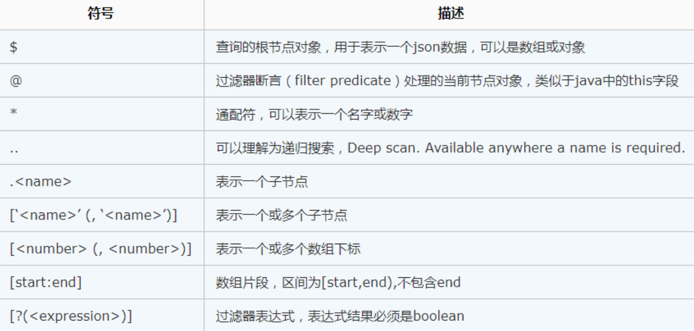

[toc]


# jsonpath

JsonPath 是一种信息抽取类库，是从Json文档中抽取指定信息的工具。

JsonPath 对于 Json 来说，相当于 XPATH 对于 XML。

Json结构清晰，可读性高，复杂度低，非常容易匹配


## insallation

```
pip install jsonpath
```





## Hello world

```
In [1]: dump_data = '{"animals":{"dog":[{"name":"Rufus","age":15},{"name":"Marty","age":null}]}}' 
   ...:  
   ...: import json 
   ...:  
   ...: import jsonpath 
   ...:  
   ...: load_data = json.loads(dump_data) 
   ...: jobs=load_data['animals']['dog'] 
   ...: result2 = [] 
   ...: for i in jobs: 
   ...:     result2.append(jsonpath.jsonpath(i,'$..name')[0]) 
   ...: print(result2)                                                                              
['Rufus', 'Marty']
```

