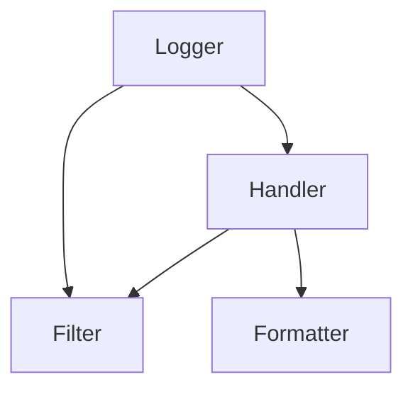

[TOC]


# logging

Logger是一个树形层级结构

Logger可以包含一个或多个Handler和Filter，即Logger与Handler或Filter是一对多的关系;
一个Logger实例可以新增多个Handler，一个Handler可以新增多个格式化器或多个过滤器，而且日志级别将会继承




## example

默认情况下，logging模块将日志打印到屏幕上(stdout)，日志级别为WARNING(即只有日志级别高于WARNING的日志信息才会输出

```
#!/usr/local/bin/python
# -*- coding:utf-8 -*-
import logging

logging.debug('debug message')
logging.info('info message')
logging.warn('warn message')
logging.error('error message')
logging.critical('critical message')

>>>
WARNING:root:warn message
ERROR:root:error message
CRITICAL:root:critical message
```


## 配置方式

- 显式创建记录器Logger、处理器Handler和格式化器Formatter，并进行相关设置；
- 通过简单方式进行配置，使用[basicConfig()](https://links.jianshu.com/go?to=http%3A%2F%2Fpython.usyiyi.cn%2Fpython_278%2Flibrary%2Flogging.html%23logging.basicConfig)函数直接进行配置；
- 通过配置文件进行配置，使用[fileConfig()](https://links.jianshu.com/go?to=http%3A%2F%2Fpython.usyiyi.cn%2Fpython_278%2Flibrary%2Flogging.config.html%23logging.config.fileConfig)函数读取配置文件；
- 通过配置字典进行配置，使用[dictConfig()](https://links.jianshu.com/go?to=http%3A%2F%2Fpython.usyiyi.cn%2Fpython_278%2Flibrary%2Flogging.config.html%23logging.config.dictConfig)函数读取配置信息；
- 通过网络进行配置，使用[listen()](https://links.jianshu.com/go?to=http%3A%2F%2Fpython.usyiyi.cn%2Fpython_278%2Flibrary%2Flogging.config.html%23logging.config.listen)函数进行网络配置。


### basicConfig关键字参数

| 关键字   | 描述                                                         |
| -------- | :----------------------------------------------------------- |
| filename | 创建一个FileHandler，使用指定的文件名，而不是使用StreamHandler。 |
| filemode | 如果指明了文件名，指明打开文件的模式（如果没有指明filemode，默认为'a'）。 |
| format   | handler使用指明的格式化字符串。                              |
| datefmt  | 使用指明的日期／时间格式。                                   |
| level    | 指明根logger的级别。                                         |
| stream   | 使用指明的流来初始化StreamHandler。该参数与'filename'不兼容，如果两个都有，'stream'被忽略。 |


## 日志格式

```
日志级别 : Logger实例名称 : 日志消息内容
```


## 输出成文件

```
#!/usr/local/bin/python
# -*- coding:utf-8 -*-
import logging

# 通过下面的方式进行简单配置输出方式与日志级别
logging.basicConfig(filename='logger.log', level=logging.INFO)

logging.debug('debug message')
logging.info('info message')
logging.warn('warn message')
logging.error('error message')
logging.critical('critical message')

>>>
标准输出(屏幕)未显示任何信息，发现当前工作目录下生成了logger.log
INFO:root:info message
WARNING:root:warn message
ERROR:root:error message
CRITICAL:root:critical message
```


# logging 组件

## Logger 

记录器，暴露了应用程序代码能直接使用的接口。

即创建一个记录器，如果没有显式的进行创建，则默认创建一个root logger，并应用默认的日志级别(WARN)，处理器Handler(StreamHandler，即将日志信息打印输出在标准输出上)，和格式化器Formatter(默认的格式即为第一个简单使用程序中输出的格式)。

```
logger = logging.getLogger(logger_name)
logger.setLevel(logging.ERROR) # 设置日志级别为ERROR，即只有日志级别大于等于ERROR的日志才会输出
logger.addHandler(handler_name) # 为Logger实例增加一个处理器
logger.removeHandler(handler_name) # 为Logger实例删除一个处理器
```


## Handler 

处理器，将（记录器产生的）日志记录发送至合适的目的地。

Handler处理器类型有很多种，比较常用的有三个，**StreamHandler**，**FileHandler**，**NullHandler**

使用以下方法设置日志级别，设置格式化器Formatter，增加或删除过滤器Filter

```
ch.setLevel(logging.WARN) # 指定日志级别，低于WARN级别的日志将被忽略
ch.setFormatter(formatter_name) # 设置一个格式化器formatter
ch.addFilter(filter_name) # 增加一个过滤器，可以增加多个
ch.removeFilter(filter_name) # 删除一个过滤器
```


### StreamHandler

```
sh = logging.StreamHandler(stream=None)
```


### FileHandler

```
fh = logging.FileHandler(filename, mode='a', encoding=None, delay=False)
```


### NullHandler

NullHandler类位于核心logging包，不做任何的格式化或者输出。
本质上它是个“什么都不做”的handler，由库开发者使用。


## Filter 

过滤器，提供了更好的粒度控制，它可以决定输出哪些日志记录。

Handlers和Loggers可以使用Filters来完成比级别更复杂的过滤。Filter基类只允许特定Logger层次以下的事件。例如用‘A.B’初始化的Filter允许Logger ‘A.B’, ‘A.B.C’, ‘A.B.C.D’, ‘A.B.D’等记录的事件，logger‘A.BB’, ‘B.A.B’ 等就不行。 如果用空字符串来初始化，所有的事件都接受。

```
filter = logging.Filter(name='')
```


## Formatter 

格式化器，指明了最终输出中日志记录的布局。


使用Formatter对象设置日志信息最后的规则、结构和内容，默认的时间格式为%Y-%m-%d %H:%M:%S。

```
formatter = logging.Formatter(fmt=None, datefmt=None)
```

>  fmt是消息的格式化字符串，datefmt是日期字符串。如果不指明fmt，将使用'%(message)s'。如果不指明datefmt，将使用ISO8601日期格式


### format格式

| 格式           |          描述          |
| -------------- | :--------------------: |
| %(levelno)s    |   打印日志级别的数值   |
| %(levelname)s  |    打印日志级别名称    |
| %(pathname)s   | 打印当前执行程序的路径 |
| %(filename)s   |  打印当前执行程序名称  |
| %(funcName)s   |   打印日志的当前函数   |
| %(lineno)d     |   打印日志的当前行号   |
| %(asctime)s    |     打印日志的时间     |
| %(thread)d     |       打印线程id       |
| %(threadName)s |      打印线程名称      |
| %(process)d    |       打印进程ID       |
| %(message)s    |      打印日志信息      |