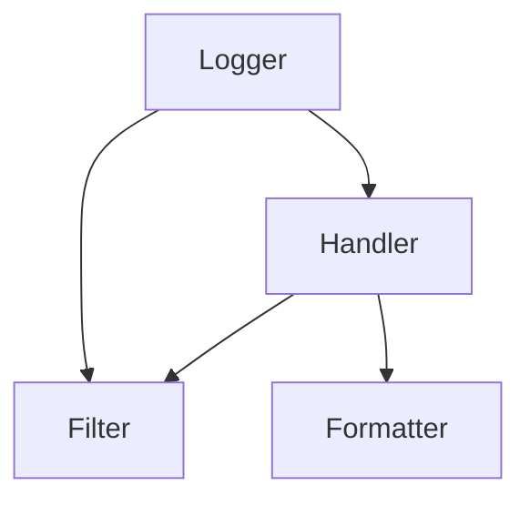

[TOC]


# logging

Logger是一个树形层级结构

Logger可以包含一个或多个Handler和Filter，即Logger与Handler或Filter是一对多的关系;
一个Logger实例可以新增多个Handler，一个Handler可以新增多个格式化器或多个过滤器，而且日志级别将会继承




## 流程

1. 判断 Logger 对象对于设置的级别是否可用，如果可用，则往下执行，否则，流程结束。

2. 创建 LogRecord 对象，如果注册到 Logger 对象中的 Filter 对象过滤后返回 False，则不记录日志，流程结束，否则，则向下执行。

3. LogRecord 对象将 Handler 对象传入当前的 Logger 对象，（图中的子流程）如果 Handler 对象的日志级别大于设置的日志级别，再判断注册到 Handler 对象中的 Filter 对象过滤后是否返回 True 而放行输出日志信息，否则不放行，流程结束。

4. 如果传入的 Handler 大于 Logger 中设置的级别，也即 Handler 有效，则往下执行，否则，流程结束。

5. 判断这个 Logger 对象是否还有父 Logger 对象，如果没有（代表当前 Logger 对象是最顶层的 Logger 对象 root Logger），流程结束。否则将 Logger 对象设置为它的父 Logger 对象，重复上面的 3、4 两步，输出父类 Logger 对象中的日志输出，直到是 root Logger 为止。


## example

默认情况下，logging模块将日志打印到屏幕上(stdout)，日志级别为WARNING(即只有日志级别高于WARNING的日志信息才会输出

```
#!/usr/local/bin/python
# -*- coding:utf-8 -*-
import logging

logging.debug('debug message')
logging.info('info message')
logging.warn('warn message')
logging.error('error message')
logging.critical('critical message')

>>>
WARNING:root:warn message
ERROR:root:error message
CRITICAL:root:critical message
```


## 配置方式

- 显式创建记录器Logger、处理器Handler和格式化器Formatter，并进行相关设置；
- 通过简单方式进行配置，使用[basicConfig()](https://links.jianshu.com/go?to=http%3A%2F%2Fpython.usyiyi.cn%2Fpython_278%2Flibrary%2Flogging.html%23logging.basicConfig)函数直接进行配置；
- 通过配置文件进行配置，使用[fileConfig()](https://links.jianshu.com/go?to=http%3A%2F%2Fpython.usyiyi.cn%2Fpython_278%2Flibrary%2Flogging.config.html%23logging.config.fileConfig)函数读取配置文件；
- 通过配置字典进行配置，使用[dictConfig()](https://links.jianshu.com/go?to=http%3A%2F%2Fpython.usyiyi.cn%2Fpython_278%2Flibrary%2Flogging.config.html%23logging.config.dictConfig)函数读取配置信息；
- 通过网络进行配置，使用[listen()](https://links.jianshu.com/go?to=http%3A%2F%2Fpython.usyiyi.cn%2Fpython_278%2Flibrary%2Flogging.config.html%23logging.config.listen)函数进行网络配置。


### basicConfig关键字参数

| 关键字   | 描述                                                         |
| -------- | :----------------------------------------------------------- |
| filename | 创建一个FileHandler，使用指定的文件名，而不是使用StreamHandler。 |
| filemode | 如果指明了文件名，指明打开文件的模式（如果没有指明filemode，默认为'a'） r[+], w[+], a[+] |
| format   | handler使用指明的格式化字符串。                              |
| datefmt  | 使用指明的日期／时间格式。                                   |
| style    | 格式占位符，默认为 "%" 和 “{}”                               |
| level    | 指明根logger的级别。                                         |
| stream   | 使用指明的流来初始化StreamHandler。该参数与'filename'不兼容，如果两个都有，'stream'被忽略。 |
| handles  | 定义处理器，用来创建 Handler 对象，不能和 filename 、stream 参数一起使用，否则也会抛出 ValueError 异常 |


## 日志格式

```
WARNING :  root        : warn message
日志级别 : Logger实例名称 : 日志消息内容
```


## 输出成文件

```
import logging

logging.basicConfig(filename="test.log", filemode="w", format="%(asctime)s %(name)s:%(levelname)s:%(message)s", datefmt="%d-%M-%Y %H:%M:%S", level=logging.DEBUG)
logging.debug('This is a debug message')
logging.info('This is an info message')
logging.warning('This is a warning message')
logging.error('This is an error message')
logging.critical('This is a critical message')

>>>
13-10-18 21:10:32 root:DEBUG:This is a debug message
13-10-18 21:10:32 root:INFO:This is an info message
13-10-18 21:10:32 root:WARNING:This is a warning message
13-10-18 21:10:32 root:ERROR:This is an error message
13-10-18 21:10:32 root:CRITICAL:This is a critical message
```


## 异常处理

当发生异常时，直接使用无参数的 debug()、info()、warning()、error()、critical() 方法并不能记录异常信息，需要设置 exc_info 参数为 True 才可以，或者使用 exception() 方法，还可以使用 log() 方法，但还要设置日志级别和 exc_info 参数。

```
import logging

logging.basicConfig(filename="test.log", filemode="w", format="%(asctime)s %(name)s:%(levelname)s:%(message)s", datefmt="%d-%M-%Y %H:%M:%S", level=logging.DEBUG)
a = 5
b = 0
try:
    c = a / b
except Exception as e:
    # 下面三种方式三选一，推荐使用第一种
    logging.exception("Exception occurred")
    logging.error("Exception occurred", exc_info=True)
    logging.log(level=logging.DEBUG, msg="Exception occurred", exc_info=True)
```


## 自定义logger

上面的基本使用可以让我们快速上手 logging 模块，但一般并不能满足实际使用，我们还需要自定义 Logger。

一个系统只有一个 Logger 对象，并且该对象不能被直接实例化，没错，这里用到了单例模式，获取 Logger 对象的方法为 **getLogger**。

这里的单例模式并不是说只有一个 Logger 对象，而是指整个系统只有一个根 Logger 对象，Logger 对象在执行 info()、error() 等方法时实际上调用都是根 Logger 对象对应的 info()、error() 等方法。

我们可以创造多个 Logger 对象，但是真正输出日志的是根 Logger 对象。每个 Logger 对象都可以设置一个名字，如果设置`logger = logging.getLogger(__name__)`，__name__ 是 Python 中的一个特殊内置变量，他代表当前模块的名称（默认为 __main__）。则 Logger 对象的 name 为建议使用使用以点号作为分隔符的命名空间等级制度。

Logger 对象可以设置多个 Handler 对象和 Filter 对象，Handler 对象又可以设置 Formatter 对象。Formatter 对象用来设置具体的输出格式，常用变量格式如下表

| 变量        | 格式            | 变量描述                                                     |
| ----------- | --------------- | :----------------------------------------------------------- |
| asctime     | %(asctime)s     | 将日志的时间构造成可读的形式，默认情况下是精确到毫秒，如 2018-10-13 23:24:57,832，可以额外指定 datefmt 参数来指定该变量的格式 |
| name        | %(name)         | 日志对象的名称                                               |
| filename    | %(filename)s    | 不包含路径的文件名                                           |
| pathname    | %(pathname)s    | 包含路径的文件名                                             |
| funcName    | %(funcName)s    | 日志记录所在的函数名                                         |
| levelname   | %(levelname)s   | 日志的级别名称                                               |
| message     | %(message)s     | 具体的日志信息                                               |
| lineno      | %(lineno)d      | 日志记录所在的行号                                           |
| pathname    | %(pathname)s    | 完整路径                                                     |
| process     | %(process)d     | 当前进程ID                                                   |
| processName | %(processName)s | 当前进程名称                                                 |
| thread      | %(thread)d      | 当前线程ID                                                   |
| threadName  | %threadName)s   | 当前线程名称                                                 |


### logger 级别

Logger 对象和 Handler 对象都可以设置级别，而默认 Logger 对象级别为 30 ，也即 WARNING，默认 Handler 对象级别为 0，也即 NOTSET。logging 模块这样设计是为了更好的灵活性，比如有时候我们既想在控制台中输出DEBUG 级别的日志，又想在文件中输出WARNING级别的日志。可以只设置一个最低级别的 Logger 对象，两个不同级别的 Handler 对象

```
import logging
import logging.handlers

logger = logging.getLogger("logger")

handler1 = logging.StreamHandler()
handler2 = logging.FileHandler(filename="test.log")

logger.setLevel(logging.DEBUG)
handler1.setLevel(logging.WARNING)
handler2.setLevel(logging.DEBUG)

formatter = logging.Formatter("%(asctime)s %(name)s %(levelname)s %(message)s")
handler1.setFormatter(formatter)
handler2.setFormatter(formatter)

logger.addHandler(handler1)
logger.addHandler(handler2)

# 分别为 10、30、30
# print(handler1.level)
# print(handler2.level)
# print(logger.level)

logger.debug('This is a customer debug message')
logger.info('This is an customer info message')
logger.warning('This is a customer warning message')
logger.error('This is an customer error message')
logger.critical('This is a customer critical message')


>>> 控制台输出
2018-10-13 23:24:57,832 logger WARNING This is a customer warning message
2018-10-13 23:24:57,832 logger ERROR This is an customer error message
2018-10-13 23:24:57,832 logger CRITICAL This is a customer critical message

>>> 文件中输出
2018-10-13 23:44:59,817 logger DEBUG This is a customer debug message
2018-10-13 23:44:59,817 logger INFO This is an customer info message
2018-10-13 23:44:59,817 logger WARNING This is a customer warning message
2018-10-13 23:44:59,817 logger ERROR This is an customer error message
2018-10-13 23:44:59,817 logger CRITICAL This is a customer critical message
```

> 创建了自定义的 Logger 对象，就不要在用 logging 中的日志输出方法了，这些方法使用的是默认配置的 Logger 对象，否则会输出的日志信息会重复


# logging 组件

## Logger 

记录器，暴露了应用程序代码能直接使用的接口。

即创建一个记录器，如果没有显式的进行创建，则默认创建一个root logger，并应用默认的日志级别(WARN)，处理器Handler(StreamHandler，即将日志信息打印输出在标准输出上)，和格式化器Formatter(默认的格式即为第一个简单使用程序中输出的格式)。

```
logger = logging.getLogger(logger_name)
logger.setLevel(logging.ERROR) # 设置日志级别为ERROR，即只有日志级别大于等于ERROR的日志才会输出
logger.addHandler(handler_name) # 为Logger实例增加一个处理器
logger.removeHandler(handler_name) # 为Logger实例删除一个处理器
```


### logger 配置

打开 logging.config Python 文件，可以看到其中的配置解析转换函数。

```
import logging.config

config = {
    'version': 1,
    'formatters': {
        'simple': {
            'format': '%(asctime)s - %(name)s - %(levelname)s - %(message)s',
        },
        # 其他的 formatter
    },
    'handlers': {
        'console': {
            'class': 'logging.StreamHandler',
            'level': 'DEBUG',
            'formatter': 'simple'
        },
        'file': {
            'class': 'logging.FileHandler',
            'filename': 'logging.log',
            'level': 'DEBUG',
            'formatter': 'simple'
        },
        # 其他的 handler
    },
    'loggers':{
        'StreamLogger': {
            'handlers': ['console'],
            'level': 'DEBUG',
        },
        'FileLogger': {
            # 既有 console Handler，还有 file Handler
            'handlers': ['console', 'file'],
            'level': 'DEBUG',
        },
        # 其他的 Logger
    }
}

logging.config.dictConfig(config)
StreamLogger = logging.getLogger("StreamLogger")
FileLogger = logging.getLogger("FileLogger")
# 省略日志输出
```


### 配置文件中获取配置

常见的配置文件有 ini 格式、yaml 格式、JSON 格式，或者从网络中获取都是可以的，只要有相应的文件解析器解析配置即可


test.ini

```
[loggers]
keys=root,sampleLogger

[handlers]
keys=consoleHandler

[formatters]
keys=sampleFormatter

[logger_root]
level=DEBUG
handlers=consoleHandler

[logger_sampleLogger]
level=DEBUG
handlers=consoleHandler
qualname=sampleLogger
propagate=0

[handler_consoleHandler]
class=StreamHandler
level=DEBUG
formatter=sampleFormatter
args=(sys.stdout,)

[formatter_sampleFormatter]
format=%(asctime)s - %(name)s - %(levelname)s - %(message)s
```


testinit.py

```
import logging.config

logging.config.fileConfig(fname='test.ini', disable_existing_loggers=False)
logger = logging.getLogger("sampleLogger")
# 省略日志输出
```


test.yaml

```
version: 1
formatters:
  simple:
    format: '%(asctime)s - %(name)s - %(levelname)s - %(message)s'
handlers:
  console:
    class: logging.StreamHandler
    level: DEBUG
    formatter: simple
  
loggers:
  simpleExample:
    level: DEBUG
    handlers: [console]
    propagate: no
root:
  level: DEBUG
  handlers: [console]
```


testyaml.py

```
import logging.config
# 需要安装 pyymal 库
import yaml

with open('test.yaml', 'r') as f:
    config = yaml.safe_load(f.read())
    logging.config.dictConfig(config)

logger = logging.getLogger("sampleLogger")
# 省略日志输出
```


## Handler 

处理器，将（记录器产生的）日志记录发送至合适的目的地。

Handler处理器类型有很多种，比较常用的有三个，**StreamHandler**，**FileHandler**，**NullHandler**

使用以下方法设置日志级别，设置格式化器Formatter，增加或删除过滤器Filter

```
ch.setLevel(logging.WARN) # 指定日志级别，低于WARN级别的日志将被忽略
ch.setFormatter(formatter_name) # 设置一个格式化器formatter
ch.addFilter(filter_name) # 增加一个过滤器，可以增加多个
ch.removeFilter(filter_name) # 删除一个过滤器
```


### StreamHandler

```
sh = logging.StreamHandler(stream=None)
```


### FileHandler

```
fh = logging.FileHandler(filename, mode='a', encoding=None, delay=False)
```


### NullHandler

NullHandler类位于核心logging包，不做任何的格式化或者输出。
本质上它是个“什么都不做”的handler，由库开发者使用。


## Filter 

过滤器，提供了更好的粒度控制，它可以决定输出哪些日志记录。

Handlers和Loggers可以使用Filters来完成比级别更复杂的过滤。Filter基类只允许特定Logger层次以下的事件。例如用‘A.B’初始化的Filter允许Logger ‘A.B’, ‘A.B.C’, ‘A.B.C.D’, ‘A.B.D’等记录的事件，logger‘A.BB’, ‘B.A.B’ 等就不行。 如果用空字符串来初始化，所有的事件都接受。

```
filter = logging.Filter(name='')
```


## Formatter 

格式化器，指明了最终输出中日志记录的布局。


使用Formatter对象设置日志信息最后的规则、结构和内容，默认的时间格式为%Y-%m-%d %H:%M:%S。

```
formatter = logging.Formatter(fmt=None, datefmt=None)
```

>  fmt是消息的格式化字符串，datefmt是日期字符串。如果不指明fmt，将使用'%(message)s'。如果不指明datefmt，将使用ISO8601日期格式


### format格式

| 格式           |          描述          |
| -------------- | :--------------------: |
| %(levelno)s    |   打印日志级别的数值   |
| %(levelname)s  |    打印日志级别名称    |
| %(pathname)s   | 打印当前执行程序的路径 |
| %(filename)s   |  打印当前执行程序名称  |
| %(funcName)s   |   打印日志的当前函数   |
| %(lineno)d     |   打印日志的当前行号   |
| %(asctime)s    |     打印日志的时间     |
| %(thread)d     |       打印线程id       |
| %(threadName)s |      打印线程名称      |
| %(process)d    |       打印进程ID       |
| %(message)s    |      打印日志信息      |


# 实际处理

## 中文乱码

上面的例子中日志输出都是英文内容，发现不了将日志输出到文件中会有中文乱码的问题，如何解决到这个问题呢？FileHandler 创建对象时可以设置文件编码，如果将文件编码设置为 “utf-8”（utf-8 和 utf8 等价），就可以解决中文乱码问题啦。一种方法是自定义 Logger 对象，需要写很多配置，另一种方法是使用默认配置方法 basicConfig()，传入 handlers 处理器列表对象，在其中的 handler 设置文件的编码。网上很多都是无效的方法，关键参考代码如下：

```
# 自定义 Logger 配置
handler = logging.FileHandler(filename="test.log", encoding="utf-8")


# 使用默认的 Logger 配置
logging.basicConfig(handlers=[logging.FileHandler("test.log", encoding="utf-8")], level=logging.DEBUG)
复制代码
```


## 临时禁用日志输出

有时候我们又不想让日志输出，但在这后又想输出日志。如果我们打印信息用的是 print() 方法，那么就需要把所有的 print() 方法都注释掉，而使用了 logging 后，我们就有了一键开关闭日志的 "魔法"。一种方法是在使用默认配置时，给 logging.disabled() 方法传入禁用的日志级别，就可以禁止设置级别以下的日志输出了，另一种方法时在自定义 Logger 时，Logger 对象的 disable 属性设为 True，默认值是 False，也即不禁用。

```
logging.disable(logging.INFO)

logger.disabled = True
```


## 日志划分

**日志文件按照时间划分或者按照大小划分**

如果将日志保存在一个文件中，那么时间一长，或者日志一多，单个日志文件就会很大，既不利于备份，也不利于查看。我们会想到能不能按照时间或者大小对日志文件进行划分呢？答案肯定是可以的，并且还很简单，logging 考虑到了我们这个需求。logging.handlers 文件中提供了 **TimedRotatingFileHandler** 和 **RotatingFileHandler** 类分别可以实现按时间和大小划分。打开这个 handles 文件，可以看到还有其他功能的 Handler 类，它们都继承自基类 **BaseRotatingHandler**。

```
# TimedRotatingFileHandler 类构造函数
def __init__(self, filename, when='h', interval=1, backupCount=0, encoding=None, delay=False, utc=False, atTime=None):


# RotatingFileHandler 类的构造函数
def __init__(self, filename, mode='a', maxBytes=0, backupCount=0, encoding=None, delay=False)
复制代码
```


```
# 每隔 1000 Byte 划分一个日志文件，备份文件为 3 个
file_handler = logging.handlers.RotatingFileHandler("test.log", mode="w", maxBytes=1000, backupCount=3, encoding="utf-8")


# 每隔 1小时 划分一个日志文件，interval 是时间间隔，备份文件为 10 个
handler2 = logging.handlers.TimedRotatingFileHandler("test.log", when="H", interval=1, backupCount=10)
复制代码
```


Python 官网虽然说 logging 库是线程安全的，但在多进程、多线程、多进程多线程环境中仍然还有值得考虑的问题，比如，如何将日志按照进程（或线程）划分为不同的日志文件，也即一个进程（或线程）对应一个文件


## Json 输出

json_logger.py

```
'''
This library is provided to allow standard python logging
to output log data as JSON formatted strings
'''
import logging
import json
import re
from datetime import date, datetime, time
import traceback
import importlib

from inspect import istraceback

from collections import OrderedDict

# skip natural LogRecord attributes
# http://docs.python.org/library/logging.html#logrecord-attributes
RESERVED_ATTRS = (
    'args', 'asctime', 'created', 'exc_info', 'exc_text', 'filename',
    'funcName', 'levelname', 'levelno', 'lineno', 'module',
    'msecs', 'message', 'msg', 'name', 'pathname', 'process',
    'processName', 'relativeCreated', 'stack_info', 'thread', 'threadName')


def merge_record_extra(record, target, reserved):
    """
    Merges extra attributes from LogRecord object into target dictionary

    :param record: logging.LogRecord
    :param target: dict to update
    :param reserved: dict or list with reserved keys to skip
    """
    for key, value in record.__dict__.items():
        # this allows to have numeric keys
        if (key not in reserved
            and not (hasattr(key, "startswith")
                     and key.startswith('_'))):
            target[key] = value
    return target


class JsonEncoder(json.JSONEncoder):
    """
    A custom encoder extending the default JSONEncoder
    """

    def default(self, obj):
        if isinstance(obj, (date, datetime, time)):
            return self.format_datetime_obj(obj)

        elif istraceback(obj):
            return ''.join(traceback.format_tb(obj)).strip()

        elif type(obj) == Exception \
                or isinstance(obj, Exception) \
                or type(obj) == type:
            return str(obj)

        try:
            return super(JsonEncoder, self).default(obj)

        except TypeError:
            try:
                return str(obj)

            except Exception:
                return None

    def format_datetime_obj(self, obj):
        return obj.isoformat()


class JsonFormatter(logging.Formatter):
    """
    A custom formatter to format logging records as json strings.
    Extra values will be formatted as str() if not supported by
    json default encoder
    """

    def __init__(self, *args, **kwargs):
        """
        :param json_default: a function for encoding non-standard objects
            as outlined in http://docs.python.org/2/library/json.html
        :param json_encoder: optional custom encoder
        :param json_serializer: a :meth:`json.dumps`-compatible callable
            that will be used to serialize the log record.
        :param json_indent: an optional :meth:`json.dumps`-compatible numeric value
            that will be used to customize the indent of the output json.
        :param prefix: an optional string prefix added at the beginning of
            the formatted string
        :param json_indent: indent parameter for json.dumps
        :param json_ensure_ascii: ensure_ascii parameter for json.dumps
        :param reserved_attrs: an optional list of fields that will be skipped when
            outputting json log record. Defaults to all log record attributes:
            http://docs.python.org/library/logging.html#logrecord-attributes
        :param timestamp: an optional string/boolean field to add a timestamp when
            outputting the json log record. If string is passed, timestamp will be added
            to log record using string as key. If True boolean is passed, timestamp key
            will be "timestamp". Defaults to False/off.
        """
        self.json_default = self._str_to_fn(kwargs.pop("json_default", None))
        self.json_encoder = self._str_to_fn(kwargs.pop("json_encoder", None))
        self.json_serializer = self._str_to_fn(kwargs.pop("json_serializer", json.dumps))
        self.json_indent = kwargs.pop("json_indent", None)
        self.json_ensure_ascii = kwargs.pop("json_ensure_ascii", True)
        self.prefix = kwargs.pop("prefix", "")
        reserved_attrs = kwargs.pop("reserved_attrs", RESERVED_ATTRS)
        self.reserved_attrs = dict(zip(reserved_attrs, reserved_attrs))
        self.timestamp = kwargs.pop("timestamp", False)

        # super(JsonFormatter, self).__init__(*args, **kwargs)
        logging.Formatter.__init__(self, *args, **kwargs)
        if not self.json_encoder and not self.json_default:
            self.json_encoder = JsonEncoder

        self._required_fields = self.parse()
        self._skip_fields = dict(zip(self._required_fields,
                                     self._required_fields))
        self._skip_fields.update(self.reserved_attrs)

    def _str_to_fn(self, fn_as_str):
        """
        If the argument is not a string, return whatever was passed in.
        Parses a string such as package.module.function, imports the module
        and returns the function.

        :param fn_as_str: The string to parse. If not a string, return it.
        """
        if not isinstance(fn_as_str, str):
            return fn_as_str

        path, _, function = fn_as_str.rpartition('.')
        module = importlib.import_module(path)
        return getattr(module, function)

    def parse(self):
        """
        Parses format string looking for substitutions

        This method is responsible for returning a list of fields (as strings)
        to include in all log messages.
        """
        standard_formatters = re.compile(r'\((.+?)\)', re.IGNORECASE)
        return standard_formatters.findall(self._fmt)

    def add_fields(self, log_record, record, message_dict):
        """
        Override this method to implement custom logic for adding fields.
        """
        for field in self._required_fields:
            log_record[field] = record.__dict__.get(field)
        log_record.update(message_dict)
        merge_record_extra(record, log_record, reserved=self._skip_fields)

        if self.timestamp:
            key = self.timestamp if type(self.timestamp) == str else 'timestamp'
            log_record[key] = datetime.utcnow()

    def process_log_record(self, log_record):
        """
        Override this method to implement custom logic
        on the possibly ordered dictionary.
        """
        return log_record

    def jsonify_log_record(self, log_record):
        """Returns a json string of the log record."""
        return self.json_serializer(log_record,
                                    default=self.json_default,
                                    cls=self.json_encoder,
                                    indent=self.json_indent,
                                    ensure_ascii=self.json_ensure_ascii)

    def format(self, record):
        """Formats a log record and serializes to json"""
        message_dict = {}
        if isinstance(record.msg, dict):
            message_dict = record.msg
            record.message = None
        else:
            record.message = record.getMessage()
        # only format time if needed
        if "asctime" in self._required_fields:
            record.asctime = self.formatTime(record, self.datefmt)

        # Display formatted exception, but allow overriding it in the
        # user-supplied dict.
        if record.exc_info and not message_dict.get('exc_info'):
            message_dict['exc_info'] = self.formatException(record.exc_info)
        if not message_dict.get('exc_info') and record.exc_text:
            message_dict['exc_info'] = record.exc_text
        # Display formatted record of stack frames
        # default format is a string returned from :func:`traceback.print_stack`
        try:
            if record.stack_info and not message_dict.get('stack_info'):
                message_dict['stack_info'] = self.formatStack(record.stack_info)
        except AttributeError:
            # Python2.7 doesn't have stack_info.
            pass

        try:
            log_record = OrderedDict()
        except NameError:
            log_record = {}

        self.add_fields(log_record, record, message_dict)
        log_record = self.process_log_record(log_record)

        return "%s%s" % (self.prefix, self.jsonify_log_record(log_record))
```


```
DEFAULT_DATETIME_FORMAT = "%Y-%m-%d %H:%M:%S"
DEFAULT_LOG_FORMAT = "%(asctime)s [%(module)s.%(funcName)s.%(lineno)d] - %(levelname)s - %(message)s"


def get_logger(
    logger_name,
    log_level=logging.INFO,
    log_format=DEFAULT_LOG_FORMAT
):
    logger = logging.getLogger(logger_name)
    logger.setLevel(log_level)
    ch = logging.StreamHandler()
    formatter = JsonFormatter(log_format, DEFAULT_DATETIME_FORMAT)
    ch.setFormatter(formatter)
    if not logger.handlers:
        logger.addHandler(ch)
    return logger


logger = get_logger(__name__)
```


gunicorn_logging.conf

```
[loggers]
keys=root, gunicorn.error, gunicorn.access

[handlers]
keys=console

[formatters]
keys=json

[logger_root]
level=INFO
handlers=console

[logger_gunicorn.error]
level=ERROR
handlers=console
propagate=0
qualname=gunicorn.error

[handler_console]
class=StreamHandler
level=INFO
formatter=json
args=(sys.stdout, )

[formatter_json]
class=bdp_service.common.json_logger.JsonFormatter

[logger_gunicorn.access]
level=INFO
handlers=console
propagate=0
qualname=gunicorn.access
```


ecs command

```
gunicorn,-w,6,-b:6000,-k,gevent,-t,3600,--access-logfile,-,--access-logformat,%({X-Forwarded-For}i)s %(t)s %(u)s %(U)s %(a)s %(h)s %(m)s %(q)s %(s)s %(b)s,--graceful-timeout,3600,--log-config,gunicorn_logging.conf,service_repo.api.app:app
```


