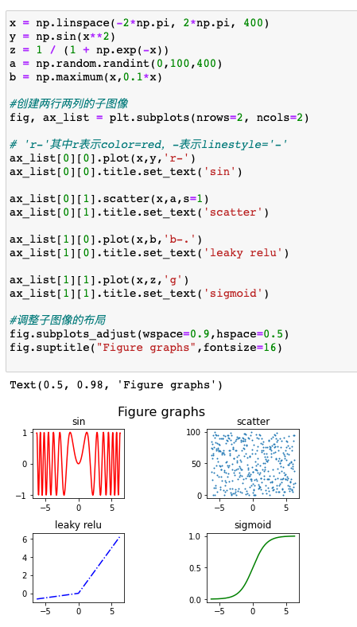

[toc]


# Matplotlib

Matplotlib 是建立在NumPy基础之上的Python绘图库，是在机器学习中用于数据可视化的工具


# Hello world

```
import matplotlib.pyplot as plt
import numpy as np
x = np.linspace(-10,10,1000)
y = 1 / (1 + np.exp(-x))
plt.plot(x,y)
plt.show()
```


## 添加常用元素

```
x = np.linspace(-10,10,1000)

#写入公式
y = 1 / (1 + np.exp(-x))

#x轴范围限制
plt.xlim(-5,5)

#y轴范围限制
plt.ylim(-0.2,1.2)

#x轴添加标签
plt.xlabel("X axis")

#y轴添加标签
plt.ylabel("Y axis")

#标题
plt.title("sigmoid function")

#设置网格，途中红色虚线
plt.grid(linestyle=":", color ="red")

#设置水平参考线
plt.axhline(y=0.5, color="green", linestyle="--", linewidth=2)

#设置垂直参考线
plt.axvline(x=0.0, color="green", linestyle="--", linewidth=2)

#绘制曲线
plt.plot(x,y)

#保存图像
plt.savefig("./sigmoid.png",format='png', dpi=300)
```


## 多曲线绘制

```
#生成均匀分布的1000个数值
x = np.linspace(-10,10,1000)

#写入sigmoid公式
y = 1 / (1 + np.exp(-x))
z = x**2
plt.xlim(-2,2)
plt.ylim(0,1)

#绘制sigmoid
plt.plot(x,y,color='#E0BF1D',linestyle='-', label ="sigmoid")

#绘制y=x*x
plt.plot(x,z,color='purple',linestyle='-.', label = "y=x*x")

#绘制legend，即下图角落的图例
plt.legend(loc="upper left")

#展示
plt.show()
```


# 常用方法


## figure 画布

首先我们认识figure(画布)，比如legend我们在上文中提到过，是线条标签的展示。grid所圈住的虚线是网格参考线。Title/x axislabel等文本标签。这张图有助于我们对figure有一个直观的理解。

```
import numpy as np
import matplotlib.pyplot as plt
from matplotlib.ticker import AutoMinorLocator, MultipleLocator, FuncFormatter

np.random.seed(19680801)

X = np.linspace(0.5, 3.5, 100)
Y1 = 3+np.cos(X)
Y2 = 1+np.cos(1+X/0.75)/2
Y3 = np.random.uniform(Y1, Y2, len(X))

fig = plt.figure(figsize=(8, 8))
ax = fig.add_subplot(1, 1, 1, aspect=1)


def minor_tick(x, pos):
    if not x % 1.0:
        return ""
    return "%.2f" % x

ax.xaxis.set_major_locator(MultipleLocator(1.000))
ax.xaxis.set_minor_locator(AutoMinorLocator(4))
ax.yaxis.set_major_locator(MultipleLocator(1.000))
ax.yaxis.set_minor_locator(AutoMinorLocator(4))
ax.xaxis.set_minor_formatter(FuncFormatter(minor_tick))

ax.set_xlim(0, 4)
ax.set_ylim(0, 4)

ax.tick_params(which='major', width=1.0)
ax.tick_params(which='major', length=10)
ax.tick_params(which='minor', width=1.0, labelsize=10)
ax.tick_params(which='minor', length=5, labelsize=10, labelcolor='0.25')

ax.grid(linestyle="--", linewidth=0.5, color='.25', zorder=-10)

ax.plot(X, Y1, c=(0.25, 0.25, 1.00), lw=2, label="Blue signal", zorder=10)
ax.plot(X, Y2, c=(1.00, 0.25, 0.25), lw=2, label="Red signal")
ax.plot(X, Y3, linewidth=0,
        marker='o', markerfacecolor='w', markeredgecolor='k')

ax.set_title("Anatomy of a figure", fontsize=20, verticalalignment='bottom')
ax.set_xlabel("X axis label")
ax.set_ylabel("Y axis label")

ax.legend()


def circle(x, y, radius=0.15):
    from matplotlib.patches import Circle
    from matplotlib.patheffects import withStroke
    circle = Circle((x, y), radius, clip_on=False, zorder=10, linewidth=1,
                    edgecolor='black', facecolor=(0, 0, 0, .0125),
                    path_effects=[withStroke(linewidth=5, foreground='w')])
    ax.add_artist(circle)


def text(x, y, text):
    ax.text(x, y, text, backgroundcolor="white",
            ha='center', va='top', weight='bold', color='blue')


# Minor tick
circle(0.50, -0.10)
text(0.50, -0.32, "Minor tick label")

# Major tick
circle(-0.03, 4.00)
text(0.03, 3.80, "Major tick")

# Minor tick
circle(0.00, 3.50)
text(0.00, 3.30, "Minor tick")

# Major tick label
circle(-0.15, 3.00)
text(-0.15, 2.80, "Major tick label")

# X Label
circle(1.80, -0.27)
text(1.80, -0.45, "X axis label")

# Y Label
circle(-0.27, 1.80)
text(-0.27, 1.6, "Y axis label")

# Title
circle(1.60, 4.13)
text(1.60, 3.93, "Title")

# Blue plot
circle(1.75, 2.80)
text(1.75, 2.60, "Line\n(line plot)")

# Red plot
circle(1.20, 0.60)
text(1.20, 0.40, "Line\n(line plot)")

# Scatter plot
circle(3.20, 1.75)
text(3.20, 1.55, "Markers\n(scatter plot)")

# Grid
circle(3.00, 3.00)
text(3.00, 2.80, "Grid")

# Legend
circle(3.70, 3.80)
text(3.70, 3.60, "Legend")

# Axes
circle(0.5, 0.5)
text(0.5, 0.3, "Axes")

# Figure
circle(-0.3, 0.65)
text(-0.3, 0.45, "Figure")

color = 'blue'
ax.annotate('Spines', xy=(4.0, 0.35), xytext=(3.3, 0.5),
            weight='bold', color=color,
            arrowprops=dict(arrowstyle='->',
                            connectionstyle="arc3",
                            color=color))

ax.annotate('', xy=(3.15, 0.0), xytext=(3.45, 0.45),
            weight='bold', color=color,
            arrowprops=dict(arrowstyle='->',
                            connectionstyle="arc3",
                            color=color))

ax.text(4.0, -0.4, "Made with http://matplotlib.org",
        fontsize=10, ha="right", color='.5')

plt.show()
```


### subplots 

```
x = np.linspace(-2*np.pi, 2*np.pi, 400)
y = np.sin(x**2)
z = 1 / (1 + np.exp(-x))
a = np.random.randint(0,100,400)
b = np.maximum(x,0.1*x)

#创建两行两列的子图像
fig, ax_list = plt.subplots(nrows=2, ncols=2)

# 'r-'其中r表示color=red，-表示linestyle='-'
ax_list[0][0].plot(x,y,'r-')
ax_list[0][0].title.set_text('sin')

ax_list[0][1].scatter(x,a,s=1)
ax_list[0][1].title.set_text('scatter')

ax_list[1][0].plot(x,b,'b-.')
ax_list[1][0].title.set_text('leaky relu')

ax_list[1][1].plot(x,z,'g')
ax_list[1][1].title.set_text('sigmoid')

#调整子图像的布局
fig.subplots_adjust(wspace=0.9,hspace=0.5)
fig.suptitle("Figure graphs",fontsize=16)
```





## annotate 注释

```
fig, ax = plt.subplots(figsize=(8, 8))

t = np.arange(0.0, 5.0, 0.01)
s = np.cos(2*np.pi*t)

# 绘制一条曲线
line, = ax.plot(t, s)

#添加注释
ax.annotate('figure pixels',
            xy=(10, 10), xycoords='figure pixels')
ax.annotate('figure points',
            xy=(80, 80), xycoords='figure points')
ax.annotate('figure fraction',
            xy=(.025, .975), xycoords='figure fraction',
            horizontalalignment='left', verticalalignment='top',
            fontsize=20)

#第一个箭头
ax.annotate('point offset from data',
            xy=(2, 1), xycoords='data',
            xytext=(-15, 25), textcoords='offset points',
            arrowprops=dict(facecolor='black', shrink=0.05),
            horizontalalignment='right', verticalalignment='bottom')

#第二个箭头
ax.annotate('axes fraction',
            xy=(3, 1), xycoords='data',
            xytext=(0.8, 0.95), textcoords='axes fraction',
            arrowprops=dict(facecolor='black', shrink=0.05),
            horizontalalignment='right', verticalalignment='top')

ax.set(xlim=(-1, 5), ylim=(-3, 5))
```


## Axes3D 库 （3D图像）

```
from mpl_toolkits.mplot3d import Axes3D
import matplotlib.pyplot as plt
from matplotlib import cm
from matplotlib.ticker import LinearLocator, FormatStrFormatter
import numpy as np


fig = plt.figure(figsize=(15,15))
ax = fig.gca(projection='3d')

# Make data.
X = np.arange(-5, 5, 0.25)
Y = np.arange(-5, 5, 0.25)
X, Y = np.meshgrid(X, Y)
R = np.sqrt(X**2 + Y**2)
Z = np.sin(R)

# Plot the surface.
surf = ax.plot_surface(X, Y, Z, cmap=cm.coolwarm,
                       linewidth=0, antialiased=False)

# Customize the z axis.
ax.set_zlim(-1.01, 1.01)
ax.zaxis.set_major_locator(LinearLocator(10))
ax.zaxis.set_major_formatter(FormatStrFormatter('%.02f'))

# Add a color bar which maps values to colors.
fig.colorbar(surf, shrink=0.5, aspect=5)
```


## animation 绘制动画 

绘制动画需要引入`animation`库，通过调用`FuncAnimation`方法来实现绘制动画。

```
import numpy as np
from matplotlib import pyplot as plt
from matplotlib import animation

fig = plt.figure()
ax = plt.axes(xlim=(0, 2), ylim=(-2, 2))
line, = ax.plot([], [], lw=2)

# 初始化方法
def init():
    line.set_data([], [])
    return line,

# 数据更新方法，周期性调用
def animate(i):
    x = np.linspace(0, 2, 1000)
    y = np.sin(2 * np.pi * (x - 0.01 * i))
    line.set_data(x, y)
    return line,

#绘制动画，frames帧数，interval周期行调用animate方法
anim = animation.FuncAnimation(fig, animate, init_func=init,
                               frames=200, interval=20, blit=True)
anim.save('ccccc.gif', fps=30)

plt.show()
```


# 参数简写

matplotlib支持参数的缩写

```
x = np.linspace(-10,10,20)
y = 1 / (1 + np.exp(-x))
plt.plot(x,y,c='k',ls='-',lw=5, label ="sigmoid", marker="o", ms=15, mfc='r')
plt.legend()
```


## c color(颜色)

| 字符 |    颜色 |
| :--- | ------: |
| ‘b’  |    blue |
| ‘g’  |   green |
| ‘r’  |     red |
| ‘c’  |    cyan |
| ‘m’  | magenta |
| ‘y’  |  yellow |
| ‘k’  |   black |
| ‘w’  |   white |


## ls linestyle(线条样式)

| 字符 |                  描述 |
| :--- | --------------------: |
| '-'  |      solid line style |
| '--' |     dashed line style |
| '-.' |   dash-dot line style |
| ':'  |     dotted line style |
| '.'  |          point marker |
| ','  |          pixel marker |
| 'o'  |         circle marker |
| 'v'  |  triangle_down marker |
| '^'  |    triangle_up marker |
| '<'  |  triangle_left marker |
| '>'  | triangle_right marker |
| '1'  |       tri_down marker |
| '2'  |         tri_up marker |
| '3'  |       tri_left marker |
| '4'  |      tri_right marker |
| 's'  |         square marker |
| 'p'  |       pentagon marker |
| '*'  |           star marker |
| 'h'  |       hexagon1 marker |
| 'H'  |       hexagon2 marker |
| '+'  |           plus marker |
| 'x'  |              x marker |
| 'D'  |        diamond marker |
| 'd'  |   thin_diamond marker |
| '\|' |          vline marker |
| '_'  |           hline marke |


## markers 记号样式


# Appendix

https://mp.weixin.qq.com/s?__biz=MzUxMjU4NjI4MQ==&mid=2247484161&idx=1&sn=926422d98f887db04d79112c98587775&chksm=f9636447ce14ed5182d05ef2b9cecb466353a634154eff891a5c4f1a292e6f3e945db931c62b&scene=178&cur_album_id=1627166768236412929#rd


https://matplotlib.org/3.2.1/gallery/showcase/anatomy.html


https://matplotlib.org/3.2.1/tutorials/introductory/sample_plots.html