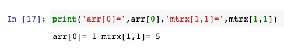

[toc]


# Numpy


## 创建数组


```
import numpy as np
arr = np.array([1, 2, 3, 4, 5])
```


我们输入以下代码创建二维数组：

```
my_matrix = [[1,2,3],[4,5,6],[7,8,9]]
mtrx= np.array(my_matrix)
```


## 索引与切片

索引一维数组与二位数组如下：

```
print('arr[0]=',arr[0],'mtrx[1,1]=',mtrx[1,1])
```



对数组切片：

```
arr[:3]
```


倒数切片：

```
arr[-3:-1]
```


加入步长(step)，步长决定了切片间隔：

```
arr[1:4:2]
```


二维数组切片：

```
mtrx[0:2, 0:2]
```

输出，代码意义为取第1、2行，第1、2列：


## dtype

NumPy的dtpe有如下几种数据类型：

```
i - integer
b - boolean
u - unsigned integer
f - float
c - complex float
m - timedelta
M - datetime
O - object
S - string
U - unicode string
V - fixed chunk of memory for other type ( void )
```


```
import numpy as np
arr1 = np.array([1, 2, 3, 4])
arr2 = np.array(['apple', 'banana', 'cherry'])
print('arr1.dtype=',arr1.dtype,'arr2.dtype=',arr2.dtype)
```


>  arr1数据类型为int64，arr2的<U6 表示不超过6位Unicode字符串。


我们可以指定dtype类型。

```
arr = np.array(['1', '2', '3'], dtype='f')
```


>  其中1.表示1.0，可以看到dtype被设置为float32数据类型。


# 常用方法

## arange

```
np.arange(0,101,2)
```

输出结果如下，该命令表示，在[0,101)区间内均匀地生成数据，间隔步长为2。

```
array([  0,   2,   4,   6,   8,  10,  12,  14,  16,  18,  20,  22,  24,
        26,  28,  30,  32,  34,  36,  38,  40,  42,  44,  46,  48,  50,
        52,  54,  56,  58,  60,  62,  64,  66,  68,  70,  72,  74,  76,
        78,  80,  82,  84,  86,  88,  90,  92,  94,  96,  98, 100])
```


## zeros

```
np.zeros((2,5))
```

输出结果如下，该命令表示，输出2行5列全为0的矩阵（二维数组）。

```
array([[0., 0., 0., 0., 0.],
       [0., 0., 0., 0., 0.]])
```


## ones

`np.ones((4,4))`输出结果如下，该命令表示，输出4行4列全为1的矩阵。

```
array([[1., 1., 1., 1.],
       [1., 1., 1., 1.],
       [1., 1., 1., 1.],
       [1., 1., 1., 1.]])
```


## eye

```
np.eye(5)
```

输出结果如下，该命令表示，输出对角线为1其余全为0的5行5列方阵。*方阵为行列相同的矩阵。*

```
array([[1., 0., 0., 0., 0.],
       [0., 1., 0., 0., 0.],
       [0., 0., 1., 0., 0.],
       [0., 0., 0., 1., 0.],
       [0., 0., 0., 0., 1.]])
```


## rand

```
np.random.rand(5,2)
```

 命令生成5行2列的随机数。

```
array([[0.67227856, 0.4880784 ],
       [0.82549517, 0.03144639],
       [0.80804996, 0.56561742],
       [0.2976225 , 0.04669572],
       [0.9906274 , 0.00682573]])
```

如果想保证随机出与本例一样的随机数，可使用与本例相同的随机种子。通过`np.random.seed`方法设置。

```
np.random.seed(99)
np.random.rand(5,2)
```


## randint

`np.random.randint(0,101,(4,5))`输出结果如下，该命令表示，在[0,101)区间内随机选取**整数**生成4行5列的数组。

```
array([[ 1, 35, 57, 40, 73],
       [82, 68, 69, 52,  1],
       [23, 35, 55, 65, 48],
       [93, 59, 87,  2, 64]])
```


## max min argmax argmin

我们先随机生成一组数：

```
np.random.seed(99)
ranarr = np.random.randint(0,101,10)
ranarr
```

输出：

```
array([ 1, 35, 57, 40, 73, 82, 68, 69, 52,  1])
```

查看最大最小值分别为：

```
print('ranarr.max()=',ranarr.max(),'ranarr.min()=',ranarr.min())
```

输出结果为`ranarr.max()= 82 ranarr.min()= 1`。
其中最大值和最小值的索引位置分别为：

```
print('ranarr.argmax()=',ranarr.argmax(),'ranarr.argmin()=',ranarr.argmin())
```

输出：

```
ranarr.argmax()= 5 ranarr.argmin()= 0
```

> 注意，当出现多个最大最小值时，取前面的索引位置。


##  reshape

```
arr = np.array([1, 2, 3, 4, 5, 6, 7, 8, 9, 10, 11, 12])
newarr = arr.reshape(4, 3)
```

其中，arr为一维数组，newarr为二位数组，其中行为4，列为3。

```
print('arr.shape=',arr.shape,'newarr.shape=',newarr.shape)
```

输出 `arr.shape= (12,) newarr.shape= (4, 3)`。

`newarr`的输出结果如下：

```
array([[ 1,  2,  3],
       [ 4,  5,  6],
       [ 7,  8,  9],
       [10, 11, 12]])
```


##  concatenate 合并

一维数组合并：

```
arr1 = np.array([1, 2, 3])
arr2 = np.array([4, 5, 6])
arr = np.concatenate((arr1, arr2))
arr
```

输出： `array([1, 2, 3, 4, 5, 6])`。

二维数组合并：

```
arr1 = np.array([[1, 2], [3, 4]])
arr2 = np.array([[5, 6], [7, 8]])
arr = np.concatenate((arr1, arr2))
arr
```

输出为：

```
array([[1, 2],
       [3, 4],
       [5, 6],
       [7, 8]])
```

我们添加参数**axis=1**：

```
arr1 = np.array([[1, 2], [3, 4]])
arr2 = np.array([[5, 6], [7, 8]])
arr = np.concatenate((arr1, arr2), axis=1)
arr
```

输出为：

```
array([[1, 2, 5, 6],
       [3, 4, 7, 8]])
```


我们把鼠标移到 `concatenate`，按快捷键`Shift+Tab`查看方法说明。可以看到`concatenate`方法沿着现有的轴进行合并操作，默认axis=0。当我们设置axis=1后，合并操作沿着列进行


## array_split 

分割数组：

```
arr = np.array([[1, 2], [3, 4], [5, 6], [7, 8], [9, 10], [11, 12]])
newarr = np.array_split(arr, 3)
newarr
```

newarr的值为：

```
[array([[1, 2],
        [3, 4]]),
 array([[5, 6],
        [7, 8]]),
 array([[ 9, 10],
        [11, 12]])]
```


## where 搜索

NumPy可通过`where`方法查找满足条件的数组索引。

```
arr = np.array([1, 2, 3, 4, 5, 6, 7, 8])
x = np.where(arr%2 == 0)
x
```

输出：

```
(array([1, 3, 5, 7], dtype=int64),)
```


## 筛选

下面的代码：

```
bool_arr = arr > 4
arr[bool_arr]
```

输出：`array([5, 6, 7, 8])`。这回我们返回的是数组中的值，而非索引。我们看看`bool_arr`的内容究竟是什么。 `bool_arr`的输出为：

```
array([False, False, False, False,  True,  True,  True,  True])
```

所以我们可以用以下命令代替以上筛选。

```
arr[arr > 4]
```


## sort

`sort`方法可对ndarry数组进行排序。

```
arr = np.array(['banana', 'cherry', 'apple'])
np.sort(arr)
```

输出排序后的结果：`array(['apple', 'banana', 'cherry'], dtype='<U6')`。

针对二维数组，`sort`方法对每一行单独排序。

```
arr = np.array([[3, 2, 4], [5, 0, 1]])
np.sort(arr)
```

输出结果：

```
array([[2, 3, 4],
       [0, 1, 5]])
```


## 随机概率

如果我们想完成如下需求该如何处理？

生成包含100个值的一维数组，其中每个值必须为3、5、7或9。将该值为3的概率设置为0.1。将该值为5的概率设置为0.3。将该值为7的概率设置为0.6。将该值为9的概率设置为0。

我们用如下命令解决：

```
random.choice([3, 5, 7, 9], p=[0.1, 0.3, 0.6, 0.0], size=(100))
```

输出结果：

```
array([7, 5, 7, 7, 7, 7, 5, 7, 5, 7, 7, 5, 5, 7, 7, 5, 3, 5, 7, 7, 7, 7,
       7, 7, 7, 7, 7, 7, 5, 3, 7, 5, 7, 5, 7, 3, 7, 7, 3, 7, 7, 7, 7, 3,
       5, 7, 7, 5, 7, 7, 5, 3, 5, 7, 7, 5, 5, 5, 5, 5, 7, 7, 7, 7, 7, 5,
       7, 7, 7, 7, 7, 5, 7, 7, 7, 7, 3, 7, 7, 5, 7, 5, 7, 5, 7, 7, 5, 7,
       7, 7, 7, 7, 7, 3, 5, 5, 7, 5, 7, 5])
```


## permutation 随机排列

根据原有数组生成新的随机排列。

```
np.random.seed(99)
arr = np.array([1, 2, 3, 4, 5])
new_arr = np.random.permutation(arr)
new_arr
```

输出为：`array([3, 1, 5, 4, 2])`。原数组`arr`不变。


## shuffle

改变原有数组为随机排列。shuffle在英文中有洗牌的意思。

```
np.random.seed(99)
arr = np.array([1, 2, 3, 4, 5])
np.random.shuffle(arr)
arr
```

输出为：`array([3, 1, 5, 4, 2])`。原数组`arr`改变。


## 随机分布


### 正太分布

使用`np.random.normal`方法生成符合正太分布的随机数。

```
x = np.random.normal(loc=1, scale=2, size=(2, 3))
x
```

输出结果为：

```
array([[ 0.14998973,  3.22564777,  1.48094109],
       [ 2.252752  , -1.64038195,  2.8590667 ]])
```


如果我们想查看x的随机分布，需安装seaborn绘制图像。使用pip安装：

```
%%sh
pip install -i https://pypi.tuna.tsinghua.edu.cn/simple seaborn
```


```
import matplotlib.pyplot as plt
import seaborn as sns
sns.distplot(x, hist=False)
plt.show()
```


### 二项分布 

使用`np.random.binomial`方法生成符合二项分布的随机数。

```
x = np.random.binomial(n=10, p=0.5, size=10)
x
```

输出结果为： `array([8, 6, 6, 2, 5, 5, 5, 5, 3, 4])`。

绘制图像：

```
import matplotlib.pyplot as plt
import seaborn as sns
sns.distplot(x, hist=True, kde=False)
plt.show()
```


### 多项式分布 

多项式分布是二项分布的一般表示。使用`np.random.multinomial`方法生成符合多项式分布的随机数。

```
x = np.random.multinomial(n=6, pvals=[1/6, 1/6, 1/6, 1/6, 1/6, 1/6])
x
```

上面代码，我们可以简单理解为投掷骰子。n=6为骰子的面，pvals表示每一面的概率为1/6。