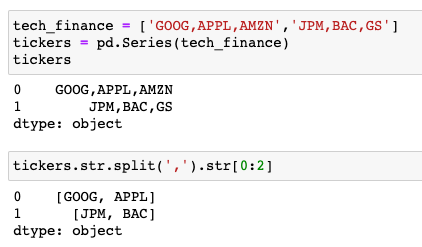
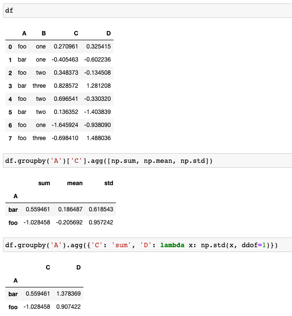

[toc]


# pandas

pandas，Python+data+analysis的组合缩写，是Python中基于Numpy和Matplotlib的第三方数据分析库，与后两者共同构成了Python数据分析的基础工具包


## 特点

- 按索引匹配的广播机制，这里的广播机制与Numpy广播机制还有很大不同
- 便捷的数据读写操作，相比于Numpy仅支持数字索引，pandas的两种数据结构均支持标签索引，包括bool索引也是支持的
- 类比SQL的join和groupby功能，pandas可以很容易实现SQL这两个核心功能，实际上，SQL的绝大部分DQL和DML操作在pandas中都可以实现
- 类比Excel的数据透视表功能，Excel中最为强大的数据分析工具之一是数据透视表，这在pandas中也可轻松实现
- 自带正则表达式的字符串向量化操作，对pandas中的一列字符串进行通函数操作，而且自带正则表达式的大部分接口
- 丰富的时间序列向量化处理接口
- 常用的数据分析与统计功能，包括基本统计量、分组统计分析等
- 集成Matplotlib的常用可视化接口，无论是series还是dataframe，均支持面向对象的绘图接口


## numpy vs pandas

正因为pandas是在Numpy基础上实现，其核心数据结构与Numpy的ndarray十分相似，但pandas与Numpy的关系不是替代，而是互为补充。二者之间主要区别是：


**从数据结构上看**

Numpy的核心数据结构是ndarray，支持任意维数的数组，但要求单个数组内所有数据是同质的，即类型必须相同；

而pandas的核心数据结构是series和dataframe，仅支持一维和二维数据，但数据内部可以是异构数据，仅要求同列数据类型一致即可

Numpy的数据结构仅支持数字索引，而pandas数据结构则同时支持数字索引和标签索引


**从功能定位上看**

Numpy虽然也支持字符串等其他数据类型，但仍然主要是用于数值计算，尤其是内部集成了大量矩阵计算模块，例如基本的矩阵运算、线性代数、fft、生成随机数等，支持灵活的广播机制

pandas主要用于数据处理与分析，支持包括数据读写、数值计算、数据处理、数据分析和数据可视化全套流程操作


# hello world


1.csv

```
Date,Symbol,Open,High,Low,Close,Volume
2019-07-08 00:00:00,BTCUSD,11475.07,11540.33,11469.53,11506.43,10.77073088
2019-07-07 23:00:00,BTCUSD,11423.0,11482.72,11423.0,11475.07,32.99655899
2019-07-07 22:00:00,BTCUSD,11526.25,11572.74,11333.59,11423.0,48.9377301868
2019-07-07 21:00:00,BTCUSD,11515.8,11562.65,11478.2,11526.25,25.3239076786
2019-07-07 20:00:00,BTCUSD,11547.98,11624.88,11423.94,11515.8,63.2119724403
2019-07-07 19:00:00,BTCUSD,11470.47,11610.0,11432.32,11547.98,67.915214697
2019-07-07 18:00:00,BTCUSD,11502.04,11525.0,11426.74,11470.47,31.1094771869
2019-07-07 17:00:00,BTCUSD,11201.6,11566.43,11201.6,11502.04,121.5256740453
2019-07-07 16:00:00,BTCUSD,11254.97,11254.97,11135.01,11201.6,23.5194946648
2019-07-07 15:00:00,BTCUSD,11358.05,11408.02,11189.0,11254.97,64.0821938629
2019-07-07 14:00:00,BTCUSD,11383.54,11428.95,11358.05,11358.05,8.2622672695
```


```
from os import path
import pandas as pd


def assert_msg(condition, msg):
    if not condition:
        raise Exception(msg)


def read_file(filename):
    filepath = path.join(path.dirname(__file__), filename)

    assert_msg(path.exists(filepath), 'filename is not exist')

    return pd.read_csv(filepath,
                       index_col=0,
                       parse_dates=True,
                       infer_datetime_format=True)


BTCUSD = read_file('1.csv')
assert_msg(BTCUSD.__len__() > 0, 'read file is failed')

print(BTCUSD.head())

>>>
                     Symbol      Open      High       Low     Close     Volume
Date                                                                          
2019-07-08 00:00:00  BTCUSD  11475.07  11540.33  11469.53  11506.43  10.770731
2019-07-07 23:00:00  BTCUSD  11423.00  11482.72  11423.00  11475.07  32.996559
2019-07-07 22:00:00  BTCUSD  11526.25  11572.74  11333.59  11423.00  48.937730
2019-07-07 21:00:00  BTCUSD  11515.80  11562.65  11478.20  11526.25  25.323908
2019-07-07 20:00:00  BTCUSD  11547.98  11624.88  11423.94  11515.80  63.211972
```


# 数据结构

pandas核心数据结构有两种，即一维的series和二维的dataframe，二者可以分别看做是在Numpy一维数组和二维数组的基础上增加了相应的标签信息。正因如此，可以从两个角度理解series和dataframe


## series 

series是带标签的一维数组，所以还可以看做是**类字典**结构：标签是key，取值是value

series中允许标签名重复


**ndim/shape/dtypes/size/T**，分别表示了数据的维数、形状、数据类型和元素个数以及转置结果。其中，由于pandas允许数据类型是异构的，各列之间可能含有多种不同的数据类型，所以dtype取其复数形式dtypes。与此同时，series因为只有一列，所以数据类型自然也就只有一种，pandas为了兼容二者，series的数据类型属性既可以用dtype也可以用dtypes获取；而dataframe则只能用dtypes。


```
import numpy as np
import pandas as pd 
pd.Series([1, 3, 5, np.nan, 6, 8])
```

> ```
> 0    1.0
> 1    3.0
> 2    5.0
> 3    NaN
> 4    6.0
> 5    8.0
> dtype: float64
> ```
>
> 


## dataframe

dataframe则可以看做是嵌套字典结构，其中列名是key，每一列的series是value。所以从这个角度讲，pandas数据创建的一种灵活方式就是通过字典或者嵌套字典，

dataframe中则允许列名和标签名均有重复


**index/columns/values**，分别对应了行标签、列标签和数据，其中数据就是一个格式向上兼容所有列数据类型的array。为了沿袭字典中的访问习惯，还可以用keys()访问标签信息，在series返回index标签，在dataframe中则返回columns列名


```
import pandas as pd
pd.DataFrame(np.array([[1, 2, 3], [4, 5, 6], [7, 8, 9]]), index=['i','ii','iii'], columns=['A', 'B', 'C'])
```

> |      |    A |    B |    C |
> | ---: | ---: | ---: | ---: |
> |    i |    1 |    2 |    3 |
> |   ii |    4 |    5 |    6 |
> |  iii |    7 |    8 |    9 |


## index

这里提到了index和columns分别代表行标签和列标签，就不得不提到pandas中的另一个数据结构：Index，例如series中标签列、dataframe中行标签和列标签均属于这种数据结构。

既然是数据结构，就必然有数据类型dtype属性，例如数值型、字符串型或时间类型等，其类型绝大多数场合并不是我们关注的主体，但有些时候值得注意，如后文中提到的通过[ ]执行标签切片访问行的过程。

此外，index数据结构还有名字属性name（默认为None）、形状属性shape等。


# 重构操作

## rename

可以对标签名重命名，也可以重置index和columns的部分标签列信息，接收标量（用于对标签名重命名）或字典（用于重命名行标签和列标签）

```py
df = pd.DataFrame('x', index=range(3), columns=list('abcde'))
df
>>>
   a  b  c  d  e
0  x  x  x  x  x
1  x  x  x  x  x
2  x  x  x  x  x
```

The following methods all work and produce the same output:

```py
df2 = df.rename({'a': 'X', 'b': 'Y'}, axis=1)  # new method
df2 = df.rename({'a': 'X', 'b': 'Y'}, axis='columns')
df2 = df.rename(columns={'a': 'X', 'b': 'Y'})  # old method  

df2
>>>
   X  Y  c  d  e
0  x  x  x  x  x
1  x  x  x  x  x
2  x  x  x  x  x
```

Remember to assign the result back, as the modification is not-inplace. Alternatively, specify `inplace=True`:

```py
df.rename({'a': 'X', 'b': 'Y'}, axis=1, inplace=True)
df
>>>
   X  Y  c  d  e
0  x  x  x  x  x
1  x  x  x  x  x
2  x  x  x  x  x
```


## reindex

接收一个新的序列与已有标签列匹配，当原标签列中不存在相应信息时，填充NAN或者可选的填充值


## set_index/reset_index

互为逆操作，前者是将已有的一列信息设置为标签列，而后者是将原标签列归为数据，并重置为默认数字标签


## set_axis

设置标签列，一次只能设置一列信息，与rename功能相近，但接收参数为一个序列更改全部标签列信息（rename中是接收字典，允许只更改部分信息）


## rename_axis

重命名标签名，rename中也可实现相同功能


# 数据读写

Pandas支持直接从文件中读写数据，如CSV、JSON、EXCEL等文件格式。Pandas支持的文件格式如下。

| Format Type |      Data Description |         Reader |       Writer |
| :---------- | --------------------: | -------------: | -----------: |
| text        |                   CSV |       read_csv |       to_csv |
| text        | Fixed-Width Text File |       read_fwf |              |
| text        |                  JSON |      read_json |      to_json |
| text        |                  HTML |      read_html |      to_html |
| text        |       Local clipboard | read_clipboard | to_clipboard |
|             |              MS Excel |     read_excel |     to_excel |
| binary      |          OpenDocument |     read_excel |              |
| binary      |           HDF5 Format |       read_hdf |       to_hdf |
| binary      |        Feather Format |   read_feather |   to_feather |
| binary      |        Parquet Format |   read_parquet |   to_parquet |
| binary      |            ORC Format |       read_orc |              |
| binary      |               Msgpack |   read_msgpack |   to_msgpack |
| binary      |                 Stata |     read_stata |     to_stata |
| binary      |                   SAS |       read_sas |              |
| binary      |                  SPSS |      read_spss |              |
| binary      |  Python Pickle Format |    read_pickle |    to_pickle |
| SQL         |                   SQL |       read_sql |       to_sql |
| SQL         |       Google BigQuery |       read_gbq |       to_gbq |


## read_csv()/to_csv()

文本文件，主要包括csv和txt两种等，分别用于读写数据


```
index_col=0 # 关闭index 列显示
```


In summary, what you're doing is saving the index to file and when you're reading back from the file, the column previously saved as `index` is loaded as a regular column.

There are a few ways to deal with this:

*Method 1*

When saving a `pandas.DataFrame` to disk, use `index=False` like this:

```py
df.to_csv(path, index=False)
```

*Method 2*

When reading from file, you can define the column that is to be used as index, like this:

```py
df = pd.read_csv(path, index_col='index')
```

*Method 3*

If method #2 does not suit you for some reason, you can always set the column to be used as index later on, like this:

```py
df.set_index('index', inplace=True)
```

After this point, your datafame should look like this:

```py
        userid    locale    age
index
    0    A1092     EN-US     31
    1    B9032     SV-SE     23
```


## read_excel()/to_excel()

Excel文件， 包括xls和xlsx两种格式均得到支持，底层是调用了xlwt和xlrd进行excel文件操作


## read_sql()/to_sql()

SQL文件，支持大部分主流关系型数据库，例如MySQL，需要相应的数据库模块支持


# 数据访问

series和dataframe兼具Numpy数组和字典的结构特性，所以数据访问都是从这两方面入手。同时，也支持bool索引进行数据访问和筛选。


## [ ] 切片（常用）

这是一个非常便捷的访问方式，不过需区分series和dataframe两种数据结构理解：

**series：**既可以用标签也可以用数字索引访问单个元素，还可以用相应的切片访问多个值，因为只有一维信息，自然毫无悬念

**dataframe：**无法访问单个元素，只能返回一列、多列或多行

**单值或多值（多个列名组成的列表）访问时按列进行查询**，单值访问不存在列名歧义时还可直接用属性符号" . "访问。


## loc/iloc （常用）

最为常用的两种数据访问方法

loc按标签值访问, loc按标签访问时也是执行范围查询，包含两端结果

iloc按数字索引访问

均支持单值访问或切片查询。与[ ]访问类似

```
df.iloc[3:5, 0:3]
```

> 表示选取索引为3、4的行，索引为0、1、2的列。即，第4、5行，第1、2、3列。注意，索引序号从0开始。冒号表示区间，左右两侧分别表示开始和结束。如`3:5`表示左开右闭区间`[3,5)`，即不包含5自身。


## at/iat

loc和iloc的特殊形式，不支持切片访问，仅可以用单个标签值或单个索引值进行访问，一般返回标量结果，除非标签值存在重复


## isin/notin

条件范围查询，即根据特定列值是否存在于指定列表返回相应的结果


## where

仍然是执行条件查询，但会返回全部结果，只是将不满足匹配条件的结果赋值为NaN或其他指定值，可用于筛选或屏蔽值


## query

按列对dataframe执行条件查询，一般可用常规的条件查询替代


## get

由于series和dataframe均可以看做是类字典结构，所以也可使用字典中的get()方法，主要适用于不确定数据结构中是否包含该标签时，与字典的get方法完全一致


## lookup

loc的一种特殊形式，分别传入一组行标签和列标签，lookup解析成一组行列坐标，返回相应结果


## 行遍历

```
# import pandas package as pd 
import pandas as pd 

# Define a dictionary containing students data 
data = {'Name': ['Ankit', 'Amit', 'Aishwarya', 'Priyanka'], 
				'Age': [21, 19, 20, 18], 
				'Stream': ['Math', 'Commerce', 'Arts', 'Biology'], 
				'Percentage': [88, 92, 95, 70]} 

# Convert the dictionary into DataFrame 
df = pd.DataFrame(data, columns = ['Name', 'Age', 'Stream', 'Percentage']) 

print("Given Dataframe :\n", df) 

print("\nIterating over rows using loc function :\n") 

# iterate through each row and select 
# 'Name' and 'Age' column respectively. 
for i in range(len(df)) : 
		print(df.loc[i, "Name"], df.loc[i, "Age"]) 

```

**Output:**

```
Given Dataframe :
         Name  Age    Stream  Percentage
0      Ankit   21      Math          88
1       Amit   19  Commerce          92
2  Aishwarya   20      Arts          95
3   Priyanka   18   Biology          70

Iterating over rows using loc function :

Ankit 21
Amit 19
Aishwarya 20
Priyanka 18
```


# 数据清洗

数据处理中的清洗工作主要包括对空值、重复值和异常值的处理：


## isna**或**isnull 判断空值

二者等价，用于判断一个series或dataframe各元素值是否为空的bool结果。

需注意对空值的界定：即None或numpy.nan才算空值，而空字符串、空列表等则不属于空值；类似地，notna和notnull则用于判断是否非空


## fillna 填充空值

按一定策略对空值进行填充，如常数填充、向前/向后填充等，也可通过inplace参数确定是否本地更改

fillna并不会更新原有的DataFrame


## dropna 删除空值

删除存在空值的整行或整列，可通过axis设置，也包括inplace参数

使用dropna方法清空NaN值。注意：dropa方法返回新的DataFrame，并不会改变原有的DataFrame。


## 缺失值


## 重复值

- - **检测重复值**，**duplicated**，检测各行是否重复，返回一个行索引的bool结果，可通过keep参数设置保留第一行/最后一行/无保留，例如keep=first意味着在存在重复的多行时，首行被认为是合法的而可以保留
    - **删除重复值**，**drop_duplicates**，按行检测并删除重复的记录，也可通过keep参数设置保留项。由于该方法默认是按行进行检测，如果存在某个需要需要按列删除，则可以先转置再执行该方法


## 异常值

判断异常值的标准依赖具体分析数据，所以这里仅给出两种处理异常值的可选方法

- - **删除**，**drop**，接受参数在特定轴线执行删除一条或多条记录，可通过axis参数设置是按行删除还是按列删除
    - **替换**，**replace**，非常强大的功能，对series或dataframe中每个元素执行按条件替换操作，还可开启正则表达式功能


# 数值计算

由于pandas是在Numpy的基础上实现的，所以Numpy的常用数值计算操作在pandas中也适用：


- **通函数ufunc**，即可以像操作标量一样对series或dataframe中的所有元素执行同一操作，这与Numpy的特性是一致的，例如前文提到的replace函数，本质上可算作是通函数。如下实现对数据表中逐元素求平方


- **广播机制**，即当维度或形状不匹配时，会按一定条件广播后计算。由于pandas是带标签的数组，所以在广播过程中会自动按标签匹配进行广播，而非类似Numpy那种纯粹按顺序进行广播。例如，如下示例中执行一个dataframe和series相乘，虽然二者维度不等、大小不等、标签顺序也不一致，但仍能按标签匹配得到预期结果


## str 字符串向量化

对于数据类型为字符串格式的一列执行向量化的字符串操作，本质上是调用series.str属性的系列接口，完成相应的字符串操作。

尤为强大的是，除了常用的字符串操作方法，str属性接口中还集成了正则表达式的大部分功能，这使得pandas在处理字符串列时，兼具高效和强力。例如如下代码可用于统计每个句子中单词的个数

需注意的是，这里的字符串接口与Python中普通字符串的接口形式上很是相近，但二者是不一样的。


### 切片




## date 时间类型向量化

如字符串一样，在pandas中另一个得到"优待"的数据类型是时间类型，正如字符串列可用str属性调用字符串接口一样，时间类型列可用dt属性调用相应接口，这在处理时间类型时会十分有效。


# 数据转换


前文提到，在处理特定值时可用replace对每个元素执行相同的操作，然而replace一般仅能用于简单的替换操作，所以pandas还提供了更为强大的数据转换方法


## map

**适用于series对象**，功能与Python中的普通map函数类似，即对给定序列中的每个值执行相同的映射操作，不同的是series中的map接口的映射方式既可以是一个函数，也可以是一个字典


## apply

**既适用于series对象也适用于dataframe对象**，但对二者处理的粒度是不一样的

apply应用于series时是逐元素执行函数操作

apply应用于dataframe时是逐行或者逐列执行函数操作（通过axis参数设置对行还是对列，默认是行），仅接收函数作为参数

apply()是对方法的调用。如`df.apply(np.sum)`表示每一列调用np.sum方法，返回每一列的数值和。


## applymap

**仅适用于dataframe对象**，且是对dataframe中的每个元素执行函数操作，从这个角度讲，与replace类似，applymap可看作是dataframe对象的通函数。


# dataframe合并与拼接


pandas中又一个重量级数据处理功能是对多个dataframe进行合并与拼接，对应SQL中两个非常重要的操作：union和join。pandas完成这两个功能主要依赖以下函数：


## concat

与Numpy中的concatenate类似，但功能更为强大，可通过一个axis参数设置是横向或者拼接，**要求非拼接轴向标签唯一**（例如沿着行进行拼接时，要求每个df内部列名是唯一的，但两个df间可以重复，毕竟有相同列才有拼接的实际意义）


## merge

完全类似于SQL中的join语法，仅支持横向拼接，通过设置连接字段，实现对同一记录的不同列信息连接，支持inner、left、right和outer4种连接方式，但只能实现SQL中的等值连接

**how : {'left', 'right', 'outer', 'inner'}** 有4种连接方式。表示是否选取左右两侧表的nan值。如left表示保留左侧表中所有数据，当遇到右侧表数据为nan值时，不显示右侧的数据。简单来说，把left表和right表看作两个集合。

- left表示取左表全部集合+两表交集
- right表示取右表全部集合+两表交集
- outer表示取两表并集
- inner表示取两表交集


### 多列 

需要将base的列获取所有的index，否则数值会不全 

这里需要使用outer


## join

语法和功能与merge一致，不同的是merge既可以用pandas接口调用，也可以用dataframe对象接口调用，而join则只适用于dataframe对象接口


## append

concat执行axis=0时的一个简化接口，类似列表的append函数一样

```
In [148]: df.append({'application_name': 'rxu_test', '1-31': 32}, ignore_index=True)
Out[148]: 
                       application_name  count  1-31
0         ap_aa_advanced-review_term_v1    2.0   NaN
1        ap_aa_advanced-review_topic_v1    2.0   NaN
2   ap_aa_constants_apple-price-tier_v1    3.0   NaN
3                    ap_aa_constants_v1   16.0   NaN
4                   ap_aa_dna_migration    5.0   NaN
5                     ap_aa_fact_sdk_v3    4.0   NaN
6                       ap_aa_review_v1    7.0   NaN
7                 ap_aa_store_domain_v1    3.0   NaN
8       ap_aa_store_download_revenue_v1    2.0   NaN
9                    ap_aa_store_iap_v1    2.0   NaN
10               ap_aa_store_product_v1    1.0   NaN
11                       aso_regular_v6   58.0   NaN
12                           cron_games    1.0   NaN
13                   event_dump_routine    2.0   NaN
14                            event_etl    4.0   NaN
15                       featured_games   10.0   NaN
16                    market_regular_v1   10.0   NaN
17                          rating_1111    3.0   NaN
18               store_rank_routine_pkg  152.0   NaN
19                     usage_regular_v6    3.0   NaN
20                             rxu_test    NaN  32.0
```

实际上，concat通过设置axis=1也可实现与merge类似的效果，二者的区别在于：merge允许连接字段重复，类似一对多或者多对一连接，此时将产生笛卡尔积结果；而concat则不允许重复，仅能一对一拼接。


▲建表语句


▲通过设置参数，concat和merge实现相同效果


# 数据分析

pandas中的另一大类功能是数据分析，通过丰富的接口，可实现大量的统计需求，包括Excel和SQL中的大部分分析过程，在pandas中均可以实现。

pandas内置了丰富的统计接口，这是与Numpy是一致的，同时又包括一些常用统计信息的集成接口。


## Dataframe 展示数据

直接展示数据

```
import numpy as np
import pandas as pd
np.random.seed(20201212)
df = pd.DataFrame(np.random.randn(6, 4), index=pd.date_range('20210101', periods=6), columns=list('ABCD'))
df
```

> 


## info

展示行标签、列标签、以及各列基本信息，包括元素个数和非空个数及数据类型等


## head/tail

从头/尾抽样指定条数记录


## describe

展示数据的基本统计指标，包括计数、均值、方差、4分位数等，还可接收一个百分位参数列表展示更多信息


仅以 `A` 列为例。

- `count`表示计数。A列有6个数据不为空。
- `mean`表示平均值。A列所有不为空的数据平均值为0.0825402。
- `std`表示标准差。A列的标准差为0.551412。
- `min`表示最小值。A列最小值为-0.816064。即，0%的数据比-0.816064小。
- `25%`表示四分之一分位数。A列的四分之一分位数为-0.18。即，25%的数据比-0.18小。
- `50%`表示二分之一分位数。A列的四分之一分位数为0.298188。即，50%的数据比0.298188小。
- `75%`表示四分之三分位数。A列的四分之三分位数为0.342885。即，75%的数据比0.342885小。
- `max`表示最大值。A列的最大值为0.696541。即，100%的数据比0.696541小。


## T (Transpose) 行列转换


## nlargest

选择某列最大的n行数据。如返回A列最大的2行数据。


## sample

查看随机的样例数据。

如表示返回随机5行数据。


参数`frac`表示fraction，分数的意思。frac=0.1即返回10%的随机数据作为样例展示。


## count/value_counts

count既适用于series也适用于dataframe，用于按列统计个数，实现忽略空值后的计数；

而value_counts则仅适用于series，执行分组统计，并默认按频数高低执行降序排列，在统计分析中很有用


## unique/nunique (仅适用Series结构)

仅适用于series对象，统计唯一值信息，unique返回唯一值结果列表，nunique返回唯一值个数(number of unique）


## 布尔索引过滤

可根据条件进行筛选，当条件判断`True`时，返回。当条件判断为`False`时，过滤掉


## sort_index/sort_values

sort_index是对标签列执行排序，如果是dataframe可通过axis参数设置是对行标签还是列标签执行排序


sort_values是按值排序，如果是dataframe对象，也可通过axis参数设置排序方向是行还是列，同时根据by参数传入指定的行或者列，可传入多行或多列并分别设置升序降序参数，非常灵活。另外，在标签列已经命名的情况下，sort_values可通过by标签名实现与sort_index相同的效果。


## Aggregate 聚合

agg是Aggregate的缩写

常用聚合方法如下：


### agg 多项聚合


### mean()

Compute mean of groups (average)


- sum(): Compute sum of group values
- size(): Compute group sizes
- count(): Compute count of group
- std(): Standard deviation of groups
- var(): Compute variance of groups
- sem(): Standard error of the mean of groups
- describe(): Generates descriptive statistics
- first(): Compute first of group values
- last(): Compute last of group values
- nth() : Take nth value, or a subset if n is a list
- min(): Compute min of group values
- max(): Compute max of group values


## groupby 分组

类比SQL中的group by功能，即按某一列或多列执行分组。一般而言，分组的目的是为了后续的聚合统计，所有groupby函数一般不单独使用，而需要级联其他聚合函数共同完成特定需求，例如分组求和、分组求均值等。

pandas官网关于groupby过程的解释: 级联其他聚合函数的方式一般有两种


### 单一聚合

单一的聚合需求用groupby+聚合函数


### 复杂聚合

复杂的大量聚合则可借用agg函数，agg函数接受多种参数形式作为聚合函数，功能更为强大。




### pivot

pivot英文有"支点"或者"旋转"的意思，排序算法中经典的快速排序就是不断根据pivot不断将数据二分，从而加速排序过程。用在这里，实际上就是执行行列重整。例如，以某列取值为重整后行标签，以另一列取值作为重整后的列标签，以其他列取值作为填充value，即实现了数据表的行列重整。以SQL中经典的学生成绩表为例，给定原始学生—课程—成绩表，需重整为学生vs课程的成绩表，则可应用pivot实现：


### reshape

`reshape`表示重塑表格。对于复杂表格，我们需要将其转换成适合我们理解的样子，比如根据某些属性分组后进行单独统计。


### stack/unstack

`stack`方法将表格分为索引和数据两个部分。索引各列保留，数据**堆叠**放置。


### pivot_table

有了pivot就不难理解pivot_table，实际上它是在前者的基础上增加了聚合的过程，类似于Excel中的数据透视表功能。

如将D、E列作为数据列，A、B作为复合行索引，**C的数据值**作为列索引


## date_range

`date_range`是Pandas自带的生成日期间隔的方法


## category

Pandas有一种特殊的数据类型叫做"目录"，即dtype="category"，我们根据将某些列设置为目录来进行分类。


# 数据可视化

pandas集成了Matplotlib中的常用可视化图形接口，可通过series和dataframe两种数据结构面向对象的接口方式简单调用。


两种数据结构作图，区别仅在于series是绘制单个图形，而dataframe则是绘制一组图形，且在dataframe绘图结果中以列名为标签自动添加legend。另外，均支持两种形式的绘图接口：


## plot 

plot属性+相应绘图接口，如plot.bar()用于绘制条形图

plot()方法并通过传入kind参数选择相应绘图类型，如plot(kind='bar')

不过，pandas绘图中仅集成了常用的图表接口，更多复杂的绘图需求往往还需依赖Matplotlib或者其他可视化库。


# Appendix

https://mp.weixin.qq.com/s/TUC9p3ziDwH7G7uJya_nRA

https://mp.weixin.qq.com/s?__biz=MzUxMjU4NjI4MQ==&mid=2247484075&idx=1&sn=81b85053a0d545b01b2a8e3decf8cf74&chksm=f96365edce14ecfb0fbcd399a43b0c553d7b1d6c0ebb68117434e13966c10df53eda13ef0b56&scene=178&cur_album_id=1627166768236412929#rd