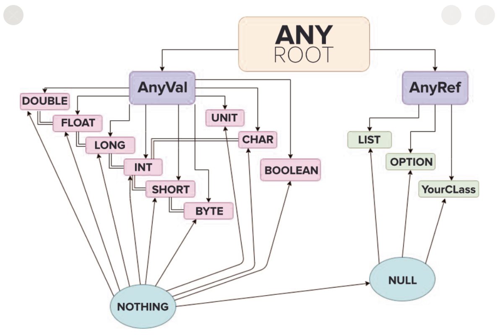

[toc]


# 变量

Scala与Java有相同的数据类型，在Scala中数据类型都是对象，也就是Scala中没有javashooing的原生（基本）类型


## var/val 声明变量

var声明的变量，变量的值是可以修改的

var修饰的对象引用可以改变，val修饰的则不可以改变，但对象的状态（值）却是可以改变的

```
object print_string {
    def main(args: Array[String]): Unit = {
        val dog = new Dog()
        dog.name = "wangwang"
        println(dog.name)
    }
}

class Dog {
    var name: String = ""
}

```

> ```
> wangwang
> ```
>
> 


val声明的变量，变量的值是不可以修改的, 即声明之后，内存地址不变。

val修饰的对象属性在编译之后，等同于加上了final

```
object pint_string {
    // 在方法外部声明的变量，如果采用val关键字，等同于使用final修饰
    val gender: String = "Male"
    def main(args: Array[String]): Unit = {
        val name: String = "Rick"
        // 可以省略类型指令
        val age = 18
        var score: Double = 99.999
        var b: Boolean = true
        println(s"name=${name}, age=${age}, gender=${gender}")
    }
}

```

> ```
> name=Rick, age=18, gender=Male
> ```
>
> 


## 特点

scala是完全面向对象的语言，没有基本的数据类型

所以scala中数字也是对象，可以调用方法


```
object ScalaStringType {
    def main(args: Array[String]): Unit = {
        val age: int = 20
        // byte, short, int, long, float, double, boolean, char
        val b: Byte = 10
        val s: Short = 10
        val i: Int = 10
        val lon: Long = 10
        val f: Float = 10.0f
        val d: Double = 10
        val bln: Boolean = true
        val c: Char = 'c'
        val in: Int = 10
    }
}
```


## 特殊符号

Scala可以使用特殊符号作为标识符，其实是将特殊符号在编译的时候进行了转换

```
object nothing_variable {
    def main(args: Array[String]): Unit = {
        val +-*/ = 123
        println(+-*/)
    }
}

```

> ```
> 123
> ```
>
> 


scala中的下划线有特殊用途，不能独立当成变量名使用


### 反引号

可以引用内部变量作为变量使用


# 类型划分

无论是AnyVal还是AnyRef，都是对象， 相互之间无法转换




| 数据类型 | 描述                                                         |
| :------- | :----------------------------------------------------------- |
| Byte     | 8位有符号补码整数。数值区间为 -128 到 127                    |
| Short    | 16位有符号补码整数。数值区间为 -32768 到 32767               |
| Int      | 32位有符号补码整数。数值区间为 -2147483648 到 2147483647, 默认类型 |
| Long     | 64位有符号补码整数。数值区间为 -9223372036854775808 到 9223372036854775807 |
| Float    | 32 位, IEEE 754 标准的单精度浮点数， 默认类型                |
| Double   | 64 位 IEEE 754 标准的双精度浮点数                            |
| Char     | 16位无符号Unicode字符, 区间值为 U+0000 到 U+FFFF             |
| String   | 字符序列                                                     |
| Boolean  | true或false                                                  |
| Unit     | 表示无值，和其他语言中void等同。用作不返回任何结果的方法的结果类型。Unit只有一个实例值，写成()。 |
| Null     | null 或空引用， 该类型只有一个实例值null                     |
| Nothing  | Nothing类型在Scala的类层级的最底端；它是任何其他类型的子类型。当一个函数没有正常的返回值，可以用Nothing来指定返回类型 |
| Any      | Any是所有其他类的超类                                        |
| AnyRef   | AnyRef类是Scala里所有引用类(reference class)的基类           |


## AnyVal 值类型

```
Double
Float
Long
Int
Short
Byte
Unit
StringOps
Char
Boolean
```


### Unit (默认Nothing返回类型)

Unit 类型用来标识过程，也就是没有明确返回值的函数。类似于Java中的void

所有的Scala表达式都有结果， 具体返回结果，取决于满足条件的代码体最后一行

```
object scala_expression_statement {
    def main(args: Array[String]): Unit = {
        val rxu = true
        val uxr = false

        val value = if (rxu) {
            "abc"
            println("bcd")
        }
        println(value)

        val value1 = if (uxr) {
            "abc"
            println("cde")
        }
        println(value1)
    }
}

```

> ```
> bcd
> ()
> ()
> ```
>
> 


## AnyRef 引用类型

```
Scala collections
Other Scala classes
All java classes
Null
Nothing
```


### Null

Null 类只有一个实例对象，就是null，类似于Java中的null引用。null可以赋值给任意的AnyRef引用类型，但是不能赋值给AnyVal值类型。

```
object nothing_variable {
    def main(args: Array[String]): Unit = {
        val ii:Int = null
        println(ii)
    }

    def f1():Nothing = {
        throw new Exception()
    }
}
```

> ```
> an expression of type Null is ineligible for implicit conversion
>         val ii:Int = null
> ```
>
> 


### Nothing

Nothing 在Scala的类层级是最底端的，他是任何其他类型的字类型。


当一个函数，确定没有正常的返回值，可以用Nothing来指定返回类型，这样的优势，可以把返回值的异常赋值给其他的函数或者变量，确保其兼容性

```
object nothing_variable {
    def main(args: Array[String]): Unit = {
    }

    def f1():Nothing = {
        throw new Exception()
    }
}
```


# 类型转换 


## 自动 （若正向） 

多种类型的数据混合运算时，系统首先自动将所有数据转换成容量最大的那种数据类型，然后再进行计算


当我们把精度（容量）的数据类型赋值给精度小的数据类型时，就会报错，反之就会进行自动类型转换


byte，short和char之间不会自动转换


## 强制 （则逆向）

将容量大的数据类型转换为小容量的数据类型，使用时需要强制转函数，但可能造成精度降低或者溢出

```
java
int num = (int)2.5

---
scala
var num: Int = 2.7.toInt 
```


Char 类型可以保存Int的常量值，但不能保存Int的变量值，需要强制转换

Byte和Short类型进行运算时，当作Int类型进行处理


## 基本类型转String

```
String str1 = true + "";
String str2 = 4.5 + "";
String str3 = 100 + "";
```


## String转基本类型

```
s1.toInt
s1.toFloat
s1.toDouble
s1.toByte
s1.toLong
s1.toShort
```


