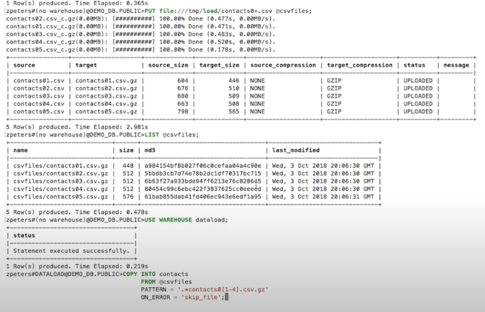
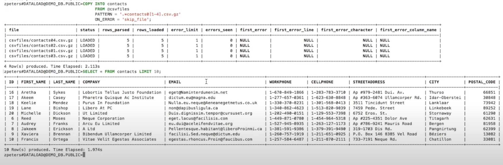
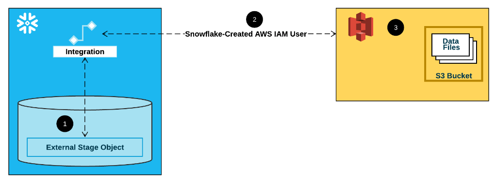

[toc]


# Snowflake

Snowflake is an analytic data warehouse provided as software-as-a-service (SaaS). Snowflake provides a data warehouse that is faster, easier to use and far more flexible than traditional data warehouse offerings.


## 特点

支持多租户、支持事务、高度安全，高度可扩展并且可以按需扩展，对ANSI SQL有着完整的支持，而且对半结构化和无结构的数据有着内置的支持

Snowflake对JSON, Avro等等半结构化数据提供了内置的支持。而且因为采用了自动的schema发现以及面向列的存储使得对非结构化数据的操作跟普通结构化数据的操作性能损失很小。


## Preparing data load


### General File Sizing Recommendations

we recommend aiming to produce data files roughly 10 MB to 100 MB in size **compressed**. Aggregate smaller files to minimize the processing overhead for each file. Split larger files into a greater number of smaller files to distribute the load among the servers in an active warehouse. 


## load data

### Unencrypted files

128-bit or 256-bit keys

When staging unencrypted files in a Snowflake internal location, the files are automatically encrypted using 128-bit keys. 256-bit keys can be enabled (for stronger encryption); however, additional configuration is required.


### Already-encrypted files

User-supplied key

Files that are already encrypted can be loaded into Snowflake from external cloud storage; the key used to encrypt the files must be provided to Snowflake.


### Bulk Loading from Amazon S3

Use the [COPY INTO ](https://docs.snowflake.com/en/sql-reference/sql/copy-into-table.html) command to load the contents of the staged file(s) into a Snowflake database table.


Snowflake uses Amazon S3 Gateway Endpoints in each of its Amazon Virtual Private Clouds.

If the S3 bucket referenced by your external stage is in the same region as your Snowflake account, your network traffic does not traverse the public Internet. The Amazon S3 Gateway Endpoints ensure that regional traffic stays within the AWS network.


#### whitelist s3 bucket

1. Contact [Snowflake Support](https://community.snowflake.com/s/article/How-To-Submit-a-Support-Case-in-Snowflake-Lodge) to obtain the Snowflake VPC ID for the AWS region in which your account is deployed.
2. Whitelist the Snowflake VPC ID by creating an [Amazon S3 policy for a specific VPC](https://docs.aws.amazon.com/AmazonS3/latest/dev/example-bucket-policies-vpc-endpoint.html?shortFooter=true#example-bucket-policies-restrict-access-vpc).
3. Provide an AWS IAM role to Snowflake to access the whitelisted Amazon S3 bucket instead of the AWS key and secret.


### local files internally



> @csvfiles comes from `>CREATE STAGE csvfiles;`
>
> COPY those staged files into WAREHOURSE table contacts 





# warehouse size 

| Warehouse Size | Servers / Cluster | Credits / Hour | Credits / Second | Notes                                                        |
| :------------- | :---------------- | :------------- | :--------------- | :----------------------------------------------------------- |
| X-Small        | 1                 | 1              | 0.0003           | Default size for warehouses created using [CREATE WAREHOUSE](https://docs.snowflake.com/en/sql-reference/sql/create-warehouse.html). |
| Small          | 2                 | 2              | 0.0006           |                                                              |
| Medium         | 4                 | 4              | 0.0011           |                                                              |
| Large          | 8                 | 8              | 0.0022           |                                                              |
| X-Large        | 16                | 16             | 0.0044           | Default for warehouses created in the web interface.         |
| 2X-Large       | 32                | 32             | 0.0089           |                                                              |
| 3X-Large       | 64                | 64             | 0.0178           |                                                              |
| 4X-Large       | 128               | 128            | 0.0356           |                                                              |


# Privileges


## other roles

Enabling Account Usage for Other Roles
By default, the SNOWFLAKE database is available only to the ACCOUNTADMIN role.
To enable other roles to access the database and schemas, and query the views, a user with the ACCOUNTADMIN role must grant the following data sharing privilege to the desired roles:

IMPORTED PRIVILEGES

```
use role accountadmin;

grant imported privileges on database snowflake to role sysadmin;
grant imported privileges on database snowflake to role customrole1;

use role customrole1;

select * from snowflake.account_usage.databases;
```


# Terminology


## Stage

staging files into internal location called Stage

each table has stage 


### external cloud 

let named stage point to external location


#### aws s3

When you create a named stage, you can specify any part of a path. For example, create an external stage using one of the above example paths:

```
create stage my_stage url='s3://mybucket/United_States/California/Los_Angeles/' credentials=(aws_key_id='1a2b3c' aws_secret_key='4x5y6z');
```


## Storage Integration

Integrations are named, first-class Snowflake objects that avoid the need for passing explicit cloud provider credentials such as secret keys or access tokens. Integration objects store an AWS identity and access management (IAM) user ID.



1. An external (i.e. S3) stage references a storage integration object in its definition.
2. Snowflake automatically associates the storage integration with a S3 IAM user created for your account. Snowflake creates a single IAM user that is referenced by all S3 storage integrations in your Snowflake account.
3. An AWS administrator in your organization grants permissions to the IAM user to access the bucket referenced in the stage definition. Note that many external stage objects can reference different buckets and paths and use the same storage integration for authentication.


## Role management

All Snowflake users are automatically assigned the predefined PUBLIC role, which enables login to Snowflake and basic object access.

Roles can be assigned at user creation or afterwards.

The account administrator (ACCOUNTADMIN) role is the most powerful role in the system.
Assign this role to at least two users. We follow strict security procedures for resetting a forgotten or lost password for users with the ACCOUNTADMIN role.


The security administrator (SECURITYADMIN) role includes the privileges to create and manage users and roles.

The system administrator (SYSADMIN) role includes the privileges to create warehouses, databases, and all database objects (schemas, tables, etc.).


## NDR

NDR是SaaS/PaaS公司衡量增长可持续性最常用到的指标，NDR=老客户在今年的月均recurring revenue/老客户在去年的月均recurring revenue

而当我们用NDR这个视角去看待Snowflake时候，却发现Snowflake的NDR与其他的企业有很大的不同。没有其他高NDR SaaS标的的新客户收入占比如此低，不到10%。

这样的差别是来自于产品和落地所带来的爬坡周期不同：

对于大多数SaaS，“今年的客户增长”代表的就是“今年的收入增长”。1-2年后的老客户，很难再提供高速的收入增长。就好比Zoom这样的产品，三个月内就可以让所有员工形成远程开会的习惯。打个比方客户可能是第一年花了100块，第二年花了150块，第三年花了180块。但对于Snowflake这样的产品，，“今年的客户增长”代表的可能是”两年后的收入增长”。新客户可能第一年花了100块，第二年花了300块，第三年花了500块。客户的增速被延迟了，报表的收入满足感也被延迟了。

而带来这一变化的是OLAP产品的特性，以及企业上云整体的复杂安排，使得客户的爬坡周期能延长到接近2年。

这也使得OLAP客户，可以很快地将存储打满到60-70%水平，但在计算的迁移上总是很缓慢。而在迁移完成后，因为解放了数据算力，BI分析师扩招后还会提供长期的增长。所以当Snowflake的CFO Scarpelli在业绩会上提到“未来几个季度的NDR都会非常稳定”时候也就不难理解了，独特的老客户增长特点使得这家公司的收入增速降得更慢，也能保持更长期的收入快速增长。这也让Snowflake更有机会完成10年20倍甚至30倍这样的高速收入增长。当我们拉长到25年维度看PS和PE的时候，估值就不一样了。


# hello world


## connector

```
from snowflake import connector
conn = connector.connect(
    autocommit=False,
    user='',
    password='',
    account='',
    role='',
    warehouse='',
    database='',
    schema='',
    session_parameters={
        'OPERATION_TAG': "test",
    }
)
cursor = conn.cursor()
sql = f"""
COPY INTO 
@bucket_name/__temp__/{urn.identifier}/{interface['table']}/      # replace with your target s3 path 
FROM (
select 
    a,
    b,
    c
from "A"."B"."C"
where a = 2
)
file_format=(type=parquet)
include_query_id=true
HEADER = TRUE
MAX_FILE_SIZE = 1000;
"""
print(sql)
cursor.execute(sql)
conn.commit()
result = cursor.fetchall()
```

> role is Snowflake role like ACCOUNTADMIN or ADMIN
>
> account is Snowflake account name, prefix of snowflake url


# FAQ


## Lower performance

更新数据会导致在Snowflake的部分数据重组，出现明显性能降级

整表sort之后更新数据


# Appendix

http://pages.cs.wisc.edu/~yxy/cs839-s20/papers/snowflake.pdf

https://zhuanlan.zhihu.com/p/56745552

https://zhuanlan.zhihu.com/p/55577067

https://docs.snowflake.com/en/user-guide/tables-clustering-micropartitions.html

https://guides.snowflake.com/?cat=resource+optimization

https://docs.snowflake.com/en/user-guide/warehouses-overview.html#warehouse-size