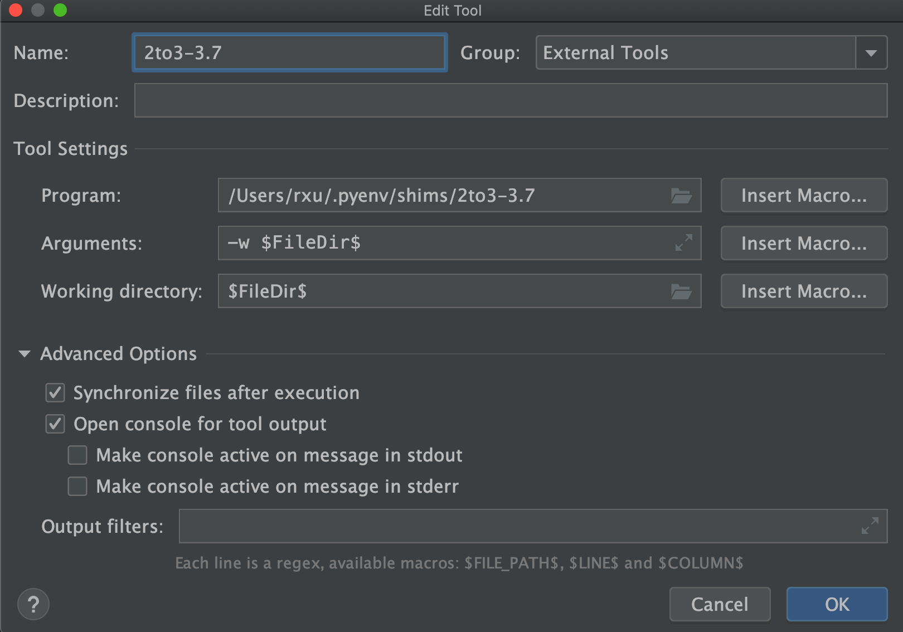

[toc]


# Pycharm


## 2to3 setup


### Mac

* find file

```
$ which 2to3-3.7
/Users/rxu/.pyenv/shims/2to3-3.7
```


* Preferences -> Tools -> External Tools



> -w 标识让2to3-3.7工具使用新生成的3.x版本的代码重写原始2.x版本的代码，并将原始2.x版本的代码重命名为  原始文件名+.bak的形式，`$FilePath$`代表原始文件的绝对路径


* Pycharm -> Tools -> External Tools -> 2to3-3.7

