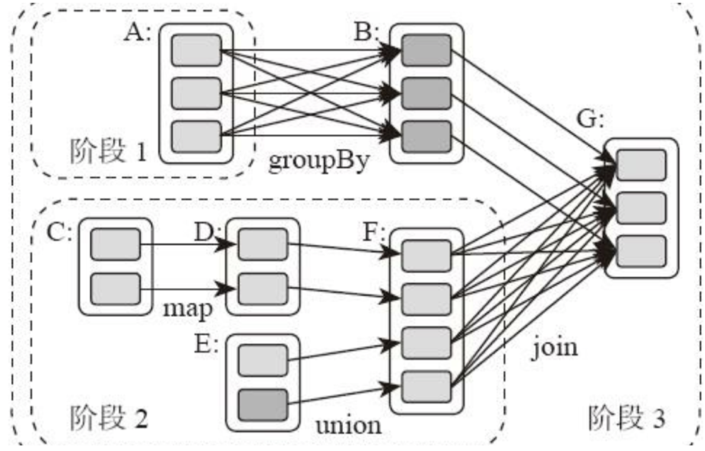
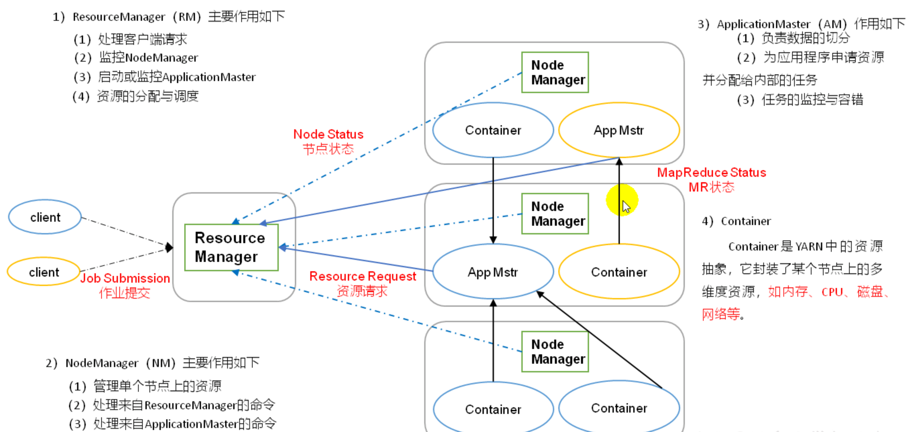

[toc]


# Spark

Hadoop MapReduce虽然已经可以满足大数据的应用场景，但是UC Berkeley的AMP Lab推出的Spark应运而生，Spark拥有更快的执行速度和更友好的编程接口，在推出后短短两年就迅速抢占MapReduce的市场份额，成为主流的大数据计算框架。


## 特点

Spark支持Yarn和HDFS，公司迁移到Spark上的成本很小，越来越多的公司用Spark代替MapReduce

spark优势在于迭代式的内存运算，适合于做大数据分析，机器学习之类的

Spark 本身是用 Scala 写的，运行在 Java 虚拟机(JVM)上，所以需要Java 环境


除了速度更快，Spark和MapReduce相比，还有更简单易用的编程模型。使用Scala语言在Spark上编写WordCount程序，主要代码只需要三行。

```
val textFile = sc.textFile("hdfs://...")
val counts = textFile.flatMap(line => line.split(" "))
                 .map(word => (word, 1))
                 .reduceByKey(_ + _)
counts.saveAsTextFile("hdfs://...")
```

> 第1行：根据HDFS路径生成一个输入数据RDD。
>
> 第2行：在输入数据RDD上执行3个操作，得到一个新的RDD。
>
> - 将输入数据的每一行文本用空格拆分成单词。
> - 将每个单词进行转换，`word => (word, 1)`，生成<Key, Value>的结构。
> - 相同的Key进行统计，统计方式是对Value求和，`(_ + _)`。
>
> 第3行：将这个RDD保存到HDFS。


## Spark的存储层次

Spark 不仅可以将任何 Hadoop 分布式文件系统(HDFS)上的文件读取为分布式数据集， 也可以支持其他支持 Hadoop 接口的系统，比如本地文件、亚马逊 S3、Cassandra、Hive、 HBase 等

Spark 支持的 Hadoop 输入格式包括文本文件、SequenceFile、 Avro、Parquet 等


# Spark 架构

降低了耦合性


## Master


### Application Master


#### Driver

和Executor 做关联的，跟踪其运行状况，为执行器节点调度任务

执行开发程序中main 方法的进程，即程序入口。

用于创建SparkContext，创建RDD以及进行RDD转化操作和行动


## Worker


### Executor 

一个工作进程，负责在Spark 作业中运行任务，任务之间相互独立

Spark应用启动时，Executor节点同时被启动，并始终伴随着整个Spark 应用的生命周期而存在

若有Executor节点故障，Spark应用可以继续执行，会将出错的节点上的任务调度到其他的executor节点上继续运行


# Spark计算阶段

和MapReduce一个应用一次只运行一个map和一个reduce不同，Spark可以根据应用的复杂程度，分割成更多的计算阶段（stage），这些计算阶段组成一个有向无环图DAG，Spark任务调度器可以根据DAG的依赖关系执行计算阶段。

某些机器学习算法可能需要进行大量的迭代计算，产生数万个计算阶段，这些计算阶段在一个应用中处理完成，而不是像MapReduce那样需要启动数万个应用，因此极大地提高了运行效率。


## DAG

DAG也就是有向无环图，就是说不同阶段的依赖关系是有向的，计算过程只能沿着依赖关系方向执行，被依赖的阶段执行完成之前，依赖的阶段不能开始执行，同时，这个依赖关系不能有环形依赖，否则就成为死循环了


整个应用被切分成3个阶段，阶段3需要依赖阶段1和阶段2，阶段1和阶段2互不依赖。Spark在执行调度的时候，先执行阶段1和阶段2，完成以后，再执行阶段3。如果有更多的阶段，Spark的策略也是一样的。只要根据程序初始化好DAG，就建立了依赖关系，然后根据依赖关系顺序执行各个计算阶段，Spark大数据应用的计算就完成了。




### 核心

Spark作业调度执行的核心是DAG，有了DAG，整个应用就被切分成哪些阶段，每个阶段的依赖关系也就清楚了。之后再根据每个阶段要处理的数据量生成相应的任务集合（TaskSet），每个任务都分配一个任务进程去处理，Spark就实现了大数据的分布式计算。


### DAGScheduler

负责Spark应用DAG生成和管理的组件是DAGScheduler，DAGScheduler根据程序代码生成DAG，然后将程序分发到分布式计算集群，按计算阶段的先后关系调度执行。


### shuffle 依赖


Spark也需要通过shuffle将数据进行重新组合，相同Key的数据放在一起，进行聚合、关联等操作，因而每次shuffle都产生新的计算阶段。这也是为什么计算阶段会有依赖关系，它需要的数据来源于前面一个或多个计算阶段产生的数据，必须等待前面的阶段执行完毕才能进行shuffle，并得到数据。

不需要进行shuffle的依赖，在Spark里被称作窄依赖；相反的，需要进行shuffle的依赖，被称作宽依赖。

跟MapReduce一样，shuffle也是Spark最重要的一个环节，只有通过shuffle，相关数据才能互相计算，构建起复杂的应用逻辑。

从本质上看，Spark可以算作是一种MapReduce计算模型的不同实现。Hadoop MapReduce简单粗暴地根据shuffle将大数据计算分成Map和Reduce两个阶段，然后就算完事了。而Spark更细腻一点，将前一个的Reduce和后一个的Map连接起来，当作一个阶段持续计算，形成一个更加优雅、高效地计算模型，虽然其本质依然是Map和Reduce。但是这种多个计算阶段依赖执行的方案可以有效减少对HDFS的访问，减少作业的调度执行次数，因此执行速度也更快。


Hadoop MapReduce主要使用磁盘存储shuffle过程中的数据不同，Spark优先使用内存进行数据存储，包括RDD数据。除非是内存不够用了，否则是尽可能使用内存， 这也是Spark性能比Hadoop高的另一个原因。


# Spark 组件


## Spark Core

Spark Core 实现了 Spark 的基本功能，包含任务调度、内存管理、错误恢复、与存储系统交互等模块。Spark Core 中还包含了对弹性分布式数据集(resilient distributed dataset，简 称 RDD)的 API 定义。


## Spark SQL

Spark SQL 是 Spark 用来操作结构化数据的程序包。通过 Spark SQL，我们可以使用 SQL 或者 Apache Hive 版本的 SQL 方言(HQL)来查询数据。Spark SQL 支持多种数据源，比 如 Hive 表、Parquet 以及 JSON 等。除了为 Spark 提供了一个 SQL 接口，Spark SQL 还支 持开发者将 SQL 和传统的 RDD 编程的数据操作方式相结合，不论是使用 Python、Java 还 是 Scala，开发者都可以在单个的应用中同时使用 SQL 和复杂的数据分析。


## Spark Streaming 

Spark Streaming 是 Spark 提供的对实时数据进行流式计算的组件。比如生产环境中的网页 服务器日志，或是网络服务中用户提交的状态更新组成的消息队列，都是数据流。Spark Streaming 提供了用来操作数据流的 API，并且与 Spark Core 中的 RDD API 高度对应。


## MLlib

MLlib 提供 了很多种机器学习算法，包括分类、回归、聚类、协同过滤等，还提供了模型评估、数据 导入等额外的支持功能。


## GraphX

GraphX 是用来操作图(比如社交网络的朋友关系图)的程序库，可以进行并行的图计算。 与 Spark Streaming 和 Spark SQL 类似，GraphX 也扩展了 Spark 的 RDD API，能用来创建 一个顶点和边都包含任意属性的有向图。

# Spark 执行过程

Spark支持Standalone、Yarn、Mesos、Kubernetes等多种部署方案，几种部署方案原理也都一样，只是不同组件角色命名不同，但是核心功能和运行流程都差不多。


Spark应用程序启动在自己的JVM进程里，即Driver进程，启动后调用SparkContext初始化执行配置和输入数据。SparkContext启动DAGScheduler构造执行的DAG图，切分成最小的执行单位也就是计算任务。

然后Driver向Cluster Manager请求计算资源，用于DAG的分布式计算。Cluster Manager收到请求以后，将Driver的主机地址等信息通知给集群的所有计算节点Worker。

Worker收到信息以后，根据Driver的主机地址，跟Driver通信并注册，然后根据自己的空闲资源向Driver通报自己可以领用的任务数。Driver根据DAG图开始向注册的Worker分配任务。

Worker收到任务后，启动Executor进程开始执行任务。Executor先检查自己是否有Driver的执行代码，如果没有，从Driver下载执行代码，通过Java反射加载后开始执行。


## 和 Yarn 集群交互




1. Client submit 任务
2. ResourceManager选择一个NM创建ApplicationMaster，ApplicationMaster集群Driver（即初始化sc）
3. ApplicationMaster向ResourceManager申请资源
4. ResourceManager返回集群资源列表
5. ApplicationMaster向NodeManager创建spark执行器对象，即Container 中的Excutor
6. Executor反向注册到ApplicationMaster
7. ApplicationMaster分解任务，然后发给Executor执行


# Spark 生态

Spark也有自己的生态体系，以Spark为基础，有支持SQL语句的Spark SQL，有支持流计算的Spark Streaming，有支持机器学习的MLlib，还有支持图计算的GraphX。利用这些产品，Spark技术栈支撑起大数据分析、大数据机器学习等各种大数据应用场景。


## Spark Streaming

Spark Streaming巧妙地利用了Spark的**分片**和**快速计算**的特性，将实时传输进来的数据按照时间进行分段，把一段时间传输进来的数据合并在一起，当作一批数据，再去交给Spark去处理。


如果时间段分得足够小，每一段的数据量就会比较小，再加上Spark引擎的处理速度又足够快，这样看起来好像数据是被实时处理的一样，这就是Spark Streaming实时流计算的奥妙。

这里要注意的是，在初始化Spark Streaming实例的时候，需要指定分段的时间间隔。下面代码示例中间隔是1秒。

```
val ssc = new StreamingContext(conf, Seconds(1))
```

当然你也可以指定更小的时间间隔，比如500ms，这样处理的速度就会更快。时间间隔的设定通常要考虑业务场景，比如你希望统计每分钟高速公路的车流量，那么时间间隔可以设为1分钟。

Spark Streaming主要负责将流数据转换成小的批数据，剩下的就可以交给Spark去做了。


# Spark性能优化

Spark性能优化可以分解为下面几步。

1.性能测试，观察Spark性能特性和资源（CPU、Memory、Disk、Net）利用情况。

2.分析、寻找资源瓶颈。

3.分析系统架构、代码，发现资源利用关键所在，思考优化策略。

4.代码、架构、基础设施调优，优化、平衡资源利用。

5.性能测试，观察系统性能特性，是否达到优化目的，以及寻找下一个瓶颈点。


# Spark on yarn vs Spark on k8s

```
spark-submit ---- ResourceManager ----- ApplicaitonMaster（Container） ---- Driver（Container）----Executor（Container）
```

```
spark-submit ---- Kube-api-server（Pod） ---- Kube-scheduler（Pod） ---- Driver（Pod） ---- Executor（Pod）
```


# Example

## Installation

### 目录结构

```
wget https://mirror.bit.edu.cn/apache/spark/spark-2.4.5/spark-2.4.5-bin-hadoop2.7.tgz
```


```
root@ubuntu:/mnt/spark-2.4.5-bin-hadoop2.7# tree -L 1
.
├── bin		包含可以用来和 Spark 进行各种方式的交互的一系列可执行文件
├── conf
├── data
├── examples	包含一些可以查看和运行的 Spark 程序，对学习 Spark 的 API 非常有帮助
├── jars
├── kubernetes
├── LICENSE
├── licenses
├── NOTICE
├── python	包含Spark项目主要组件的源代码
├── R		包含Spark项目主要组件的源代码				
├── README.md
├── RELEASE
├── sbin
└── yarn
```

