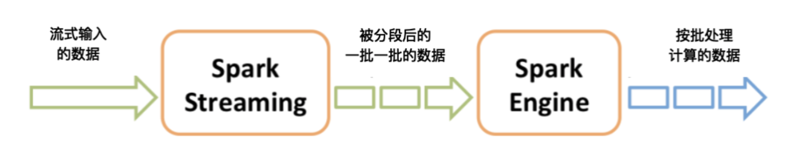

[toc]


# 函数式编程

Spark的开发语言是Scala，这是Scala在并行和并发计算方面优势的体现，此外，Spark在很多宏观设计层面都借鉴了函数式编程思想，如接口、惰性求值和容错等。

* 函数式编程接口。纯函数式编程中，是不存在变量的，所有的值都是不可变的。这样函数可以不依赖也不修改外部状态，函数调用的结果不依赖于调用的时间和位置，这样更利于测试和调试。另外，由于多个线程之间不共享状态，因此不需要用锁来保护可变状态，使得函数式编程能够更好的利用多核的计算能力
* 函数式编程思想的一大特点是低阶函数与核心数据结构，在Spark API中，这一点得到了很好的继承。Spark API同样提供了map、reduce、filter等算子（operator）来构建数据处理管道，用户的业务逻辑以高阶函数的形式定义，用户通过高阶函数与算子之间的组合，像搭积木一样，构建了整个作业的执行计划。此外，从根本上来说，Spark最核心的数据结构只有一种：RDD（Resilient Distributed Dataset，弹性分布式数据集），从API上来说，它和普通集合几乎完全相同，但是它却抽象了分布式文件系统中的文件，对于用户来说，这是透明的，从这个角度上来说，RDD是一个分布式的集合。
* 惰性求值。Spark的算子分为两类，转换（transform）算子和行动（action）算子，只有行动算子才会真正触发整个作业提交并运行。这样一来，无论用户采用了多少个转换算子来构建一个无比复杂的数据处理管道，只有最后的行动算子才能触发整个作业开始执行。
* 容错。在Spark的抽象中，处理的每一份数据都是不可变的，它们都是由它所依赖的上游数据集生成出来的，依赖关系由算子定义，在一个Spark作业中，这被称为血统。在考虑容错时，与其考虑如何持久化每一份数据，不如保存血统依赖和上游数据集，从而在下游数据集出现可用性问题时，利用血统依赖和上游数据集重算进行恢复。这是利用了函数（血统依赖）在给定参数（上游数据集）情况下，一定能够得到既定输出（下游数据集）的特性。

# Spark

Hadoop MapReduce虽然已经可以满足大数据的应用场景，但是UC Berkeley的AMP Lab推出的Spark应运而生，Spark拥有更快的执行速度和更友好的编程接口，在推出后短短两年就迅速抢占MapReduce的市场份额，成为主流的大数据计算框架。


## 特点

Spark支持Yarn和HDFS，迁移到Spark上的成本很小

spark优势在于迭代式的内存运算，适合于做大数据分析，机器学习之类的

Spark 本身是用 Scala 写的，运行在 Java 虚拟机(JVM)上，所以需要Java 环境

Spark 的并行机制是多线程模型，而 MapReduce 是多进程模型， 多进程模型便于细粒度控制每个任务占用的资源，但会消耗较多的启动时间。而 Spark 同一节点上的任务以多线程的方式运行在一个 JVM 进程中，可以带来更快的启动速度、更高的 CPU 利用率，以及更好的内存共享。


除了速度更快，Spark和MapReduce相比，还有更简单易用的编程模型。使用Scala语言在Spark上编写WordCount程序，主要代码只需要三行。

```
val textFile = sc.textFile("hdfs://...")
val counts = textFile.flatMap(line => line.split(" "))
                 .map(word => (word, 1))
                 .reduceByKey(_ + _)
counts.saveAsTextFile("hdfs://...")
```

> 第1行：根据HDFS路径生成一个输入数据RDD。
>
> 第2行：在输入数据RDD上执行3个操作，得到一个新的RDD。
>
> - 将输入数据的每一行文本用空格拆分成单词。
> - 将每个单词进行转换，`word => (word, 1)`，生成<Key, Value>的结构。
> - 相同的Key进行统计，统计方式是对Value求和，`(_ + _)`。
>
> 第3行：将这个RDD保存到HDFS。


## Spark的存储层次

Spark 不仅可以将任何 Hadoop 分布式文件系统(HDFS)上的文件读取为分布式数据集， 也可以支持其他支持 Hadoop 接口的系统，比如本地文件、亚马逊 S3、Cassandra、Hive、 HBase 等

Spark 支持的 Hadoop 输入格式包括文本文件、SequenceFile、 Avro、Parquet 等


# Spark 架构


## Cluster Manager

ClusterManager负责所有Executor的资源管理和调度，根据底层资源管理和调度平台的不同，ClusterManager可以有多种选择，对应了多种资源管理平台，如YARN的ResourceManager与Mesos的ClusterManager，此外Executor也会根据资源管理平台的不同运行在不同的容器中。


## Application Master

Driver节点和所有的executor节点一起被称为一个 Spark 应用(application)


## Driver

和Executor 做关联的，跟踪其运行状况，为执行器节点调度任务

执行开发程序中main() 方法的进程，即程序入口。它执行用户编写的用来创建 SparkContext、创建 RDD，以及进行 RDD 的转化操作和行动操作的代码

Spark程序的入口是Driver中的SparkContext。与Spark 1.x相比，在Spark 2.0中，有一个变化是用SparkSession统一了与用户交互的接口，曾经熟悉的SparkContext、SqlContext、HiveContext都是SparkSession的成员变量，这样更加简洁。SparkContext的作用是连接用户编写的代码与运行作业调度和任务分发的代码

Driver 程序一旦终止，Spark 应用也就结束了


## Executor 

一个工作进程，负责在Spark 作业中运行任务，任务之间相互独立, 并将结果返回给驱动器进程

Executor 通过自身的块管理器(Block Manager)为用户程序中要求缓存的 RDD 提供内存式存储。RDD 是直接缓存在执行器进程内的，因此任务可以在运行时充分利用缓存数据加速运算

Spark应用启动时，Executor节点同时被启动，并始终伴随着整个Spark 应用的生命周期而存在

若有Executor节点故障，Spark应用可以继续执行，会将出错的节点上的任务调度到其他的executor节点上继续运行


### 内存分配

有一个 20 个物理节点的集群，每个物理节点是一个四核的机器

然后你使用 --executor-memory 1G 和 --total-executor-cores 8 提交应用。这样 Spark 就会在不同机器上启动 8 个执行器进程，每个 1GB 内存

通过 --executor-cores 设置每个执行器进程从 YARN 中占用的核心数目


# Spark 执行过程


首先Driver根据用户编写的代码生成一个计算任务的有向无环图（Directed Acyclic Graph, DAG）

接着，DAG会根据RDD（弹性分布式数据集）之间的依赖关系被DAGScheduler（Driver组件）切分成由Task组成的Stage（TaskSet）

TaskScheduler（Driver组件）会通过ClusterManager将任务调度到Executor上执行

在DAG中，每个Task的输入就是一个Partition（分区），而一个Executor同时只能执行一个Task，但一个Worker（物理节点）上可以同时运行多个Executor。


## 集群执行过程

Spark支持Standalone、Yarn、Mesos、Kubernetes等多种部署方案，几种部署方案原理也都一样，只是不同组件角色命名不同，但是核心功能和运行流程都差不多。


Spark应用程序启动在自己的JVM进程里，即Driver进程，启动后调用SparkContext初始化执行配置和输入数据。SparkContext启动DAGScheduler构造执行的DAG图，切分成最小的执行单位也就是计算任务。

然后Driver向Cluster Manager请求计算资源，用于DAG的分布式计算。Cluster Manager收到请求以后，将Driver的主机地址等信息通知给集群的所有计算节点Worker。

Worker收到信息以后，根据Driver的主机地址，跟Driver通信并注册，然后根据自己的空闲资源向Driver通报自己可以领用的任务数。Driver根据DAG图开始向注册的Worker分配任务。

Worker收到任务后，启动Executor进程开始执行任务。Executor先检查自己是否有Driver的执行代码，如果没有，从Driver下载执行代码，通过Java反射加载后开始执行。


# Spark计算阶段

和MapReduce一个应用一次只运行一个map和一个reduce不同，Spark可以根据应用的复杂程度，分割成更多的计算阶段（stage），这些计算阶段组成一个有向无环图DAG，Spark任务调度器可以根据DAG的依赖关系执行计算阶段。

某些机器学习算法可能需要进行大量的迭代计算，产生数万个计算阶段，这些计算阶段在一个应用中处理完成，而不是像MapReduce那样需要启动数万个应用，因此极大地提高了运行效率。


## DAG

在图论中，如果一个有向图从任意顶点出发无法经过若干条边回到该点，则这个图是一个有向无环图（DAG,directed acyclic graph）
因为有向图中一个点经过两种路线到达另一个点未必形成环，因此有向无环图未必能转化成树，但任何有向树均为有向无环图

DAG也就是有向无环图，就是说不同阶段的依赖关系是有向的，计算过程只能沿着依赖关系方向执行，被依赖的阶段执行完成之前，依赖的阶段不能开始执行，同时，这个依赖关系不能有环形依赖，否则就成为死循环了


整个应用被切分成3个阶段，阶段3需要依赖阶段1和阶段2，阶段1和阶段2互不依赖。Spark在执行调度的时候，先执行阶段1和阶段2，完成以后，再执行阶段3。如果有更多的阶段，Spark的策略也是一样的。只要根据程序初始化好DAG，就建立了依赖关系，然后根据依赖关系顺序执行各个计算阶段，Spark大数据应用的计算就完成了。


### 核心

Spark作业调度执行的核心是DAG，有了DAG，整个应用就被切分成哪些阶段，每个阶段的依赖关系也就清楚了。之后再根据每个阶段要处理的数据量生成相应的任务集合（TaskSet），每个任务都分配一个任务进程去处理，Spark就实现了大数据的分布式计算。


### DAGScheduler

负责Spark应用DAG生成和管理的组件是DAGScheduler，DAGScheduler根据程序代码生成DAG，然后将程序分发到分布式计算集群，按计算阶段的先后关系调度执行。


### shuffle 依赖


Spark也需要通过shuffle将数据进行重新组合，相同Key的数据放在一起，进行聚合、关联等操作，因而每次shuffle都产生新的计算阶段。这也是为什么计算阶段会有依赖关系，它需要的数据来源于前面一个或多个计算阶段产生的数据，必须等待前面的阶段执行完毕才能进行shuffle，并得到数据。

不需要进行shuffle的依赖，在Spark里被称作窄依赖；相反的，需要进行shuffle的依赖，被称作宽依赖。

跟MapReduce一样，shuffle也是Spark最重要的一个环节，只有通过shuffle，相关数据才能互相计算，构建起复杂的应用逻辑。

从本质上看，Spark可以算作是一种MapReduce计算模型的不同实现。Hadoop MapReduce简单粗暴地根据shuffle将大数据计算分成Map和Reduce两个阶段，然后就算完事了。而Spark更细腻一点，将前一个的Reduce和后一个的Map连接起来，当作一个阶段持续计算，形成一个更加优雅、高效地计算模型，虽然其本质依然是Map和Reduce。但是这种多个计算阶段依赖执行的方案可以有效减少对HDFS的访问，减少作业的调度执行次数，因此执行速度也更快。


Hadoop MapReduce主要使用磁盘存储shuffle过程中的数据不同，Spark优先使用内存进行数据存储，包括RDD数据。除非是内存不够用了，否则是尽可能使用内存， 这也是Spark性能比Hadoop高的另一个原因。


# Spark 组件


## Spark Core

Spark Core 实现了 Spark 的基本功能，包含任务调度、内存管理、错误恢复、与存储系统交互等模块。Spark Core 中还包含了对弹性分布式数据集(resilient distributed dataset，简 称 RDD)的 API 定义。


## Spark SQL

Spark SQL 是 Spark 用来操作结构化数据的程序包。通过 Spark SQL，我们可以使用 SQL 或者 Apache Hive 版本的 SQL 方言(HQL)来查询数据。Spark SQL 支持多种数据源，比如 Hive 表、Parquet 以及 JSON 等。除了为 Spark 提供了一个 SQL 接口，Spark SQL 还支 持开发者将 SQL 和传统的 RDD 编程的数据操作方式相结合，不论是使用 Python、Java 还是 Scala，开发者都可以在单个的应用中同时使用 SQL 和复杂的数据分析。


## Spark Streaming 

Spark Streaming 是 Spark 提供的对实时数据进行流式计算的组件。比如生产环境中的网页服务器日志，或是网络服务中用户提交的状态更新组成的消息队列，都是数据流。Spark Streaming 提供了用来操作数据流的 API，并且与 Spark Core 中的 RDD API 高度对应。


## MLlib

MLlib 提供 了很多种机器学习算法，包括分类、回归、聚类、协同过滤等，还提供了模型评估、数据 导入等额外的支持功能。


## GraphX

GraphX 是用来操作图(比如社交网络的朋友关系图)的程序库，可以进行并行的图计算。 与 Spark Streaming 和 Spark SQL 类似，GraphX 也扩展了 Spark 的 RDD API，能用来创建 一个顶点和边都包含任意属性的有向图。

# Spark 生态

Spark也有自己的生态体系，以Spark为基础，有支持SQL语句的Spark SQL，有支持流计算的Spark Streaming，有支持机器学习的MLlib，还有支持图计算的GraphX。利用这些产品，Spark技术栈支撑起大数据分析、大数据机器学习等各种大数据应用场景。


## Spark Streaming

Spark Streaming巧妙地利用了Spark的**分片**和**快速计算**的特性，将实时传输进来的数据按照时间进行分段，把一段时间传输进来的数据合并在一起，当作一批数据，再去交给Spark去处理。




如果时间段分得足够小，每一段的数据量就会比较小，再加上Spark引擎的处理速度又足够快，这样看起来好像数据是被实时处理的一样，这就是Spark Streaming实时流计算的奥妙。

这里要注意的是，在初始化Spark Streaming实例的时候，需要指定分段的时间间隔。下面代码示例中间隔是1秒。

```
val ssc = new StreamingContext(conf, Seconds(1))
```

当然你也可以指定更小的时间间隔，比如500ms，这样处理的速度就会更快。时间间隔的设定通常要考虑业务场景，比如你希望统计每分钟高速公路的车流量，那么时间间隔可以设为1分钟。

Spark Streaming主要负责将流数据转换成小的批数据，剩下的就可以交给Spark去做了。


## Tungsten项目

Tungsten旨在利用应用程序语义显式管理内存，消除JVM对象模型和垃圾回收的开销

JVM对象开销一向是很大的，例如字符串采用UTF-8编码，还有一些对象header等信息，这样就容易引起内存不足，降低CPU访问数据的吞吐量。JVM的垃圾回收器是一个非常复杂的组件，同时它的设计思路和面对的场景通常都是针对在线事务处理（OLTP）系统，如交易系统，而Spark的使用场景则偏向于在线分析处理（OLAP）系统和离线计算系统，这两种场景对于性能需求差别非常大，因此利用JVM的垃圾回收器来应对Spark面对的场景，必然无法令人满意。

Tungsten的目的就是摆脱JVM的垃圾回收器，自己管理内存


# Parquet

一种流行的列式存储格式，可以高效地存储具有嵌套字段的记录


# Installation


## Linux

```
wget https://mirror.bit.edu.cn/apache/spark/spark-2.4.5/spark-2.4.5-bin-hadoop2.7.tgz
```


目录结构

```
root@ubuntu:/mnt/spark-2.4.5-bin-hadoop2.7# tree -L 1
.
├── bin		包含可以用来和 Spark 进行各种方式的交互的一系列可执行文件
├── conf
├── data
├── examples	包含一些可以查看和运行的 Spark 程序，对学习 Spark 的 API 非常有帮助
├── jars
├── kubernetes
├── LICENSE
├── licenses
├── NOTICE
├── python	包含Spark项目主要组件的源代码
├── R		包含Spark项目主要组件的源代码				
├── README.md
├── RELEASE
├── sbin
└── yarn
```


## mac os

```
brew upgrade && brew update
```


```
java -version
```

For Latest Java use

```
brew cask install java
```

**Install xcode-select**

```
xcode-select --install
```

**Install Scala**

```
brew install scala
```


```
scala -version
```


**Install Apache Spark**

```
brew install apache-spark
```


To start spark shell execute below command

```
Spark-shell

val s = "hello world"
```


**Add Spark path to bash profile**

Run below command and then add the path to the profile

```
vim ~/.profile

export SPARK_HOME=/usr/local/Cellar/apache-spark/3.1.1/libexec
export PYTHONPATH=/usr/local/Cellar/apache-spark/3.1.1/libexec/python/:$PYTHONP$
source ~/.bash_profile
```

```
cd /usr/local/Cellar/apache-spark/3.1.1/libexec/sbin
```

And execute below command to start all services

```
sbin/start-all.sh
```


**Spark Master UI** 

http://localhost:8080/


**Spark Application UI**

 http://localhost:4040/


# Example


## 蒙特卡罗方法预测股票价格

蒙特卡罗方法（Monte Carlo method），也称统计模拟方法，是20世纪40年代中期由于科学技术的发展和电子计算机的发明，而被提出的一种以概率统计理论为指导的一类非常重要的数值计算方法，原理是通过大量随机样本去了解一个系统，进而得到所要计算的值。它非常强大和灵活，又相当简单易懂，很容易实现。对于许多问题来说，它往往是最简单的计算方法，有时甚至是唯一可行的方法。蒙特卡罗方法在金融工程学、宏观经济学、计算物理学（如粒子输运计算、量子热力学计算、空气动力学计算）等领域应用广泛。

运用蒙特卡罗方法预测股票价格，这里我们认为影响股票价格的因子（解释变量）有原油价格（WTI）、30年期国债价格（Bond）、标准普尔500指数（GSPC）、纳斯达克指数（NDAQ），它们之间是一个线性关系，


$$
y=b0+b1·x_{WTI}+b2·x_{Bond}+b3·x_{GSPC}+b4·x_{NDAQ}
$$


# pyspark


## example

```
SET python_operator="""
def tier(spark, **kwargs):
    date_input=kwargs['date_input']
    import boto3
    import botocore
    BUCKET_NAME = 'prod_appannie_ios' # replace with your bucket name
    KEY = ('tier-price/{}/price_matrix').format(date_input) # replace with your object key
    s3 = boto3.resource('s3')
    try:
        s3.Bucket(BUCKET_NAME).download_file(KEY, '/tmp/price_matrix')
    except botocore.exceptions.ClientError as e:
        if e.response['Error']['Code'] == "404":
            print("The object does not exist.")
        else:
            raise
    import json
    import zlib
    from ast import literal_eval
    import pandas as pd
    import datetime
    count=1
    date=datetime.datetime.strptime(date_input, '%Y-%m-%d')
    df = pd.DataFrame(columns=('id','tier','currency_code','price','date'))
    with open("/tmp/price_matrix", 'rb') as f:
        raw = f.read()
        json_raw_data=json.loads(literal_eval(zlib.decompress(raw).decode('utf-8'))).get('data').get('pricingTiers')
        for i in json_raw_data:
            tier=i['tierStem']
            info=i['pricingInfo']
            for m,n in enumerate(info):
                currency_code=n['currencyCode']
                price=n['retailPrice']
                df=df.append(pd.DataFrame({'id':[count],'tier':[tier],'currency_code':[currency_code],'price':[price],'date':[date]}),ignore_index=True)
                count=count+1
    dfr=spark.createDataFrame(df)
    return dfr
"""
```


# Appendix

https://medium.com/beeranddiapers/installing-apache-spark-on-mac-os-ce416007d79f

