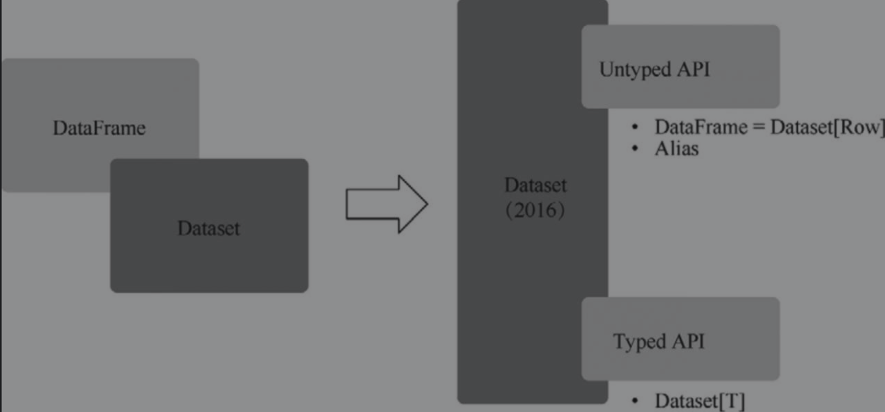
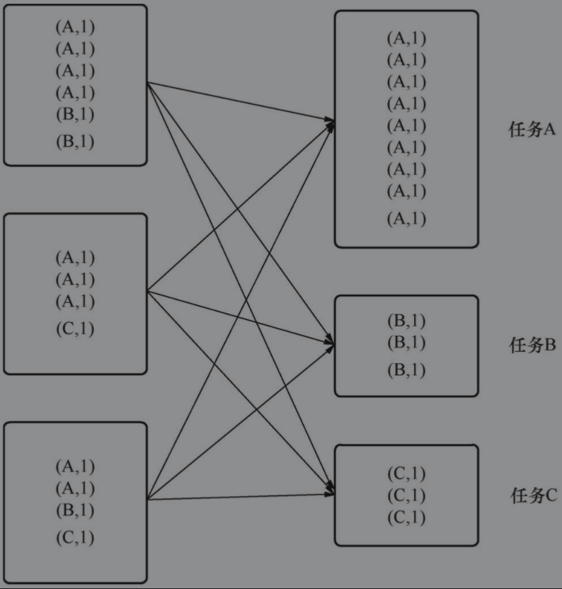
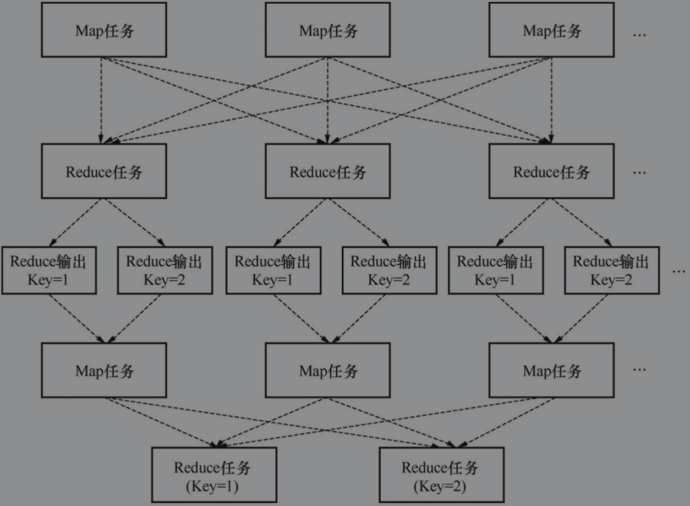

[toc]


# Spark性能优化

Spark性能优化可以分解为下面几步。

1.性能测试，观察Spark性能特性和资源（CPU、Memory、Disk、Net）利用情况。

2.分析、寻找资源瓶颈。

3.分析系统架构、代码，发现资源利用关键所在，思考优化策略。

4.代码、架构、基础设施调优，优化、平衡资源利用。

5.性能测试，观察系统性能特性，是否达到优化目的，以及寻找下一个瓶颈点。


对 Spark 进行性能调优，通常就是修改 Spark 应用的运行时配置选项。Spark 中最主要的配 置机制是通过 SparkConf 类对 Spark 进行配置


## 统一Dataset和DataFrame接口

Dataset的目标是提供类型安全的编程接口。这允许开发人员使用编译时类型安全的半结构化数据（如JSON或键值对，即可以在应用程序运行之前检查错误）

所以Spark Python API不实现Dataset API的原因是Python不是类型安全的语言。

同样重要的是，Dataset API还包含高级域特定的语言操作，如sum、avg、join和group。该特性意味着Dataset具有传统RDD的灵活性，而且代码也更具可读性。类似于DataFrame, Dataset可以通过将表达式和数据字段暴露给查询计划器并利用Tungsten的快速内存编码来从Spark的Catalyst优化器获益



Dataset API提供了类型安全的面向对象编程接口。Dataset可以通过将表达式和数据字段暴露给查询计划程序和Tungsten的快速内存编码来利用Catalyst优化器。但是，现在DataFrame和Dataset都作为Apache Spark 2.0的一部分，其实DataFrame现在是DatasetUntyped API的别名。更具体地说

```
DataFrame = Dataset[Row]
```

DataFrame API与DataSet API能够充分地享受到Tungsten项目的优化成果，这是由于在DataFrame中，可以获得更多的应用语义。


## 提高作业并行度

在作业并行程度不高的情况下，最有效的方式就是提高作业并行程度。在Spark作业划分中，一个Executor只能同时执行一个任务，一个计算任务的输入是一个分区（partition），因此改变并行程度只有一个办法就是提高同时运行Executor的个数。


## 内存管理

Spark作业中内存主要有两个用途：计算和存储。计算是指在Shuffle、连接、排序和聚合等操作中用于执行计算任务的内存，而存储指的是用于跨集群缓存和传播数据的内存。在Spark中，这两块共享一个统一的内存区域（M），如图2-42所示，用计算内存时，存储部分可以获取所有可用内存，反之亦然，如有必要，计算内存也可以将数据从存储区移出，但会在总存储内存使用量下降到特定阈值（R）时才执行。换句话说，R决定了M内的一个分区，在这个分区中，数据不会被移出。由于实际情况的复杂性，存储区一般不会去占用计算区


## 序列化

序列化是以时间换空间的一种内存取舍方式，其根本原因还是内存比较吃紧，我们可以优先选择对象数组或者基本类型而不是那些集合类型来实现自己的数据结构，fastutil包提供了与Java标准兼容的集合类型。除此之外，还应该避免使用大量小对象与指针嵌套的结构。我们可以考虑使用数据ID或者枚举对象来代替字符串键。如果内存小于32 GB，可以设置Java选项-XX:+UseCompressedOops来压缩指针为4字节，以上是需要用到序列化之前可以做的调优工作以节省内存


## JVM垃圾回收（GC）调优

通常来说，那种只读取RDD一次，然后对其进行各种操作的作业不太会引起垃圾回收（GC）问题。当Java需要将老对象释放而为新对象腾出空间时，需要追踪所有Java对象，然后在其中找出没有被使用的那些对象。GC的成本与Java对象数量成正比，因此使用较少对象的数据结构会大大减轻GC压力，如直接使用整型数组，而不选用链表。通常在出现GC问题的时候，序列化缓存是首先应该尝试的方法。


## 数据本地性的取舍

对于分布式计算框架，通常都有数据本地性问题。如果数据所在的节点与计算任务（代码所在）节点相同，那么结果肯定会快，反之则需要将远端数据移动过来，这样就会慢。通常情况下，由于代码体积通常比数据小得多，因此一般Spark的调度准则会优先考虑分发代码。

数据本地性衡量的是数据与处理它的代码之间的远近，基于数据当前的位置有以下几个级别。

PROCESS_LOCAL：该级别表示数据就在代码运行的JVM中，这无疑是最佳的级别。

NODE_LOCAL：该级别表示数据与代码在同节点，如数据所在的DataNode与代码运行的NodeManager是同一个节点，这种级别也不错。

NO_PREF：该级别表示数据所在之处对于集群所有节点来说都是无差异的，无论在何处访问速度都是一样的。

RACK_LOCAL：该级别表示数据与运行代码的节点同机架，因此需要交换机网络传输。

ANY：该级别表示数据在内网中的不同机架中。


Spark当然希望每个计算任务都具有最佳的数据本地性，但这不一定总是满足的。如果没有空闲的节点处理数据，这时就会有两种选择，一种情况是等待数据所在节点完成计算，另一种是切换到远端节点开始计算。


## 将经常被使用的数据进行缓存

如果某份数据经常会被使用，可以尝试用cache算子将其缓存，有时效果极好。


## 使用广播变量避免Hash连接操作

在进行连接操作时，可以尝试将小表通过广播变量进行广播，从而避免Shuffle，这种方式也被称为Map端连接。


## 聚合filter算子产生的大量小分区数据

在使用filter算子后，通常数据会被打碎成很多个小分区，这会影响后面的执行操作，可以先对后面的数据用coalesce算子进行一次合并。


## 根据场景选用高性能算子

很多算子都能达到相同的效果，但是性能差异却比较大，例如在聚合操作时，选择reduceByKey无疑比groupByKey更好；在map函数初始化性能消耗太大或者单条记录很大时，mapPartition算子比map算子表现更好；在去重时，distinct算子比groupBy算子表现更好。


## 数据倾斜

数据倾斜是数据处理作业中的一个非常常见也是非常难以处理的问题。正常情况下，数据通常都会出现数据倾斜的问题，只是轻重不同而已。数据倾斜的症状是大量数据集中到一个或者几个任务里，导致这几个任务会拖慢整个作业的执行速度，严重的甚至会导致整个作业执行失败




对于这种情况，可以采取以下几种办法处理。

过滤掉脏数据：很多情况下，数据倾斜通常是由脏数据引起的，这个时候需要将脏数据过滤。

提供作业的并行度：这种方式仍然不能从根本上消除数据倾斜，只是尽可能地将数据分散到多个任务中去，这种方案只能提升作业的执行速度，但是不能解决数据倾斜的问题。

广播变量：可以将小表进行广播，避免了Shuffle的过程，这样就使计算相对均匀地分布在每个Map任务中，但是对于数据倾斜严重的情况，还是会出现作业执行缓慢的问题。

将不均匀的数据进行单独处理：在连接操作的时候，可以先从大表中将集中分布的连接键找出来，与小表单独处理，再与剩余数据连接的结果做合并。处理方法为如果大表的数据存在数据倾斜，而小表不存在这种情况，那么可以将大表中存在倾斜的数据提取出来，并将小表中对应的数据提取出来，这时可以将小表中的数据扩充n倍，而大表中的每条数据则打上一个n以内的随机数作为新键，小表中的数据则根据扩容批次作为新键


对于那种分组统计的任务，可以通过两阶段聚合的方案来解决数据倾斜的问题，首先将数据打上一个随机的键值，并根据键的散列值进行分发，将数据均匀地分散到多个任务中去，然后在每个任务中按照真实的键值做局部聚合，最后再按照真实的键值分发一次，得到最后的结果



