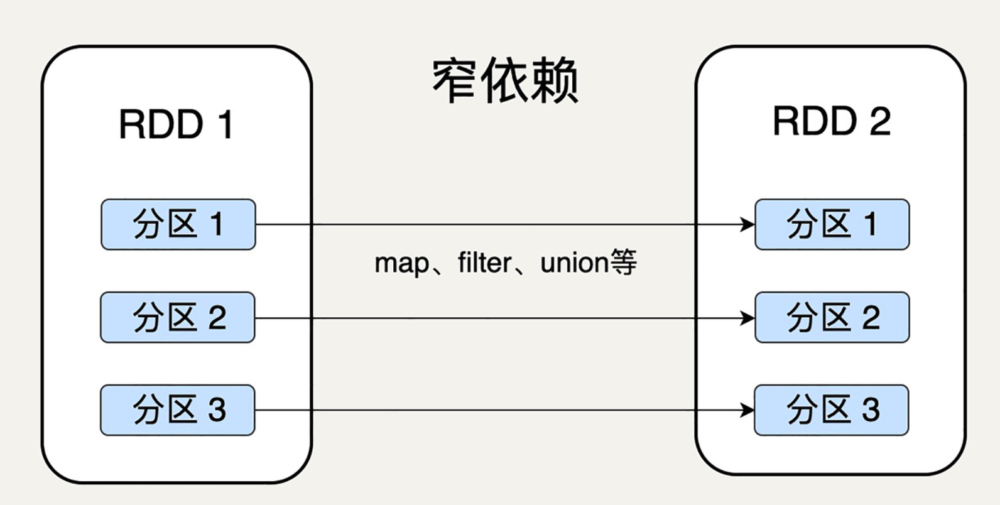

[toc]


# RDD 弹性数据集

RDD是Spark的核心概念，是弹性数据集（Resilient Distributed Datasets）的缩写。RDD既是Spark面向开发者的编程模型，又是Spark自身架构的核心元素。


Spark则直接针对数据进行编程，将大规模数据集合抽象成一个RDD对象，然后在这个RDD上进行各种计算处理，得到一个新的RDD，继续计算处理，直到得到最后的结果数据。所以Spark可以理解成是**面向对象的大数据计算**。


所以在上面WordCount的代码示例里，第2行代码实际上进行了3次RDD转换，每次转换都得到一个新的RDD，因为新的RDD可以继续调用RDD的转换函数，所以连续写成一行代码。事实上，可以分成3行。

```
val rdd1 = textFile.flatMap(line => line.split(" "))
val rdd2 = rdd1.map(word => (word, 1))
val rdd3 = rdd2.reduceByKey(_ + _)
```


Spark也是对大数据进行分片计算，Spark分布式计算的数据分片、任务调度都是以RDD为单位展开的，每个RDD分片都会分配到一个执行进程去处理。

在 Spark 中，对数据的所有操作不外乎创 建 RDD、转化已有 RDD 以及调用 RDD 操作进行求值。而在这一切背后，Spark 会自动将 RDD 中的数据分发到集群上，并将操作并行化执行。


## RDD 特征


### 分区

分区代表同一个 RDD 包含的数据被存储在系统的不同节点中，这也是它可以被并行处理的前提

逻辑上，我们可以认为 RDD 是一个大的数组。数组中的每个元素代表一个分区（Partition）

在物理存储中，每个分区指向一个存放在内存或者硬盘中的数据块（Block），而这些数据块是独立的，它们可以被存放在系统中的不同节点

而RDD 只是抽象意义的数据集合，分区内部并不会存储具体的数据


RDD 中的每个分区存有它在该 RDD 中的 index。通过 RDD 的 ID 和分区的 index 可以唯一确定对应数据块的编号，从而通过底层存储层的接口中提取到数据进行处理

在集群中，各个节点上的数据块会尽可能地存放在内存中，只有当内存没有空间时才会存入硬盘。这样可以最大化地减少硬盘读写的开销

虽然 RDD 内部存储的数据是只读的，但是，我们可以去修改（例如通过 repartition 转换操作）并行计算单元的划分结构，也就是分区的数量


### 不可变性

代表每一个 RDD 都是只读的，它所包含的分区信息不可以被改变。既然已有的 RDD 不可以被改变，我们只可以对现有的 RDD 进行转换（Transformation）操作，得到新的 RDD 作为中间计算的结果


```
lines = sc.textFile("data.txt")
lineLengths = lines.map(lambda s: len(s))
totalLength = lineLengths.reduce(lambda a, b: a + b)
```

> 读入文本文件 data.txt，创建了第一个 RDD lines，它的每一个元素是一行文本。
>
> 然后调用 map 函数去映射产生第二个 RDD lineLengths，每个元素代表每一行简单文本的字数。
>
> 最后调用 reduce 函数去得到第三个 RDD totalLength，它只有一个元素，代表整个文本的总字数


在一个有 N 步的计算模型中，如果记载第 N 步输出 RDD 的节点发生故障，数据丢失，我们可以从第 N-1 步的 RDD 出发，再次计算，而无需重复整个 N 步计算过程。这样的容错特性也是 RDD 为什么是一个“弹性”的数据集的原因之一


### 并行操作

由于单个 RDD 的分区特性，使得它天然支持并行操作，即不同节点上的数据可以被分别处理，然后产生一个新的 RDD。


# RDD 结构


## Spark Context 

SparkContext 是所有 Spark 功能的入口，它代表了与 Spark 节点的连接，可以用来创建 RDD 对象以及在节点中的广播变量等。一个线程只有一个 SparkContext。


## SparkConf

SparkConf 则是一些参数配置信息


## Partitions

代表 RDD 中数据的逻辑结构，每个 Partition 会映射到某个节点内存或硬盘的一个数据块。

Partitioner 决定了 RDD 的分区方式，目前有两种主流的分区方式：Hash partitioner 和 Range partitioner。Hash，顾名思义就是对数据的 Key 进行散列分区，Range 则是按照 Key 的排序进行均匀分区。此外我们还可以创建自定义的 Partitioner。


## Dependencies 依赖关系

Dependencies 是 RDD 中最重要的组件之一

Spark 不需要将每个中间计算结果进行数据复制以防数据丢失，因为每一步产生的 RDD 里都会存储它的依赖关系，即它是通过哪个 RDD 经过哪个转换操作得到的。


### 窄依赖（Narrow Dependency）

窄依赖就是父 RDD 的分区可以一一对应到子 RDD 的分区

窄依赖允许子 RDD 的每个分区可以被并行处理产生

一些转换操作如 map、filter 会产生窄依赖关系， 因为 map 是将分区里的每一个元素通过计算转化为另一个元素，一个分区里的数据不会跑到两个不同的分区




窄依赖可以支持在同一个节点上链式执行多条命令，例如在执行了 map 后，紧接着执行 filter

因此，窄依赖的失败恢复更有效，因为它只需要重新计算丢失的父分区即可


### 宽依赖（Wide Dependency）

宽依赖就是父 RDD 的每个分区可以被多个子 RDD 的分区使用

宽依赖则必须等待父 RDD 的所有分区都被计算好之后才能开始处理。

只有父RDD的分区被多个子RDD的分区利用的时候才是宽依赖，其他的情况就是窄依赖

一些Join、groupBy 则会生成宽依赖关系，因为groupBy 则要将拥有所有分区里有相同 Key 的元素放到同一个目标分区，而每一个父分区都可能包含各种 Key 的元素，所以它可能被任意一个子分区所依赖


宽依赖需要所有的父分区都是可用的，可能还需要调用类似 MapReduce 之类的操作进行跨节点传递

从失败恢复的角度考虑，宽依赖牵涉到 RDD 各级的多个父分区，失败恢复并没有窄依赖更有效


## Checkpoint

如果一个 RDD 的依赖链比较长，而且中间又有多个 RDD 出现故障的话，进行恢复可能会非常耗费时间和计算资源

检查点（Checkpoint）的引入，就是为了优化这些情况下的数据恢复

在计算过程中，对于一些计算过程比较耗时的 RDD，我们可以将它缓存至硬盘或 HDFS 中，标记这个 RDD 有被检查点处理过，并且清空它的所有依赖关系。同时，给它新建一个依赖于 CheckpointRDD 的依赖关系，CheckpointRDD 可以用来从硬盘中读取 RDD 和生成新的分区信息。这样，当某个子 RDD 需要错误恢复时，回溯至该 RDD，发现它被检查点记录过，就可以直接去硬盘中读取这个 RDD，而无需再向前回溯计算。


相对于持久化RDD，Checkpoint会清空该RDD的依赖关系，并新建一个CheckpointRDD依赖关系，让该RDD依赖，并保存在磁盘或HDFS文件系统中，当数据恢复时，可通过CheckpointRDD读取RDD进行数据计算；持久化RDD会保存依赖关系和计算结果至内存中，可用于后续计算。


## Storage Level

用来记录 RDD 持久化时的存储级别，常用的有以下几个：

MEMORY_ONLY：只缓存在内存中，如果内存空间不够则不缓存多出来的部分。这是 RDD 存储级别的默认值。

MEMORY_AND_DISK：缓存在内存中，如果空间不够则缓存在硬盘中。

DISK_ONLY：只缓存在硬盘中。

MEMORY_ONLY_2 和 MEMORY_AND_DISK_2 等：与上面的级别功能相同，只不过每个分区在集群中两个节点上建立副本。


## Iterator

迭代函数（Iterator）和计算函数（Compute）是用来表示 RDD 怎样通过父 RDD 计算得到的

迭代函数会首先判断缓存中是否有想要计算的 RDD，如果有就直接读取，如果没有，就查找想要计算的 RDD 是否被检查点处理过。如果有，就直接读取，如果没有，就调用计算函数向上递归，查找父 RDD 进行计算。

# HelloWorld

变量 lines 是一个 RDD，是从你电脑上的一个本地的文本文件创建出来的。我们可以在这个 RDD 上运行各种并行操作，比如统计这个数据集中的元素个数 (在这里就是文本的行数)，或者是输出第一个元素


## pyspark

Python 行数统计

```

In [1]: lines = sc.textFile("README.md")    # 创建一个名为lines的RDD                                                                       
In [2]: lines.count()                       # 统计RDD中的元素个数                                                                                Out[2]: 104                                                                     

In [3]: lines.first()     # 这个RDD中的第一个元素，也就是README.md的第一行 u'# Apache Spark'                                                                     
Out[3]: '# Apache Spark'

```


## scala

Scala 行数统计

```
scala> val lines = sc.textFile("README.md") // 创建一个名为lines的RDD
lines: spark.RDD[String] = MappedRDD[...]
scala> lines.count() // 统计RDD中的元素个数 res0: Long = 127
scala> lines.first() // 这个RDD中的第一个元素，也就是README.md的第一行 res1: String = # Apache Spark
```


# Spark 运行过程

Spark 在每次转换操作的时候，使用了新产生的 RDD 来记录计算逻辑，这样就把作用在 RDD 上的所有计算逻辑串起来，形成了一个链条。当对 RDD 进行动作时，Spark 会从计算链的最后一个 RDD 开始，依次从上一个 RDD 获取数据并执行计算逻辑，最后输出结果


## 惰性计算

Spark并不是按照代码写的操作顺序去生成RDD，比如`rdd2 = rdd1.map(func)`这样的代码并不会在物理上生成一个新的RDD。物理上，Spark只有在产生新的RDD分片时候，才会真的生成一个RDD，Spark的这种特性也被称作**惰性计算**。

Spark 并不会立刻计算出新 RDD 中各个分区的数值。直到遇到一个动作时，数据才会被计算，并且输出结果给 Driver。


## RDD 持久化（缓存）

Spark 的 persist() 和 cache() 方法支持将 RDD 的数据缓存至内存或硬盘中，这样当下次对同一 RDD 进行 Action 操作时，可以直接读取 RDD 的结果，大幅提高了 Spark 的计算效率

```
rdd = sc.parallelize([1, 2, 3, 4, 5])
rdd1 = rdd.map(lambda x: x+5)
rdd2 = rdd1.filter(lambda x: x % 2 == 0)
rdd2.persist()
count = rdd2.count() // 3
first = rdd2.first() // 6
rdd2.unpersist()
```

> 在第四行我把 RDD2 的结果缓存在内存中，所以 Spark 无需从一开始的 rdd 开始算起了（持久化处理过的 RDD 只有第一次有 action 操作时才会从源头计算，之后就把结果存储下来，所以在这个例子中，count 需要从源头开始计算，而 first 不需要）。


持久化可以选择不同的存储级别。正如我们讲 RDD 的结构时提到的一样，有 MEMORY_ONLY，MEMORY_AND_DISK，DISK_ONLY 等。cache() 方法会默认取 MEMORY_ONLY 这一级别

# RDD 的转换操作

转换是用来把一个 RDD 转换成另一个 RDD，而动作则是通过计算返回一个结果


## Transformation 转换函数

函数返回值还是RDD

调用以后得到的还是一个RDD，RDD的计算逻辑主要通过转换函数完成。

Spark提供了很多对 RDD 的操作，如 Map、Filter、flatMap、groupByKey 和 Union 等等，极大地提升了对各种复杂场景的支持。开发者既不用再绞尽脑汁挖掘 MapReduce 模型的潜力，也不用维护复杂的 MapReduce 状态机。


map，filter等不会出现新的分片， 

reduceByKey， union，join，groupByKey 等会出现新分片


### map 计算 

map 是最基本的转换操作

与 MapReduce 中的 map 一样，它把一个 RDD 中的所有数据通过一个函数，映射成一个新的 RDD，任何原 RDD 中的元素在新 RDD 中都有且只有一个元素与之对应


```
rdd = sc.parallelize(["b", "a", "c"])
rdd2 = rdd.map(lambda x: (x, 1)) 

>>>
[('b', 1), ('a', 1), ('c', 1)]
```


### mapPartitions

mapPartitions 是 map 的变种。不同于 map 的输入函数是应用于 RDD 中每个元素，mapPartitions 的输入函数是应用于 RDD 的每个分区，也就是把每个分区中的内容作为整体来处理的，所以输入函数的类型是 Iterator[T] => Iterator[U]

```

rdd = sc.parallelize([1, 2, 3, 4], 2)

def f(iterator): 
    yield sum(iterator)

rdd2 = rdd.mapPartitions(f) 

>>>
[3, 7]
```

> mapPartitions 的输入函数是对每个分区内的元素求和，所以返回的 RDD 包含两个元素：1+2=3 和 3+4=7


### filter 过滤 

filter 这个操作，是选择原 RDD 里所有数据中满足某个特定条件的数据，去返回一个新的 RDD

```
rdd = sc.parallelize([1, 2, 3, 4, 5])
rdd2 = rdd.filter(lambda x: x % 2 == 0) 

>>>
[2, 4]
```

> 返回所有的偶数


### mapValues 

计算每个键的对应值的均值


### reduceByKey 聚合 

reduceByKey(func, [numPartitions])  

来自不同分片的相同Key必须聚合在一起进行操作，这样就会产生新的RDD分片。实际执行过程中，是否会产生新的RDD分片，并不是根据转换函数名就能判断出来的

```
rdd.reduceByKey((x, y) => x + y)

>>>
{(1, 2), (3, 10)}
```


### groupByKey( ) 分组

groupByKey([numPartitions])

groupByKey 和 SQL 中的 groupBy 类似，是把对象的集合按某个 Key 来归类，返回的 RDD 中每个 Key 对应一个序列。即对具有相同键的值进行分组

```

rdd = sc.parallelize([("a", 1), ("b", 1), ("a", 2)])
rdd.groupByKey().collect()
>>>
"a" [1, 2]
"b" [1]
```


### union 合并数据集 

union(otherDataset)


### join 连接数据集 

join(otherDataset, [numPartitions])


## Action 执行函数

函数不再返回RDD


### collect

RDD 中的动作操作 collect 与函数式编程中的 collect 类似，它会以数组的形式，返回 RDD 的所有元素。

需要注意的是，collect 操作只有在输出数组所含的数据数量较小时使用，因为所有的数据都会载入到程序的内存中，如果数据量较大，会占用大量 JVM 内存，导致内存溢出

```
rdd = sc.parallelize(["b", "a", "c"])
rdd.map(lambda x: (x, 1)).collect() 

>>>
[('b', 1), ('a', 1), ('c', 1)]
```


### count 计数

返回RDD中数据的元素个数

```
sc.parallelize([2, 3, 4]).count() 

>>>
3
```


### countByKey

仅适用于 Key-Value pair 类型的 RDD，返回具有每个 key 的计数的 的 map

```
rdd = sc.parallelize([("a", 1), ("b", 1), ("a", 1)])
sorted(rdd.countByKey().items()) 

>>>
[('a', 2), ('b', 1)]
```


### reduce

与 MapReduce 中的 reduce 类似，它会把 RDD 中的元素根据一个输入函数聚合起来

```
from operator import add
sc.parallelize([1, 2, 3, 4, 5]).reduce(add)  

>>>
15
```


### **saveAsTextFile**(path)

将RDD数据存储到path路径下


# Example

## RDD for wordCount

在 Spark 2.0 之后，随着新的 DataFrame/DataSet API 的普及化，Spark 引入了新的 SparkSession 对象作为所有 Spark 任务的入口。

SparkSession 不仅有 SparkContext 的所有功能，它还集成了所有 Spark 提供的 API，比如 DataFrame、Spark Streaming 和 Structured Streaming，我们再也不用为不同的功能分别定义 Context。

```
spark = SparkSession
       .builder
       .appName(appName)
       .getOrCreate()
text_file = spark.read.text("file://….").rdd.map(lambda r: r[0])
```


1. 把每行的文本拆分成一个个词语,  可以用 flatMap 去把行转换成词语

2. 统计每个词语的频率, 可以先把每个词语转换成（word, 1）的形式，然后用 reduceByKey 去把相同词语的次数相加起来。

```
counts = lines.flatMap(lambda x: x.split(' '))
                  .map(lambda x: (x, 1))
                  .reduceByKey(add)
```

3. 只有当碰到 action 操作后，这些转换动作才会被执行, 可以用 collect 操作把结果按数组的形式返回并输出

```
output = counts.collect()
for (word, count) in output:
    print("%s: %i" % (word, count))
spark.stop() // 停止SparkSession
```


